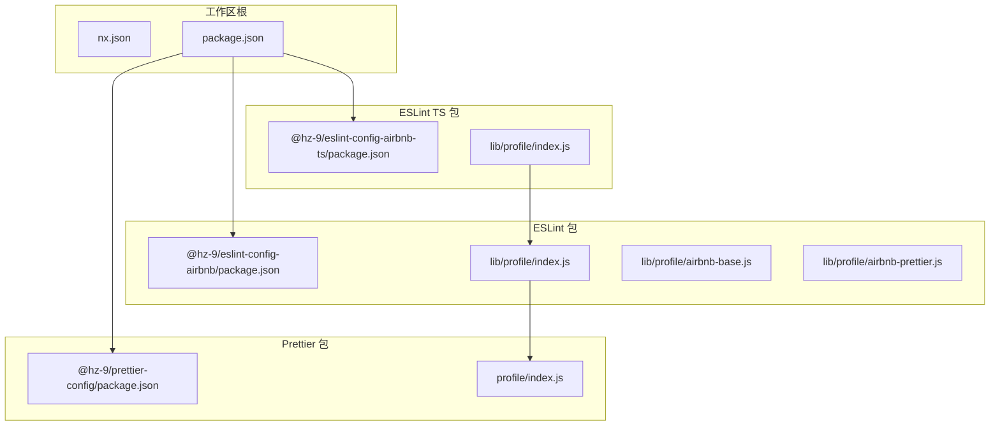
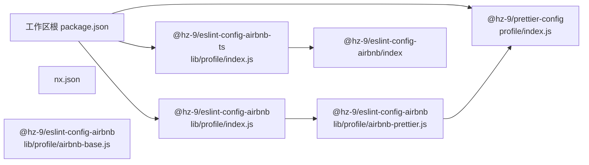
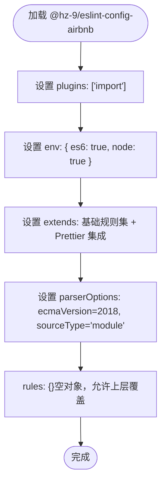
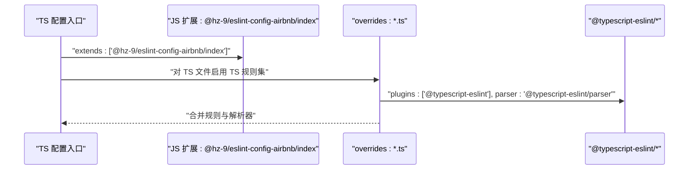
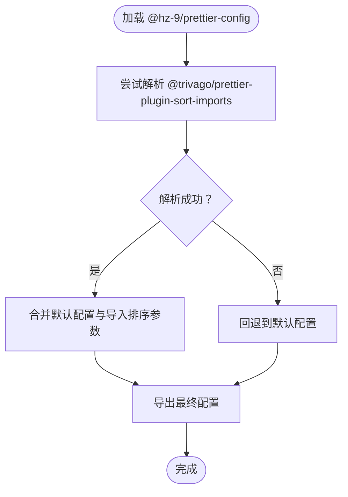
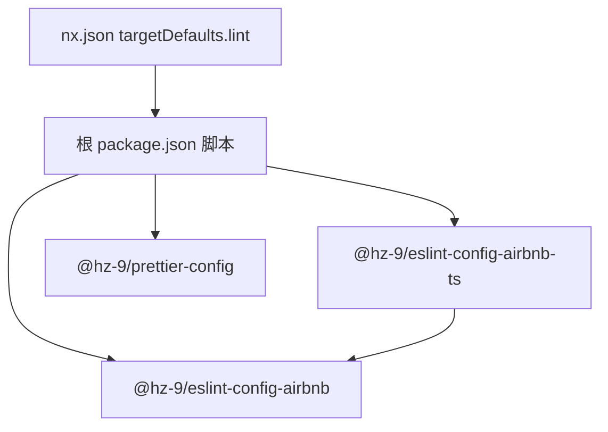

# API 参考

<cite>
**本文引用的文件**
- [packages/eslint-config-airbnb/package.json](file://packages/eslint-config-airbnb/package.json)
- [packages/eslint-config-airbnb/lib/profile/index.js](file://packages/eslint-config-airbnb/lib/profile/index.js)
- [packages/eslint-config-airbnb/lib/profile/airbnb-base.js](file://packages/eslint-config-airbnb/lib/profile/airbnb-base.js)
- [packages/eslint-config-airbnb/lib/profile/airbnb-prettier.js](file://packages/eslint-config-airbnb/lib/profile/airbnb-prettier.js)
- [packages/eslint-config-airbnb-ts/package.json](file://packages/eslint-config-airbnb-ts/package.json)
- [packages/eslint-config-airbnb-ts/lib/profile/index.js](file://packages/eslint-config-airbnb-ts/lib/profile/index.js)
- [packages/prettier-config/package.json](file://packages/prettier-config/package.json)
- [packages/prettier-config/profile/index.js](file://packages/prettier-config/profile/index.js)
- [package.json](file://package.json)
- [nx.json](file://nx.json)
</cite>

## 目录
1. [简介](#简介)
2. [项目结构](#项目结构)
3. [核心组件](#核心组件)
4. [架构总览](#架构总览)
5. [详细组件分析](#详细组件分析)
6. [依赖关系分析](#依赖关系分析)
7. [性能考量](#性能考量)
8. [故障排查指南](#故障排查指南)
9. [结论](#结论)
10. [附录](#附录)

## 简介
本文件为 lint-nx 的公共接口 API 文档，聚焦于以下方面：
- ESLint 配置：Airbnb 风格的 JavaScript 与 TypeScript 配置对象的导出、扩展链、插件、解析器选项、环境与规则覆盖。
- Prettier 配置：格式化选项、导入排序规则与可选插件检测机制。
- 完整配置项清单、默认值与使用示例路径。
- 错误处理策略（如缺失可选插件时的降级）与性能优化建议。
- 版本兼容性与迁移指南。

## 项目结构
lint-nx 采用 Nx 工作区组织，核心包包括：
- @hz-9/eslint-config-airbnb：JavaScript/Airbnb 风格 ESLint 配置
- @hz-9/eslint-config-airbnb-ts：TypeScript/Airbnb 风格 ESLint 配置
- @hz-9/prettier-config：Prettier 格式化配置与导入排序插件集成

图表来源
- [nx.json:1-20](file://nx.json#L1-L20)
- [package.json:1-38](file://package.json#L1-L38)
- [packages/eslint-config-airbnb/package.json:1-84](file://packages/eslint-config-airbnb/package.json#L1-L84)
- [packages/eslint-config-airbnb/lib/profile/index.js:1-38](file://packages/eslint-config-airbnb/lib/profile/index.js#L1-L38)
- [packages/eslint-config-airbnb/lib/profile/airbnb-base.js:1-27](file://packages/eslint-config-airbnb/lib/profile/airbnb-base.js#L1-L27)
- [packages/eslint-config-airbnb/lib/profile/airbnb-prettier.js:1-29](file://packages/eslint-config-airbnb/lib/profile/airbnb-prettier.js#L1-L29)
- [packages/eslint-config-airbnb-ts/package.json:1-87](file://packages/eslint-config-airbnb-ts/package.json#L1-L87)
- [packages/eslint-config-airbnb-ts/lib/profile/index.js:1-87](file://packages/eslint-config-airbnb-ts/lib/profile/index.js#L1-L87)
- [packages/prettier-config/package.json:1-45](file://packages/prettier-config/package.json#L1-L45)
- [packages/prettier-config/profile/index.js:1-30](file://packages/prettier-config/profile/index.js#L1-L30)

章节来源
- [nx.json:1-20](file://nx.json#L1-L20)
- [package.json:1-38](file://package.json#L1-L38)

## 核心组件
本节概述各包的公共接口与导出，便于快速定位配置入口与扩展点。

- @hz-9/eslint-config-airbnb
  - 导出入口：lib/profile/index.js
  - 支持别名导出：airbnb-base、airbnb-prettier、flat 系列等
  - 适用场景：JavaScript 项目，基于 Airbnb 规则集与 Prettier 集成
  - 关键字段：plugins、env、extends、parserOptions、rules
  - 参考路径：[packages/eslint-config-airbnb/lib/profile/index.js:1-38](file://packages/eslint-config-airbnb/lib/profile/index.js#L1-L38)

- @hz-9/eslint-config-airbnb-ts
  - 导出入口：lib/profile/index.js
  - 通过 overrides 应用 TypeScript 规则与解析器
  - 依赖：@hz-9/eslint-config-airbnb/index
  - 适用场景：TypeScript 项目，继承 JS 配置并叠加 TS 规则
  - 参考路径：[packages/eslint-config-airbnb-ts/lib/profile/index.js:1-87](file://packages/eslint-config-airbnb-ts/lib/profile/index.js#L1-L87)

- @hz-9/prettier-config
  - 导出入口：profile/index.js
  - 功能：动态检测并启用 @trivago/prettier-plugin-sort-imports；若不可用则回退到默认配置
  - 适用场景：统一项目格式化风格与导入排序
  - 参考路径：[packages/prettier-config/profile/index.js:1-30](file://packages/prettier-config/profile/index.js#L1-L30)

章节来源
- [packages/eslint-config-airbnb/package.json:1-84](file://packages/eslint-config-airbnb/package.json#L1-L84)
- [packages/eslint-config-airbnb/lib/profile/index.js:1-38](file://packages/eslint-config-airbnb/lib/profile/index.js#L1-L38)
- [packages/eslint-config-airbnb/lib/profile/airbnb-base.js:1-27](file://packages/eslint-config-airbnb/lib/profile/airbnb-base.js#L1-L27)
- [packages/eslint-config-airbnb/lib/profile/airbnb-prettier.js:1-29](file://packages/eslint-config-airbnb/lib/profile/airbnb-prettier.js#L1-L29)
- [packages/eslint-config-airbnb-ts/package.json:1-87](file://packages/eslint-config-airbnb-ts/package.json#L1-L87)
- [packages/eslint-config-airbnb-ts/lib/profile/index.js:1-87](file://packages/eslint-config-airbnb-ts/lib/profile/index.js#L1-L87)
- [packages/prettier-config/package.json:1-45](file://packages/prettier-config/package.json#L1-L45)
- [packages/prettier-config/profile/index.js:1-30](file://packages/prettier-config/profile/index.js#L1-L30)

## 架构总览
下图展示 lint-nx 在工作区中的配置装配关系：TS 配置继承 JS 配置，并在 overrides 中叠加 TS 规则；Prettier 配置作为共享模块被两者扩展。

图表来源
- [package.json:1-38](file://package.json#L1-L38)
- [nx.json:1-20](file://nx.json#L1-L20)
- [packages/eslint-config-airbnb/lib/profile/index.js:1-38](file://packages/eslint-config-airbnb/lib/profile/index.js#L1-L38)
- [packages/eslint-config-airbnb/lib/profile/airbnb-base.js:1-27](file://packages/eslint-config-airbnb/lib/profile/airbnb-base.js#L1-L27)
- [packages/eslint-config-airbnb/lib/profile/airbnb-prettier.js:1-29](file://packages/eslint-config-airbnb/lib/profile/airbnb-prettier.js#L1-L29)
- [packages/eslint-config-airbnb-ts/lib/profile/index.js:1-87](file://packages/eslint-config-airbnb-ts/lib/profile/index.js#L1-L87)
- [packages/prettier-config/profile/index.js:1-30](file://packages/prettier-config/profile/index.js#L1-L30)

## 详细组件分析

### ESLint 配置（JavaScript/Airbnb）
- 公共接口
  - 导出对象包含：plugins、env、extends、parserOptions、rules
  - 扩展链：基础规则集 + Prettier 集成规则
  - 解析器选项：ecmaVersion、sourceType
- 使用示例路径
  - 基础配置：[packages/eslint-config-airbnb/lib/profile/airbnb-base.js:1-27](file://packages/eslint-config-airbnb/lib/profile/airbnb-base.js#L1-L27)
  - Prettier 集成配置：[packages/eslint-config-airbnb/lib/profile/airbnb-prettier.js:1-29](file://packages/eslint-config-airbnb/lib/profile/airbnb-prettier.js#L1-L29)
  - 统一入口（含 Prettier 集成）：[packages/eslint-config-airbnb/lib/profile/index.js:1-38](file://packages/eslint-config-airbnb/lib/profile/index.js#L1-L38)

图表来源
- [packages/eslint-config-airbnb/lib/profile/index.js:1-38](file://packages/eslint-config-airbnb/lib/profile/index.js#L1-L38)

章节来源
- [packages/eslint-config-airbnb/lib/profile/index.js:1-38](file://packages/eslint-config-airbnb/lib/profile/index.js#L1-L38)
- [packages/eslint-config-airbnb/lib/profile/airbnb-base.js:1-27](file://packages/eslint-config-airbnb/lib/profile/airbnb-base.js#L1-L27)
- [packages/eslint-config-airbnb/lib/profile/airbnb-prettier.js:1-29](file://packages/eslint-config-airbnb/lib/profile/airbnb-prettier.js#L1-L29)

### ESLint 配置（TypeScript/Airbnb）
- 公共接口
  - 继承 JS 配置：extends: ['@hz-9/eslint-config-airbnb/index']
  - 通过 overrides 仅对 TS 文件应用 TS 规则与解析器
  - 插件与解析器：@typescript-eslint/parser、@typescript-eslint
- 使用示例路径
  - 统一入口与 overrides 定义：[packages/eslint-config-airbnb-ts/lib/profile/index.js:1-87](file://packages/eslint-config-airbnb-ts/lib/profile/index.js#L1-L87)

图表来源
- [packages/eslint-config-airbnb-ts/lib/profile/index.js:1-87](file://packages/eslint-config-airbnb-ts/lib/profile/index.js#L1-L87)

章节来源
- [packages/eslint-config-airbnb-ts/lib/profile/index.js:1-87](file://packages/eslint-config-airbnb-ts/lib/profile/index.js#L1-L87)

### Prettier 配置
- 公共接口
  - 动态检测插件：@trivago/prettier-plugin-sort-imports
  - 若可用，则启用并合并默认配置与导入排序参数
  - 若不可用，则回退到默认配置
- 关键配置项（当插件可用时）
  - plugins: [插件解析路径]
  - importOrder: 分组规则数组
  - importOrderSeparation: true
  - importOrderSortSpecifiers: true
  - importOrderGroupNamespaceSpecifiers: true
  - importOrderParserPlugins: ['typescript','classProperties','decorators-legacy']
- 使用示例路径
  - 配置装配逻辑：[packages/prettier-config/profile/index.js:1-30](file://packages/prettier-config/profile/index.js#L1-L30)

图表来源
- [packages/prettier-config/profile/index.js:1-30](file://packages/prettier-config/profile/index.js#L1-L30)

章节来源
- [packages/prettier-config/profile/index.js:1-30](file://packages/prettier-config/profile/index.js#L1-L30)

## 依赖关系分析
- 工作区脚本与工具
  - 根 package.json 提供 build、lint、test、format、format:check 等脚本
  - nx.json 定义 targetDefaults.lint 的输入依赖，确保 ESLint 配置变更触发重检
- 包级依赖
  - @hz-9/eslint-config-airbnb-ts 依赖 @hz-9/eslint-config-airbnb（workspace:*）
  - @hz-9/prettier-config 依赖 @trivago/prettier-plugin-sort-imports
- 引擎与 Node 版本
  - 各包 engines 字段限制 Node 版本范围，需满足工作区要求

图表来源
- [package.json:1-38](file://package.json#L1-L38)
- [nx.json:1-20](file://nx.json#L1-L20)
- [packages/eslint-config-airbnb-ts/package.json:1-87](file://packages/eslint-config-airbnb-ts/package.json#L1-L87)
- [packages/prettier-config/package.json:1-45](file://packages/prettier-config/package.json#L1-L45)

章节来源
- [package.json:1-38](file://package.json#L1-L38)
- [nx.json:1-20](file://nx.json#L1-L20)
- [packages/eslint-config-airbnb-ts/package.json:1-87](file://packages/eslint-config-airbnb-ts/package.json#L1-L87)
- [packages/prettier-config/package.json:1-45](file://packages/prettier-config/package.json#L1-L45)

## 性能考量
- 避免重复解析：ESLint 配置已通过 require.resolve 将扩展链解析为绝对路径，减少运行时解析开销。
- 规则覆盖最小化：JS 配置的 rules 为空对象，便于上层按需覆盖，避免在基础配置中堆叠大量规则导致检查时间增加。
- Prettier 插件按需启用：仅在插件存在时启用导入排序，减少不必要的插件初始化成本。
- 缓存与增量检查：Nx 的 targetDefaults.lint 输入包含 ESLint 配置文件，有助于缓存命中与增量构建。

## 故障排查指南
- Prettier 插件未安装
  - 现象：控制台输出“未找到 @trivago/prettier-plugin-sort-imports”，最终回退到默认配置
  - 处理：安装插件或在项目中显式声明 peerDependencies
  - 参考路径：[packages/prettier-config/profile/index.js:1-30](file://packages/prettier-config/profile/index.js#L1-L30)
- ESLint/TypeScript 版本不匹配
  - 现象：TypeScript 或 ESLint 版本不在包定义的 peerDependencies/engines 范围内
  - 处理：升级/降级至受支持版本，或调整工作区 Node 版本
  - 参考路径：
    - [packages/eslint-config-airbnb-ts/package.json:1-87](file://packages/eslint-config-airbnb-ts/package.json#L1-L87)
    - [packages/eslint-config-airbnb/package.json:1-84](file://packages/eslint-config-airbnb/package.json#L1-L84)
    - [packages/prettier-config/package.json:1-45](file://packages/prettier-config/package.json#L1-L45)
- TS 规则未生效
  - 现象：仅 JS 文件应用 TS 规则
  - 处理：确认 overrides 的 files 模式是否匹配实际 TS 文件
  - 参考路径：[packages/eslint-config-airbnb-ts/lib/profile/index.js:1-87](file://packages/eslint-config-airbnb-ts/lib/profile/index.js#L1-L87)

章节来源
- [packages/prettier-config/profile/index.js:1-30](file://packages/prettier-config/profile/index.js#L1-L30)
- [packages/eslint-config-airbnb-ts/package.json:1-87](file://packages/eslint-config-airbnb-ts/package.json#L1-L87)
- [packages/eslint-config-airbnb/package.json:1-84](file://packages/eslint-config-airbnb/package.json#L1-L84)
- [packages/prettier-config/package.json:1-45](file://packages/prettier-config/package.json#L1-L45)
- [packages/eslint-config-airbnb-ts/lib/profile/index.js:1-87](file://packages/eslint-config-airbnb-ts/lib/profile/index.js#L1-L87)

## 结论
- lint-nx 提供了清晰的分层配置：JS 基础配置、TS 扩展配置与 Prettier 统一格式化。
- 通过 overrides 与扩展链实现最小化覆盖与可维护性。
- 动态插件检测提升兼容性与易用性。
- 建议在团队内统一 Node/ESLint/TypeScript/Prettier 版本，以获得最佳体验与稳定性。

## 附录

### A. ESLint 配置对象字段说明（JavaScript/Airbnb）
- 字段
  - plugins: 字符串数组，用于注册插件（如 import）
  - env: 环境变量集合（如 es6、node）
  - extends: 字符串数组，扩展多个规则集（基础规则 + Prettier 集成）
  - parserOptions: 对象，包含 ecmaVersion、sourceType
  - rules: 对象，用于覆盖或新增规则（当前基础配置为空）
- 默认值
  - plugins: ['import']
  - env: { es6: true, node: true }
  - parserOptions: { ecmaVersion: 2018, sourceType: 'module' }
  - rules: {}
- 使用示例路径
  - [packages/eslint-config-airbnb/lib/profile/index.js:1-38](file://packages/eslint-config-airbnb/lib/profile/index.js#L1-L38)

章节来源
- [packages/eslint-config-airbnb/lib/profile/index.js:1-38](file://packages/eslint-config-airbnb/lib/profile/index.js#L1-L38)

### B. ESLint 配置对象字段说明（TypeScript/Airbnb）
- 字段
  - extends: ['@hz-9/eslint-config-airbnb/index']
  - overrides: 数组，针对 TS 文件启用 TS 规则与解析器
  - plugins: ['@typescript-eslint']（在 overrides 中）
  - parser: '@typescript-eslint/parser'
- 默认值
  - 继承 JS 配置的 plugins/env/parserOptions 等
  - overrides 仅作用于 TS 文件
- 使用示例路径
  - [packages/eslint-config-airbnb-ts/lib/profile/index.js:1-87](file://packages/eslint-config-airbnb-ts/lib/profile/index.js#L1-L87)

章节来源
- [packages/eslint-config-airbnb-ts/lib/profile/index.js:1-87](file://packages/eslint-config-airbnb-ts/lib/profile/index.js#L1-L87)

### C. Prettier 配置选项说明
- 当插件可用时的关键选项
  - plugins: [插件解析路径]
  - importOrder: 导入分组规则数组
  - importOrderSeparation: true
  - importOrderSortSpecifiers: true
  - importOrderGroupNamespaceSpecifiers: true
  - importOrderParserPlugins: ['typescript','classProperties','decorators-legacy']
- 默认行为
  - 若插件不可用，回退到默认配置
- 使用示例路径
  - [packages/prettier-config/profile/index.js:1-30](file://packages/prettier-config/profile/index.js#L1-L30)

章节来源
- [packages/prettier-config/profile/index.js:1-30](file://packages/prettier-config/profile/index.js#L1-L30)

### D. 版本兼容性与迁移指南
- Node 版本
  - 各包 engines 限制 Node 版本范围，需满足工作区要求
  - 参考路径：
    - [packages/eslint-config-airbnb/package.json:1-84](file://packages/eslint-config-airbnb/package.json#L1-L84)
    - [packages/eslint-config-airbnb-ts/package.json:1-87](file://packages/eslint-config-airbnb-ts/package.json#L1-L87)
    - [packages/prettier-config/package.json:1-45](file://packages/prettier-config/package.json#L1-L45)
    - [package.json:1-38](file://package.json#L1-L38)
- ESLint/TypeScript/Prettier
  - peerDependencies 与 devDependencies 明确了受支持版本范围
  - 迁移建议：优先升级到受支持的最新稳定版本，再进行配置微调
  - 参考路径：
    - [packages/eslint-config-airbnb-ts/package.json:1-87](file://packages/eslint-config-airbnb-ts/package.json#L1-L87)
    - [packages/prettier-config/package.json:1-45](file://packages/prettier-config/package.json#L1-L45)
    - [package.json:1-38](file://package.json#L1-L38)

章节来源
- [packages/eslint-config-airbnb/package.json:1-84](file://packages/eslint-config-airbnb/package.json#L1-L84)
- [packages/eslint-config-airbnb-ts/package.json:1-87](file://packages/eslint-config-airbnb-ts/package.json#L1-L87)
- [packages/prettier-config/package.json:1-45](file://packages/prettier-config/package.json#L1-L45)
- [package.json:1-38](file://package.json#L1-L38)