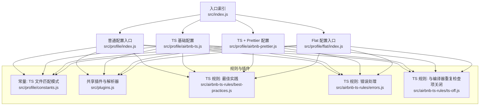
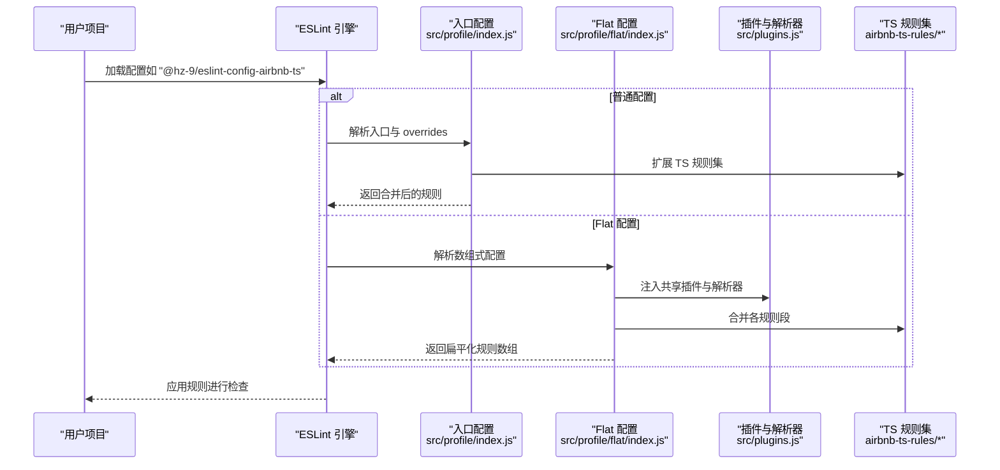
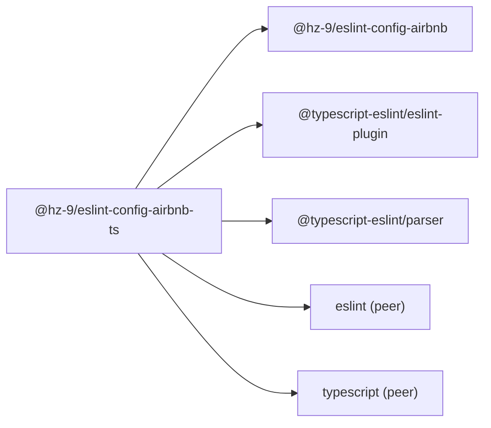

# ESLint Airbnb TypeScript 配置 API

<cite>
**本文引用的文件**
- [packages/eslint-config-airbnb-ts/package.json](file://packages/eslint-config-airbnb-ts/package.json)
- [packages/eslint-config-airbnb-ts/src/index.js](file://packages/eslint-config-airbnb-ts/src/index.js)
- [packages/eslint-config-airbnb-ts/src/profile/index.js](file://packages/eslint-config-airbnb-ts/src/profile/index.js)
- [packages/eslint-config-airbnb-ts/src/profile/airbnb-ts.js](file://packages/eslint-config-airbnb-ts/src/profile/airbnb-ts.js)
- [packages/eslint-config-airbnb-ts/src/profile/airbnb-prettier.js](file://packages/eslint-config-airbnb-ts/src/profile/airbnb-prettier.js)
- [packages/eslint-config-airbnb-ts/src/profile/flat/index.js](file://packages/eslint-config-airbnb-ts/src/profile/flat/index.js)
- [packages/eslint-config-airbnb-ts/src/profile/constants.js](file://packages/eslint-config-airbnb-ts/src/profile/constants.js)
- [packages/eslint-config-airbnb-ts/src/plugins.js](file://packages/eslint-config-airbnb-ts/src/plugins.js)
- [packages/eslint-config-airbnb-ts/src/airbnb-ts-rules/best-practices.js](file://packages/eslint-config-airbnb-ts/src/airbnb-ts-rules/best-practices.js)
- [packages/eslint-config-airbnb-ts/src/airbnb-ts-rules/errors.js](file://packages/eslint-config-airbnb-ts/src/airbnb-ts-rules/errors.js)
- [packages/eslint-config-airbnb-ts/src/airbnb-ts-rules/ts-off.js](file://packages/eslint-config-airbnb-ts/src/airbnb-ts-rules/ts-off.js)
- [packages/eslint-config-airbnb/package.json](file://packages/eslint-config-airbnb/package.json)
- [packages/tsconfig.base.json](file://packages/tsconfig.base.json)
</cite>

## 目录
1. [简介](#简介)
2. [项目结构](#项目结构)
3. [核心组件](#核心组件)
4. [架构总览](#架构总览)
5. [详细组件分析](#详细组件分析)
6. [依赖关系分析](#依赖关系分析)
7. [性能与兼容性考量](#性能与兼容性考量)
8. [故障排查指南](#故障排查指南)
9. [结论](#结论)
10. [附录：配置示例与迁移指南](#附录配置示例与迁移指南)

## 简介
本文件面向使用 ESLint 的 TypeScript 项目的开发者，系统化说明 @hz-9/eslint-config-airbnb-ts 包的 API 设计与使用方式。该配置在 Airbnb JavaScript 规则基础上，针对 TypeScript 文件（含 TSX、CTS、MTS）进行增强与适配，重点覆盖：
- TypeScript 特有规则替换与启用
- 装饰器与模块解析等高级能力的兼容
- 与标准 ESLint Airbnb 配置的差异与增强点
- 与 TypeScript 编译器选项的协同
- 完整配置示例、迁移步骤与升级注意事项

## 项目结构
该包以“配置分发 + 规则聚合”的方式组织，核心入口导出多种配置变体（普通与 Flat），并在 TypeScript 文件范围内叠加 @typescript-eslint 插件与规则集。

图表来源
- [packages/eslint-config-airbnb-ts/src/index.js:1-2](file://packages/eslint-config-airbnb-ts/src/index.js#L1-L2)
- [packages/eslint-config-airbnb-ts/src/profile/index.js:44-86](file://packages/eslint-config-airbnb-ts/src/profile/index.js#L44-L86)
- [packages/eslint-config-airbnb-ts/src/profile/airbnb-ts.js:3-34](file://packages/eslint-config-airbnb-ts/src/profile/airbnb-ts.js#L3-L34)
- [packages/eslint-config-airbnb-ts/src/profile/airbnb-prettier.js:3-36](file://packages/eslint-config-airbnb-ts/src/profile/airbnb-prettier.js#L3-L36)
- [packages/eslint-config-airbnb-ts/src/profile/flat/index.js:30-66](file://packages/eslint-config-airbnb-ts/src/profile/flat/index.js#L30-L66)
- [packages/eslint-config-airbnb-ts/src/profile/constants.js:1-4](file://packages/eslint-config-airbnb-ts/src/profile/constants.js#L1-L4)
- [packages/eslint-config-airbnb-ts/src/plugins.js:1-16](file://packages/eslint-config-airbnb-ts/src/plugins.js#L1-L16)
- [packages/eslint-config-airbnb-ts/src/airbnb-ts-rules/best-practices.js:1-60](file://packages/eslint-config-airbnb-ts/src/airbnb-ts-rules/best-practices.js#L1-L60)
- [packages/eslint-config-airbnb-ts/src/airbnb-ts-rules/errors.js:1-15](file://packages/eslint-config-airbnb-ts/src/airbnb-ts-rules/errors.js#L1-L15)
- [packages/eslint-config-airbnb-ts/src/airbnb-ts-rules/ts-off.js:1-85](file://packages/eslint-config-airbnb-ts/src/airbnb-ts-rules/ts-off.js#L1-L85)

章节来源
- [packages/eslint-config-airbnb-ts/src/index.js:1-2](file://packages/eslint-config-airbnb-ts/src/index.js#L1-L2)
- [packages/eslint-config-airbnb-ts/src/profile/index.js:44-86](file://packages/eslint-config-airbnb-ts/src/profile/index.js#L44-L86)
- [packages/eslint-config-airbnb-ts/src/profile/airbnb-ts.js:3-34](file://packages/eslint-config-airbnb-ts/src/profile/airbnb-ts.js#L3-L34)
- [packages/eslint-config-airbnb-ts/src/profile/airbnb-prettier.js:3-36](file://packages/eslint-config-airbnb-ts/src/profile/airbnb-prettier.js#L3-L36)
- [packages/eslint-config-airbnb-ts/src/profile/flat/index.js:30-66](file://packages/eslint-config-airbnb-ts/src/profile/flat/index.js#L30-L66)
- [packages/eslint-config-airbnb-ts/src/profile/constants.js:1-4](file://packages/eslint-config-airbnb-ts/src/profile/constants.js#L1-L4)
- [packages/eslint-config-airbnb-ts/src/plugins.js:1-16](file://packages/eslint-config-airbnb-ts/src/plugins.js#L1-L16)

## 核心组件
- 入口与导出
  - 主入口导出多个命名导出，支持按需选择基础、Prettier 或 Flat 配置。
  - 普通配置通过 overrides 仅对 TypeScript 文件生效；Flat 配置通过 files 数组精确限定。
- 规则覆盖策略
  - 对于与 TypeScript 编译器职责重叠或在 TS 中易误报的规则，统一在 ts-off 中关闭。
  - 将部分基础规则替换为 @typescript-eslint 版本，以获得更贴合类型的语义检查。
- 插件与解析器
  - 在 TypeScript 文件作用域内启用 @typescript-eslint 插件与解析器。
  - Flat 配置中复用共享插件实例，避免重复初始化。

章节来源
- [packages/eslint-config-airbnb-ts/package.json:21-54](file://packages/eslint-config-airbnb-ts/package.json#L21-L54)
- [packages/eslint-config-airbnb-ts/src/profile/index.js:44-86](file://packages/eslint-config-airbnb-ts/src/profile/index.js#L44-L86)
- [packages/eslint-config-airbnb-ts/src/profile/flat/index.js:30-66](file://packages/eslint-config-airbnb-ts/src/profile/flat/index.js#L30-L66)
- [packages/eslint-config-airbnb-ts/src/plugins.js:8-15](file://packages/eslint-config-airbnb-ts/src/plugins.js#L8-L15)
- [packages/eslint-config-airbnb-ts/src/airbnb-ts-rules/ts-off.js:1-85](file://packages/eslint-config-airbnb-ts/src/airbnb-ts-rules/ts-off.js#L1-L85)
- [packages/eslint-config-airbnb-ts/src/airbnb-ts-rules/best-practices.js:4-58](file://packages/eslint-config-airbnb-ts/src/airbnb-ts-rules/best-practices.js#L4-L58)

## 架构总览
下图展示从入口到规则应用的调用链路，以及 Flat 配置与普通配置的差异。

图表来源
- [packages/eslint-config-airbnb-ts/src/profile/index.js:44-86](file://packages/eslint-config-airbnb-ts/src/profile/index.js#L44-L86)
- [packages/eslint-config-airbnb-ts/src/profile/flat/index.js:30-66](file://packages/eslint-config-airbnb-ts/src/profile/flat/index.js#L30-L66)
- [packages/eslint-config-airbnb-ts/src/plugins.js:8-15](file://packages/eslint-config-airbnb-ts/src/plugins.js#L8-L15)
- [packages/eslint-config-airbnb-ts/src/airbnb-ts-rules/best-practices.js:1-60](file://packages/eslint-config-airbnb-ts/src/airbnb-ts-rules/best-practices.js#L1-L60)

## 详细组件分析

### 普通配置入口（index）
- 职责
  - 继承 @hz-9/eslint-config-airbnb 的基础规则
  - 通过 overrides 仅在 TypeScript 文件上启用 @typescript-eslint 插件与解析器
  - 扩展一系列 TS 专用规则集与 Prettier 规则
- 关键点
  - 使用 TS_FILES_GLOB 精确匹配 *.ts、*.tsx、*.cts、*.mts
  - 将部分基础规则替换为 @typescript-eslint 版本，提升类型感知能力

章节来源
- [packages/eslint-config-airbnb-ts/src/profile/index.js:44-86](file://packages/eslint-config-airbnb-ts/src/profile/index.js#L44-L86)
- [packages/eslint-config-airbnb-ts/src/profile/constants.js:1-4](file://packages/eslint-config-airbnb-ts/src/profile/constants.js#L1-L4)
- [packages/eslint-config-airbnb-ts/src/airbnb-ts-rules/best-practices.js:8-58](file://packages/eslint-config-airbnb-ts/src/airbnb-ts-rules/best-practices.js#L8-L58)

### TS 基础配置（airbnb-ts）
- 职责
  - 以 @hz-9/eslint-config-airbnb/airbnb-base 为基础，叠加 TS 规则集
  - 与 index 类似，通过 overrides 限定 TS 文件范围
- 差异
  - 不包含 Prettier 规则扩展（便于与外部 Prettier 集成）

章节来源
- [packages/eslint-config-airbnb-ts/src/profile/airbnb-ts.js:3-34](file://packages/eslint-config-airbnb-ts/src/profile/airbnb-ts.js#L3-L34)

### TS + Prettier 配置（airbnb-prettier）
- 职责
  - 在 airbnb-base 基础上叠加 TS 规则集与 Prettier 规则
- 适用场景
  - 需要 ESLint 与 Prettier 协同时的完整配置

章节来源
- [packages/eslint-config-airbnb-ts/src/profile/airbnb-prettier.js:3-36](file://packages/eslint-config-airbnb-ts/src/profile/airbnb-prettier.js#L3-L36)

### Flat 配置入口（flat/index）
- 职责
  - 将继承链拆分为多个规则段，显式注入共享插件与解析器
  - 通过 files 数组限定 TS 文件范围，避免对 JS 文件产生影响
- 优势
  - 更清晰的可维护性与可组合性
  - 与 ESLint Flat API 一致，便于未来迁移

章节来源
- [packages/eslint-config-airbnb-ts/src/profile/flat/index.js:30-66](file://packages/eslint-config-airbnb-ts/src/profile/flat/index.js#L30-L66)
- [packages/eslint-config-airbnb-ts/src/plugins.js:8-15](file://packages/eslint-config-airbnb-ts/src/plugins.js#L8-L15)

### TypeScript 规则替换与关闭（airbnb-ts-rules）
- 最佳实践（best-practices）
  - 将多条基础规则替换为 @typescript-eslint 版本，以获得更强的类型感知与更合理的默认值
  - 例如 default-param-last、dot-notation、no-empty-function、no-implied-eval、no-loop-func、no-magic-numbers、no-redeclare、no-unused-expressions、require-await、return-await 等
- 错误处理（errors）
  - 当前版本未新增替换规则，保留基础规则
- 与编译器重复检查项关闭（ts-off）
  - 针对构造函数、super 调用、getter/setter、const/函数/导入赋值、unresolved、named 导出等规则进行关闭，避免与 TypeScript 编译器重复检查或误报

章节来源
- [packages/eslint-config-airbnb-ts/src/airbnb-ts-rules/best-practices.js:4-58](file://packages/eslint-config-airbnb-ts/src/airbnb-ts-rules/best-practices.js#L4-L58)
- [packages/eslint-config-airbnb-ts/src/airbnb-ts-rules/errors.js:4-13](file://packages/eslint-config-airbnb-ts/src/airbnb-ts-rules/errors.js#L4-L13)
- [packages/eslint-config-airbnb-ts/src/airbnb-ts-rules/ts-off.js:1-85](file://packages/eslint-config-airbnb-ts/src/airbnb-ts-rules/ts-off.js#L1-L85)

### 常量与插件（constants 与 plugins）
- 常量
  - TS_FILES_GLOB：统一的 TS 文件匹配模式，确保规则仅应用于 TypeScript 相关文件
- 插件
  - 提供共享的 import 与 @typescript-eslint 插件实例，以及 @typescript-eslint/parser
  - Flat 配置中直接复用这些实例，减少开销

章节来源
- [packages/eslint-config-airbnb-ts/src/profile/constants.js:1-4](file://packages/eslint-config-airbnb-ts/src/profile/constants.js#L1-L4)
- [packages/eslint-config-airbnb-ts/src/plugins.js:8-15](file://packages/eslint-config-airbnb-ts/src/plugins.js#L8-L15)

## 依赖关系分析
- 内部依赖
  - @hz-9/eslint-config-airbnb：作为基础规则集，提供 JS 侧的 Airbnb 规则
- 外部依赖
  - @typescript-eslint/eslint-plugin 与 @typescript-eslint/parser：为 TS 文件提供类型感知的规则与解析
- 版本约束
  - peerDependencies 明确 ESLint 与 TypeScript 的版本范围
  - engines 指定 Node 版本范围

图表来源
- [packages/eslint-config-airbnb-ts/package.json:66-79](file://packages/eslint-config-airbnb-ts/package.json#L66-L79)
- [packages/eslint-config-airbnb/package.json:65-76](file://packages/eslint-config-airbnb/package.json#L65-L76)

章节来源
- [packages/eslint-config-airbnb-ts/package.json:66-79](file://packages/eslint-config-airbnb-ts/package.json#L66-L79)
- [packages/eslint-config-airbnb/package.json:65-76](file://packages/eslint-config-airbnb/package.json#L65-L76)

## 性能与兼容性考量
- 规则替换与关闭
  - 通过替换为 @typescript-eslint 版本与关闭重复检查项，减少误报与重复计算，提高整体性能
- Flat 配置
  - 将规则拆分为多个段落，利于缓存与增量更新
- TypeScript 版本
  - 与 TypeScript 5.0–5.3 兼容，建议在项目中保持一致的编译器版本，避免规则与编译器行为不一致

章节来源
- [packages/eslint-config-airbnb-ts/src/airbnb-ts-rules/best-practices.js:8-58](file://packages/eslint-config-airbnb-ts/src/airbnb-ts-rules/best-practices.js#L8-L58)
- [packages/eslint-config-airbnb-ts/src/airbnb-ts-rules/ts-off.js:1-85](file://packages/eslint-config-airbnb-ts/src/airbnb-ts-rules/ts-off.js#L1-L85)
- [packages/eslint-config-airbnb-ts/package.json:74-78](file://packages/eslint-config-airbnb-ts/package.json#L74-L78)

## 故障排查指南
- 规则冲突
  - 若出现与 TypeScript 编译器重复检查的冲突，确认是否正确启用了 @typescript-eslint 规则或已在 ts-off 中关闭对应规则
- 文件范围问题
  - 确认 TS_FILES_GLOB 是否覆盖到你的文件类型（*.ts、*.tsx、*.cts、*.mts）
- Flat 配置加载失败
  - 检查是否正确引入共享插件与解析器，以及规则段顺序是否符合 ESLint Flat API 要求
- 与 Prettier 冲突
  - 若使用 airbnb-prettier 配置，请确保 Prettier 与 ESLint 的格式化规则一致，避免双重格式化

章节来源
- [packages/eslint-config-airbnb-ts/src/profile/constants.js:1-4](file://packages/eslint-config-airbnb-ts/src/profile/constants.js#L1-L4)
- [packages/eslint-config-airbnb-ts/src/profile/flat/index.js:30-66](file://packages/eslint-config-airbnb-ts/src/profile/flat/index.js#L30-L66)
- [packages/eslint-config-airbnb-ts/src/airbnb-ts-rules/ts-off.js:67-85](file://packages/eslint-config-airbnb-ts/src/airbnb-ts-rules/ts-off.js#L67-L85)

## 结论
@hz-9/eslint-config-airbnb-ts 在保留 Airbnb 风格与可读性的同时，针对 TypeScript 的特性进行了精细化增强：
- 通过 @typescript-eslint 替换与扩展规则，提升类型感知与准确性
- 对与编译器重复检查的规则进行关闭，避免冗余与误报
- 提供普通与 Flat 双形态配置，满足不同项目需求
- 与 tsconfig.base.json 的编译器选项协同，形成“静态检查 + 编译期强约束”的双保险

## 附录：配置示例与迁移指南

### 与 tsconfig.base.json 的协同
- 编译器选项
  - target/module/moduleResolution/esModuleInterop/skipLibCheck/strict 等选项由 tsconfig.base.json 统一管理
  - 请确保项目中的 tsconfig 与该基线一致，以保证 ESLint 与编译器行为一致

章节来源
- [packages/tsconfig.base.json:2-11](file://packages/tsconfig.base.json#L2-L11)

### 迁移步骤（从纯 JS 到 TS）
- 步骤 1：安装依赖
  - 安装 @hz-9/eslint-config-airbnb-ts、eslint、typescript，以及 @typescript-eslint/eslint-plugin 与 @typescript-eslint/parser
- 步骤 2：选择配置
  - 普通配置：使用 "@hz-9/eslint-config-airbnb-ts"
  - TS 基础：使用 "@hz-9/eslint-config-airbnb-ts/airbnb-ts"
  - TS + Prettier：使用 "@hz-9/eslint-config-airbnb-ts/airbnb-prettier"
  - Flat 配置：使用 "@hz-9/eslint-config-airbnb-ts/flat"
- 步骤 3：调整文件范围
  - 确保 TS_FILES_GLOB 覆盖到你的 TS/TSX/CTS/MTS 文件
- 步骤 4：验证与修复
  - 运行 ESLint，根据提示逐项修复类型相关问题
  - 如遇与编译器重复检查的规则冲突，确认已启用 @typescript-eslint 或已在 ts-off 中关闭

### 升级注意事项
- ESLint 与 TypeScript 版本
  - 严格遵循 peerDependencies 中的版本范围，避免因版本不匹配导致规则失效或解析错误
- 规则替换策略
  - 升级后关注 @typescript-eslint 新增规则与行为变化，必要时微调配置
- Flat 配置迁移
  - 若从普通配置迁移到 Flat，注意规则段顺序与共享插件的使用方式

章节来源
- [packages/eslint-config-airbnb-ts/package.json:74-79](file://packages/eslint-config-airbnb-ts/package.json#L74-L79)
- [packages/eslint-config-airbnb-ts/src/profile/flat/index.js:30-66](file://packages/eslint-config-airbnb-ts/src/profile/flat/index.js#L30-L66)
- [packages/eslint-config-airbnb-ts/src/airbnb-ts-rules/best-practices.js:8-58](file://packages/eslint-config-airbnb-ts/src/airbnb-ts-rules/best-practices.js#L8-L58)