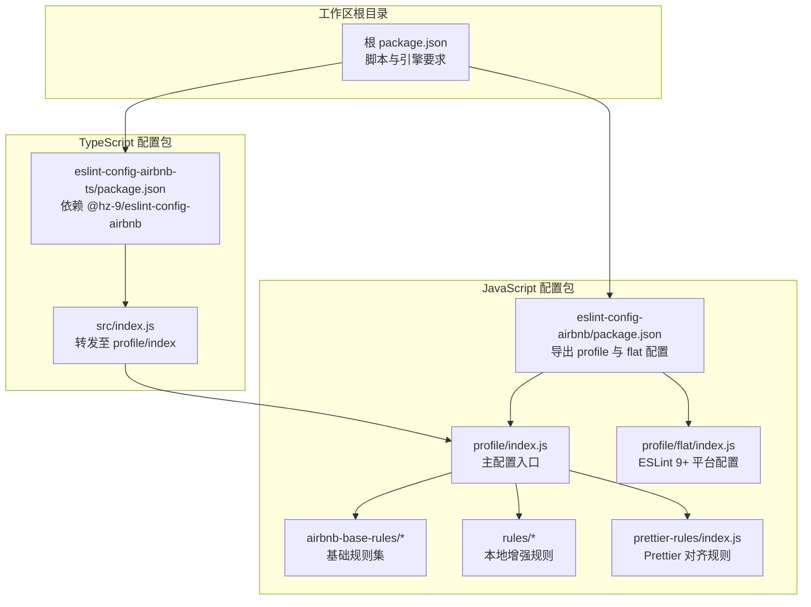
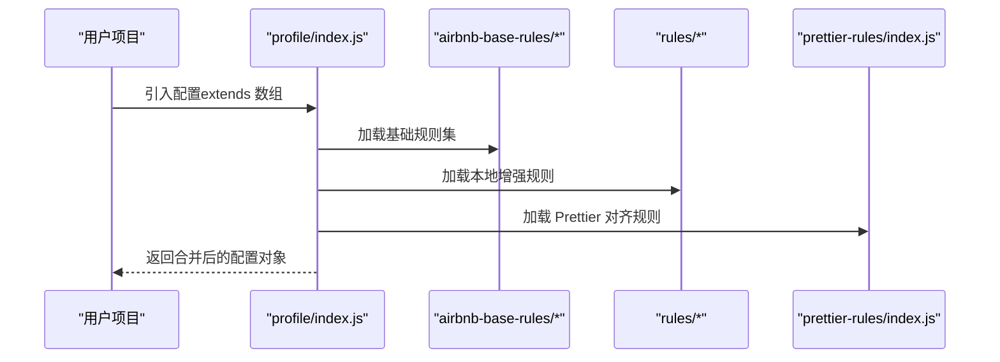
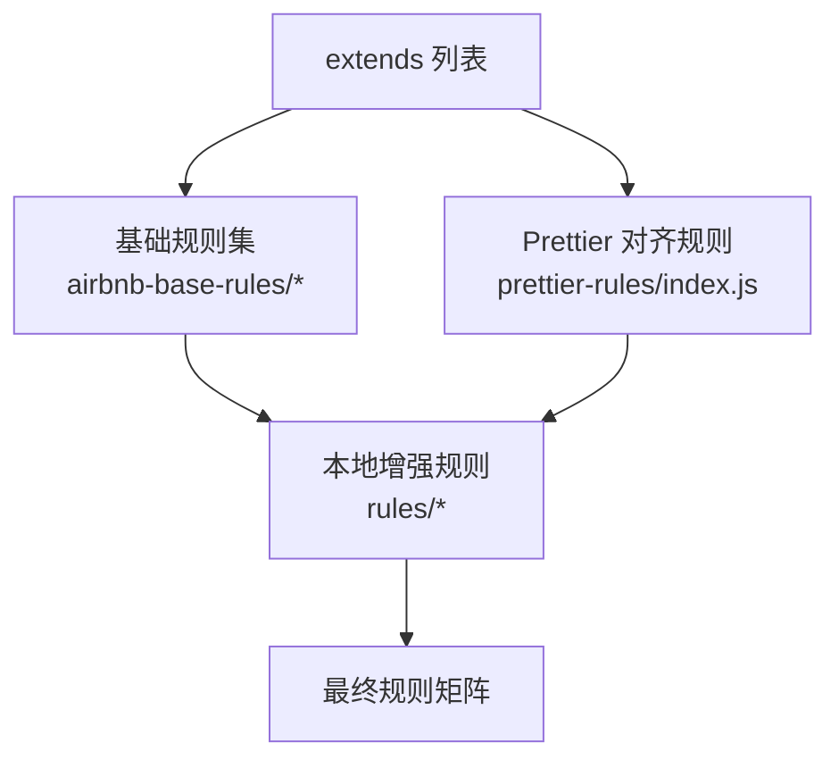
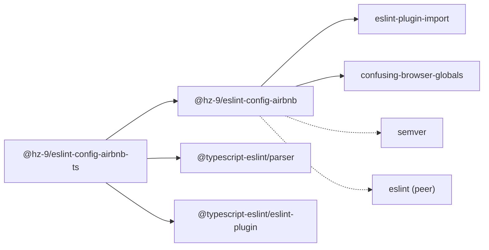

# ESLint Airbnb 配置 API

<cite>
**本文引用的文件**
- [packages/eslint-config-airbnb/package.json](file://packages/eslint-config-airbnb/package.json)
- [packages/eslint-config-airbnb-ts/package.json](file://packages/eslint-config-airbnb-ts/package.json)
- [packages/eslint-config-airbnb/src/profile/index.js](file://packages/eslint-config-airbnb/src/profile/index.js)
- [packages/eslint-config-airbnb/src/profile/airbnb-base.js](file://packages/eslint-config-airbnb/src/profile/airbnb-base.js)
- [packages/eslint-config-airbnb/src/profile/airbnb-prettier.js](file://packages/eslint-config-airbnb/src/profile/airbnb-prettier.js)
- [packages/eslint-config-airbnb/src/prettier-rules/index.js](file://packages/eslint-config-airbnb/src/prettier-rules/index.js)
- [packages/eslint-config-airbnb/src/airbnb-base-rules/best-practices.js](file://packages/eslint-config-airbnb/src/airbnb-base-rules/best-practices.js)
- [packages/eslint-config-airbnb/src/airbnb-base-rules/imports.js](file://packages/eslint-config-airbnb/src/airbnb-base-rules/imports.js)
- [packages/eslint-config-airbnb/src/rules/best-practices.js](file://packages/eslint-config-airbnb/src/rules/best-practices.js)
- [packages/eslint-config-airbnb/src/rules/imports.js](file://packages/eslint-config-airbnb/src/rules/imports.js)
- [packages/eslint-config-airbnb/src/profile/flat/index.js](file://packages/eslint-config-airbnb/src/profile/flat/index.js)
- [packages/eslint-config-airbnb-ts/src/index.js](file://packages/eslint-config-airbnb-ts/src/index.js)
- [package.json](file://package.json)
</cite>

## 目录
1. [简介](#简介)
2. [项目结构](#项目结构)
3. [核心组件](#核心组件)
4. [架构总览](#架构总览)
5. [详细组件分析](#详细组件分析)
6. [依赖关系分析](#依赖关系分析)
7. [性能与可维护性考量](#性能与可维护性考量)
8. [故障排查指南](#故障排查指南)
9. [结论](#结论)
10. [附录：配置示例与最佳实践](#附录配置示例与最佳实践)

## 简介
本文件为 @hz-9/eslint-config-airbnb 包的 API 文档，系统性说明配置对象的结构（rules、extends、plugins、env、parserOptions 等），梳理规则继承与覆盖机制，并提供从基础到高级的完整配置示例与最佳实践。同时说明与 Prettier 的集成方式以及与其他 ESLint 插件（如 import）的协作模式。

## 项目结构
该仓库采用多包工作区组织，核心包为 @hz-9/eslint-config-airbnb（JavaScript）与 @hz-9/eslint-config-airbnb-ts（TypeScript）。前者提供基于 Airbnb 的规则集与 Prettier 集成；后者在前者基础上叠加 TypeScript 解析器与类型规则。

图表来源
- [packages/eslint-config-airbnb/package.json:1-84](file://packages/eslint-config-airbnb/package.json#L1-L84)
- [packages/eslint-config-airbnb/src/profile/index.js:1-38](file://packages/eslint-config-airbnb/src/profile/index.js#L1-L38)
- [packages/eslint-config-airbnb/src/profile/flat/index.js:1-51](file://packages/eslint-config-airbnb/src/profile/flat/index.js#L1-L51)
- [packages/eslint-config-airbnb-ts/package.json:1-87](file://packages/eslint-config-airbnb-ts/package.json#L1-L87)
- [packages/eslint-config-airbnb-ts/src/index.js:1-2](file://packages/eslint-config-airbnb-ts/src/index.js#L1-L2)
- [package.json:1-38](file://package.json#L1-L38)

章节来源
- [packages/eslint-config-airbnb/package.json:1-84](file://packages/eslint-config-airbnb/package.json#L1-L84)
- [packages/eslint-config-airbnb-ts/package.json:1-87](file://packages/eslint-config-airbnb-ts/package.json#L1-L87)
- [package.json:1-38](file://package.json#L1-L38)

## 核心组件
- 配置对象结构
  - plugins: 声明使用的插件集合（如 import）
  - env: 运行时环境（如 es6、node）
  - extends: 继承其他配置文件数组（支持相对路径 resolve）
  - parserOptions: 解析器选项（如 ecmaVersion、sourceType）
  - rules: 当前配置中显式声明的规则覆盖
- 主要导出
  - profile/index.js：标准配置入口（含 Prettier 对齐）
  - profile/airbnb-base.js：仅 Airbnb 基础规则（不含 Prettier）
  - profile/airbnb-prettier.js：Airbnb + Prettier 对齐
  - profile/flat/index.js：ESLint 9+ 平台扁平化配置数组
- 规则来源分层
  - airbnb-base-rules/*：Airbnb 原始规则集（严格程度较高）
  - rules/*：本地增强/覆盖（更宽松或补充）
  - prettier-rules/index.js：与 Prettier 对齐的样式规则关闭策略

章节来源
- [packages/eslint-config-airbnb/src/profile/index.js:1-38](file://packages/eslint-config-airbnb/src/profile/index.js#L1-L38)
- [packages/eslint-config-airbnb/src/profile/airbnb-base.js:1-27](file://packages/eslint-config-airbnb/src/profile/airbnb-base.js#L1-L27)
- [packages/eslint-config-airbnb/src/profile/airbnb-prettier.js:1-29](file://packages/eslint-config-airbnb/src/profile/airbnb-prettier.js#L1-L29)
- [packages/eslint-config-airbnb/src/prettier-rules/index.js:1-268](file://packages/eslint-config-airbnb/src/prettier-rules/index.js#L1-L268)
- [packages/eslint-config-airbnb/src/profile/flat/index.js:1-51](file://packages/eslint-config-airbnb/src/profile/flat/index.js#L1-L51)

## 架构总览
下图展示配置对象的装配流程：profile 入口通过 extends 聚合多个规则集，最终形成完整的规则矩阵；flat 模式以数组形式逐段合并语言选项与规则。

图表来源
- [packages/eslint-config-airbnb/src/profile/index.js:9-29](file://packages/eslint-config-airbnb/src/profile/index.js#L9-L29)
- [packages/eslint-config-airbnb/src/airbnb-base-rules/best-practices.js:1-460](file://packages/eslint-config-airbnb/src/airbnb-base-rules/best-practices.js#L1-L460)
- [packages/eslint-config-airbnb/src/rules/best-practices.js:1-35](file://packages/eslint-config-airbnb/src/rules/best-practices.js#L1-L35)
- [packages/eslint-config-airbnb/src/prettier-rules/index.js:1-268](file://packages/eslint-config-airbnb/src/prettier-rules/index.js#L1-L268)

## 详细组件分析

### 配置对象与继承机制
- 继承链路
  - profile/index.js 通过 extends 聚合基础规则集与 Prettier 对齐规则，随后叠加本地增强规则。
  - airbnb-base.js 仅包含基础规则集，便于不引入 Prettier 的场景。
  - airbnb-prettier.js 在基础规则集之上再引入 Prettier 对齐规则。
- 覆盖策略
  - 后加载的规则会覆盖先前定义的同名规则；本地增强规则位于基础规则之后，因此具有更高优先级。
  - flat/index.js 以数组顺序合并，后一项覆盖前一项的同名键值。

图表来源
- [packages/eslint-config-airbnb/src/profile/index.js:9-29](file://packages/eslint-config-airbnb/src/profile/index.js#L9-L29)
- [packages/eslint-config-airbnb/src/prettier-rules/index.js:1-268](file://packages/eslint-config-airbnb/src/prettier-rules/index.js#L1-L268)
- [packages/eslint-config-airbnb/src/rules/best-practices.js:1-35](file://packages/eslint-config-airbnb/src/rules/best-practices.js#L1-L35)

章节来源
- [packages/eslint-config-airbnb/src/profile/index.js:1-38](file://packages/eslint-config-airbnb/src/profile/index.js#L1-L38)
- [packages/eslint-config-airbnb/src/profile/airbnb-base.js:1-27](file://packages/eslint-config-airbnb/src/profile/airbnb-base.js#L1-L27)
- [packages/eslint-config-airbnb/src/profile/airbnb-prettier.js:1-29](file://packages/eslint-config-airbnb/src/profile/airbnb-prettier.js#L1-L29)
- [packages/eslint-config-airbnb/src/prettier-rules/index.js:1-268](file://packages/eslint-config-airbnb/src/prettier-rules/index.js#L1-L268)
- [packages/eslint-config-airbnb/src/rules/best-practices.js:1-35](file://packages/eslint-config-airbnb/src/rules/best-practices.js#L1-L35)

### 导入规则（import）与扩展点
- 基础导入规则（airbnb-base-rules/imports.js）涵盖解析器设置、模块解析、导入顺序、重复导入、动态导入等。
- 本地增强（rules/imports.js）对部分规则进行放宽或扩展（例如对 Vite 配置文件的 dev 依赖白名单追加）。
- 使用要点
  - 若需自定义解析器或忽略特定文件类型，可在 extends 之前先加载自定义配置，以实现覆盖。
  - 如需更严格的导入顺序控制，可将 import/order 的分组策略调整为更细粒度。

章节来源
- [packages/eslint-config-airbnb/src/airbnb-base-rules/imports.js:1-296](file://packages/eslint-config-airbnb/src/airbnb-base-rules/imports.js#L1-L296)
- [packages/eslint-config-airbnb/src/rules/imports.js:1-29](file://packages/eslint-config-airbnb/src/rules/imports.js#L1-L29)

### Prettier 集成与规则对齐
- prettier-rules/index.js 将大量样式类规则统一设为关闭，避免与 Prettier 格式化冲突。
- 在 airbnb-prettier.js 中，先加载基础规则集，再加载 Prettier 对齐规则，确保格式化一致性。
- 最佳实践
  - 推荐在项目中同时安装 Prettier，并在编辑器中启用保存时格式化。
  - 若需要部分风格由 ESLint 控制（如最大行宽），可在此处开启相应规则并配合 Prettier 的相关配置。

章节来源
- [packages/eslint-config-airbnb/src/prettier-rules/index.js:1-268](file://packages/eslint-config-airbnb/src/prettier-rules/index.js#L1-L268)
- [packages/eslint-config-airbnb/src/profile/airbnb-prettier.js:1-29](file://packages/eslint-config-airbnb/src/profile/airbnb-prettier.js#L1-L29)

### Flat 配置（ESLint 9+）
- flat/index.js 以数组形式组织配置，每项为一个片段对象，包含 plugins、settings、languageOptions、rules 等键。
- 片段按顺序合并，后项覆盖前项的同名键值；适合在 monorepo 或复杂工程中按层拆分配置。
- 适用场景
  - 多语言混合项目（JS/TS/JSX/TSX）
  - 需要按文件类型或目录范围精细控制规则

章节来源
- [packages/eslint-config-airbnb/src/profile/flat/index.js:1-51](file://packages/eslint-config-airbnb/src/profile/flat/index.js#L1-L51)

### TypeScript 配置（@hz-9/eslint-config-airbnb-ts）
- 依赖 @hz-9/eslint-config-airbnb，并引入 @typescript-eslint/parser 与 @typescript-eslint/eslint-plugin。
- 通过 src/index.js 直接转发至 profile/index，复用同一套规则体系。
- 使用建议
  - 在 TS 项目中优先使用 flat 配置，以获得更好的类型感知与性能。
  - 结合 tsconfig.base.json 与工程化的类型检查策略。

章节来源
- [packages/eslint-config-airbnb-ts/package.json:1-87](file://packages/eslint-config-airbnb-ts/package.json#L1-L87)
- [packages/eslint-config-airbnb-ts/src/index.js:1-2](file://packages/eslint-config-airbnb-ts/src/index.js#L1-L2)

## 依赖关系分析
- 运行时依赖
  - eslint-plugin-import：提供 import 相关规则与解析能力
  - confusing-browser-globals：阻止使用易混淆的浏览器全局变量
  - semver：版本比较工具（用于兼容性判断）
- peerDependencies
  - eslint：要求宿主项目安装 ESLint（版本范围见包信息）
- 工作区集成
  - 根 package.json 声明了工作区脚本与引擎要求，确保 Node 与 ESLint 版本满足约束

图表来源
- [packages/eslint-config-airbnb/package.json:65-79](file://packages/eslint-config-airbnb/package.json#L65-L79)
- [packages/eslint-config-airbnb-ts/package.json:66-79](file://packages/eslint-config-airbnb-ts/package.json#L66-L79)
- [package.json:17-32](file://package.json#L17-L32)

章节来源
- [packages/eslint-config-airbnb/package.json:65-79](file://packages/eslint-config-airbnb/package.json#L65-L79)
- [packages/eslint-config-airbnb-ts/package.json:66-79](file://packages/eslint-config-airbnb-ts/package.json#L66-L79)
- [package.json:17-32](file://package.json#L17-L32)

## 性能与可维护性考量
- 规则数量与复杂度
  - 基础规则集覆盖全面，建议结合项目规模选择是否启用 Prettier 对齐或本地增强规则，以平衡严格度与维护成本。
- 扁平化配置（Flat）
  - 通过数组片段化配置，可按需裁剪规则，减少不必要的扫描与匹配开销。
- 解析器与解析范围
  - 合理设置 parserOptions 与 import resolver，避免对无关目录进行扫描，提升性能。

## 故障排查指南
- 规则冲突
  - 现象：ESLint 报告与 Prettier 冲突的样式类错误
  - 处理：确认已启用 airbnb-prettier.js 或在配置中引入 prettier-rules/index.js，并保持 Prettier 正常运行
- 导入规则误报
  - 现象：对 Vite、Webpack 等配置文件的 dev 依赖报错
  - 处理：确认 rules/imports.js 中已包含对应通配符；必要时在项目中新增自定义配置覆盖
- Flat 配置未生效
  - 现象：ESLint 9+ 下规则未按预期应用
  - 处理：检查 flat/index.js 的片段顺序与键名拼写；确保语言选项与规则键一致

章节来源
- [packages/eslint-config-airbnb/src/rules/imports.js:13-26](file://packages/eslint-config-airbnb/src/rules/imports.js#L13-L26)
- [packages/eslint-config-airbnb/src/prettier-rules/index.js:1-268](file://packages/eslint-config-airbnb/src/prettier-rules/index.js#L1-L268)
- [packages/eslint-config-airbnb/src/profile/flat/index.js:23-50](file://packages/eslint-config-airbnb/src/profile/flat/index.js#L23-L50)

## 结论
本配置包通过清晰的分层与继承机制，提供了从严格到宽松的多种使用方式。推荐在团队内统一采用 airbnb-prettier.js 或 flat 配置，结合 Prettier 实现“格式化由 Prettier，风格由 ESLint”分工，既保证一致性又降低维护成本。

## 附录：配置示例与最佳实践

- 基础配置（JavaScript）
  - 使用 profile/index.js 或 airbnb-prettier.js，适用于大多数前端项目
  - 参考路径：[profile/index.js:1-38](file://packages/eslint-config-airbnb/src/profile/index.js#L1-L38)，[airbnb-prettier.js:1-29](file://packages/eslint-config-airbnb/src/profile/airbnb-prettier.js#L1-L29)

- 基础配置（仅 Airbnb）
  - 使用 airbnb-base.js，不引入 Prettier 对齐
  - 参考路径：[airbnb-base.js:1-27](file://packages/eslint-config-airbnb/src/profile/airbnb-base.js#L1-L27)

- Flat 配置（ESLint 9+）
  - 使用 profile/flat/index.js，按片段组织规则
  - 参考路径：[flat/index.js:1-51](file://packages/eslint-config-airbnb/src/profile/flat/index.js#L1-L51)

- TypeScript 项目
  - 安装 @hz-9/eslint-config-airbnb-ts，并在项目中引用其导出
  - 参考路径：[@hz-9/eslint-config-airbnb-ts/package.json:1-87](file://packages/eslint-config-airbnb-ts/package.json#L1-L87)，[src/index.js:1-2](file://packages/eslint-config-airbnb-ts/src/index.js#L1-L2)

- 自定义扩展与覆盖
  - 在项目根配置中先加载基础配置，再加载自定义配置，以实现覆盖
  - 示例思路参考：[profile/index.js 继承链:9-29](file://packages/eslint-config-airbnb/src/profile/index.js#L9-L29)

- 与 Prettier 的集成
  - 启用 airbnb-prettier.js 或引入 prettier-rules/index.js，避免格式化冲突
  - 参考路径：[prettier-rules/index.js:1-268](file://packages/eslint-config-airbnb/src/prettier-rules/index.js#L1-L268)

- 常见问题与建议
  - Vite/Webpack 配置文件误报 dev 依赖：确认已启用本地增强规则中的 devDependencies 白名单
    - 参考路径：[rules/imports.js:13-26](file://packages/eslint-config-airbnb/src/rules/imports.js#L13-L26)
  - 导入顺序与命名导出策略：根据团队规范调整 import/order 与 import/prefer-default-export
    - 参考路径：[airbnb-base-rules/imports.js:140-150](file://packages/eslint-config-airbnb/src/airbnb-base-rules/imports.js#L140-L150)