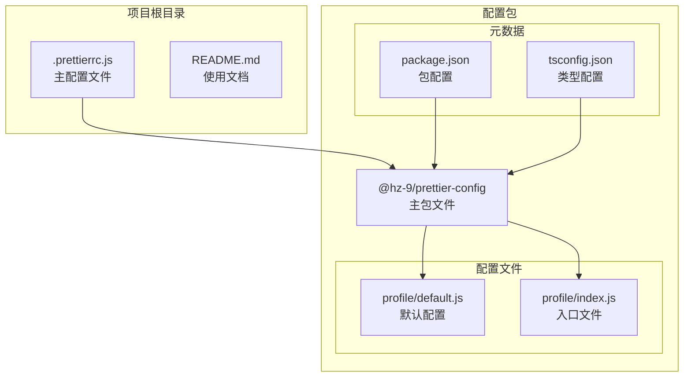
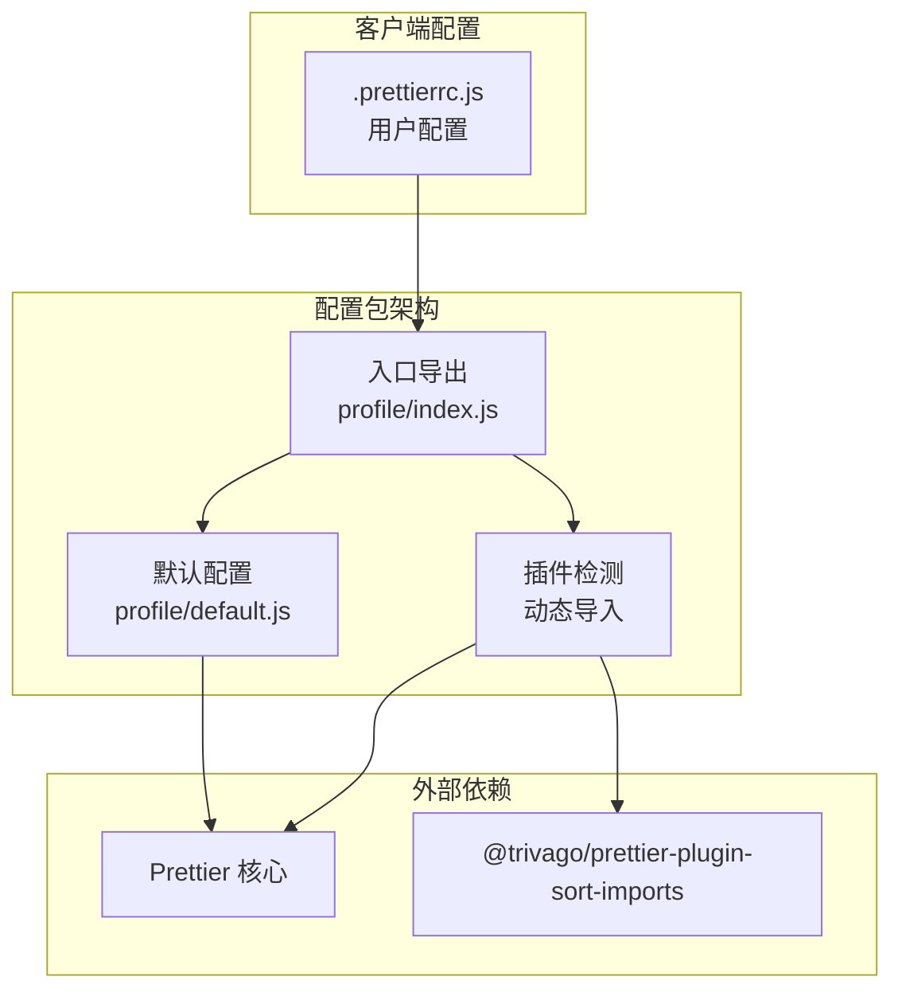
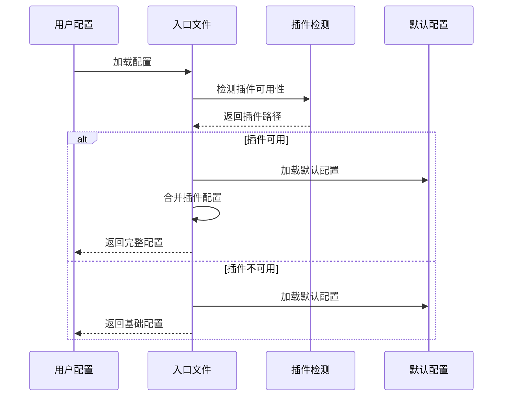
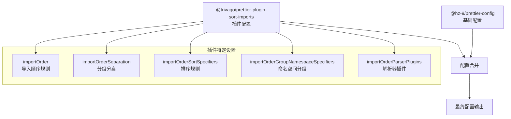
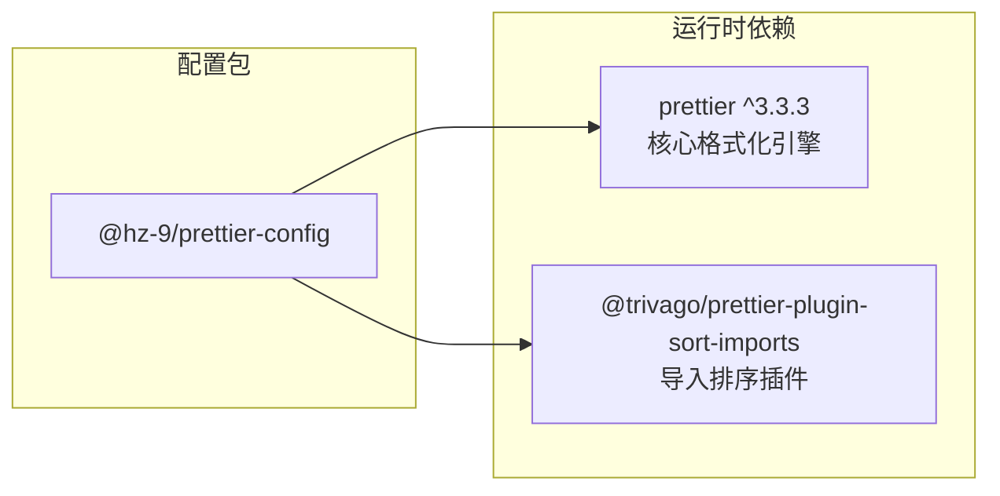

# Prettier 格式化配置 API

<cite>
**本文档引用的文件**
- [.prettierrc.js](file://.prettierrc.js)
- [packages/prettier-config/package.json](file://packages/prettier-config/package.json)
- [packages/prettier-config/README.md](file://packages/prettier-config/README.md)
- [packages/prettier-config/profile/index.js](file://packages/prettier-config/profile/index.js)
- [packages/prettier-config/profile/default.js](file://packages/prettier-config/profile/default.js)
- [packages/prettier-config/tsconfig.json](file://packages/prettier-config/tsconfig.json)
</cite>

## 目录
1. [简介](#简介)
2. [项目结构](#项目结构)
3. [核心组件](#核心组件)
4. [架构概览](#架构概览)
5. [详细组件分析](#详细组件分析)
6. [依赖关系分析](#依赖关系分析)
7. [性能考虑](#性能考虑)
8. [故障排除指南](#故障排除指南)
9. [结论](#结论)
10. [附录](#附录)

## 简介
本项目提供了一个可复用的 Prettier 格式化配置包，旨在为 hz-9 团队提供统一的代码格式化标准。该配置包通过模块化设计，支持按需扩展和定制，同时保持与主流前端技术栈的良好兼容性。

## 项目结构
该项目采用多包工作区结构，核心配置位于 `packages/prettier-config` 目录下，包含基础配置和可选插件支持。

**图表来源**
- [.prettierrc.js:1-15](file://.prettierrc.js#L1-L15)
- [packages/prettier-config/package.json:1-45](file://packages/prettier-config/package.json#L1-L45)
- [packages/prettier-config/profile/index.js:1-30](file://packages/prettier-config/profile/index.js#L1-L30)

**章节来源**
- [.prettierrc.js:1-15](file://.prettierrc.js#L1-L15)
- [packages/prettier-config/package.json:1-45](file://packages/prettier-config/package.json#L1-L45)

## 核心组件
配置包的核心由三个主要组件构成：默认配置、动态插件集成和入口导出模块。

### 默认配置模块
默认配置模块提供了基础的代码格式化规则，涵盖了打印宽度、引号策略、分号处理等核心参数。

### 动态插件集成模块
该模块实现了智能插件检测机制，能够根据项目环境自动启用或禁用特定功能。

### 入口导出模块
入口文件负责协调默认配置和插件配置，提供统一的配置接口。

**章节来源**
- [packages/prettier-config/profile/default.js:1-28](file://packages/prettier-config/profile/default.js#L1-L28)
- [packages/prettier-config/profile/index.js:1-30](file://packages/prettier-config/profile/index.js#L1-L30)

## 架构概览
配置包采用分层架构设计，通过模块化的方式实现功能解耦和可扩展性。

**图表来源**
- [.prettierrc.js:3-14](file://.prettierrc.js#L3-L14)
- [packages/prettier-config/profile/index.js:1-30](file://packages/prettier-config/profile/index.js#L1-L30)

## 详细组件分析

### 默认配置参数详解
默认配置模块定义了完整的代码格式化规则集，每个参数都有明确的设计目的和适用场景。

#### 基础格式化参数
- **printWidth**: 设置代码行长限制，采用较大的值以适应复杂代码结构
- **tabWidth**: 控制制表符宽度，与缩进策略配合使用
- **useTabs**: 决定使用制表符还是空格进行缩进
- **semi**: 控制语句末尾是否添加分号

#### 引号和字符串处理
- **singleQuote**: 统一使用单引号而非双引号
- **quoteProps**: 控制对象属性名的引号策略
- **trailingComma**: 设置尾随逗号的应用范围
- **arrowParens**: 控制箭头函数参数括号的使用

#### HTML 和 JSX 特定设置
- **htmlWhitespaceSensitivity**: 处理 HTML 中空白字符的敏感度
- **vueIndentScriptAndStyle**: 控制 Vue 文件中脚本和样式的缩进
- **endOfLine**: 设置行结束符格式

#### 对象和数组格式化
- **bracketSpacing**: 控制对象字面量中括号内的空白
- **bracketSameLine**: 决定括号是否放在同一行
- **singleAttributePerLine**: 强制每个属性单独一行

**章节来源**
- [packages/prettier-config/profile/default.js:1-28](file://packages/prettier-config/profile/default.js#L1-L28)

### 插件集成机制
配置包实现了智能的插件检测和集成机制，确保在不同环境下都能正常工作。

**图表来源**
- [packages/prettier-config/profile/index.js:4-29](file://packages/prettier-config/profile/index.js#L4-L29)

**章节来源**
- [packages/prettier-config/profile/index.js:1-30](file://packages/prettier-config/profile/index.js#L1-L30)

### 配置继承和扩展
主配置文件展示了如何继承基础配置并添加特定功能。

**图表来源**
- [.prettierrc.js:3-14](file://.prettierrc.js#L3-L14)

**章节来源**
- [.prettierrc.js:1-15](file://.prettierrc.js#L1-L15)

## 依赖关系分析

### 包依赖图
配置包的依赖关系相对简单，主要依赖于 Prettier 核心和可选的导入排序插件。

**图表来源**
- [packages/prettier-config/package.json:32-37](file://packages/prettier-config/package.json#L32-L37)

### 版本兼容性
配置包对 Node.js 版本有明确要求，确保在指定版本范围内提供最佳兼容性。

**章节来源**
- [packages/prettier-config/package.json:38-40](file://packages/prettier-config/package.json#L38-L40)

## 性能考虑
配置包在设计时充分考虑了性能优化，特别是在插件检测和配置加载方面。

### 智能插件检测
通过延迟加载和错误处理机制，避免不必要的性能开销。

### 配置缓存策略
合理的配置结构设计减少了重复计算和内存占用。

## 故障排除指南

### 常见问题及解决方案

#### 插件未找到错误
当 `@trivago/prettier-plugin-sort-imports` 未安装时，系统会显示相应的错误信息并回退到基础配置。

#### 版本兼容性问题
确保 Node.js 版本符合包的引擎要求，避免运行时错误。

#### 配置冲突
如果遇到与其他工具的配置冲突，检查配置文件的合并顺序和优先级。

**章节来源**
- [packages/prettier-config/profile/index.js:7-11](file://packages/prettier-config/profile/index.js#L7-L11)

## 结论
该 Prettier 配置包通过模块化设计和智能集成机制，为团队提供了灵活且强大的代码格式化解决方案。其简洁的配置结构和完善的错误处理机制，使得配置和维护变得异常简单。

## 附录

### 完整配置参数参考
以下是最常用的配置参数及其作用：

| 参数名称 | 类型 | 默认值 | 说明 |
|---------|------|--------|------|
| printWidth | number | 120 | 代码行长限制 |
| tabWidth | number | 2 | 制表符宽度 |
| useTabs | boolean | false | 是否使用制表符 |
| semi | boolean | false | 是否使用分号 |
| singleQuote | boolean | true | 是否使用单引号 |
| trailingComma | string | 'es5' | 尾随逗号应用范围 |
| arrowParens | string | 'always' | 箭头函数括号策略 |
| bracketSpacing | boolean | true | 对象括号内空白 |
| endOfLine | string | 'lf' | 行结束符格式 |

### 使用示例
配置包支持多种使用方式，从简单的直接使用到复杂的扩展配置。

**章节来源**
- [packages/prettier-config/README.md:17-40](file://packages/prettier-config/README.md#L17-L40)