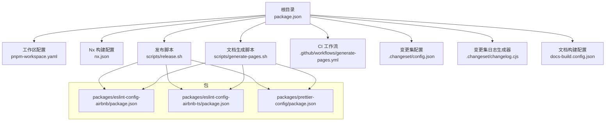
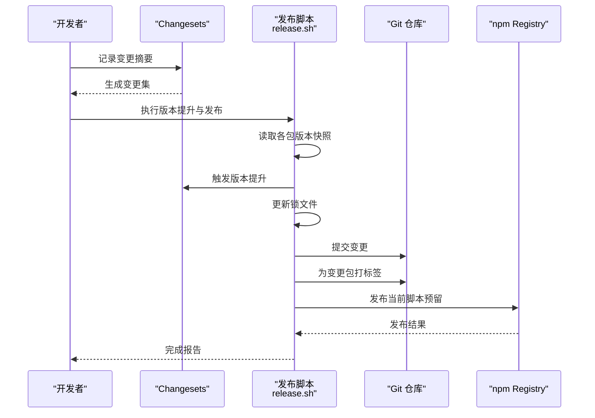
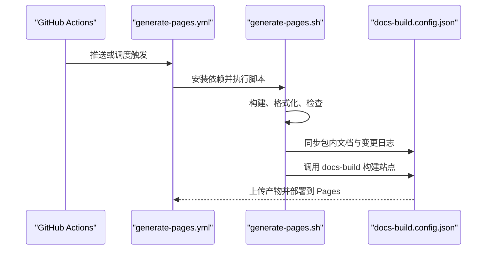
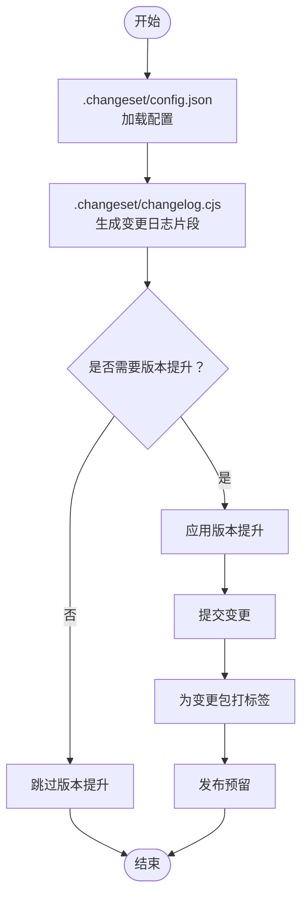
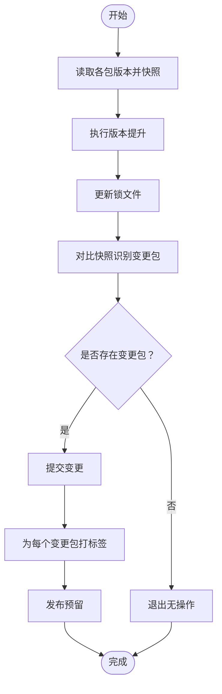
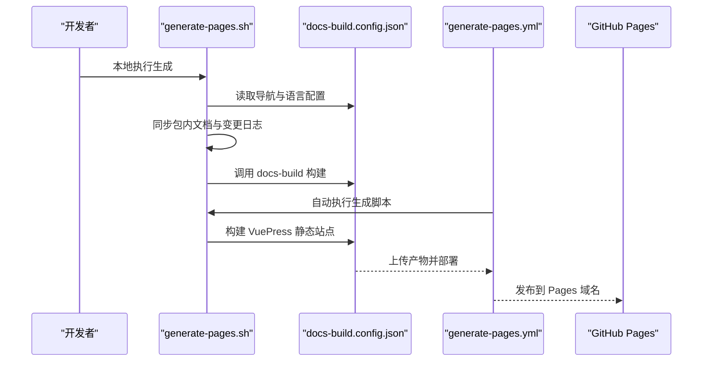
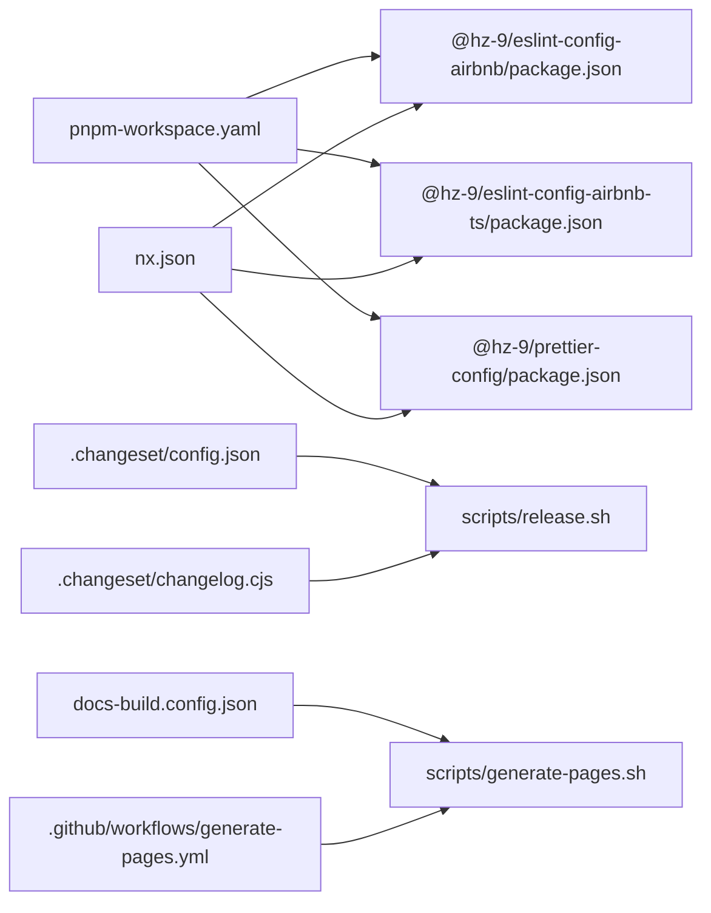

# 发布流程

<cite>
**本文引用的文件**
- [package.json](file://package.json)
- [pnpm-workspace.yaml](file://pnpm-workspace.yaml)
- [nx.json](file://nx.json)
- [.changeset/config.json](file://.changeset/config.json)
- [.changeset/changelog.cjs](file://.changeset/changelog.cjs)
- [scripts/release.sh](file://scripts/release.sh)
- [scripts/generate-pages.sh](file://scripts/generate-pages.sh)
- [.github/workflows/generate-pages.yml](file://.github/workflows/generate-pages.yml)
- [docs-build.config.json](file://docs-build.config.json)
- [packages/eslint-config-airbnb/package.json](file://packages/eslint-config-airbnb/package.json)
- [packages/eslint-config-airbnb/CHANGELOG.md](file://packages/eslint-config-airbnb/CHANGELOG.md)
- [packages/eslint-config-airbnb-ts/package.json](file://packages/eslint-config-airbnb-ts/package.json)
- [packages/prettier-config/package.json](file://packages/prettier-config/package.json)
</cite>

## 目录
1. [简介](#简介)
2. [项目结构](#项目结构)
3. [核心组件](#核心组件)
4. [架构总览](#架构总览)
5. [详细组件分析](#详细组件分析)
6. [依赖分析](#依赖分析)
7. [性能考虑](#性能考虑)
8. [故障排查指南](#故障排查指南)
9. [结论](#结论)
10. [附录](#附录)

## 简介
本文件系统化梳理本仓库的发布机制与自动化流程，覆盖版本号管理、变更日志生成、包发布流程、CI/CD 工作流、发布前检查清单与质量保证步骤、不同发布类型（主版本、次版本、补丁版本）的处理方式、发布回滚策略与应急处理方案，以及文档网站的自动生成与部署流程。目标是帮助维护者与贡献者在不深入源码的情况下也能高效、安全地完成发布。

## 项目结构
本仓库采用 pnpm 工作区组织多包（packages），使用 Changesets 进行版本与变更日志管理，并通过脚本与 GitHub Actions 实现自动化发布与文档站点生成。

**图表来源**
- [package.json:1-38](file://package.json#L1-L38)
- [pnpm-workspace.yaml:1-6](file://pnpm-workspace.yaml#L1-L6)
- [nx.json:1-20](file://nx.json#L1-L20)
- [scripts/release.sh:1-73](file://scripts/release.sh#L1-L73)
- [scripts/generate-pages.sh:1-56](file://scripts/generate-pages.sh#L1-L56)
- [.github/workflows/generate-pages.yml:1-68](file://.github/workflows/generate-pages.yml#L1-L68)
- [.changeset/config.json:1-12](file://.changeset/config.json#L1-L12)
- [.changeset/changelog.cjs:1-37](file://.changeset/changelog.cjs#L1-L37)
- [docs-build.config.json:1-174](file://docs-build.config.json#L1-L174)
- [packages/eslint-config-airbnb/package.json:1-84](file://packages/eslint-config-airbnb/package.json#L1-L84)
- [packages/eslint-config-airbnb-ts/package.json:1-87](file://packages/eslint-config-airbnb-ts/package.json#L1-L87)
- [packages/prettier-config/package.json:1-45](file://packages/prettier-config/package.json#L1-L45)

**章节来源**
- [package.json:1-38](file://package.json#L1-L38)
- [pnpm-workspace.yaml:1-6](file://pnpm-workspace.yaml#L1-L6)
- [nx.json:1-20](file://nx.json#L1-L20)

## 核心组件
- 版本与变更日志：基于 Changesets 的版本号管理与变更日志生成，支持独立包版本与依赖更新记录。
- 包发布：通过发布脚本执行版本提升、锁文件更新、提交与打标签，预留 npm 发布步骤。
- 文档生成与部署：本地文档同步与构建，GitHub Actions 自动化生成并部署到 GitHub Pages。
- 工作区与构建：pnpm 工作区与 Nx 目标默认配置，确保多包一致性与可重复构建。

**章节来源**
- [.changeset/config.json:1-12](file://.changeset/config.json#L1-L12)
- [.changeset/changelog.cjs:1-37](file://.changeset/changelog.cjs#L1-L37)
- [scripts/release.sh:1-73](file://scripts/release.sh#L1-L73)
- [scripts/generate-pages.sh:1-56](file://scripts/generate-pages.sh#L1-L56)
- [.github/workflows/generate-pages.yml:1-68](file://.github/workflows/generate-pages.yml#L1-L68)
- [docs-build.config.json:1-174](file://docs-build.config.json#L1-L174)

## 架构总览
下图展示从“变更记录”到“版本提升、提交、打标签、发布”的完整发布链路，以及“文档生成与部署”的自动化链路。

**图表来源**
- [.changeset/config.json:1-12](file://.changeset/config.json#L1-L12)
- [scripts/release.sh:1-73](file://scripts/release.sh#L1-L73)

**图表来源**
- [.github/workflows/generate-pages.yml:1-68](file://.github/workflows/generate-pages.yml#L1-L68)
- [scripts/generate-pages.sh:1-56](file://scripts/generate-pages.sh#L1-L56)
- [docs-build.config.json:1-174](file://docs-build.config.json#L1-L174)

## 详细组件分析

### 版本号管理与变更日志
- 变更集配置：控制变更日志生成器、访问级别、基础分支、内部依赖更新策略等。
- 日志生成器：定制变更日志输出格式，避免冗余提交哈希，保留列表式摘要。
- 变更记录：由开发者在变更时编写 Changesets 摘要；脚本在发布时读取并生成统一版本提升与日志。

**图表来源**
- [.changeset/config.json:1-12](file://.changeset/config.json#L1-L12)
- [.changeset/changelog.cjs:1-37](file://.changeset/changelog.cjs#L1-L37)

**章节来源**
- [.changeset/config.json:1-12](file://.changeset/config.json#L1-L12)
- [.changeset/changelog.cjs:1-37](file://.changeset/changelog.cjs#L1-L37)

### 包发布流程（本地脚本）
发布脚本负责：
- 快照当前各包版本
- 触发 Changesets 版本提升
- 更新锁文件
- 识别变更包并生成对应标签
- 提交与打标签（当前脚本预留发布步骤）

**图表来源**
- [scripts/release.sh:1-73](file://scripts/release.sh#L1-L73)

**章节来源**
- [scripts/release.sh:1-73](file://scripts/release.sh#L1-L73)

### 文档网站生成与部署
- 本地生成：构建、格式化、检查后，从各包同步“指南”与“变更日志”，再调用 docs-build 构建站点。
- 自动化部署：GitHub Actions 在 master 分支推送或手动触发时，安装依赖、执行生成脚本、安装 VuePress 依赖、构建静态站点并上传至 Pages。

**图表来源**
- [scripts/generate-pages.sh:1-56](file://scripts/generate-pages.sh#L1-L56)
- [docs-build.config.json:1-174](file://docs-build.config.json#L1-L174)
- [.github/workflows/generate-pages.yml:1-68](file://.github/workflows/generate-pages.yml#L1-L68)

**章节来源**
- [scripts/generate-pages.sh:1-56](file://scripts/generate-pages.sh#L1-L56)
- [.github/workflows/generate-pages.yml:1-68](file://.github/workflows/generate-pages.yml#L1-L68)
- [docs-build.config.json:1-174](file://docs-build.config.json#L1-L174)

### 不同发布类型的处理方式
- 主版本（major）：破坏性变更或重大重构，谨慎使用，需明确标注并评估影响范围。
- 次版本（minor）：新增功能或向后兼容的改进，适合引入新能力。
- 补丁版本（patch）：修复类变更，如错误修正、文档更新等，最常见且风险最低。
- 内部依赖更新策略：根据配置对工作区内依赖进行补丁级更新，保持内部一致性。

**章节来源**
- [.changeset/config.json:1-12](file://.changeset/config.json#L1-L12)

### 发布前检查清单与质量保证
- 本地质量检查
  - 构建所有包
  - 统一格式化
  - 全面代码检查
- 变更集审查
  - 确认变更摘要清晰、准确
  - 评估影响范围与兼容性
- 锁文件与依赖
  - 更新锁文件以确保可复现构建
- 提交与标签
  - 提交信息规范（建议遵循约定式提交）
  - 为每个变更包创建独立标签
- 发布验证
  - 校验各包版本与文件列表
  - 核对变更日志生成结果
- 文档同步
  - 确保各包“指南”与“变更日志”已同步至文档站点
  - 验证站点构建成功并可访问

**章节来源**
- [scripts/release.sh:1-73](file://scripts/release.sh#L1-L73)
- [scripts/generate-pages.sh:1-56](file://scripts/generate-pages.sh#L1-L56)

### 发布回滚策略与应急处理
- 回滚策略
  - Git 回滚：撤销提交与标签，必要时重打标签
  - npm 回滚：若已发布，按 npm 回退策略处理（如标记废弃版本）
- 应急处理
  - 快速修复：小范围补丁版本发布
  - 紧急降级：回退到上一个稳定版本并重新打标签
  - 通知与追踪：在变更日志中记录回滚原因与后续措施

**章节来源**
- [scripts/release.sh:1-73](file://scripts/release.sh#L1-L73)

## 依赖分析
- 工作区与包
  - pnpm 工作区定义了 packages/* 作为包集合，便于统一安装与跨包引用。
  - 各包的 package.json 定义了导出、入口、文件列表、引擎与发布配置。
- 构建与工具
  - Nx 目标默认配置确保构建、检查等任务具备一致输入与依赖关系。
  - Changesets 提供版本与日志管理；husky 与 lint-staged 保障提交质量。
- 文档与站点
  - docs-build.config.json 定义站点语言、导航与侧边栏，驱动文档生成与部署。

**图表来源**
- [pnpm-workspace.yaml:1-6](file://pnpm-workspace.yaml#L1-L6)
- [nx.json:1-20](file://nx.json#L1-L20)
- [.changeset/config.json:1-12](file://.changeset/config.json#L1-L12)
- [.changeset/changelog.cjs:1-37](file://.changeset/changelog.cjs#L1-L37)
- [scripts/release.sh:1-73](file://scripts/release.sh#L1-L73)
- [scripts/generate-pages.sh:1-56](file://scripts/generate-pages.sh#L1-L56)
- [.github/workflows/generate-pages.yml:1-68](file://.github/workflows/generate-pages.yml#L1-L68)
- [docs-build.config.json:1-174](file://docs-build.config.json#L1-L174)

**章节来源**
- [pnpm-workspace.yaml:1-6](file://pnpm-workspace.yaml#L1-L6)
- [nx.json:1-20](file://nx.json#L1-L20)
- [packages/eslint-config-airbnb/package.json:1-84](file://packages/eslint-config-airbnb/package.json#L1-L84)
- [packages/eslint-config-airbnb-ts/package.json:1-87](file://packages/eslint-config-airbnb-ts/package.json#L1-L87)
- [packages/prettier-config/package.json:1-45](file://packages/prettier-config/package.json#L1-L45)

## 性能考虑
- 并行构建：利用 Nx 的依赖拓扑与缓存，减少重复构建时间。
- 锁文件更新：仅在版本提升后更新锁文件，避免不必要的安装开销。
- 文档生成：按需同步包内文档与变更日志，避免全量扫描。
- CI 并发：GitHub Actions 使用并发组避免重复部署，同时允许生产部署完成。

[本节为通用指导，无需特定文件来源]

## 故障排查指南
- Changesets 未生成版本提升
  - 检查变更摘要是否正确提交
  - 确认配置中的基础分支与访问级别
- 锁文件不一致
  - 在版本提升后执行锁文件更新
  - 清理缓存后重新安装
- 文档构建失败
  - 检查 docs-build 配置与语言设置
  - 确认包内“指南”与“变更日志”存在且可读
- CI 部署异常
  - 查看工作流日志与权限配置
  - 确认 Pages 产物路径与上传步骤

**章节来源**
- [.changeset/config.json:1-12](file://.changeset/config.json#L1-L12)
- [scripts/generate-pages.sh:1-56](file://scripts/generate-pages.sh#L1-L56)
- [.github/workflows/generate-pages.yml:1-68](file://.github/workflows/generate-pages.yml#L1-L68)

## 结论
本仓库通过 Changesets 实现多包版本与变更日志的统一管理，结合本地发布脚本与 GitHub Actions 工作流，形成从变更记录到版本提升、提交打标签、再到文档站点自动化的闭环。配合严格的发布前检查与回滚策略，可在保证质量的同时高效推进迭代发布。

[本节为总结，无需特定文件来源]

## 附录

### 变更日志示例（来自包）
- 包：@hz-9/eslint-config-airbnb
- 示例条目：包含主要变更、次要变更与补丁变更的记录方式
- 生成规则：遵循本地变更集日志生成器，避免冗余前缀并保留列表式摘要

**章节来源**
- [packages/eslint-config-airbnb/CHANGELOG.md:1-184](file://packages/eslint-config-airbnb/CHANGELOG.md#L1-L184)
- [.changeset/changelog.cjs:1-37](file://.changeset/changelog.cjs#L1-L37)