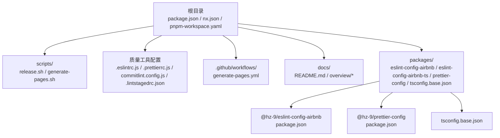
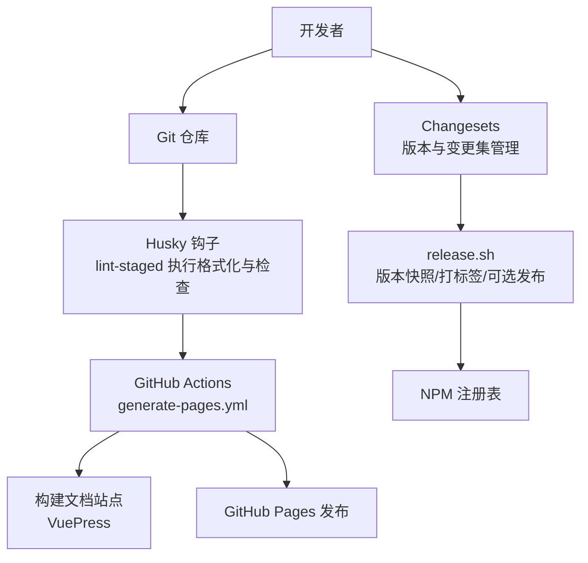
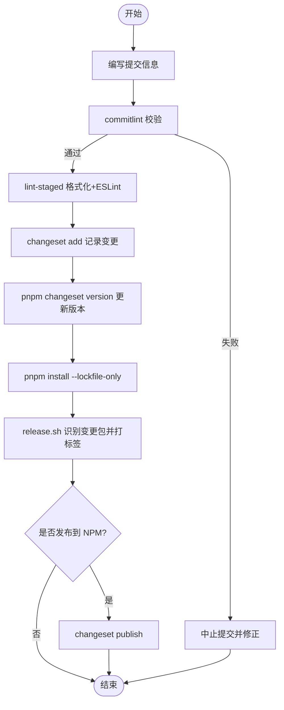
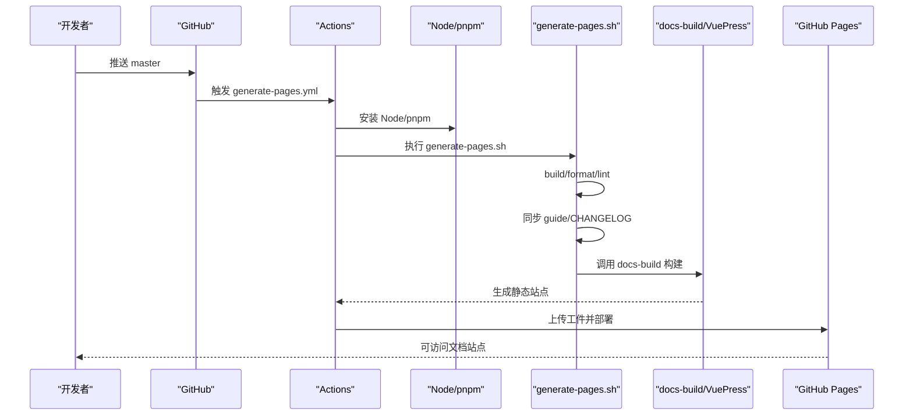
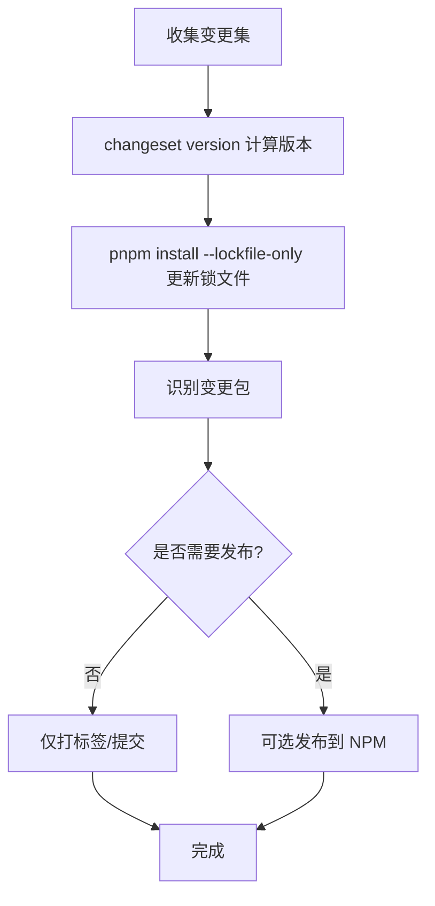
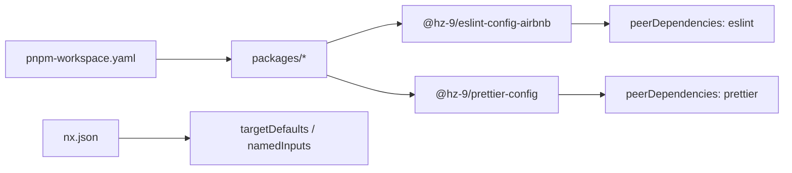

# 开发指南

<cite>
**本文引用的文件**
- [package.json](file://package.json)
- [nx.json](file://nx.json)
- [pnpm-workspace.yaml](file://pnpm-workspace.yaml)
- [commitlint.config.js](file://commitlint.config.js)
- [.eslintrc.js](file://.eslintrc.js)
- [.prettierrc.js](file://.prettierrc.js)
- [.github/workflows/generate-pages.yml](file://.github/workflows/generate-pages.yml)
- [scripts/release.sh](file://scripts/release.sh)
- [scripts/generate-pages.sh](file://scripts/generate-pages.sh)
- [.changeset/config.json](file://.changeset/config.json)
- [.lintstagedrc.json](file://.lintstagedrc.json)
- [.husky/_/husky.sh](file://.husky/_/husky.sh)
- [packages/eslint-config-airbnb/package.json](file://packages/eslint-config-airbnb/package.json)
- [packages/prettier-config/package.json](file://packages/prettier-config/package.json)
- [packages/tsconfig.base.json](file://packages/tsconfig.base.json)
- [docs/overview/to-developer.md](file://docs/overview/to-developer.md)
- [docs/README.md](file://docs/README.md)
</cite>

## 目录
1. [简介](#简介)
2. [项目结构](#项目结构)
3. [核心组件](#核心组件)
4. [架构总览](#架构总览)
5. [详细组件分析](#详细组件分析)
6. [依赖分析](#依赖分析)
7. [性能考虑](#性能考虑)
8. [故障排查指南](#故障排查指南)
9. [结论](#结论)
10. [附录](#附录)

## 简介
本开发指南面向参与“lint-nx”项目的开发者，系统阐述本地开发环境搭建、代码提交规范与变更集管理、CI/CD 流程、自动化测试与部署策略、代码审查与质量保证流程、开发工具配置与调试技巧，以及版本控制策略与发布周期管理。项目采用 Nx 管理多包工作区，使用 pnpm 进行工作区管理，借助 Changesets 实现变更集与版本管理，通过 Husky/Lint-Staged 强化提交前质量门禁，并以 GitHub Actions 自动化生成与发布文档站点。

## 项目结构
项目为基于 pnpm 的工作区（monorepo），根目录包含工作区配置、脚本、质量工具配置与文档构建脚本；packages 目录下包含多个独立发布的包，当前主要为 ESLint 与 Prettier 配置包，以及共享的 tsconfig 基础配置。

图表来源
- [pnpm-workspace.yaml:1-6](file://pnpm-workspace.yaml#L1-L6)
- [nx.json:1-20](file://nx.json#L1-L20)
- [package.json:1-38](file://package.json#L1-L38)
- [scripts/release.sh:1-73](file://scripts/release.sh#L1-L73)
- [scripts/generate-pages.sh:1-56](file://scripts/generate-pages.sh#L1-L56)
- [.eslintrc.js:1-4](file://.eslintrc.js#L1-L4)
- [.prettierrc.js:1-15](file://.prettierrc.js#L1-L15)
- [commitlint.config.js:1-7](file://commitlint.config.js#L1-L7)
- [.lintstagedrc.json:1-5](file://.lintstagedrc.json#L1-L5)
- [.github/workflows/generate-pages.yml:1-68](file://.github/workflows/generate-pages.yml#L1-L68)
- [packages/eslint-config-airbnb/package.json:1-84](file://packages/eslint-config-airbnb/package.json#L1-L84)
- [packages/prettier-config/package.json:1-45](file://packages/prettier-config/package.json#L1-L45)
- [packages/tsconfig.base.json:1-13](file://packages/tsconfig.base.json#L1-L13)
- [docs/README.md:1-28](file://docs/README.md#L1-L28)

章节来源
- [pnpm-workspace.yaml:1-6](file://pnpm-workspace.yaml#L1-L6)
- [nx.json:1-20](file://nx.json#L1-L20)
- [package.json:1-38](file://package.json#L1-L38)

## 核心组件
- 工作区与任务编排：Nx 提供统一的任务编排与缓存能力，定义了 build、lint 等目标的输入与依赖关系，支持跨包依赖链的增量构建。
- 质量工具链：ESLint + Airbnb 配置、Prettier + 导入排序插件、Commitlint 提交信息规范、Husky + Lint-staged 提交前钩子。
- 变更集与版本管理：Changesets 负责变更记录与版本号计算，配合发布脚本完成版本快照、打标签与可选的发布步骤。
- 文档与站点发布：generate-pages.sh 同步各包文档与变更日志，调用 docs-build 构建 VuePress 站点并通过 GitHub Actions 部署到 Pages。
- 包配置：各包通过 exports/main/files 等字段声明导出与发布内容，遵循 peerDependencies 与 engines 约束。

章节来源
- [nx.json:1-20](file://nx.json#L1-L20)
- [.eslintrc.js:1-4](file://.eslintrc.js#L1-L4)
- [.prettierrc.js:1-15](file://.prettierrc.js#L1-L15)
- [commitlint.config.js:1-7](file://commitlint.config.js#L1-L7)
- [.lintstagedrc.json:1-5](file://.lintstagedrc.json#L1-L5)
- [.changeset/config.json:1-12](file://.changeset/config.json#L1-L12)
- [scripts/release.sh:1-73](file://scripts/release.sh#L1-L73)
- [scripts/generate-pages.sh:1-56](file://scripts/generate-pages.sh#L1-L56)
- [packages/eslint-config-airbnb/package.json:1-84](file://packages/eslint-config-airbnb/package.json#L1-L84)
- [packages/prettier-config/package.json:1-45](file://packages/prettier-config/package.json#L1-L45)

## 架构总览
下图展示从本地开发到文档站点发布的整体流程，包括质量门禁、版本管理与自动化部署。

图表来源
- [.lintstagedrc.json:1-5](file://.lintstagedrc.json#L1-L5)
- [.husky/_/husky.sh:1-9](file://.husky/_/husky.sh#L1-L9)
- [.github/workflows/generate-pages.yml:1-68](file://.github/workflows/generate-pages.yml#L1-L68)
- [scripts/generate-pages.sh:1-56](file://scripts/generate-pages.sh#L1-L56)
- [scripts/release.sh:1-73](file://scripts/release.sh#L1-L73)
- [.changeset/config.json:1-12](file://.changeset/config.json#L1-L12)

## 详细组件分析

### 本地开发环境搭建
- Node 与包管理器
  - Node 版本要求：满足根工程 engines 约定；开发建议使用与团队一致的 Node 版本（参考 to-developer 文档）。
  - 包管理器：pnpm 8.x，工作区配置见 pnpm-workspace.yaml。
- 安装与初始化
  - 在根目录执行安装，自动解析工作区与依赖。
  - 初始化 Husky 提交钩子：执行 prepare 脚本。
- 常用脚本
  - 构建所有包、统一格式化、统一 Lint、运行所有测试等，详见根 package.json 中的 scripts 字段。

章节来源
- [package.json:1-38](file://package.json#L1-L38)
- [pnpm-workspace.yaml:1-6](file://pnpm-workspace.yaml#L1-L6)
- [docs/overview/to-developer.md:1-19](file://docs/overview/to-developer.md#L1-L19)

### 代码提交规范与变更集管理
- 提交信息规范
  - 使用 Conventional Commits，结合 commitlint 的规则限制 scope，确保变更可追踪与自动生成变更日志。
- 提交前质量门禁
  - Husky + lint-staged 在暂存区执行 Prettier 写入与 ESLint 修复，减少 CI 失败率。
- 变更集与版本管理
  - Changesets 负责记录变更、计算版本与生成变更日志；配置文件指定基线分支与内部依赖更新策略。
  - 发布脚本负责版本快照、更新锁文件、识别变更包、打标签与可选发布至 NPM。

图表来源
- [commitlint.config.js:1-7](file://commitlint.config.js#L1-L7)
- [.lintstagedrc.json:1-5](file://.lintstagedrc.json#L1-L5)
- [.changeset/config.json:1-12](file://.changeset/config.json#L1-L12)
- [scripts/release.sh:1-73](file://scripts/release.sh#L1-L73)

章节来源
- [commitlint.config.js:1-7](file://commitlint.config.js#L1-L7)
- [.lintstagedrc.json:1-5](file://.lintstagedrc.json#L1-L5)
- [.changeset/config.json:1-12](file://.changeset/config.json#L1-L12)
- [scripts/release.sh:1-73](file://scripts/release.sh#L1-L73)

### CI/CD 流程与自动化测试
- 文档站点自动化
  - 推送 master 触发 generate-pages.yml；在 Ubuntu 环境中安装 Node 与 pnpm，执行 generate-pages.sh。
  - generate-pages.sh 先进行全量构建、格式化与 Lint，再同步各包的 guide 与 CHANGELOG 至 docs，最后调用 docs-build 构建 VuePress 并上传工件、部署到 GitHub Pages。
- 测试策略
  - 根脚本提供 run-many --target=test --all，可在 CI 中按需启用 Vitest 测试任务（具体测试实现由各包自行提供）。

图表来源
- [.github/workflows/generate-pages.yml:1-68](file://.github/workflows/generate-pages.yml#L1-L68)
- [scripts/generate-pages.sh:1-56](file://scripts/generate-pages.sh#L1-L56)

章节来源
- [.github/workflows/generate-pages.yml:1-68](file://.github/workflows/generate-pages.yml#L1-L68)
- [scripts/generate-pages.sh:1-56](file://scripts/generate-pages.sh#L1-L56)
- [package.json:1-38](file://package.json#L1-L38)

### 代码审查与质量保证
- 代码风格与静态检查
  - ESLint 使用 Airbnb 配置扩展，统一规则与最佳实践。
  - Prettier 配置导入排序插件与自定义 importOrder，确保 import 顺序一致性。
- 提交前拦截
  - lint-staged 对 staged 文件执行 Prettier 与 ESLint，降低 PR 中的风格问题。
- 提交信息约束
  - commitlint 限制 scope 与类型，保证变更日志可读性与自动化生成质量。
- 包级质量
  - 各包通过 exports/main/files 明确导出与发布内容，遵循 peerDependencies 与 engines，避免运行时冲突。

章节来源
- [.eslintrc.js:1-4](file://.eslintrc.js#L1-L4)
- [.prettierrc.js:1-15](file://.prettierrc.js#L1-L15)
- [.lintstagedrc.json:1-5](file://.lintstagedrc.json#L1-L5)
- [commitlint.config.js:1-7](file://commitlint.config.js#L1-L7)
- [packages/eslint-config-airbnb/package.json:1-84](file://packages/eslint-config-airbnb/package.json#L1-L84)
- [packages/prettier-config/package.json:1-45](file://packages/prettier-config/package.json#L1-L45)

### 开发工具配置与调试技巧
- VS Code/编辑器建议
  - 安装 ESLint 与 Prettier 插件，启用保存时格式化与 ESLint 自动修复。
  - 使用工作区根目录打开项目，确保编辑器识别 pnpm 工作区与 Nx 任务。
- 常用命令
  - pnpm build：构建所有包。
  - pnpm lint：对 packages 目录统一 Lint。
  - pnpm format / pnpm format:check：格式化或检查格式。
  - pnpm test：运行所有包的测试（如各包已配置）。
- 调试建议
  - 在本地修改配置后，先执行 format 与 lint，再运行对应包的测试，确保改动无副作用。
  - 如遇 Husky 钩子报错，检查 .husky/_/husky.sh 的提示并按指引升级或移除旧钩子。

章节来源
- [package.json:1-38](file://package.json#L1-L38)
- [.husky/_/husky.sh:1-9](file://.husky/_/husky.sh#L1-L9)

### 版本控制策略与发布周期
- 分支与基线
  - baseBranch 指向 master，作为版本计算与变更集的基准。
- 变更集与版本计算
  - Changesets 根据变更集决定主/次/补丁版本，并生成变更日志模板。
- 发布脚本流程
  - 快照当前版本 → changeset version → 更新锁文件 → 识别变更包 → 打标签（可选发布）。
- 发布节奏
  - 建议按功能/修复聚合后批量发布，保持变更日志清晰与版本稳定。

图表来源
- [.changeset/config.json:1-12](file://.changeset/config.json#L1-L12)
- [scripts/release.sh:1-73](file://scripts/release.sh#L1-L73)

章节来源
- [.changeset/config.json:1-12](file://.changeset/config.json#L1-L12)
- [scripts/release.sh:1-73](file://scripts/release.sh#L1-L73)

## 依赖分析
- 工作区组织
  - pnpm-workspace.yaml 将 packages/* 设为工作区包集合，便于统一安装与跨包依赖解析。
- Nx 目标与输入
  - targetDefaults 为 build/lint 设置输入与依赖，确保构建顺序与缓存命中。
- 包导出与发布
  - 各包通过 exports/main/files 明确导出入口与发布文件，peerDependencies 与 engines 约束保证兼容性。

图表来源
- [pnpm-workspace.yaml:1-6](file://pnpm-workspace.yaml#L1-L6)
- [nx.json:1-20](file://nx.json#L1-L20)
- [packages/eslint-config-airbnb/package.json:1-84](file://packages/eslint-config-airbnb/package.json#L1-L84)
- [packages/prettier-config/package.json:1-45](file://packages/prettier-config/package.json#L1-L45)

章节来源
- [pnpm-workspace.yaml:1-6](file://pnpm-workspace.yaml#L1-L6)
- [nx.json:1-20](file://nx.json#L1-L20)
- [packages/eslint-config-airbnb/package.json:1-84](file://packages/eslint-config-airbnb/package.json#L1-L84)
- [packages/prettier-config/package.json:1-45](file://packages/prettier-config/package.json#L1-L45)

## 性能考虑
- 构建与缓存
  - 利用 Nx 的 targetDefaults 与 namedInputs，确保生产构建输入最小化，提升缓存命中率与增量构建效率。
- 质量工具开销
  - lint-staged 仅处理暂存文件，避免全量格式化与 Lint 带来的额外时间成本。
- 文档构建
  - generate-pages.sh 在 CI 中分阶段执行，先进行全量构建与校验，再同步与构建文档，减少不必要的重复工作。

章节来源
- [nx.json:1-20](file://nx.json#L1-L20)
- [.lintstagedrc.json:1-5](file://.lintstagedrc.json#L1-L5)
- [scripts/generate-pages.sh:1-56](file://scripts/generate-pages.sh#L1-L56)

## 故障排查指南
- Husky 钩子报错
  - 若出现旧版 husky 提示，请按提示移除过时脚本片段，确保使用新版 Husky 配置。
- Node 版本不匹配
  - 严格遵循根 package.json engines 与 to-developer 文档中的 Node 版本建议，避免安装与运行差异。
- Changesets 未生效
  - 确认已执行 changeset version 并提交变更；检查 .changeset/config.json 的 baseBranch 是否正确。
- CI 文档构建失败
  - 检查 generate-pages.sh 的同步与构建步骤输出；确认 docs-build 配置与 Node 版本一致。
- Prettier/ESLint 冲突
  - 优先执行 lint-staged 或手动执行 format 与 lint，确保导入顺序与规则一致。

章节来源
- [.husky/_/husky.sh:1-9](file://.husky/_/husky.sh#L1-L9)
- [docs/overview/to-developer.md:1-19](file://docs/overview/to-developer.md#L1-L19)
- [.changeset/config.json:1-12](file://.changeset/config.json#L1-L12)
- [scripts/generate-pages.sh:1-56](file://scripts/generate-pages.sh#L1-L56)
- [.prettierrc.js:1-15](file://.prettierrc.js#L1-L15)
- [.eslintrc.js:1-4](file://.eslintrc.js#L1-L4)

## 结论
本指南总结了 lint-nx 项目的开发流程、质量保障与发布机制。通过 Nx 统一任务编排、Changesets 管理版本与变更集、Husky/Lint-staged 强化提交前质量门禁、GitHub Actions 自动化文档站点发布，形成高效稳定的开发与交付闭环。建议团队在本地与 CI 中严格执行上述流程，持续优化质量工具链与发布节奏。

## 附录
- 快速开始（来自文档）
  - 安装依赖、构建全部包、统一 Lint、格式化代码等基础操作可参考根目录文档与脚本。

章节来源
- [docs/README.md:1-28](file://docs/README.md#L1-L28)