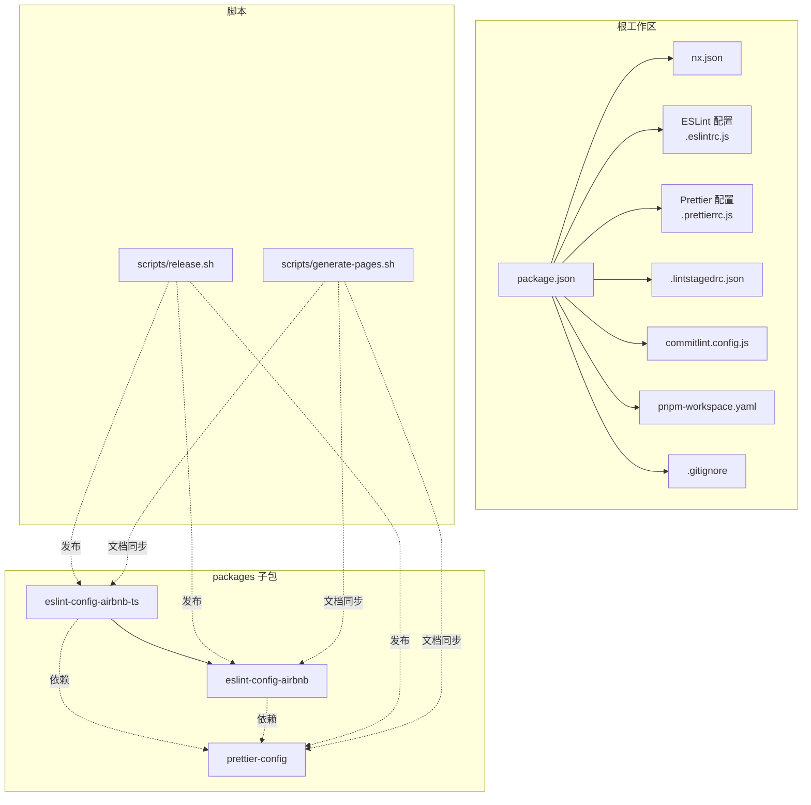
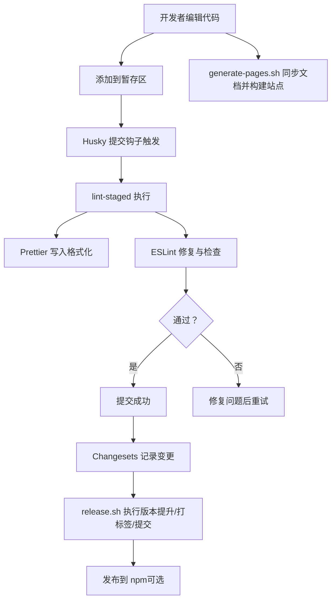
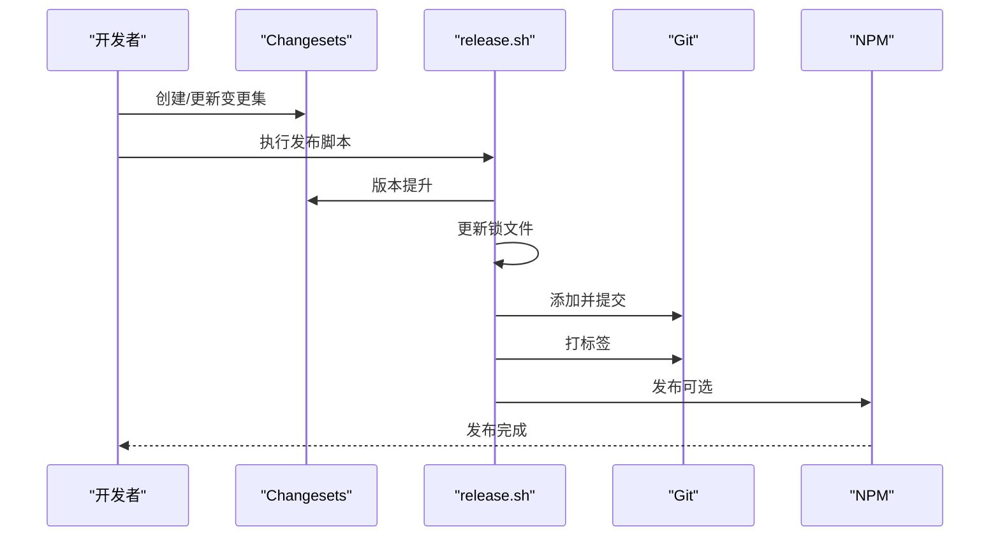
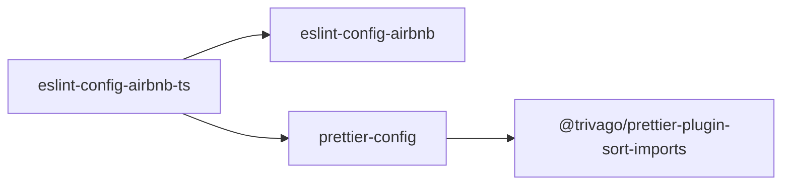

# 开发流程

<cite>
**本文引用的文件**
- [.eslintrc.js](file://.eslintrc.js)
- [.prettierrc.js](file://.prettierrc.js)
- [.lintstagedrc.json](file://.lintstagedrc.json)
- [commitlint.config.js](file://commitlint.config.js)
- [package.json](file://package.json)
- [nx.json](file://nx.json)
- [pnpm-workspace.yaml](file://pnpm-workspace.yaml)
- [README.md](file://README.md)
- [scripts/release.sh](file://scripts/release.sh)
- [scripts/generate-pages.sh](file://scripts/generate-pages.sh)
- [packages/eslint-config-airbnb/package.json](file://packages/eslint-config-airbnb/package.json)
- [packages/eslint-config-airbnb-ts/package.json](file://packages/eslint-config-airbnb-ts/package.json)
- [packages/prettier-config/package.json](file://packages/prettier-config/package.json)
- [.gitignore](file://.gitignore)
</cite>

## 目录
1. [简介](#简介)
2. [项目结构](#项目结构)
3. [核心组件](#核心组件)
4. [架构总览](#架构总览)
5. [详细组件分析](#详细组件分析)
6. [依赖分析](#依赖分析)
7. [性能与效率建议](#性能与效率建议)
8. [故障排查指南](#故障排查指南)
9. [结论](#结论)
10. [附录：常用操作清单](#附录常用操作清单)

## 简介
本仓库是一个基于 Nx 的多包工作区，提供统一的 JavaScript/TypeScript 代码质量工具链：ESLint + Prettier，并通过 Husky + lint-staged 在提交前自动执行格式化与静态检查，结合 Changesets 实现版本管理与发布流水线。本文档面向开发者，系统性说明从本地开发到 CI/CD 的完整流程，包括代码规范、提交规范、质量检查、分支与合并策略、以及常见场景的操作指南。

## 项目结构
- 工作区采用 pnpm workspace 管理多包，根目录 scripts 负责发布与文档生成脚本，packages 下为可独立发布的配置包（ESLint 与 Prettier 配置）。
- 根级配置文件定义了 ESLint、Prettier、Commitlint、lint-staged、Nx 等工具的规则与集成方式。
- 文档与构建配置位于 docs-build.config.json 与 docs 目录中，配合 generate-pages.sh 同步各包文档并生成站点。

**图表来源**
- [package.json:1-38](file://package.json#L1-L38)
- [nx.json:1-20](file://nx.json#L1-L20)
- [pnpm-workspace.yaml:1-6](file://pnpm-workspace.yaml#L1-L6)
- [.eslintrc.js:1-4](file://.eslintrc.js#L1-L4)
- [.prettierrc.js:1-15](file://.prettierrc.js#L1-L15)
- [.lintstagedrc.json:1-5](file://.lintstagedrc.json#L1-L5)
- [commitlint.config.js:1-7](file://commitlint.config.js#L1-L7)
- [scripts/release.sh:1-73](file://scripts/release.sh#L1-L73)
- [scripts/generate-pages.sh:1-56](file://scripts/generate-pages.sh#L1-L56)
- [packages/eslint-config-airbnb/package.json:1-84](file://packages/eslint-config-airbnb/package.json#L1-L84)
- [packages/eslint-config-airbnb-ts/package.json:1-87](file://packages/eslint-config-airbnb-ts/package.json#L1-L87)
- [packages/prettier-config/package.json:1-45](file://packages/prettier-config/package.json#L1-L45)

**章节来源**
- [pnpm-workspace.yaml:1-6](file://pnpm-workspace.yaml#L1-L6)
- [README.md:1-45](file://README.md#L1-L45)

## 核心组件
- ESLint 配置：根配置扩展统一的 Airbnb 风格规则集，确保跨包一致性。
- Prettier 配置：继承共享配置并启用导入排序插件，统一格式风格与导入顺序。
- 提交前检查：通过 lint-staged 对暂存文件执行 Prettier 写入与 ESLint 修复。
- 提交规范：基于 Conventional Commits，限定作用域范围以提升变更可追踪性。
- 版本与发布：Changesets 管理版本与变更日志；release.sh 完成版本提升、打标签与提交。
- 文档生成：generate-pages.sh 同步子包文档并构建站点。
- 工作区与缓存：Nx 统一构建、测试与受影响目标；.gitignore 排除临时与构建产物。

**章节来源**
- [.eslintrc.js:1-4](file://.eslintrc.js#L1-L4)
- [.prettierrc.js:1-15](file://.prettierrc.js#L1-L15)
- [.lintstagedrc.json:1-5](file://.lintstagedrc.json#L1-L5)
- [commitlint.config.js:1-7](file://commitlint.config.js#L1-L7)
- [package.json:5-16](file://package.json#L5-L16)
- [scripts/release.sh:1-73](file://scripts/release.sh#L1-L73)
- [scripts/generate-pages.sh:1-56](file://scripts/generate-pages.sh#L1-L56)
- [nx.json:1-20](file://nx.json#L1-L20)
- [.gitignore:1-84](file://.gitignore#L1-L84)

## 架构总览
下图展示了从本地编辑到提交、再到发布与文档生成的关键路径与工具协作关系。

**图表来源**
- [.lintstagedrc.json:1-5](file://.lintstagedrc.json#L1-L5)
- [commitlint.config.js:1-7](file://commitlint.config.js#L1-L7)
- [scripts/release.sh:1-73](file://scripts/release.sh#L1-L73)
- [scripts/generate-pages.sh:1-56](file://scripts/generate-pages.sh#L1-L56)

## 详细组件分析

### ESLint 配置与使用
- 配置扩展：根配置扩展统一的 Airbnb 风格 ESLint 规则集，确保所有包遵循一致的代码风格与安全规则。
- 运行方式：可通过根脚本批量 lint 所有包，或在 Nx 中按需运行受影响项目的 lint 目标。
- 与 Prettier 协同：通过共享配置与插件，避免格式冲突；在提交阶段由 lint-staged 先执行 Prettier 再执行 ESLint 修复，保证一致性。

**章节来源**
- [.eslintrc.js:1-4](file://.eslintrc.js#L1-L4)
- [package.json:8-9](file://package.json#L8-L9)
- [nx.json:6-14](file://nx.json#L6-L14)

### Prettier 配置与使用
- 配置扩展：继承共享 Prettier 配置，并启用导入排序插件，统一导入顺序与分组。
- 插件与规则：支持 TypeScript、类属性、装饰器等语法解析；通过 importOrder 分组与排序规则，提升可读性。
- 运行方式：提供格式化写入与只读校验两类脚本，便于在本地与 CI 中使用。

**章节来源**
- [.prettierrc.js:1-15](file://.prettierrc.js#L1-L15)
- [packages/prettier-config/package.json:1-45](file://packages/prettier-config/package.json#L1-L45)
- [package.json:10-11](file://package.json#L10-L11)

### 提交前检查（lint-staged）
- 规则：对 JS/TS 文件先执行 Prettier 写入，再执行 ESLint 修复与检查；对 JSON/CSS/Markdown 文件仅执行 Prettier 写入。
- 触发：通过 Husky 钩子在提交前自动执行，失败时阻止提交，确保主干干净。

**章节来源**
- [.lintstagedrc.json:1-5](file://.lintstagedrc.json#L1-L5)
- [package.json:12](file://package.json#L12)

### 提交规范与 Commitlint
- 规范：基于 Conventional Commits，限定作用域范围，便于自动生成变更日志与版本号。
- 配置：扩展 conventional 规则并在作用域枚举中加入各子包与 all，确保变更粒度清晰。

**章节来源**
- [commitlint.config.js:1-7](file://commitlint.config.js#L1-L7)

### 版本与发布（Changesets + release.sh）
- Changesets：用于记录变更、生成变更日志与版本号提升。
- release.sh：完成版本提升、锁文件更新、确定变更包、提交与打标签；保留发布到 npm 的步骤以便按需执行。
- 与工作流：结合 CI 可实现自动化发布，当前脚本注释掉发布与推送步骤，便于本地验证。

**图表来源**
- [scripts/release.sh:1-73](file://scripts/release.sh#L1-L73)
- [package.json:14-15](file://package.json#L14-L15)

**章节来源**
- [scripts/release.sh:1-73](file://scripts/release.sh#L1-L73)
- [package.json:14-15](file://package.json#L14-L15)

### 文档生成与同步（generate-pages.sh）
- 流程：先构建、格式化、lint，再清理旧文档目录，同步各包的指南与变更日志，最后调用文档构建工具生成站点。
- 价值：统一维护各子包文档，减少重复劳动，便于对外展示与查阅。

**章节来源**
- [scripts/generate-pages.sh:1-56](file://scripts/generate-pages.sh#L1-L56)
- [README.md:1-45](file://README.md#L1-L45)

### 工作区与缓存（Nx）
- 目标默认值：build 任务依赖上游包；lint 任务输入包含根级 ESLint 配置与忽略文件。
- 输入集合：default 与 production 输入集，便于缓存与增量构建。
- 基线：默认基线指向 master，影响 affected 目标的判断。

**章节来源**
- [nx.json:1-20](file://nx.json#L1-L20)

## 依赖分析
- 子包依赖关系：
  - TypeScript ESLint 配置依赖 JavaScript ESLint 配置与 Prettier 配置。
  - Prettier 配置依赖导入排序插件。
- 工作区范围：pnpm workspace 指定 packages/* 为工作区包，便于统一安装与发布。

**图表来源**
- [packages/eslint-config-airbnb-ts/package.json:66-70](file://packages/eslint-config-airbnb-ts/package.json#L66-L70)
- [packages/eslint-config-airbnb/package.json:65-69](file://packages/eslint-config-airbnb/package.json#L65-L69)
- [packages/prettier-config/package.json:32-33](file://packages/prettier-config/package.json#L32-L33)

**章节来源**
- [pnpm-workspace.yaml:4-6](file://pnpm-workspace.yaml#L4-L6)
- [packages/eslint-config-airbnb-ts/package.json:1-87](file://packages/eslint-config-airbnb-ts/package.json#L1-L87)
- [packages/eslint-config-airbnb/package.json:1-84](file://packages/eslint-config-airbnb/package.json#L1-L84)
- [packages/prettier-config/package.json:1-45](file://packages/prettier-config/package.json#L1-L45)

## 性能与效率建议
- 使用 Nx affected 目标：仅对受影响的包执行 lint/build/test，缩短迭代周期。
- 缓存与输入：利用 Nx namedInputs 与 targetDefaults 的输入配置，提升缓存命中率。
- 本地预检：在提交前通过 lint-staged 快速发现格式与规则问题，减少 CI 失败概率。
- 并行任务：在支持的环境中并行执行 lint 与 format，充分利用多核资源。

**章节来源**
- [nx.json:6-14](file://nx.json#L6-L14)
- [package.json:7-11](file://package.json#L7-L11)

## 故障排查指南
- 提交被拒绝：
  - 检查 lint-staged 是否报错，优先修复 Prettier 格式与 ESLint 规则问题。
  - 确认 husky 已正确安装并启用。
- ESLint/Prettier 冲突：
  - 确保使用共享配置与插件；在提交阶段先 Prettier 再 ESLint 修复。
- Changesets 未生效：
  - 确认已创建/更新变更集并执行版本提升脚本；检查生成的标签与提交信息。
- 文档未更新：
  - 确认 generate-pages.sh 正常执行，检查各子包是否提供指南与变更日志文件。
- 锁文件不一致：
  - 在版本提升后执行锁文件更新步骤，确保依赖一致。

**章节来源**
- [.lintstagedrc.json:1-5](file://.lintstagedrc.json#L1-L5)
- [package.json:12](file://package.json#L12)
- [scripts/release.sh:20-27](file://scripts/release.sh#L20-L27)
- [scripts/generate-pages.sh:22-56](file://scripts/generate-pages.sh#L22-L56)

## 结论
本工作区通过统一的 ESLint 与 Prettier 配置、lint-staged 提交前检查、Conventional Commits 与 Changesets 发布流程，构建了高效、可维护的多包开发体系。结合 Nx 的缓存与增量能力，能够在大型项目中保持稳定的开发体验与高质量交付。

## 附录：常用操作清单
- 安装依赖与启动：参考根 README 的快速开始命令。
- 本地质量检查：格式化写入、只读校验、全量 lint、受影响目标 lint。
- 文档生成：同步子包文档并构建站点。
- 版本与发布：创建变更集、版本提升、打标签、提交；发布到 npm（可选）。

**章节来源**
- [README.md:7-36](file://README.md#L7-L36)
- [package.json:5-16](file://package.json#L5-L16)
- [scripts/generate-pages.sh:10-15](file://scripts/generate-pages.sh#L10-L15)
- [scripts/release.sh:20-58](file://scripts/release.sh#L20-L58)