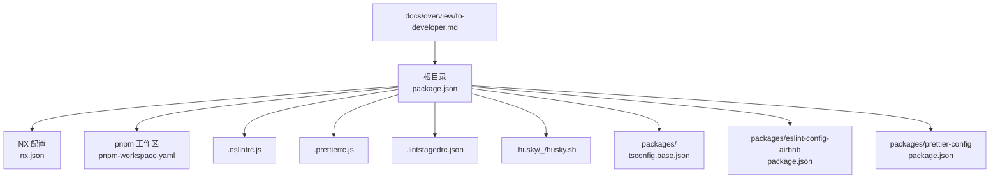
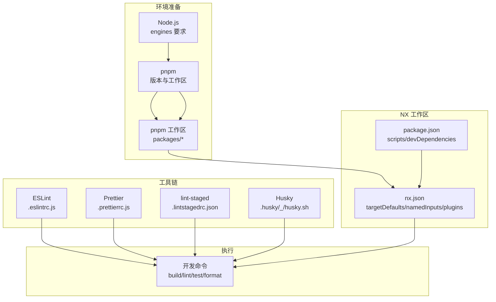
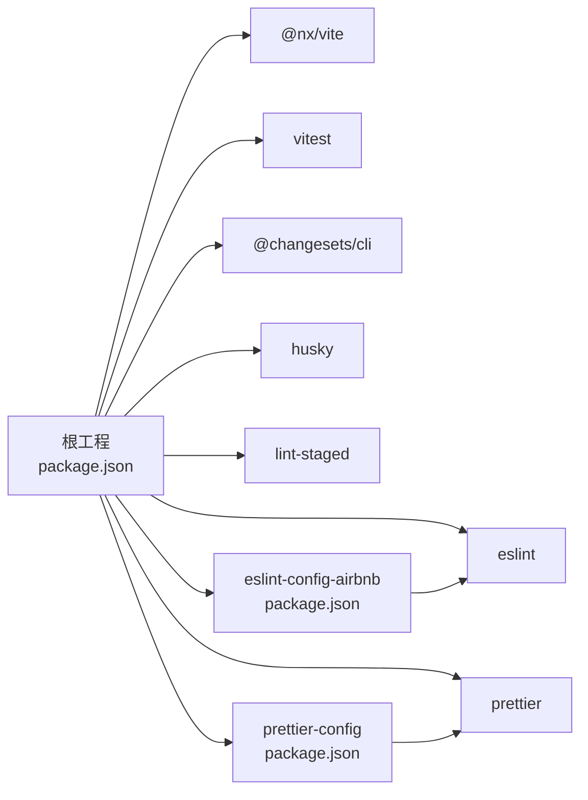

# 环境搭建

<cite>
**本文引用的文件**
- [package.json](file://package.json)
- [nx.json](file://nx.json)
- [pnpm-workspace.yaml](file://pnpm-workspace.yaml)
- [README.md](file://README.md)
- [README.zh-CN.md](file://README.zh-CN.md)
- [.eslintrc.js](file://.eslintrc.js)
- [.prettierrc.js](file://.prettierrc.js)
- [.lintstagedrc.json](file://.lintstagedrc.json)
- [.husky/_/husky.sh](file://.husky/_/husky.sh)
- [packages/tsconfig.base.json](file://packages/tsconfig.base.json)
- [packages/eslint-config-airbnb/package.json](file://packages/eslint-config-airbnb/package.json)
- [packages/prettier-config/package.json](file://packages/prettier-config/package.json)
- [docs/overview/to-developer.md](file://docs/overview/to-developer.md)
- [docs/overview/to-developer.zh-CN.md](file://docs/overview/to-developer.zh-CN.md)
</cite>

## 目录
1. [简介](#简介)
2. [项目结构](#项目结构)
3. [核心组件](#核心组件)
4. [架构总览](#架构总览)
5. [详细组件分析](#详细组件分析)
6. [依赖分析](#依赖分析)
7. [性能考虑](#性能考虑)
8. [故障排查指南](#故障排查指南)
9. [结论](#结论)
10. [附录](#附录)

## 简介
本指南面向本地开发环境的搭建与维护，覆盖 Node.js 版本要求、pnpm 包管理器安装与工作区配置、NX 工作区初始化步骤、依赖安装流程、跨平台配置方法、IDE 推荐设置与插件、开发工具链要求与性能优化建议，以及常见环境问题的排查与解决。

## 项目结构
该仓库为 NX 工作区，采用 pnpm 工作区组织多包（packages/*），通过 nx.json 配置目标默认行为与输入集，通过 .eslintrc.js、.prettierrc.js、.lintstagedrc.json 等工具配置统一的代码质量与格式化策略。

图表来源
- [package.json:1-38](file://package.json#L1-L38)
- [nx.json:1-20](file://nx.json#L1-L20)
- [pnpm-workspace.yaml:1-6](file://pnpm-workspace.yaml#L1-L6)
- [.eslintrc.js:1-4](file://.eslintrc.js#L1-L4)
- [.prettierrc.js:1-15](file://.prettierrc.js#L1-L15)
- [.lintstagedrc.json:1-5](file://.lintstagedrc.json#L1-L5)
- [.husky/_/husky.sh:1-9](file://.husky/_/husky.sh#L1-L9)
- [packages/tsconfig.base.json:1-13](file://packages/tsconfig.base.json#L1-L13)
- [packages/eslint-config-airbnb/package.json:1-84](file://packages/eslint-config-airbnb/package.json#L1-L84)
- [packages/prettier-config/package.json:1-45](file://packages/prettier-config/package.json#L1-L45)
- [docs/overview/to-developer.md:1-19](file://docs/overview/to-developer.md#L1-L19)

章节来源
- [README.md:1-45](file://README.md#L1-L45)
- [README.zh-CN.md:1-45](file://README.zh-CN.md#L1-L45)

## 核心组件
- Node.js 版本要求：根 package.json 的 engines 字段明确要求 Node.js 版本范围；各子包（如 eslint-config-airbnb、prettier-config）亦声明了兼容的 Node 范围。
- pnpm 工作区：pnpm-workspace.yaml 指定 packages/* 为工作区包集合，配合 package.json 的 workspace:* 依赖解析。
- NX 工作区：nx.json 定义 targetDefaults、namedInputs、插件等，支持构建、lint 等目标的输入与依赖关系。
- 代码质量工具：.eslintrc.js 统一扩展规则；.prettierrc.js 引入排序插件与 importOrder 规则；.lintstagedrc.json 配置提交前格式化与修复。
- 开发脚本：package.json 中提供 build、lint、test、format、changeset 等常用命令，便于一键执行。

章节来源
- [package.json:17-37](file://package.json#L17-L37)
- [pnpm-workspace.yaml:4-6](file://pnpm-workspace.yaml#L4-L6)
- [nx.json:5-18](file://nx.json#L5-L18)
- [.eslintrc.js:1-4](file://.eslintrc.js#L1-L4)
- [.prettierrc.js:3-14](file://.prettierrc.js#L3-L14)
- [.lintstagedrc.json:1-5](file://.lintstagedrc.json#L1-L5)
- [README.md:7-36](file://README.md#L7-L36)

## 架构总览
下图展示从环境准备到开发执行的关键路径：Node 与 pnpm 安装 → 工作区初始化 → 依赖安装 → NX 命令执行 → 工具链联动。

图表来源
- [package.json:17-37](file://package.json#L17-L37)
- [pnpm-workspace.yaml:4-6](file://pnpm-workspace.yaml#L4-L6)
- [nx.json:5-18](file://nx.json#L5-L18)
- [.eslintrc.js:1-4](file://.eslintrc.js#L1-L4)
- [.prettierrc.js:3-14](file://.prettierrc.js#L3-L14)
- [.lintstagedrc.json:1-5](file://.lintstagedrc.json#L1-L5)
- [.husky/_/husky.sh:1-9](file://.husky/_/husky.sh#L1-L9)
- [README.md:7-36](file://README.md#L7-L36)

## 详细组件分析

### Node.js 版本要求与兼容性
- 根工程 engines 字段定义了 Node 版本范围，确保 CI 与本地一致。
- 子包（eslint-config-airbnb、prettier-config）各自声明 Node 兼容范围，避免版本冲突。
- 文档提示当前主要使用 Node 18，计划在 2025 年迁移到 Node 20。

章节来源
- [package.json:33-35](file://package.json#L33-L35)
- [packages/eslint-config-airbnb/package.json:77-79](file://packages/eslint-config-airbnb/package.json#L77-L79)
- [packages/prettier-config/package.json:38-40](file://packages/prettier-config/package.json#L38-L40)
- [docs/overview/to-developer.md:7-18](file://docs/overview/to-developer.md#L7-L18)
- [docs/overview/to-developer.zh-CN.md:7-18](file://docs/overview/to-developer.zh-CN.md#L7-L18)

### pnpm 包管理器与工作区配置
- 工作区声明：pnpm-workspace.yaml 指定 packages/* 为工作区包集合。
- 依赖解析：根 package.json 的 devDependencies 中使用 workspace:* 解析工作区内包。
- 包管理器版本：package.json 的 packageManager 字段固定 pnpm 版本，保证一致性。

章节来源
- [pnpm-workspace.yaml:4-6](file://pnpm-workspace.yaml#L4-L6)
- [package.json:17-32](file://package.json#L17-L32)
- [package.json:36](file://package.json#L36)

### NX 工作区初始化与目标配置
- 插件启用：nx.json 启用 @nx/vite 插件。
- 目标默认行为：targetDefaults 为 build、lint 设置 inputs 与依赖关系，提升缓存命中与增量构建效率。
- 输入集：namedInputs 定义 default 与 production 输入集，用于缓存与执行约束。

章节来源
- [nx.json:5-18](file://nx.json#L5-L18)

### 代码质量工具链
- ESLint：.eslintrc.js 扩展 @hz-9/eslint-config-airbnb；可结合 eslint.config.js（Flat Config）使用。
- Prettier：.prettierrc.js 继承 @hz-9/prettier-config，并引入 import 排序插件与 importOrder 规则。
- 提交前钩子：.lintstagedrc.json 对 JS/TS/JSON/CSS/MD 文件分别执行格式化与修复。
- Husky：.husky/_/husky.sh 提示旧版 husky 的迁移注意事项。

章节来源
- [.eslintrc.js:1-4](file://.eslintrc.js#L1-L4)
- [.prettierrc.js:3-14](file://.prettierrc.js#L3-L14)
- [.lintstagedrc.json:1-5](file://.lintstagedrc.json#L1-L5)
- [.husky/_/husky.sh:1-9](file://.husky/_/husky.sh#L1-L9)

### 依赖安装流程与 NX 命令
- 安装依赖：使用 pnpm install 安装根与工作区内包。
- 常用命令：build、lint、test、format、nx graph、nx affected 等，详见 README。

章节来源
- [README.md:9-36](file://README.md#L9-L36)
- [README.zh-CN.md:9-36](file://README.zh-CN.md#L9-L36)
- [package.json:5-16](file://package.json#L5-L16)

### 不同操作系统下的环境配置方法
- Windows
  - 使用 Node.js 官方安装包或 nvm-windows 安装指定版本。
  - 使用 pnpm 官方安装包或 npm i -g pnpm 安装 pnpm。
  - 在 Git Bash 或 WSL 中执行脚本，确保 .husky 钩子可用。
- macOS
  - 使用 nvm 安装 Node.js；使用 Homebrew 安装 pnpm。
  - 若使用 zsh，请确认 .husky 钩子路径与权限正确。
- Linux
  - 使用 nvm 安装 Node.js；使用 curl 或官方安装脚本安装 pnpm。
  - 注意 .lintstagedrc.json 与 shell 路径，必要时调整为 sh-compatible。

章节来源
- [package.json:33-35](file://package.json#L33-L35)
- [pnpm-workspace.yaml:4-6](file://pnpm-workspace.yaml#L4-L6)
- [.husky/_/husky.sh:1-9](file://.husky/_/husky.sh#L1-L9)

### IDE 推荐设置与插件
- VS Code
  - 安装 ESLint、Prettier、EditorConfig、TypeScript Importer 等插件。
  - 在工作区根目录打开，VS Code 将自动识别 NX 与 pnpm 工作区。
  - 配置编辑器默认格式化为 Prettier，保存时自动格式化。
- WebStorm/IntelliJ IDEA
  - 安装 ESLint、Prettier 插件，启用内置 TypeScript/JavaScript 支持。
  - 在项目设置中选择 pnpm 作为包管理器，启用 Nx 插件（如已安装）。
- 共享配置
  - 使用根目录的 .eslintrc.js 与 .prettierrc.js，确保团队一致的规则。

章节来源
- [.eslintrc.js:1-4](file://.eslintrc.js#L1-L4)
- [.prettierrc.js:3-14](file://.prettierrc.js#L3-L14)

### 开发工具链要求与性能优化建议
- 工具链要求
  - Node.js：满足根工程 engines 与子包 engines。
  - pnpm：使用固定版本，避免跨环境差异。
  - NX：使用与 devDependencies 一致的版本，确保插件与缓存策略生效。
- 性能优化
  - 利用 nx.json 的 targetDefaults 与 namedInputs，减少重复计算。
  - 使用 nx affected 仅对变更项目执行 lint/build，缩短迭代时间。
  - 在 .lintstagedrc.json 中合理拆分任务，避免阻塞主线。

章节来源
- [nx.json:6-18](file://nx.json#L6-L18)
- [README.md:25-26](file://README.md#L25-L26)

## 依赖分析
- 根工程依赖
  - devDependencies：包含 nx、@nx/vite、eslint、prettier、vitest、@changesets/cli、husky、lint-staged 等。
  - engines：限定 Node 版本范围。
  - packageManager：固定 pnpm 版本。
- 工作区包
  - packages/eslint-config-airbnb：提供 ESLint 规则集，声明 peerDependencies 与 engines。
  - packages/prettier-config：提供 Prettier 规则集，声明 peerDependencies 与 engines。
  - packages/tsconfig.base.json：提供基础 TS 编译选项，供工作区内包复用。

图表来源
- [package.json:17-32](file://package.json#L17-L32)
- [packages/eslint-config-airbnb/package.json:65-79](file://packages/eslint-config-airbnb/package.json#L65-L79)
- [packages/prettier-config/package.json:32-40](file://packages/prettier-config/package.json#L32-L40)

章节来源
- [package.json:17-32](file://package.json#L17-L32)
- [packages/eslint-config-airbnb/package.json:65-79](file://packages/eslint-config-airbnb/package.json#L65-L79)
- [packages/prettier-config/package.json:32-40](file://packages/prettier-config/package.json#L32-L40)

## 性能考虑
- 使用 nx.json 的 targetDefaults 与 namedInputs，提升缓存命中率与增量构建效率。
- 通过 nx affected 仅对变更项目执行 lint/build，缩短迭代周期。
- 在 .lintstagedrc.json 中合理拆分任务，避免阻塞主线。
- 固定 pnpm 版本与 Node 版本，减少环境差异导致的性能波动。

章节来源
- [nx.json:6-18](file://nx.json#L6-L18)
- [README.md:25-26](file://README.md#L25-L26)

## 故障排查指南
- Node 版本不匹配
  - 症状：安装失败或运行时报错。
  - 处理：根据根工程 engines 与子包 engines 选择合适 Node 版本；使用 nvm/nodenv 管理多版本。
- pnpm 版本不一致
  - 症状：lockfile 冲突或安装异常。
  - 处理：使用 package.json 的 packageManager 固定的 pnpm 版本；清理 node_modules 与 pnpm-store 后重装。
- Husky 钩子失效
  - 症状：git hooks 未触发。
  - 处理：按 .husky/_/husky.sh 的提示迁移至新版 husky；确保 .husky 目录权限正确。
- ESLint/Prettier 规则冲突
  - 症状：格式化后仍报错或规则不生效。
  - 处理：确认 .eslintrc.js 与 .prettierrc.js 的继承与插件顺序；优先使用 Flat Config（eslint.config.js）以减少冲突。
- NX 缓存异常
  - 症状：构建结果不更新或缓存污染。
  - 处理：清理 nx 缓存与 pnpm store；检查 nx.json 的 inputs 与 base 分支是否正确。

章节来源
- [package.json:33-35](file://package.json#L33-L35)
- [package.json:36](file://package.json#L36)
- [.husky/_/husky.sh:1-9](file://.husky/_/husky.sh#L1-L9)
- [.eslintrc.js:1-4](file://.eslintrc.js#L1-L4)
- [.prettierrc.js:3-14](file://.prettierrc.js#L3-L14)
- [nx.json:3-18](file://nx.json#L3-L18)

## 结论
通过严格遵循 Node.js 与 pnpm 版本要求、正确配置 NX 工作区与工具链、在 IDE 中启用统一规则与插件，可显著提升本地开发体验与一致性。遇到环境问题时，优先核对版本范围、固定 pnpm 版本、迁移 Husky 钩子、校验 ESLint/Prettier 配置与 NX 缓存状态。

## 附录
- 快速命令参考（来自 README）
  - 安装依赖、Lint、Build、Format、查看依赖图、仅对变更项目执行 Lint、Changeset 流程与发布流程等。

章节来源
- [README.md:9-36](file://README.md#L9-L36)
- [README.zh-CN.md:9-36](file://README.zh-CN.md#L9-L36)