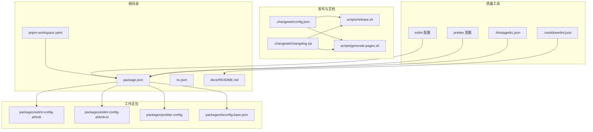
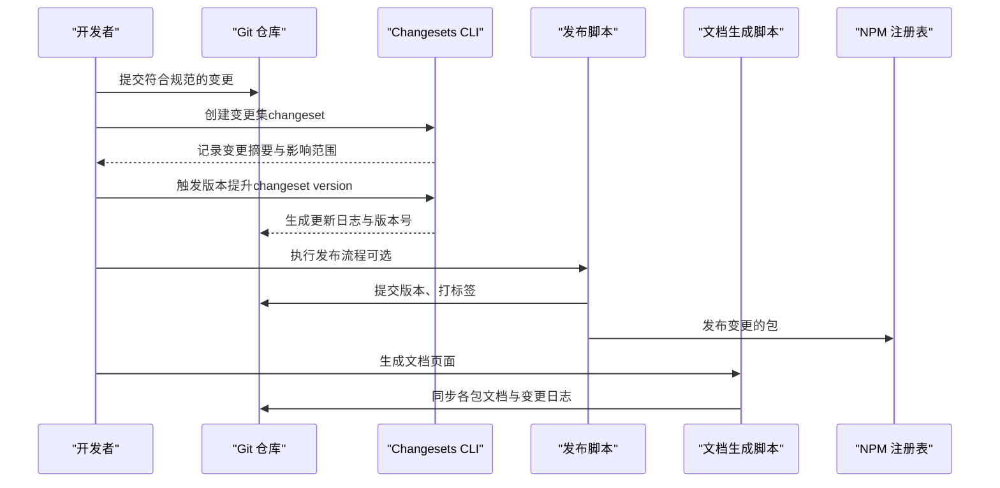
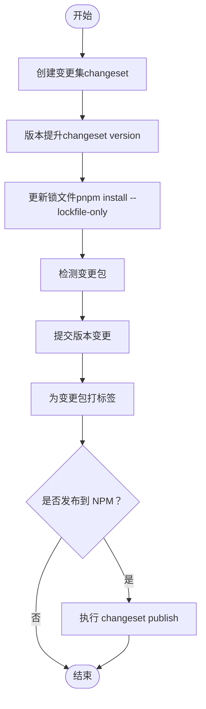
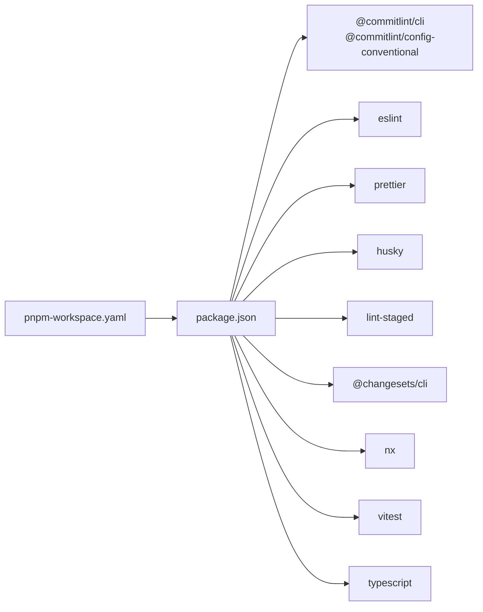

# 贡献规范

<cite>
**本文引用的文件**
- [package.json](file://package.json)
- [README.md](file://README.zh-CN.md)
- [.changeset/config.json](file://.changeset/config.json)
- [.changeset/changelog.cjs](file://.changeset/changelog.cjs)
- [scripts/release.sh](file://scripts/release.sh)
- [scripts/generate-pages.sh](file://scripts/generate-pages.sh)
- [.prettierrc.js](file://.prettierrc.js)
- [.eslintrc.js](file://.eslintrc.js)
- [.lintstagedrc.json](file://.lintstagedrc.json)
- [.markdownlint.json](file://.markdownlint.json)
- [pnpm-workspace.yaml](file://pnpm-workspace.yaml)
- [docs/README.md](file://docs/README.md)
</cite>

## 目录
1. [简介](#简介)
2. [项目结构](#项目结构)
3. [核心组件](#核心组件)
4. [架构总览](#架构总览)
5. [详细组件分析](#详细组件分析)
6. [依赖分析](#依赖分析)
7. [性能考虑](#性能考虑)
8. [故障排查指南](#故障排查指南)
9. [结论](#结论)
10. [附录](#附录)

## 简介
本贡献规范旨在帮助贡献者高效、一致地参与项目开发，涵盖以下方面：
- 如何报告 Issue 与提交 Pull Request 的流程与标准
- 变更集（Changeset）系统与版本管理策略
- 代码风格、测试与文档更新规范
- 行为准则与沟通指南
- 新贡献者入门与常见问题解答
- 维护者职责与决策流程

本项目采用 Nx 管理多包工作区，使用 pnpm 进行工作区管理，并通过 Changesets 实现版本与发布流程；同时以 ESLint、Prettier、lint-staged、Commitlint 等工具保障质量与一致性。

## 项目结构
项目采用 pnpm 工作区组织，根目录包含多个包（packages/*），并通过 Nx 管理构建、测试与受影响范围分析。发布与文档生成由脚本与 Changesets 协同完成。

图表来源
- [pnpm-workspace.yaml:1-6](file://pnpm-workspace.yaml#L1-L6)
- [package.json:1-38](file://package.json#L1-L38)
- [.changeset/config.json:1-12](file://.changeset/config.json#L1-L12)
- [.changeset/changelog.cjs:1-37](file://.changeset/changelog.cjs#L1-L37)
- [scripts/release.sh:1-73](file://scripts/release.sh#L1-L73)
- [scripts/generate-pages.sh:1-56](file://scripts/generate-pages.sh#L1-L56)
- [.eslintrc.js:1-4](file://.eslintrc.js#L1-L4)
- [.prettierrc.js:1-15](file://.prettierrc.js#L1-L15)
- [.lintstagedrc.json:1-5](file://.lintstagedrc.json#L1-L5)
- [.markdownlint.json:1-11](file://.markdownlint.json#L1-L11)
- [docs/README.md:1-28](file://docs/README.md#L1-L28)

章节来源
- [pnpm-workspace.yaml:1-6](file://pnpm-workspace.yaml#L1-L6)
- [package.json:1-38](file://package.json#L1-L38)
- [docs/README.md:1-28](file://docs/README.md#L1-L28)

## 核心组件
- 质量工具链：ESLint、Prettier、lint-staged、Commitlint、markdownlint
- 版本与发布：Changesets、发布脚本、文档生成脚本
- 工作区与任务：Nx、pnpm 工作区、包清单与脚本

章节来源
- [package.json:5-16](file://package.json#L5-L16)
- [.eslintrc.js:1-4](file://.eslintrc.js#L1-L4)
- [.prettierrc.js:1-15](file://.prettierrc.js#L1-L15)
- [.lintstagedrc.json:1-5](file://.lintstagedrc.json#L1-L5)
- [.markdownlint.json:1-11](file://.markdownlint.json#L1-L11)
- [.changeset/config.json:1-12](file://.changeset/config.json#L1-L12)
- [scripts/release.sh:1-73](file://scripts/release.sh#L1-L73)
- [scripts/generate-pages.sh:1-56](file://scripts/generate-pages.sh#L1-L56)

## 架构总览
下图展示从本地开发到版本发布与文档生成的整体流程，强调 Changesets 在版本与变更记录中的核心作用。

图表来源
- [package.json:13-15](file://package.json#L13-L15)
- [.changeset/config.json:1-12](file://.changeset/config.json#L1-L12)
- [.changeset/changelog.cjs:1-37](file://.changeset/changelog.cjs#L1-L37)
- [scripts/release.sh:1-73](file://scripts/release.sh#L1-L73)
- [scripts/generate-pages.sh:1-56](file://scripts/generate-pages.sh#L1-L56)

## 详细组件分析

### Issue 报告规范
- 使用模板：建议在仓库中提供 Issue 模板，至少包含“标题”“复现步骤”“期望结果”“实际结果”“环境信息（Node、pnpm、操作系统）”等字段。
- 标签与优先级：按类型（Bug/Feature/Documentation/Question）与严重程度（低/中/高/紧急）标注。
- 关联信息：提供最小可复现示例、相关包名与版本、是否在 affected 命令下可复现。

### Pull Request 提交流程
- 分支策略：建议基于 master 分支创建特性分支，命名如 feature/xxx 或 fix/xxx。
- 提交信息：遵循约定式提交（Conventional Commits），确保被 Commitlint 校验通过。
- 变更集：若涉及对外发布的包，请在 PR 中附带 Changeset 摘要，描述变更类型与影响。
- 质量检查：确保通过 lint、格式化、测试与受影响范围分析。
- 文档更新：如涉及用户可见的行为变更或新增功能，同步更新对应包的文档与变更日志。

章节来源
- [package.json:18-21](file://package.json#L18-L21)
- [.changeset/config.json:4-8](file://.changeset/config.json#L4-L8)

### 代码审查标准
- 代码风格：统一使用 Prettier 与 ESLint，提交前通过 lint-staged 自动修复。
- 可读性与健壮性：函数/模块职责单一、错误处理完备、边界条件清晰。
- 影响面评估：关注对工作区内其他包的影响，必要时进行 affected 测试。
- 文档与注释：新增功能需配套文档与必要的注释说明。

章节来源
- [.lintstagedrc.json:1-5](file://.lintstagedrc.json#L1-L5)
- [.prettierrc.js:1-15](file://.prettierrc.js#L1-L15)
- [.eslintrc.js:1-4](file://.eslintrc.js#L1-L4)

### 变更集（Changeset）系统与版本管理
- 初始化与配置：通过 Changesets CLI 初始化，配置文件位于 .changeset/config.json，指定访问级别、基础分支、内部依赖更新策略等。
- 变更记录：每次变更前运行 changeset 命令，按提示选择变更类型与影响范围，并编写简洁明确的摘要。
- 版本提升：执行 changeset version 将根据摘要生成更新日志与版本号。
- 发布脚本：release.sh 支持版本提升、锁文件更新、确定变更包、提交与打标签；发布到 NPM 可在本地手动启用。
- 文档生成：generate-pages.sh 会同步各包文档与变更日志，再调用 docs-build 生成站点。

图表来源
- [package.json:13-15](file://package.json#L13-L15)
- [scripts/release.sh:20-68](file://scripts/release.sh#L20-L68)
- [.changeset/config.json:1-12](file://.changeset/config.json#L1-L12)
- [.changeset/changelog.cjs:6-21](file://.changeset/changelog.cjs#L6-L21)

章节来源
- [package.json:13-15](file://package.json#L13-L15)
- [.changeset/config.json:1-12](file://.changeset/config.json#L1-L12)
- [.changeset/changelog.cjs:1-37](file://.changeset/changelog.cjs#L1-L37)
- [scripts/release.sh:1-73](file://scripts/release.sh#L1-L73)

### 代码风格与测试覆盖率
- 代码风格
  - Prettier：统一格式化规则与导入排序，插件用于导入顺序规范化。
  - ESLint：继承企业级 Airbnbs 配置，保证风格与潜在问题识别。
  - lint-staged：在提交前自动格式化与修复，减少 CI 压力。
  - markdownlint：约束文档格式，避免不一致的标题与元素使用。
- 测试
  - 使用 Vitest 运行测试，建议在 PR 中提供测试用例或覆盖说明。
  - 对受影响的包执行 affected 测试，确保回归可控。
- 覆盖率
  - 建议设置最低覆盖率阈值（例如语句/分支/函数/行均不低于 80%），并在 CI 中强制校验。

章节来源
- [.prettierrc.js:1-15](file://.prettierrc.js#L1-L15)
- [.eslintrc.js:1-4](file://.eslintrc.js#L1-L4)
- [.lintstagedrc.json:1-5](file://.lintstagedrc.json#L1-L5)
- [.markdownlint.json:1-11](file://.markdownlint.json#L1-L11)
- [package.json:31-31](file://package.json#L31-L31)

### 文档更新规范
- 文档位置：各包的指南与变更日志应放置于包内 docs 与 CHANGELOG.md。
- 同步流程：generate-pages.sh 会将各包 docs/guide 与 CHANGELOG.md 同步至根 docs/guide 与 docs/changelog，并生成站点。
- 更新时机：新增功能、破坏性变更、重要修复均需更新对应包的文档与变更日志。

章节来源
- [scripts/generate-pages.sh:22-55](file://scripts/generate-pages.sh#L22-L55)
- [docs/README.md:1-28](file://docs/README.md#L1-L28)

### 行为准则与沟通指南
- 行为准则
  - 尊重与包容：尊重不同背景与观点，禁止骚扰与歧视。
  - 建设性反馈：以事实与数据为基础，避免人身攻击。
  - 开放协作：欢迎提问与建议，共同改进项目。
- 沟通渠道
  - 使用 GitHub Issues/PR 讨论技术方案与问题。
  - 保持讨论聚焦、及时回复与跟进。

### 新贡献者入门指导
- 环境准备：安装 Node 与 pnpm，满足引擎版本要求。
- 克隆与安装：安装依赖后，先执行格式化、Linter 与构建，确保环境正常。
- 常用命令：参考根 README 的快速开始与常用命令，熟悉 affected、lint、build、format 等。
- 提交流程：创建分支、编写代码与变更集、提交 PR 并等待审查。

章节来源
- [package.json:33-36](file://package.json#L33-L36)
- [README.md:7-36](file://README.zh-CN.md#L7-L36)

### 常见问题解答
- Q：如何只对变更的项目运行 Lint？
  - A：使用 affected 命令，仅对受影响项目执行目标。
- Q：如何生成更新日志但暂不发布？
  - A：执行 changeset version 生成更新日志与版本号，发布可后续手动触发。
- Q：文档页面未更新？
  - A：运行 generate-pages.sh 同步各包文档与变更日志后再构建站点。

章节来源
- [README.md:25-26](file://README.zh-CN.md#L25-L26)
- [scripts/generate-pages.sh:1-56](file://scripts/generate-pages.sh#L1-L56)

### 维护者职责与决策流程
- 职责
  - 审查 PR：确保代码风格、测试与文档达标，评估影响面与兼容性。
  - 版本与发布：协调 Changesets 提升版本与发布节奏，维护更新日志。
  - 文档与站点：确保文档与站点内容准确、完整。
- 决策流程
  - 功能变更：社区讨论与投票，必要时形成 RFC。
  - 破坏性变更：提前预告与迁移指引，尽量提供自动化迁移工具。
  - 发布节奏：按 Changesets 生成的摘要与影响范围决定发布时间窗口。

## 依赖分析
- 工具链依赖
  - Changesets：版本与变更记录核心。
  - ESLint/Prettier：风格与静态检查。
  - lint-staged：提交前质量门禁。
  - Commitlint：提交信息规范化。
  - markdownlint：文档格式约束。
- 工作区依赖
  - pnpm 工作区：统一管理多包。
  - Nx：任务编排与 affected 分析。

图表来源
- [package.json:17-32](file://package.json#L17-L32)
- [pnpm-workspace.yaml:1-6](file://pnpm-workspace.yaml#L1-L6)

章节来源
- [package.json:17-32](file://package.json#L17-L32)
- [pnpm-workspace.yaml:1-6](file://pnpm-workspace.yaml#L1-L6)

## 性能考虑
- 使用 affected 命令仅对变更项目执行任务，缩短 CI 时间。
- 在本地启用 lint-staged 与 husky，将问题前置到提交阶段。
- 合理拆分包与任务，避免不必要的全局扫描。

## 故障排查指南
- Husky 警告
  - 现象：启动 husky 时出现弃用提示。
  - 处理：按照提示移除过时的 shell 引导行，升级到推荐方式。
- Changesets 无法生成更新日志
  - 现象：version 命令后未生成预期条目。
  - 处理：确认已创建变更集摘要，检查配置文件与基础分支设置。
- 发布脚本未打标签
  - 现象：版本提升后未创建 Git 标签。
  - 处理：检查脚本中的标签生成逻辑与权限，确认存在变更包。
- 文档未同步
  - 现象：docs 页面缺少最新指南或变更日志。
  - 处理：运行 generate-pages.sh 同步各包文档与变更日志，重新构建站点。

章节来源
- [.husky/_/husky.sh:1-9](file://.husky/_/husky.sh#L1-L9)
- [.changeset/config.json:8-8](file://.changeset/config.json#L8-L8)
- [scripts/release.sh:54-58](file://scripts/release.sh#L54-L58)
- [scripts/generate-pages.sh:22-55](file://scripts/generate-pages.sh#L22-L55)

## 结论
本贡献规范结合项目现状，明确了从 Issue 到 PR、从 Changesets 到发布的全流程规范，辅以质量工具与文档生成机制，确保团队协作高效、一致且可持续。建议在实践中持续优化流程与工具链，逐步完善自动化与可观测性。

## 附录
- 快速命令参考（来自根 README）
  - 安装依赖、Linter、构建、格式化、查看依赖图、仅对受影响项目执行 Lint、创建/版本提升/发布 Changesets
- 包清单
  - @hz-9/eslint-config-airbnb：JavaScript ESLint 配置
  - @hz-9/eslint-config-airbnb-ts：TypeScript ESLint 配置
  - @hz-9/prettier-config：Prettier 配置

章节来源
- [README.md:7-36](file://README.zh-CN.md#L7-L36)
- [docs/README.md:7-11](file://docs/README.md#L7-L11)