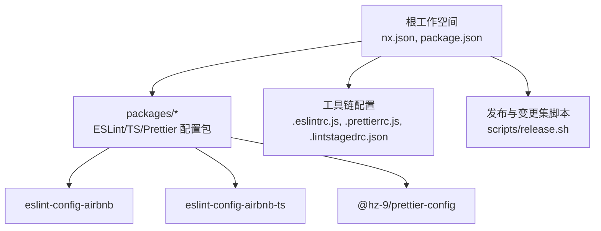
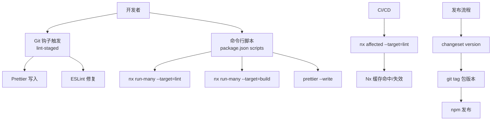
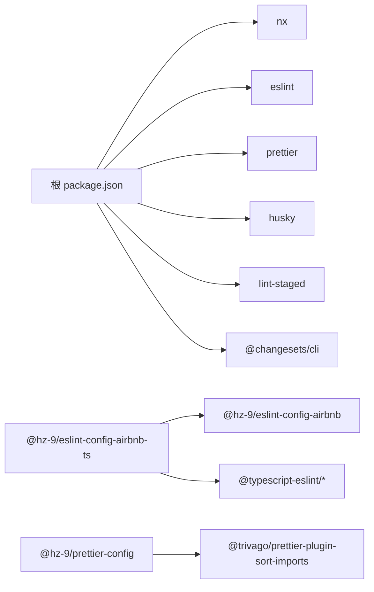

# 快速开始

<cite>
**本文引用的文件**
- [README.md](file://README.md)
- [docs/README.md](file://docs/README.md)
- [package.json](file://package.json)
- [nx.json](file://nx.json)
- [.eslintrc.js](file://.eslintrc.js)
- [.prettierrc.js](file://.prettierrc.js)
- [.lintstagedrc.json](file://.lintstagedrc.json)
- [.gitignore](file://.gitignore)
- [.markdownlint.json](file://.markdownlint.json)
- [pnpm-workspace.yaml](file://pnpm-workspace.yaml)
- [packages/tsconfig.base.json](file://packages/tsconfig.base.json)
- [packages/eslint-config-airbnb/package.json](file://packages/eslint-config-airbnb/package.json)
- [packages/eslint-config-airbnb-ts/package.json](file://packages/eslint-config-airbnb-ts/package.json)
- [packages/prettier-config/package.json](file://packages/prettier-config/package.json)
- [scripts/release.sh](file://scripts/release.sh)
</cite>

## 目录
1. [简介](#简介)
2. [项目结构](#项目结构)
3. [核心组件](#核心组件)
4. [架构总览](#架构总览)
5. [详细组件分析](#详细组件分析)
6. [依赖关系分析](#依赖关系分析)
7. [性能与可维护性建议](#性能与可维护性建议)
8. [故障排除指南](#故障排除指南)
9. [结论](#结论)
10. [附录：完整配置清单与示例路径](#附录完整配置清单与示例路径)

## 简介
本指南面向初学者与团队协作场景，帮助你在现有或新的 Nx 工作空间中快速集成并使用 lint-nx（ESLint + Prettier）配置，涵盖安装、配置、运行与发布流程，并提供跨平台与版本兼容性说明。

## 项目结构
该仓库采用 Nx 管理多包工作空间，使用 pnpm 进行依赖管理，核心配置集中在根目录与 packages 子包中：
- 根级配置：nx.json、.eslintrc.js、.prettierrc.js、.lintstagedrc.json、pnpm-workspace.yaml、package.json
- 包配置：packages/eslint-config-airbnb、packages/eslint-config-airbnb-ts、packages/prettier-config
- 文档与脚本：docs/README.md、scripts/release.sh、.markdownlint.json

图表来源
- [nx.json:1-20](file://nx.json#L1-L20)
- [package.json:1-38](file://package.json#L1-L38)
- [pnpm-workspace.yaml:1-6](file://pnpm-workspace.yaml#L1-L6)

章节来源
- [README.md:1-45](file://README.md#L1-L45)
- [docs/README.md:1-28](file://docs/README.md#L1-L28)
- [pnpm-workspace.yaml:1-6](file://pnpm-workspace.yaml#L1-L6)

## 核心组件
- ESLint 配置扩展：通过根级 .eslintrc.js 继承 @hz-9/eslint-config-airbnb，支持 JavaScript/TypeScript 项目的统一规则。
- Prettier 配置扩展：通过 .prettierrc.js 继承 @hz-9/prettier-config，并启用 import 排序插件与自定义排序规则。
- Nx 目标与输入：nx.json 定义 lint 目标的输入（默认、生产集与 ESLint 配置文件），便于缓存与增量执行。
- 质量门禁：.lintstagedrc.json 在提交前自动格式化与修复 JS/TS/Prettier 支持的文件。
- 工作空间与脚本：package.json 提供 lint、format、build、test 等常用命令；scripts/release.sh 提供版本与标签流程参考。

章节来源
- [.eslintrc.js:1-4](file://.eslintrc.js#L1-L4)
- [.prettierrc.js:1-15](file://.prettierrc.js#L1-L15)
- [nx.json:6-14](file://nx.json#L6-L14)
- [.lintstagedrc.json:1-5](file://.lintstagedrc.json#L1-L5)
- [package.json:5-16](file://package.json#L5-L16)
- [scripts/release.sh:1-73](file://scripts/release.sh#L1-L73)

## 架构总览
下图展示了从开发到发布的典型流程：本地开发时通过 Husky/Lint-Staged 触发格式化与 ESLint 修复；CI 可复用 Nx 的 affected 与缓存能力；发布阶段使用 Changesets 进行版本与变更记录管理。

图表来源
- [.lintstagedrc.json:1-5](file://.lintstagedrc.json#L1-L5)
- [package.json:5-16](file://package.json#L5-L16)
- [nx.json:6-14](file://nx.json#L6-L14)
- [scripts/release.sh:20-68](file://scripts/release.sh#L20-L68)

## 详细组件分析

### 安装与环境准备
- Node.js 版本要求：根工作空间与各包均声明了兼容的 Node.js 范围，请确保满足最低版本要求。
- 包管理器：仓库使用 pnpm，且在根 package.json 中声明了固定版本，推荐使用相同版本以避免锁文件差异。
- 初始化 Git 与 Husky：根 package.json 提供 prepare 脚本用于初始化 husky 钩子。

章节来源
- [package.json:33-37](file://package.json#L33-L37)
- [packages/eslint-config-airbnb/package.json:77-79](file://packages/eslint-config-airbnb/package.json#L77-L79)
- [packages/eslint-config-airbnb-ts/package.json:80-82](file://packages/eslint-config-airbnb-ts/package.json#L80-L82)
- [packages/prettier-config/package.json:38-40](file://packages/prettier-config/package.json#L38-L40)
- [package.json:12](file://package.json#L12)

### 在现有 Nx 工作空间中集成
- 步骤概览
  1) 安装依赖：使用 pnpm 安装根与各子包依赖。
  2) 引入配置：将根级 ESLint/Prettier 配置复制到目标工作空间，或通过依赖方式引入。
  3) 配置 Nx 目标：在目标工作空间的 nx.json 中添加 lint 目标与输入，使其识别 ESLint 配置文件。
  4) 配置 Husky/Lint-Staged：在目标工作空间启用提交前检查。
  5) 运行与验证：执行 lint、format、build 等命令，确认结果符合预期。

- 关键参考路径
  - ESLint 配置继承：[根级 .eslintrc.js:1-4](file://.eslintrc.js#L1-L4)
  - Prettier 配置继承与插件：[根级 .prettierrc.js:1-15](file://.prettierrc.js#L1-L15)
  - Nx 目标与输入：[nx.json:6-14](file://nx.json#L6-L14)
  - 提交前检查：[.lintstagedrc.json:1-5](file://.lintstagedrc.json#L1-L5)

章节来源
- [.eslintrc.js:1-4](file://.eslintrc.js#L1-L4)
- [.prettierrc.js:1-15](file://.prettierrc.js#L1-L15)
- [nx.json:6-14](file://nx.json#L6-L14)
- [.lintstagedrc.json:1-5](file://.lintstagedrc.json#L1-L5)

### 基本使用示例
- 安装依赖与构建
  - 使用 pnpm 安装依赖与构建所有包。
- 代码格式化
  - 对所有支持的文件类型进行格式化检查或写入。
- 全局与受影响目标
  - 执行全局 lint 或仅对受影响项目执行 lint。
- 交互式版本与发布准备
  - 使用 Changesets 创建变更集，版本化与生成变更日志，准备打标签与发布。

章节来源
- [README.md:9-36](file://README.md#L9-L36)
- [docs/README.md:15-27](file://docs/README.md#L15-L27)
- [package.json:5-16](file://package.json#L5-L16)

### 配置文件详解与最佳实践
- ESLint 配置
  - 继承策略：根级 .eslintrc.js 通过映射 require.resolve 方式加载 @hz-9/eslint-config-airbnb，确保解析稳定。
  - 适用范围：适用于 JavaScript/TypeScript 项目，具体规则由被继承的配置包决定。
- Prettier 配置
  - 继承策略：根级 .prettierrc.js 继承 @hz-9/prettier-config，并追加 import 排序插件与排序规则。
  - 插件与排序：启用 @trivago/prettier-plugin-sort-imports 并设置 importOrder 等参数，提升导入一致性。
- Lint-Staged
  - 文件类型：对 JS/TS/JSX/TSX 执行 prettier --write 与 eslint --fix；对 JSON/CSS/Markdown 执行 prettier --write。
- Nx 目标输入
  - lint 目标输入包含默认输入与 ESLint 配置文件，便于缓存与增量执行。

章节来源
- [.eslintrc.js:1-4](file://.eslintrc.js#L1-L4)
- [.prettierrc.js:1-15](file://.prettierrc.js#L1-L15)
- [.lintstagedrc.json:1-5](file://.lintstagedrc.json#L1-L5)
- [nx.json:6-14](file://nx.json#L6-L14)

### 发布与版本管理
- Changesets 流程
  - 创建变更集：用于记录版本与变更说明。
  - 版本化：根据变更集更新各包版本并生成变更日志。
  - 打标签：为每个发布包创建对应标签。
  - 发布：推送标签后发布至 npm（脚本中已预留步骤）。
- 参考脚本
  - 发布流水线脚本提供了版本快照、锁定文件更新、确定变更包、打标签与提交等步骤。

章节来源
- [scripts/release.sh:1-73](file://scripts/release.sh#L1-L73)
- [package.json:13-15](file://package.json#L13-L15)

## 依赖关系分析
- 工作空间与包管理
  - pnpm 工作空间：通过 pnpm-workspace.yaml 指定 packages/* 作为工作空间包集合。
  - 根依赖：nx、eslint、prettier、husky、lint-staged、@changesets/cli 等。
- 包间依赖
  - @hz-9/eslint-config-airbnb-ts 依赖 @hz-9/eslint-config-airbnb 与 TypeScript ESLint 生态。
  - @hz-9/prettier-config 依赖 @trivago/prettier-plugin-sort-imports。
- Node.js 与 TypeScript 版本
  - 各包声明了兼容的 Node.js 范围与 TypeScript 范围，确保运行时与编译时的一致性。

图表来源
- [package.json:17-32](file://package.json#L17-L32)
- [packages/eslint-config-airbnb-ts/package.json:66-75](file://packages/eslint-config-airbnb-ts/package.json#L66-L75)
- [packages/prettier-config/package.json:32-33](file://packages/prettier-config/package.json#L32-L33)

章节来源
- [pnpm-workspace.yaml:4-6](file://pnpm-workspace.yaml#L4-L6)
- [package.json:17-32](file://package.json#L17-L32)
- [packages/eslint-config-airbnb-ts/package.json:66-75](file://packages/eslint-config-airbnb-ts/package.json#L66-L75)
- [packages/prettier-config/package.json:32-33](file://packages/prettier-config/package.json#L32-L33)

## 性能与可维护性建议
- 利用 Nx 缓存与增量执行
  - 通过 nx.json 的 targetDefaults 与 namedInputs，确保 lint 目标正确识别配置文件与产物输入，减少不必要的重复执行。
- 合理拆分规则与配置
  - 将通用规则收敛至 @hz-9/eslint-config-airbnb 与 @hz-9/prettier-config，业务规则尽量通过覆盖或补充实现，降低维护成本。
- 提交前检查
  - 使用 .lintstagedrc.json 在本地快速发现并修复问题，缩短反馈回路。
- 锁定与版本
  - 固定 pnpm 版本与 Node.js 范围，避免因工具链差异导致的不一致。

章节来源
- [nx.json:6-14](file://nx.json#L6-L14)
- [.lintstagedrc.json:1-5](file://.lintstagedrc.json#L1-L5)
- [package.json:33-37](file://package.json#L33-L37)

## 故障排除指南
- Node.js 版本不匹配
  - 现象：安装失败或运行时报错。
  - 处理：升级/降级 Node.js 至根工作空间与包声明的兼容范围。
- pnpm 版本不一致
  - 现象：锁文件冲突或安装异常。
  - 处理：使用根 package.json 中声明的 pnpm 版本，保持团队一致。
- ESLint/Prettier 插件缺失
  - 现象：ESLint 报插件未找到或 Prettier 导入排序无效。
  - 处理：确认已安装 @hz-9/eslint-config-airbnb、@hz-9/eslint-config-airbnb-ts、@hz-9/prettier-config 及其 peerDependencies。
- Husky 钩子未生效
  - 现象：git 提交无任何动作。
  - 处理：执行根 package.json 的 prepare 脚本初始化钩子。
- Nx affected 未命中缓存
  - 现象：每次执行都重新 lint。
  - 处理：确认 nx.json 的 lint 输入包含 .eslintrc* 与 .eslintignore，确保配置变更能正确触发重建。
- Markdown 规则影响
  - 现象：文档检查报错。
  - 处理：根据 .markdownlint.json 的配置调整或忽略特定规则。

章节来源
- [package.json:33-37](file://package.json#L33-L37)
- [packages/eslint-config-airbnb/package.json:74-76](file://packages/eslint-config-airbnb/package.json#L74-L76)
- [packages/eslint-config-airbnb-ts/package.json:76-79](file://packages/eslint-config-airbnb-ts/package.json#L76-L79)
- [packages/prettier-config/package.json:35-37](file://packages/prettier-config/package.json#L35-L37)
- [package.json:12](file://package.json#L12)
- [nx.json:11-13](file://nx.json#L11-L13)
- [.markdownlint.json:1-11](file://.markdownlint.json#L1-L11)

## 结论
通过本快速开始指南，你可以在 Nx 工作空间中快速集成 lint-nx 的 ESLint 与 Prettier 配置，借助 Husky/Lint-Staged 实现本地质量门禁，利用 Nx 的缓存与增量能力提升效率，并通过 Changesets 完成版本与发布管理。建议在团队内统一 Node.js、pnpm 与编辑器插件版本，确保一致的开发体验。

## 附录：完整配置清单与示例路径
- 安装与初始化
  - pnpm 安装：[根 package.json scripts:5-16](file://package.json#L5-L16)
  - Husky 初始化：[根 package.json prepare](file://package.json#L12)
- 核心配置文件
  - ESLint：[根级 .eslintrc.js:1-4](file://.eslintrc.js#L1-L4)
  - Prettier：[根级 .prettierrc.js:1-15](file://.prettierrc.js#L1-L15)
  - Lint-Staged：[.lintstagedrc.json:1-5](file://.lintstagedrc.json#L1-L5)
  - Nx 目标与输入：[nx.json:6-14](file://nx.json#L6-L14)
- 包与版本
  - 工作空间：[pnpm-workspace.yaml:4-6](file://pnpm-workspace.yaml#L4-L6)
  - TypeScript 基础配置：[packages/tsconfig.base.json:1-13](file://packages/tsconfig.base.json#L1-L13)
  - 包依赖与引擎：[@hz-9/eslint-config-airbnb:65-82](file://packages/eslint-config-airbnb/package.json#L65-L82)、[@hz-9/eslint-config-airbnb-ts:66-82](file://packages/eslint-config-airbnb-ts/package.json#L66-L82)、[@hz-9/prettier-config:32-43](file://packages/prettier-config/package.json#L32-L43)
- 发布与版本
  - Changesets 与标签：[scripts/release.sh:20-68](file://scripts/release.sh#L20-L68)
  - 根脚本入口：[package.json scripts:13-15](file://package.json#L13-L15)