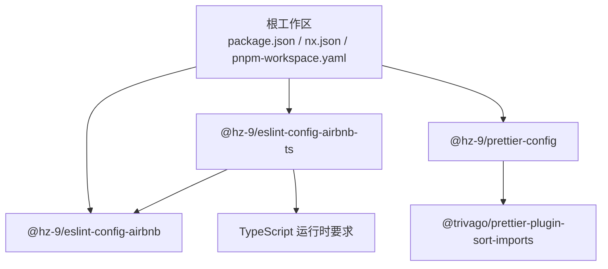
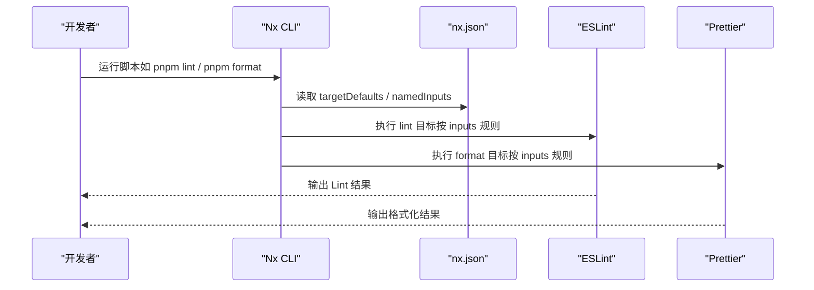
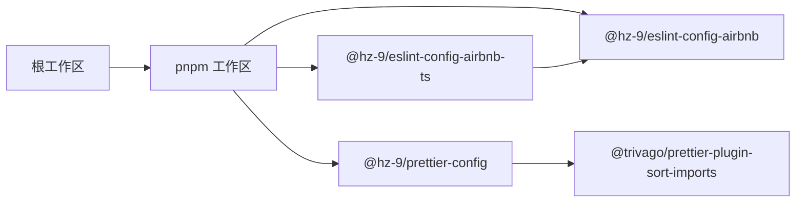

# 故障排除

<cite>
**本文引用的文件**
- [package.json](file://package.json)
- [nx.json](file://nx.json)
- [pnpm-workspace.yaml](file://pnpm-workspace.yaml)
- [README.md](file://README.md)
- [README.zh-CN.md](file://README.zh-CN.md)
- [.eslintrc.js](file://.eslintrc.js)
- [.prettierrc.js](file://.prettierrc.js)
- [.husky/_/husky.sh](file://.husky/_/husky.sh)
- [scripts/release.sh](file://scripts/release.sh)
- [packages/eslint-config-airbnb/package.json](file://packages/eslint-config-airbnb/package.json)
- [packages/eslint-config-airbnb-ts/package.json](file://packages/eslint-config-airbnb-ts/package.json)
- [packages/prettier-config/package.json](file://packages/prettier-config/package.json)
- [packages/tsconfig.base.json](file://packages/tsconfig.base.json)
</cite>

## 目录
1. [简介](#简介)
2. [项目结构](#项目结构)
3. [核心组件](#核心组件)
4. [架构总览](#架构总览)
5. [详细组件分析](#详细组件分析)
6. [依赖分析](#依赖分析)
7. [性能考虑](#性能考虑)
8. [故障排除指南](#故障排除指南)
9. [结论](#结论)
10. [附录](#附录)

## 简介
本指南面向使用该 Nx 工作区进行 JavaScript/TypeScript 代码质量与格式化的团队，聚焦于安装、配置、性能与兼容性等常见问题的诊断与修复，并提供调试工具与日志分析技巧，帮助在不同环境下快速定位并解决问题。

## 项目结构
该仓库采用 pnpm 工作区 + Nx 管理多包的组织方式，核心由三个包组成：Airbnb 风格 ESLint 配置、Airbnb 风格 TypeScript ESLint 配置、Prettier 配置；同时通过 Nx 的 targetDefaults、namedInputs 等能力统一构建、测试与 Lint 行为。

图表来源
- [pnpm-workspace.yaml:1-6](file://pnpm-workspace.yaml#L1-L6)
- [packages/eslint-config-airbnb/package.json:1-84](file://packages/eslint-config-airbnb/package.json#L1-L84)
- [packages/eslint-config-airbnb-ts/package.json:1-87](file://packages/eslint-config-airbnb-ts/package.json#L1-L87)
- [packages/prettier-config/package.json:1-45](file://packages/prettier-config/package.json#L1-L45)

章节来源
- [README.md:1-45](file://README.md#L1-L45)
- [README.zh-CN.md:1-45](file://README.zh-CN.md#L1-L45)
- [pnpm-workspace.yaml:1-6](file://pnpm-workspace.yaml#L1-L6)
- [nx.json:1-20](file://nx.json#L1-L20)

## 核心组件
- ESLint 配置（JavaScript/Airbnb 风格）：提供统一的规则集与扩展链，作为根级 ESLint 配置的基线。
- ESLint 配置（TypeScript/Airbnb 风格）：在 JS 基础上引入 TS 解析器与插件，形成 TS 场景的完整规则集。
- Prettier 配置：集中管理格式化策略与导入排序插件，保证跨文件一致性。
- Nx 目标与输入：通过 targetDefaults 与 namedInputs 统一 Lint/Build 输入与依赖关系，提升缓存命中与增量效率。

章节来源
- [.eslintrc.js:1-4](file://.eslintrc.js#L1-L4)
- [packages/eslint-config-airbnb/package.json:1-84](file://packages/eslint-config-airbnb/package.json#L1-L84)
- [packages/eslint-config-airbnb-ts/package.json:1-87](file://packages/eslint-config-airbnb-ts/package.json#L1-L87)
- [packages/prettier-config/package.json:1-45](file://packages/prettier-config/package.json#L1-L45)
- [nx.json:6-18](file://nx.json#L6-L18)

## 架构总览
下图展示从命令到具体执行的典型路径：用户通过 npm 脚本触发 Nx 任务，Nx 按 targetDefaults 与 namedInputs 决定输入与依赖，再调用对应工具（ESLint/Prettier/Vitest 等）完成检查或格式化。

图表来源
- [package.json:5-16](file://package.json#L5-L16)
- [nx.json:6-18](file://nx.json#L6-L18)

章节来源
- [package.json:5-16](file://package.json#L5-L16)
- [nx.json:1-20](file://nx.json#L1-L20)

## 详细组件分析

### ESLint 配置（JavaScript/Airbnb 风格）
- 作用：作为根 ESLint 配置，继承统一规则集，覆盖浏览器全局混淆项、导入规则等。
- 关键点：通过扩展链集中管理规则，避免各子包重复配置；与 Prettier 协同以减少格式争议。
- 兼容性：要求 Node 版本满足引擎约束；需与项目中 ESLint 版本匹配。

章节来源
- [.eslintrc.js:1-4](file://.eslintrc.js#L1-L4)
- [packages/eslint-config-airbnb/package.json:74-82](file://packages/eslint-config-airbnb/package.json#L74-L82)

### ESLint 配置（TypeScript/Airbnb 风格）
- 作用：在 JS 基础上引入 TS 解析器与插件，提供 TS 场景的规则集。
- 关键点：依赖 JS 配置包，形成复用与升级的一致性；对 TypeScript 版本有明确范围要求。
- 兼容性：需同时满足 ESLint 与 TypeScript 的引擎约束。

章节来源
- [packages/eslint-config-airbnb-ts/package.json:66-82](file://packages/eslint-config-airbnb-ts/package.json#L66-L82)

### Prettier 配置
- 作用：集中管理格式化策略与导入排序插件，统一团队风格。
- 关键点：通过插件实现导入顺序分组与排序，结合 importOrderParserPlugins 支持装饰器与类属性。
- 兼容性：对 Prettier 版本有明确要求；与 ESLint 配置协同，避免冲突。

章节来源
- [.prettierrc.js:1-15](file://.prettierrc.js#L1-L15)
- [packages/prettier-config/package.json:32-43](file://packages/prettier-config/package.json#L32-L43)

### Nx 目标与输入
- 作用：统一 Lint/Build 的输入与依赖，提升缓存命中与增量效率。
- 关键点：lint 目标关注 .eslintrc* 与 .eslintignore；build 目标按依赖链向上构建。
- 性能：合理设置 inputs 可显著缩短 CI 时间。

章节来源
- [nx.json:6-18](file://nx.json#L6-L18)

## 依赖分析
- 工作区与包：pnpm 工作区声明 packages/*，三个包均位于该目录。
- 包间依赖：TS ESLint 配置依赖 JS ESLint 配置；Prettier 配置依赖导入排序插件。
- 运行时要求：各包对 Node/ESLint/TypeScript/Prettier 的引擎版本有明确范围。

图表来源
- [pnpm-workspace.yaml:4-6](file://pnpm-workspace.yaml#L4-L6)
- [packages/eslint-config-airbnb-ts/package.json:66-70](file://packages/eslint-config-airbnb-ts/package.json#L66-L70)
- [packages/prettier-config/package.json:32-34](file://packages/prettier-config/package.json#L32-L34)

章节来源
- [pnpm-workspace.yaml:1-6](file://pnpm-workspace.yaml#L1-L6)
- [packages/eslint-config-airbnb-ts/package.json:66-70](file://packages/eslint-config-airbnb-ts/package.json#L66-L70)
- [packages/prettier-config/package.json:32-34](file://packages/prettier-config/package.json#L32-L34)

## 性能考虑
- 使用 Nx affected 仅对变更项目执行 Lint，降低 CI 时间。
- 合理配置 targetDefaults 的 inputs，避免不必要的重建。
- 在本地开发阶段优先使用格式化检查（format:check），减少 CI 失败重试成本。
- 对大型工作区，建议开启 Nx 分布式缓存（若使用 Nx Cloud）以进一步提升速度。

章节来源
- [README.md:25-26](file://README.md#L25-L26)
- [nx.json:6-18](file://nx.json#L6-L18)

## 故障排除指南

### 一、安装与环境问题
- 症状：安装失败或依赖不兼容
  - 排查要点
    - Node 版本是否满足各包引擎要求（>=18.18.0 <19.0.0 或 >=20.9.0 <21.0.0）
    - pnpm 版本是否与工作区锁定一致（见 packageManager 字段）
    - 是否正确启用 pnpm 工作区（packages/*）
  - 修复步骤
    - 切换到符合要求的 Node 版本后重试安装
    - 清理锁文件与 node_modules 后重新安装
    - 确认 pnpm 工作区配置正确且包路径存在
  - 参考来源
    - [package.json:33-36](file://package.json#L33-L36)
    - [pnpm-workspace.yaml:4-6](file://pnpm-workspace.yaml#L4-L6)

- 症状：husky 脚本提示已弃用
  - 排查要点：husky 脚本中包含弃用警告
  - 修复步骤：按照提示移除脚本中的两行内容，参考官方迁移指引
  - 参考来源
    - [.husky/_/husky.sh:1-9](file://.husky/_/husky.sh#L1-L9)

### 二、配置冲突与规则不生效
- 症状：ESLint/Prettier 规则冲突或未生效
  - 排查要点
    - 根 ESLint 配置是否正确继承 JS 风格配置
    - TS 项目是否同时满足 ESLint 与 TypeScript 版本范围
    - Prettier 插件与解析器插件版本是否匹配
  - 修复步骤
    - 确保 .eslintrc.js 正确 extends 对应配置
    - 在 TS 项目中同时安装并配置 @typescript-eslint/parser 与插件
    - 对齐 Prettier 与插件版本，避免解析器插件不兼容
  - 参考来源
    - [.eslintrc.js:1-4](file://.eslintrc.js#L1-L4)
    - [packages/eslint-config-airbnb-ts/package.json:66-82](file://packages/eslint-config-airbnb-ts/package.json#L66-L82)
    - [.prettierrc.js:6-14](file://.prettierrc.js#L6-L14)

- 症状：Lint 未覆盖新增文件或忽略规则不生效
  - 排查要点：检查 .eslintignore 与 .eslintrc.js 中的 ignorePatterns
  - 修复步骤：确认 ignorePatterns 与命名规则一致，必要时调整 targetDefaults 的 inputs
  - 参考来源
    - [nx.json:11-13](file://nx.json#L11-L13)

### 三、性能问题（CI/本地慢）
- 症状：CI 时间过长或本地 Lint 缓慢
  - 排查要点：是否对全量项目执行 Lint；inputs 是否过于宽泛
  - 修复步骤
    - 使用 affected 仅对变更项目执行 Lint
    - 优化 targetDefaults 的 inputs，减少无关文件参与
    - 在本地先执行格式化检查，减少 CI 失败重试
  - 参考来源
    - [README.md:25-26](file://README.md#L25-L26)
    - [nx.json:6-18](file://nx.json#L6-L18)

### 四、兼容性问题（Node/ESLint/TypeScript/Prettier）
- 症状：运行时报“引擎不满足”或“模块解析失败”
  - 排查要点：核对各包 engines 字段与当前环境版本
  - 修复步骤：升级/降级至满足要求的版本组合
  - 参考来源
    - [packages/eslint-config-airbnb/package.json:77-82](file://packages/eslint-config-airbnb/package.json#L77-L82)
    - [packages/eslint-config-airbnb-ts/package.json:79-82](file://packages/eslint-config-airbnb-ts/package.json#L79-L82)
    - [packages/prettier-config/package.json:38-43](file://packages/prettier-config/package.json#L38-L43)

### 五、发布与版本管理问题
- 症状：发布流程中断或标签缺失
  - 排查要点：release 脚本是否正确记录版本快照、是否生成标签
  - 修复步骤：检查 changeset 流程与脚本执行顺序，确保版本提升与标签创建成功
  - 参考来源
    - [scripts/release.sh:12-46](file://scripts/release.sh#L12-L46)

### 六、调试工具与日志分析
- 常用命令
  - 查看依赖图谱：nx graph
  - 仅对变更项目执行 Lint：nx affected --target=lint
  - 格式化检查（不写入）：pnpm format:check
- 日志与输出
  - ESLint 输出：关注规则冲突与未覆盖文件
  - Prettier 输出：关注导入排序与格式化差异
  - Nx 输出：关注 inputs 变更与缓存命中情况

章节来源
- [README.md:22-26](file://README.md#L22-L26)
- [package.json:10-11](file://package.json#L10-L11)

### 七、不同环境下的特殊问题
- 开发机（macOS/Linux/Windows）
  - 注意 pnpm 与 Node 版本一致性，避免大小写敏感导致的路径问题
- CI（GitHub Actions 等）
  - 使用受支持的 Node 版本矩阵；缓存 pnpm store 与 node_modules
  - 将 affected 与 format:check 作为前置步骤，提高成功率
- Docker/容器化
  - 显式指定 Node 版本与 pnpm 版本，避免镜像层差异导致的不一致

### 八、社区支持与问题报告
- 文档与示例
  - 项目文档地址与各包文档入口
- 问题反馈
  - 通过 GitHub Issues 提交，附带以下信息
    - 环境信息（Node/pnpm/Nx/ESLint/Prettier 版本）
    - 复现步骤与期望/实际行为
    - 相关配置文件片段（脱敏处理）
    - 截图或最小可复现仓库链接

章节来源
- [README.md:5](file://README.md#L5)
- [packages/eslint-config-airbnb/package.json:10-17](file://packages/eslint-config-airbnb/package.json#L10-L17)
- [packages/eslint-config-airbnb-ts/package.json:10-18](file://packages/eslint-config-airbnb-ts/package.json#L10-L18)
- [packages/prettier-config/package.json:8-16](file://packages/prettier-config/package.json#L8-L16)

## 结论
通过规范安装与环境校验、统一配置与输入、以及合理的调试与发布流程，可以有效降低 Lint 与格式化环节的故障率。建议在团队内固化上述流程与检查清单，持续优化 Nx 输入与 CI 策略，以获得稳定高效的开发体验。

## 附录

### A. 常见问题对照表
- 安装失败：检查 Node 与 pnpm 版本、工作区配置
- 规则冲突：确认 ESLint/Prettier 插件版本与解析器匹配
- CI 慢：使用 affected、优化 inputs、缓存 store
- 发布失败：核对 changeset 与标签生成流程

### B. 快速自检清单
- [ ] Node 版本满足引擎要求
- [ ] pnpm 工作区配置正确
- [ ] ESLint 与 Prettier 插件版本匹配
- [ ] .eslintignore 与 .eslintrc.js 配置一致
- [ ] 使用 affected 与 format:check 优化流程
- [ ] CI 缓存与锁文件策略已启用