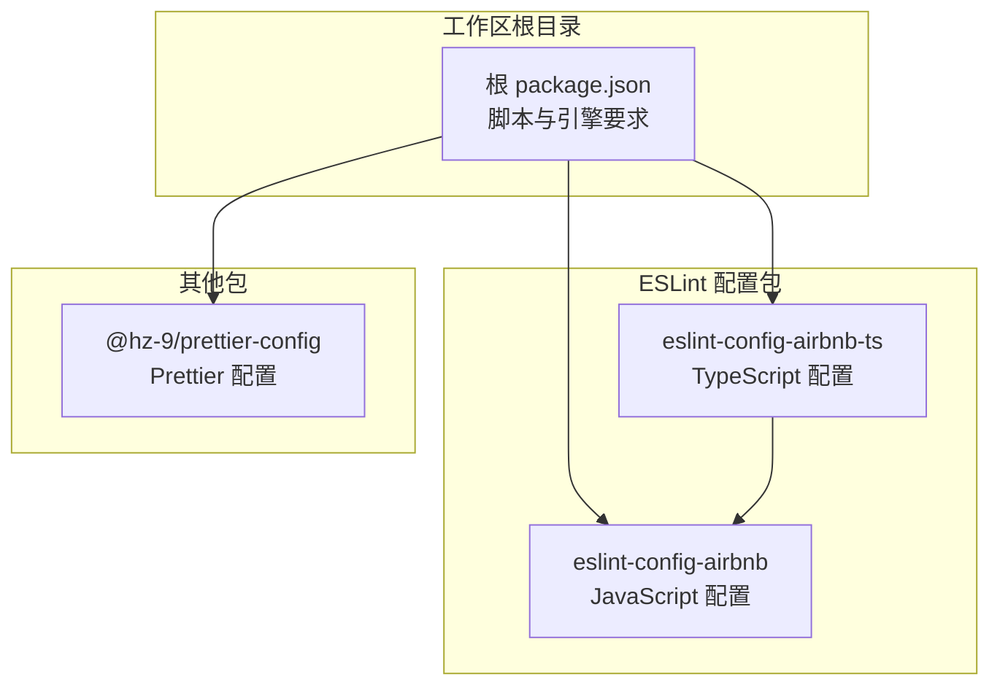
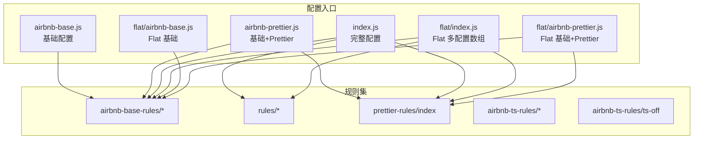
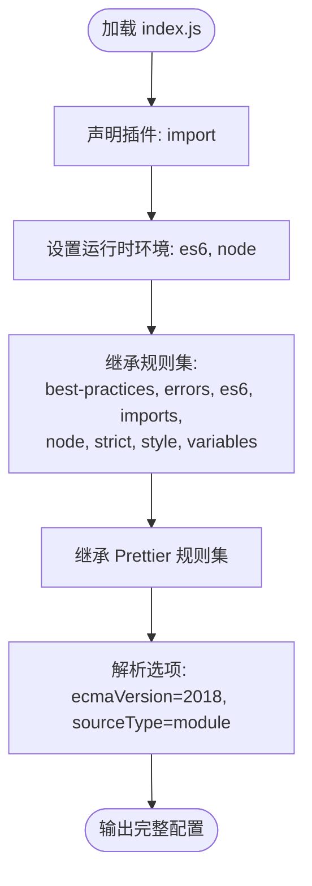
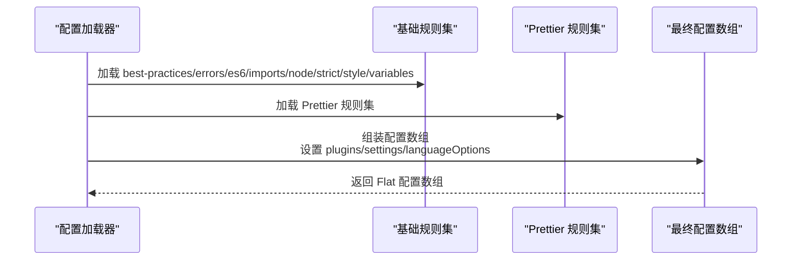
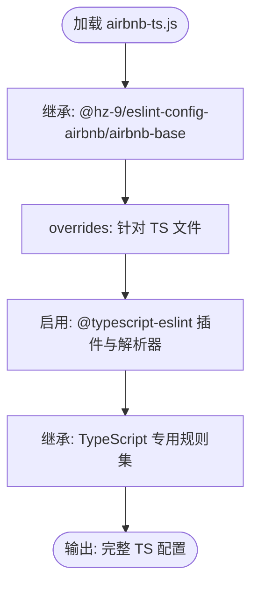
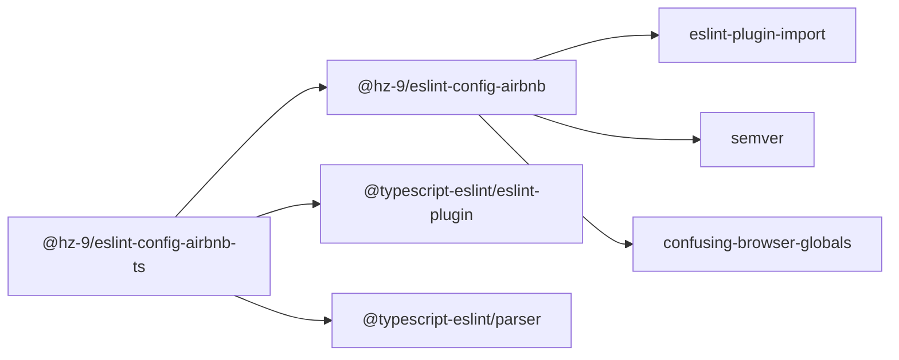

# ESLint Airbnb 规则包

<cite>
**本文引用的文件**
- [packages/eslint-config-airbnb/package.json](file://packages/eslint-config-airbnb/package.json)
- [packages/eslint-config-airbnb-ts/package.json](file://packages/eslint-config-airbnb-ts/package.json)
- [packages/eslint-config-airbnb/src/profile/index.js](file://packages/eslint-config-airbnb/src/profile/index.js)
- [packages/eslint-config-airbnb/src/profile/airbnb-base.js](file://packages/eslint-config-airbnb/src/profile/airbnb-base.js)
- [packages/eslint-config-airbnb/src/profile/airbnb-prettier.js](file://packages/eslint-config-airbnb/src/profile/airbnb-prettier.js)
- [packages/eslint-config-airbnb/src/profile/flat/index.js](file://packages/eslint-config-airbnb/src/profile/flat/index.js)
- [packages/eslint-config-airbnb/src/profile/flat/airbnb-base.js](file://packages/eslint-config-airbnb/src/profile/flat/airbnb-base.js)
- [packages/eslint-config-airbnb/src/profile/flat/airbnb-prettier.js](file://packages/eslint-config-airbnb/src/profile/flat/airbnb-prettier.js)
- [packages/eslint-config-airbnb-ts/src/index.js](file://packages/eslint-config-airbnb-ts/src/index.js)
- [packages/eslint-config-airbnb-ts/src/profile/airbnb-ts.js](file://packages/eslint-config-airbnb-ts/src/profile/airbnb-ts.js)
- [packages/eslint-config-airbnb-ts/src/profile/constants.js](file://packages/eslint-config-airbnb-ts/src/profile/constants.js)
- [package.json](file://package.json)
</cite>

## 目录
1. [简介](#简介)
2. [项目结构](#项目结构)
3. [核心组件](#核心组件)
4. [架构总览](#架构总览)
5. [详细组件分析](#详细组件分析)
6. [依赖分析](#依赖分析)
7. [性能考虑](#性能考虑)
8. [故障排查指南](#故障排查指南)
9. [结论](#结论)
10. [附录](#附录)

## 简介
本项目是面向 JavaScript/TypeScript 的 ESLint 规则集合，提供与 Airbnb 风格一致的代码质量规范，并与 Prettier 格式化工具协同工作。它通过分层配置文件组织规则，支持传统配置与 ESLint Flat Config（多配置数组）两种模式，便于在不同项目中灵活启用基础规则、Airbnb 扩展规则以及 Prettier 集成。

该包既可作为独立配置使用，也可作为 TypeScript 配置的依赖，通过 overrides 将 TypeScript 特有规则应用于 ts/tsx 文件，确保在强类型语言下保持一致的风格与质量标准。

## 项目结构
仓库采用 Nx 工作区组织，包含四个主要包：
- @hz-9/eslint-config-airbnb：JavaScript 基础配置与规则集
- @hz-9/eslint-config-airbnb-ts：基于上述包的 TypeScript 扩展配置
- @hz-9/prettier-config：Prettier 统一格式化配置（与本包配合）
- 文档与脚本：用于构建、发布与生成页面

图表来源
- [package.json:1-38](file://package.json#L1-L38)
- [packages/eslint-config-airbnb/package.json:1-84](file://packages/eslint-config-airbnb/package.json#L1-L84)
- [packages/eslint-config-airbnb-ts/package.json:1-87](file://packages/eslint-config-airbnb-ts/package.json#L1-L87)

章节来源
- [package.json:1-38](file://package.json#L1-L38)
- [packages/eslint-config-airbnb/package.json:1-84](file://packages/eslint-config-airbnb/package.json#L1-L84)
- [packages/eslint-config-airbnb-ts/package.json:1-87](file://packages/eslint-config-airbnb-ts/package.json#L1-L87)

## 核心组件
- JavaScript 配置入口
  - 传统配置入口：导出完整配置对象，包含环境、插件、继承的规则集、解析选项等
  - Flat Config 入口：导出配置数组，按语言/规则类别拆分，便于组合与覆盖
- TypeScript 配置入口
  - 基于 JavaScript 基础配置，通过 overrides 仅对 ts/tsx 文件应用 TypeScript 特有规则
  - 使用 TypeScript 解析器与 ESLint 插件，结合常量定义 ts 文件匹配模式
- Prettier 集成
  - 在 JavaScript 配置中通过继承 Prettier 规则集，统一格式化与检查行为
  - 提供 airbnb-prettier 变体，便于仅启用 Prettier 相关规则

章节来源
- [packages/eslint-config-airbnb/src/profile/index.js:1-38](file://packages/eslint-config-airbnb/src/profile/index.js#L1-L38)
- [packages/eslint-config-airbnb/src/profile/flat/index.js:1-51](file://packages/eslint-config-airbnb/src/profile/flat/index.js#L1-L51)
- [packages/eslint-config-airbnb-ts/src/profile/airbnb-ts.js:1-35](file://packages/eslint-config-airbnb-ts/src/profile/airbnb-ts.js#L1-L35)
- [packages/eslint-config-airbnb-ts/src/profile/constants.js:1-4](file://packages/eslint-config-airbnb-ts/src/profile/constants.js#L1-L4)
- [packages/eslint-config-airbnb/src/profile/airbnb-prettier.js:1-29](file://packages/eslint-config-airbnb/src/profile/airbnb-prettier.js#L1-L29)

## 架构总览
整体架构由“基础规则集 + 扩展规则集 + Prettier 集成”三层组成，通过配置入口进行聚合或拆分，形成可复用、可组合的规则体系。

图表来源
- [packages/eslint-config-airbnb/src/profile/airbnb-base.js:1-27](file://packages/eslint-config-airbnb/src/profile/airbnb-base.js#L1-L27)
- [packages/eslint-config-airbnb/src/profile/airbnb-prettier.js:1-29](file://packages/eslint-config-airbnb/src/profile/airbnb-prettier.js#L1-L29)
- [packages/eslint-config-airbnb/src/profile/index.js:1-38](file://packages/eslint-config-airbnb/src/profile/index.js#L1-L38)
- [packages/eslint-config-airbnb/src/profile/flat/index.js:1-51](file://packages/eslint-config-airbnb/src/profile/flat/index.js#L1-L51)
- [packages/eslint-config-airbnb/src/profile/flat/airbnb-base.js:1-29](file://packages/eslint-config-airbnb/src/profile/flat/airbnb-base.js#L1-L29)
- [packages/eslint-config-airbnb/src/profile/flat/airbnb-prettier.js:1-33](file://packages/eslint-config-airbnb/src/profile/flat/airbnb-prettier.js#L1-L33)

## 详细组件分析

### JavaScript 配置入口（传统配置）
- 功能要点
  - 启用 import 插件与常用运行时环境
  - 继承多类基础规则集（最佳实践、错误处理、ES6、导入、Node、严格模式、风格、变量）
  - 继承 Prettier 规则集以统一格式化
  - 设置解析选项为 ES2018 模块语法
- 适用场景
  - 传统 JavaScript 项目或需要与 Prettier 协同的项目
  - 对 Flat Config 支持度有限的旧版 ESLint 环境

图表来源
- [packages/eslint-config-airbnb/src/profile/index.js:1-38](file://packages/eslint-config-airbnb/src/profile/index.js#L1-L38)

章节来源
- [packages/eslint-config-airbnb/src/profile/index.js:1-38](file://packages/eslint-config-airbnb/src/profile/index.js#L1-L38)

### JavaScript 配置入口（Flat Config）
- 功能要点
  - 将规则按类别拆分为多个配置段，分别设置语言选项与规则
  - 聚合基础规则集与 Prettier 规则集，最后统一设置解析选项
  - 通过 plugins 与 settings 进行全局插件与导入设置
- 适用场景
  - 新版 ESLint（8.57+）推荐的 Flat Config 方案
  - 需要更细粒度控制规则合并顺序与优先级的项目

图表来源
- [packages/eslint-config-airbnb/src/profile/flat/index.js:1-51](file://packages/eslint-config-airbnb/src/profile/flat/index.js#L1-L51)

章节来源
- [packages/eslint-config-airbnb/src/profile/flat/index.js:1-51](file://packages/eslint-config-airbnb/src/profile/flat/index.js#L1-L51)

### TypeScript 配置入口
- 功能要点
  - 基于 JavaScript 基础配置（airbnb-base），通过 overrides 仅对 ts/tsx 文件生效
  - 在 overrides 中启用 TypeScript 插件与解析器，并继承 TypeScript 专用规则集
  - 使用常量定义 ts 文件匹配模式，确保规则仅作用于目标文件
- 适用场景
  - 纯 TypeScript 项目或混合 JS/TS 项目中的 TS 文件

图表来源
- [packages/eslint-config-airbnb-ts/src/profile/airbnb-ts.js:1-35](file://packages/eslint-config-airbnb-ts/src/profile/airbnb-ts.js#L1-L35)
- [packages/eslint-config-airbnb-ts/src/profile/constants.js:1-4](file://packages/eslint-config-airbnb-ts/src/profile/constants.js#L1-L4)

章节来源
- [packages/eslint-config-airbnb-ts/src/profile/airbnb-ts.js:1-35](file://packages/eslint-config-airbnb-ts/src/profile/airbnb-ts.js#L1-L35)
- [packages/eslint-config-airbnb-ts/src/profile/constants.js:1-4](file://packages/eslint-config-airbnb-ts/src/profile/constants.js#L1-L4)

### Prettier 集成变体
- airbnb-prettier.js
  - 在基础规则集之上叠加 Prettier 规则集，适合需要强调格式化的团队
  - 适用于希望 ESLint 与 Prettier 协同工作的项目
- flat/airbnb-prettier.js
  - Flat Config 下的等价变体，按配置段聚合规则

章节来源
- [packages/eslint-config-airbnb/src/profile/airbnb-prettier.js:1-29](file://packages/eslint-config-airbnb/src/profile/airbnb-prettier.js#L1-L29)
- [packages/eslint-config-airbnb/src/profile/flat/airbnb-prettier.js:1-33](file://packages/eslint-config-airbnb/src/profile/flat/airbnb-prettier.js#L1-L33)

## 依赖分析
- JavaScript 包依赖
  - eslint-plugin-import：提供 import 规则与导入路径校验
  - semver：版本比较工具（用于兼容性判断）
  - confusing-browser-globals：避免误用浏览器全局变量
  - peerDependencies：与 ESLint 8.57.x 兼容
- TypeScript 包依赖
  - 依赖 @hz-9/eslint-config-airbnb（工作区内部）
  - 依赖 @typescript-eslint/eslint-plugin 与 @typescript-eslint/parser
  - peerDependencies：ESLint 8.57.x 与 TypeScript 5.x（范围限定）

图表来源
- [packages/eslint-config-airbnb/package.json:65-79](file://packages/eslint-config-airbnb/package.json#L65-L79)
- [packages/eslint-config-airbnb-ts/package.json:66-79](file://packages/eslint-config-airbnb-ts/package.json#L66-L79)

章节来源
- [packages/eslint-config-airbnb/package.json:65-79](file://packages/eslint-config-airbnb/package.json#L65-L79)
- [packages/eslint-config-airbnb-ts/package.json:66-79](file://packages/eslint-config-airbnb-ts/package.json#L66-L79)

## 性能考虑
- 规则拆分与按需加载
  - Flat Config 将规则按类别拆分为多个配置段，减少单次合并成本
  - 仅对目标文件（如 ts/tsx）应用 TypeScript 规则，降低无关文件的检查开销
- 插件与解析器选择
  - 使用 TypeScript 解析器仅在 overrides 中启用，避免对 JS 文件造成额外负担
- 缓存与增量检查
  - 建议配合 ESLint 缓存与增量检查策略，提升大型项目的迭代效率

## 故障排查指南
- 版本不兼容
  - 症状：ESLint 报告与规则不匹配或无法加载
  - 排查：确认 ESLint 版本与包的 peerDependencies 一致；TypeScript 包还需满足其版本范围
  - 参考
    - [packages/eslint-config-airbnb/package.json:74-79](file://packages/eslint-config-airbnb/package.json#L74-L79)
    - [packages/eslint-config-airbnb-ts/package.json:76-79](file://packages/eslint-config-airbnb-ts/package.json#L76-L79)
- Flat Config 未生效
  - 症状：使用 Flat Config 但规则未按预期合并
  - 排查：确认配置数组顺序与语言选项设置；检查是否正确聚合了基础规则集与 Prettier 规则集
  - 参考
    - [packages/eslint-config-airbnb/src/profile/flat/index.js:1-51](file://packages/eslint-config-airbnb/src/profile/flat/index.js#L1-L51)
- TypeScript 规则未应用
  - 症状：ts/tsx 文件未触发 TypeScript 专用规则
  - 排查：确认 overrides 的 files 模式与项目文件匹配；检查插件与解析器是否启用
  - 参考
    - [packages/eslint-config-airbnb-ts/src/profile/airbnb-ts.js:13-34](file://packages/eslint-config-airbnb-ts/src/profile/airbnb-ts.js#L13-L34)
    - [packages/eslint-config-airbnb-ts/src/profile/constants.js:1-4](file://packages/eslint-config-airbnb-ts/src/profile/constants.js#L1-L4)
- Prettier 规则冲突
  - 症状：ESLint 与 Prettier 冲突导致修复失败或报错
  - 排查：确认已启用 Prettier 规则集；检查编辑器保存流程是否先执行 Prettier 再执行 ESLint
  - 参考
    - [packages/eslint-config-airbnb/src/profile/airbnb-prettier.js:1-29](file://packages/eslint-config-airbnb/src/profile/airbnb-prettier.js#L1-L29)

章节来源
- [packages/eslint-config-airbnb/package.json:74-79](file://packages/eslint-config-airbnb/package.json#L74-L79)
- [packages/eslint-config-airbnb-ts/package.json:76-79](file://packages/eslint-config-airbnb-ts/package.json#L76-L79)
- [packages/eslint-config-airbnb/src/profile/flat/index.js:1-51](file://packages/eslint-config-airbnb/src/profile/flat/index.js#L1-L51)
- [packages/eslint-config-airbnb-ts/src/profile/airbnb-ts.js:13-34](file://packages/eslint-config-airbnb-ts/src/profile/airbnb-ts.js#L13-L34)
- [packages/eslint-config-airbnb-ts/src/profile/constants.js:1-4](file://packages/eslint-config-airbnb-ts/src/profile/constants.js#L1-L4)
- [packages/eslint-config-airbnb/src/profile/airbnb-prettier.js:1-29](file://packages/eslint-config-airbnb/src/profile/airbnb-prettier.js#L1-L29)

## 结论
本包通过清晰的分层设计与多种配置入口，为 JavaScript/TypeScript 项目提供了可复用、可扩展的代码质量保障方案。建议新项目优先采用 Flat Config 与 TypeScript 配置，结合 Prettier 实现“写得对、格式化对”的开发体验；在复杂项目中，可通过 overrides 与规则拆分实现精细化治理。

## 附录
- 安装与使用
  - JavaScript 配置：安装 @hz-9/eslint-config-airbnb 并在 ESLint 配置中引用
  - TypeScript 配置：安装 @hz-9/eslint-config-airbnb-ts，后者会自动依赖 JavaScript 基础配置
  - 参考
    - [packages/eslint-config-airbnb/package.json:62-64](file://packages/eslint-config-airbnb/package.json#L62-L64)
    - [packages/eslint-config-airbnb-ts/package.json:63-65](file://packages/eslint-config-airbnb-ts/package.json#L63-L65)
- 集成 Prettier
  - 在 JavaScript 配置中已内置 Prettier 规则集；如需仅启用 Prettier 规则，可使用 airbnb-prettier 变体
  - 参考
    - [packages/eslint-config-airbnb/src/profile/airbnb-prettier.js:1-29](file://packages/eslint-config-airbnb/src/profile/airbnb-prettier.js#L1-L29)
- 最佳实践
  - 优先使用 Flat Config 与 overrides 精准控制规则作用域
  - 保持规则拆分清晰，便于维护与升级
  - 在团队内统一编辑器保存流程，减少格式化冲突