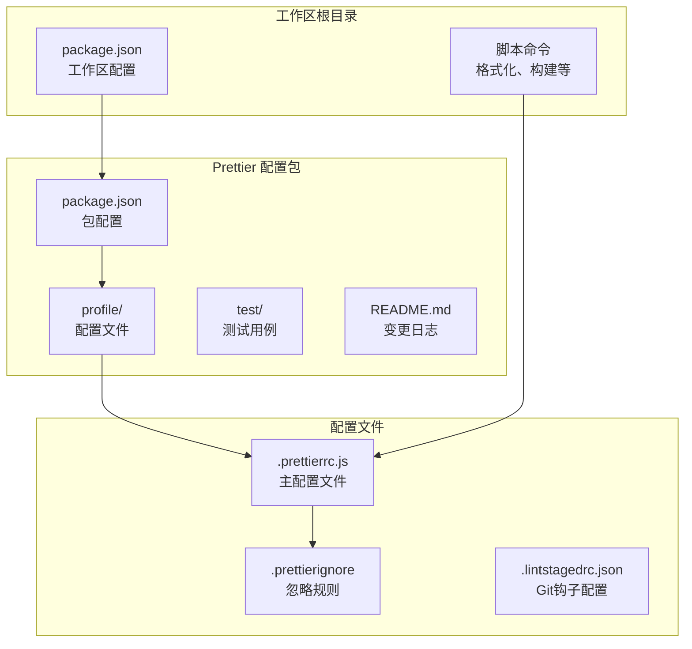
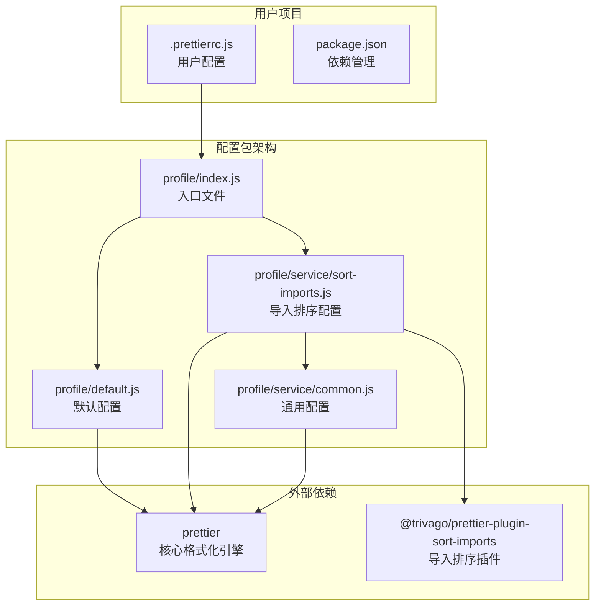
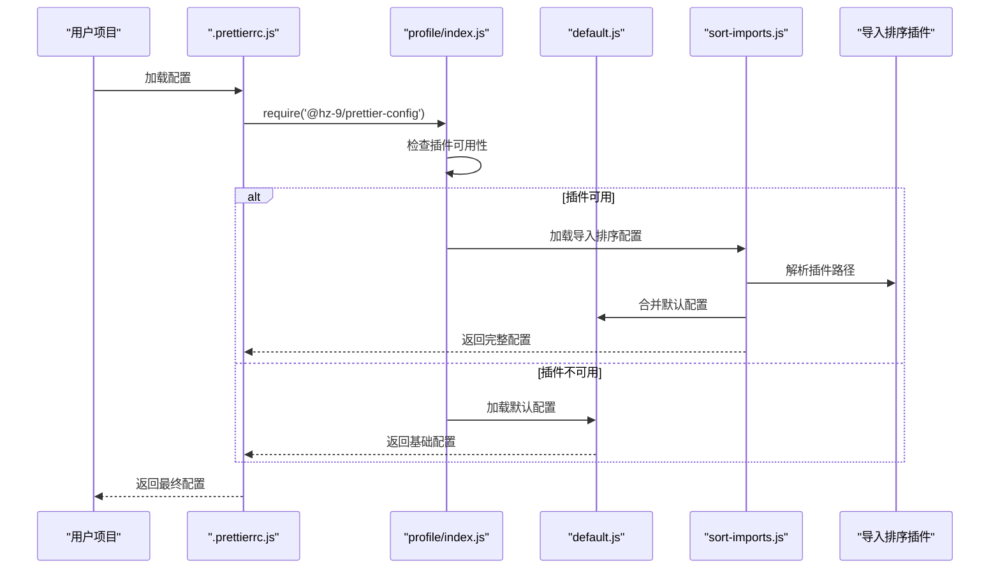
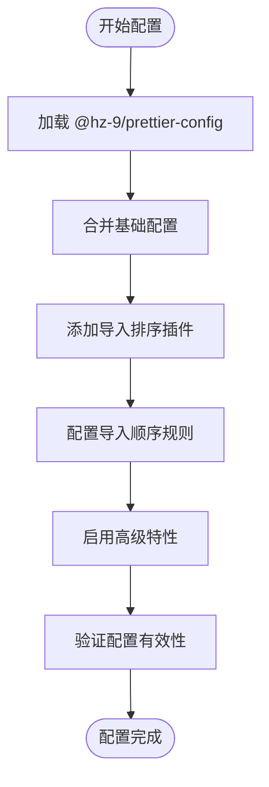
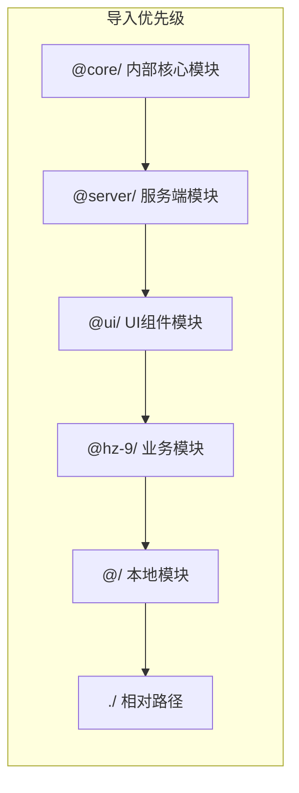
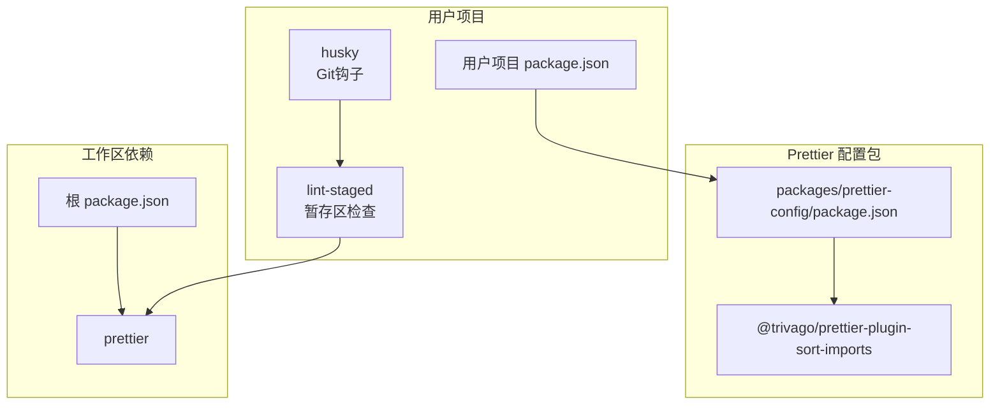

# Prettier 代码格式化配置包

<cite>
**本文档引用的文件**
- [packages/prettier-config/package.json](file://packages/prettier-config/package.json)
- [.prettierrc.js](file://.prettierrc.js)
- [.prettierignore](file://.prettierignore)
- [packages/prettier-config/profile/index.js](file://packages/prettier-config/profile/index.js)
- [packages/prettier-config/profile/default.js](file://packages/prettier-config/profile/default.js)
- [packages/prettier-config/profile/service/sort-imports.js](file://packages/prettier-config/profile/service/sort-imports.js)
- [packages/prettier-config/profile/service/common.js](file://packages/prettier-config/profile/service/common.js)
- [packages/prettier-config/README.md](file://packages/prettier-config/README.md)
- [packages/prettier-config/CHANGELOG.md](file://packages/prettier-config/CHANGELOG.md)
- [package.json](file://package.json)
- [README.md](file://README.md)
- [.lintstagedrc.json](file://.lintstagedrc.json)
</cite>

## 目录
1. [简介](#简介)
2. [项目结构](#项目结构)
3. [核心组件](#核心组件)
4. [架构概览](#架构概览)
5. [详细组件分析](#详细组件分析)
6. [依赖关系分析](#依赖关系分析)
7. [性能考虑](#性能考虑)
8. [故障排除指南](#故障排除指南)
9. [结论](#结论)
10. [附录](#附录)

## 简介

HZ 9 Prettier 代码格式化配置包是一个专为 JavaScript/TypeScript 项目设计的统一格式化解决方案。该包提供了标准化的代码格式化规则，确保团队代码风格的一致性，支持现代化的导入语句排序功能，并与编辑器插件无缝集成。

该配置包的核心设计理念是通过预设的格式化规则减少团队在代码风格上的分歧，提高代码质量和开发效率。它特别适用于采用 Nx 工作区的大型前端项目，能够处理复杂的导入语句组织和多语言文件格式化需求。

## 项目结构

该项目采用 Nx 工作区结构，Prettier 配置包位于 `packages/prettier-config` 目录下，具有清晰的模块化架构：



**图表来源**
- [packages/prettier-config/package.json:1-45](file://packages/prettier-config/package.json#L1-L45)
- [.prettierrc.js:1-15](file://.prettierrc.js#L1-L15)
- [.prettierignore:1-105](file://.prettierignore#L1-L105)

**章节来源**
- [packages/prettier-config/package.json:1-45](file://packages/prettier-config/package.json#L1-L45)
- [README.md:1-45](file://README.md#L1-L45)

## 核心组件

### 主要配置文件

Prettier 配置包的核心由三个主要配置文件组成：

#### 默认配置 (default.js)
提供基础的代码格式化规则，包括：
- **打印宽度**: 120 字符，支持注释的长代码行
- **行尾序列**: 统一使用 LF 换行符
- **引号策略**: 使用单引号而非双引号
- **尾随逗号**: ES5 兼容模式（函数参数不使用，数组使用）
- **箭头函数括号**: 始终添加括号
- **分号**: 不使用分号
- **HTML 敏感度**: 忽略空白敏感性
- **单属性换行**: 强制每个属性单独一行

#### 导入排序配置 (sort-imports.js)
基于 `@trivago/prettier-plugin-sort-imports` 插件的高级配置：
- **导入顺序**: 按 @core → @server → @ui → @hz-9 → @ → 相对路径 的优先级排序
- **分组分离**: 启用导入语句分组间的空行
- **命名空间分组**: 将命名空间导入语句分组处理
- **解析器插件**: 支持 TypeScript、类属性、装饰器语法

#### 共同配置 (common.js)
提供简化的基础配置，不包含导入排序功能。

**章节来源**
- [packages/prettier-config/profile/default.js:1-29](file://packages/prettier-config/profile/default.js#L1-L29)
- [packages/prettier-config/profile/service/sort-imports.js:1-36](file://packages/prettier-config/profile/service/sort-imports.js#L1-L36)
- [packages/prettier-config/profile/service/common.js:1-4](file://packages/prettier-config/profile/service/common.js#L1-L4)

## 架构概览

Prettier 配置包采用模块化设计，支持多种使用场景：



**图表来源**
- [packages/prettier-config/profile/index.js:1-30](file://packages/prettier-config/profile/index.js#L1-L30)
- [packages/prettier-config/profile/default.js:1-29](file://packages/prettier-config/profile/default.js#L1-L29)
- [packages/prettier-config/profile/service/sort-imports.js:1-36](file://packages/prettier-config/profile/service/sort-imports.js#L1-L36)

### 配置加载流程



**图表来源**
- [packages/prettier-config/profile/index.js:4-29](file://packages/prettier-config/profile/index.js#L4-L29)
- [.prettierrc.js:3-14](file://.prettierrc.js#L3-L14)

**章节来源**
- [packages/prettier-config/profile/index.js:1-30](file://packages/prettier-config/profile/index.js#L1-L30)
- [.prettierrc.js:1-15](file://.prettierrc.js#L1-L15)

## 详细组件分析

### 配置文件结构分析

#### 主配置文件 (.prettierrc.js)
用户项目中的主配置文件展示了完整的集成方式：



**图表来源**
- [.prettierrc.js:3-14](file://.prettierrc.js#L3-L14)

#### 配置选项详解

| 配置项 | 默认值 | 自定义值 | 说明 |
|--------|--------|----------|------|
| printWidth | 80 | 120 | 单行最大字符数，支持注释的长代码行 |
| endOfLine | lf | lf | 统一行尾序列，避免跨平台差异 |
| singleQuote | false | true | 使用单引号而非双引号 |
| trailingComma | none | es5 | ES5兼容的尾随逗号策略 |
| arrowParens | avoid | always | 箭头函数参数始终添加括号 |
| semi | true | false | 不使用分号结尾 |
| bracketSameLine | false | false | 大括号不与下一行对齐 |
| htmlWhitespaceSensitivity | css | ignore | HTML空白敏感度设置 |
| singleAttributePerLine | false | true | HTML属性强制每行一个 |

**章节来源**
- [packages/prettier-config/profile/default.js:1-29](file://packages/prettier-config/profile/default.js#L1-L29)
- [.prettierrc.js:8-14](file://.prettier.js#L8-L14)

### 导入排序功能

导入排序功能是该配置包的核心特色，通过 `@trivago/prettier-plugin-sort-imports` 实现：

#### 导入顺序规则


**图表来源**
- [packages/prettier-config/profile/service/sort-imports.js:25](file://packages/prettier-config/profile/service/sort-imports.js#L25)

#### 高级排序特性
- **命名空间分组**: 将命名空间导入语句按组处理
- **导入语句分离**: 在不同组之间添加空行
- **类型参数排序**: 对导入的类型参数进行字母序排序
- **解析器支持**: 支持 TypeScript、类属性、装饰器语法

**章节来源**
- [packages/prettier-config/profile/service/sort-imports.js:19-35](file://packages/prettier-config/profile/service/sort-imports.js#L19-L35)

## 依赖关系分析

### 包依赖图



**图表来源**
- [packages/prettier-config/package.json:32-37](file://packages/prettier-config/package.json#L32-L37)
- [package.json:24-29](file://package.json#L24-L29)

### 版本兼容性

该配置包确保与不同版本的 Prettier 和 Node.js 的兼容性：

| 组件 | 版本要求 | 节点版本 |
|------|----------|----------|
| Prettier | ^3.3.3 | >=18.15.0 <19.0.0<br/>或 >=20.9.0 <21.0.0 |
| Node.js | - | >=18.18.0 <19.0.0<br/>或 >=20.9.0 <21.0.0 |
| @trivago/prettier-plugin-sort-imports | ^4.3.0 | - |

**章节来源**
- [packages/prettier-config/package.json:35-40](file://packages/prettier-config/package.json#L35-L40)
- [package.json:33-35](file://package.json#L33-L35)

## 性能考虑

### 配置优化策略

1. **智能插件检测**: 自动检测导入排序插件的可用性，避免不必要的性能开销
2. **缓存机制**: 利用 Prettier 的内置缓存机制减少重复格式化
3. **增量格式化**: 结合 Git 钩子实现增量格式化，只处理修改的文件

### 性能监控指标

- **格式化速度**: 建议在大型项目中使用并行处理
- **内存使用**: 导入排序功能会增加内存使用量
- **CPU 利用率**: 复杂的导入排序操作可能影响 CPU 性能

## 故障排除指南

### 常见问题及解决方案

#### 1. 导入排序插件未安装
**问题**: 控制台显示需要安装 `@trivago/prettier-plugin-sort-imports`
**解决方案**: 
```bash
npm install @trivago/prettier-plugin-sort-imports --save-dev
```

#### 2. 配置加载失败
**问题**: Prettier 无法正确加载配置
**解决方案**: 
- 检查 `.prettierrc.js` 文件的语法
- 确认配置文件返回有效的对象
- 验证 Node.js 版本兼容性

#### 3. 格式化结果不符合预期
**问题**: 导入语句没有按预期顺序排列
**解决方案**:
- 检查导入路径是否符合正则表达式规则
- 验证导入语句的相对路径处理
- 确认命名空间导入语句的分组设置

### 调试技巧

1. **查看配置详情**: 使用 `prettier --debug-check` 查看实际应用的配置
2. **渐进式调试**: 从基础配置开始，逐步添加高级特性
3. **版本对比**: 比较不同版本配置包的行为差异

**章节来源**
- [packages/prettier-config/profile/service/sort-imports.js:8-17](file://packages/prettier-config/profile/service/sort-imports.js#L8-L17)

## 结论

HZ 9 Prettier 代码格式化配置包提供了一个完整、可扩展的代码格式化解决方案。其模块化设计允许用户根据需要选择不同的配置级别，从基础的代码格式化到高级的导入语句排序功能。

该配置包的主要优势包括：
- **一致性**: 确保团队代码风格的统一
- **可扩展性**: 支持多种配置组合和自定义选项
- **易用性**: 简单的安装和配置过程
- **兼容性**: 良好的版本兼容性和插件支持

通过合理使用该配置包，团队可以显著提高代码质量，减少代码审查中的格式化争议，并提升整体开发效率。

## 附录

### 安装和使用步骤

1. **安装配置包**:
```bash
npm install @hz-9/prettier-config --save-dev
```

2. **配置项目**:
```javascript
// .prettierrc.js
module.exports = {
  ...require('@hz-9/prettier-config'),
  // 可选：添加自定义配置
}
```

3. **运行格式化**:
```bash
npx prettier --write .
```

### 编辑器集成

#### VS Code 配置
1. 安装 Prettier 扩展
2. 在设置中启用 "Editor: Format On Save"
3. 设置默认格式化程序为 Prettier

#### WebStorm/IntelliJ 配置
1. 安装 Prettier 插件
2. 在 Settings → Tools → Actions on Save 中勾选 "Reformat code"
3. 配置 Prettier 作为代码格式化工具

### 团队协作最佳实践

1. **统一配置**: 在团队内推广使用相同的配置包版本
2. **CI/CD 集成**: 在持续集成中加入格式化检查步骤
3. **文档更新**: 定期更新团队的代码格式化规范文档
4. **培训计划**: 为新成员提供配置包使用的培训材料

**章节来源**
- [packages/prettier-config/README.md:17-39](file://packages/prettier-config/README.md#L17-L39)
- [packages/prettier-config/CHANGELOG.md:1-50](file://packages/prettier-config/CHANGELOG.md#L1-L50)