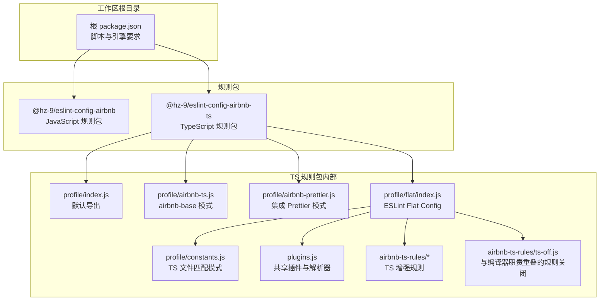
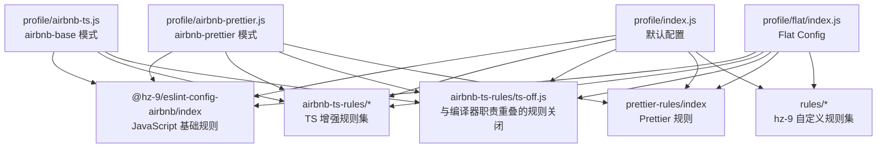
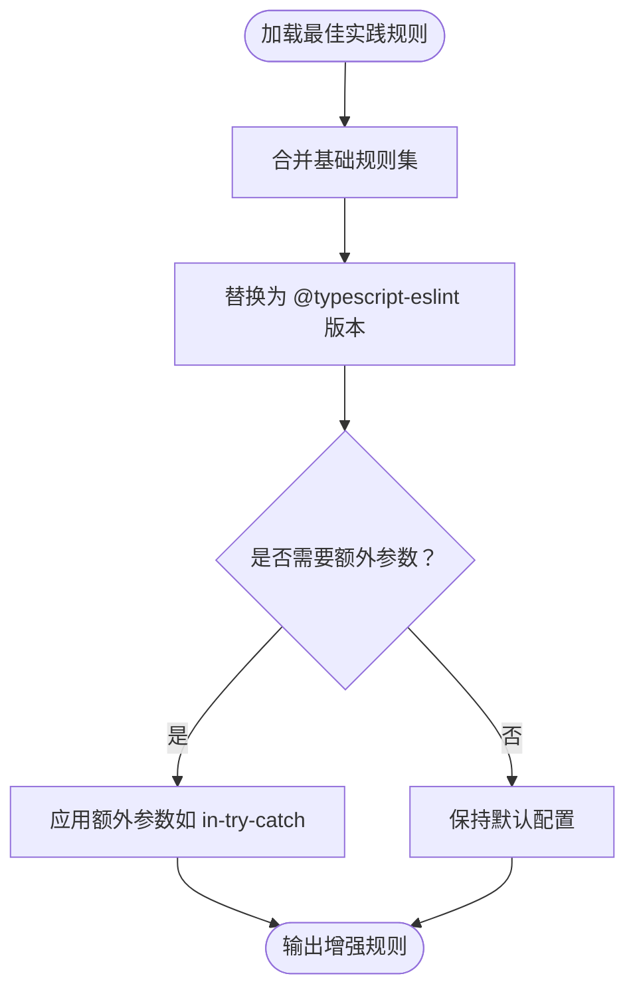
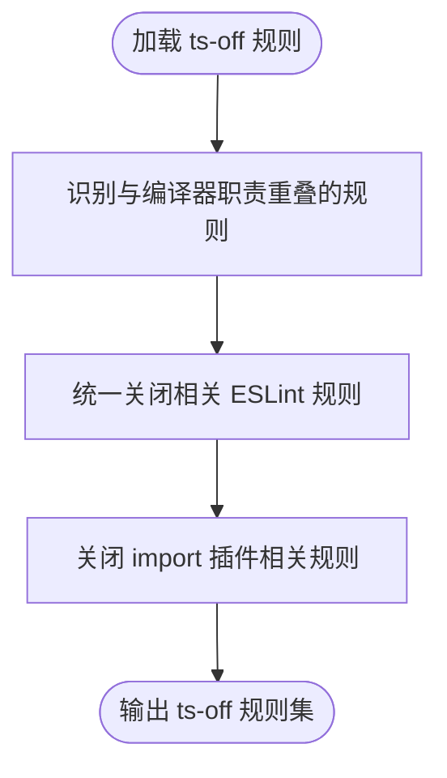
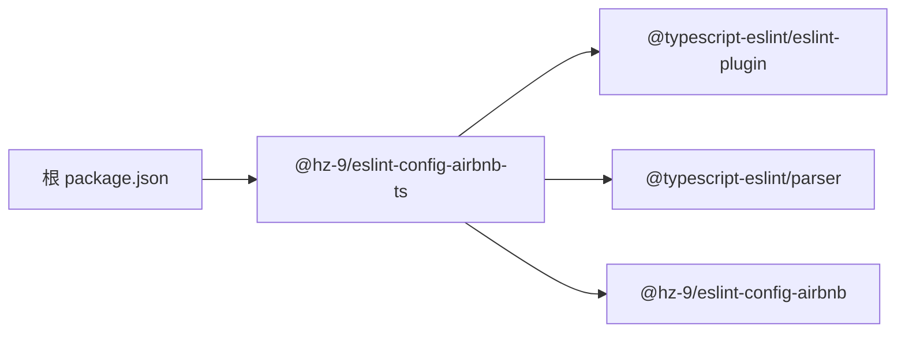

# TypeScript ESLint Airbnb 规则包

<cite>
**本文引用的文件**
- [packages/eslint-config-airbnb-ts/package.json](file://packages/eslint-config-airbnb-ts/package.json)
- [packages/eslint-config-airbnb-ts/src/index.js](file://packages/eslint-config-airbnb-ts/src/index.js)
- [packages/eslint-config-airbnb-ts/src/profile/index.js](file://packages/eslint-config-airbnb-ts/src/profile/index.js)
- [packages/eslint-config-airbnb-ts/src/profile/airbnb-ts.js](file://packages/eslint-config-airbnb-ts/src/profile/airbnb-ts.js)
- [packages/eslint-config-airbnb-ts/src/profile/airbnb-prettier.js](file://packages/eslint-config-airbnb-ts/src/profile/airbnb-prettier.js)
- [packages/eslint-config-airbnb-ts/src/profile/flat/index.js](file://packages/eslint-config-airbnb-ts/src/profile/flat/index.js)
- [packages/eslint-config-airbnb-ts/src/profile/constants.js](file://packages/eslint-config-airbnb-ts/src/profile/constants.js)
- [packages/eslint-config-airbnb-ts/src/plugins.js](file://packages/eslint-config-airbnb-ts/src/plugins.js)
- [packages/eslint-config-airbnb-ts/src/airbnb-ts-rules/best-practices.js](file://packages/eslint-config-airbnb-ts/src/airbnb-ts-rules/best-practices.js)
- [packages/eslint-config-airbnb-ts/src/airbnb-ts-rules/errors.js](file://packages/eslint-config-airbnb-ts/src/airbnb-ts-rules/errors.js)
- [packages/eslint-config-airbnb-ts/src/airbnb-ts-rules/ts-off.js](file://packages/eslint-config-airbnb-ts/src/airbnb-ts-rules/ts-off.js)
- [packages/eslint-config-airbnb/package.json](file://packages/eslint-config-airbnb/package.json)
- [package.json](file://package.json)
</cite>

## 目录
1. [简介](#简介)
2. [项目结构](#项目结构)
3. [核心组件](#核心组件)
4. [架构总览](#架构总览)
5. [详细组件分析](#详细组件分析)
6. [依赖关系分析](#依赖关系分析)
7. [性能考量](#性能考量)
8. [故障排查指南](#故障排查指南)
9. [结论](#结论)
10. [附录](#附录)

## 简介
本文件面向使用 TypeScript 的项目，系统性介绍 @hz-9/eslint-config-airbnb-ts 规则包的设计与用法。该包在标准 @hz-9/eslint-config-airbnb（JavaScript）之上，为 TypeScript 文件提供了增强的规则集与解析器配置，确保与 TypeScript 编译器的类型检查形成互补：既保留 Airbnb 风格的代码规范，又通过 @typescript-eslint 插件强化对泛型、重载、可选链等语言特性的检查，并对与编译器职责重叠或在 TS 中易误报的规则进行“关闭”处理。

## 项目结构
该仓库采用 Nx 工作区组织，核心包位于 packages/eslint-config-airbnb-ts，同时维护配套的 JavaScript 版本 @hz-9/eslint-config-airbnb。TypeScript 规则包通过 profile 导出多种配置形态（普通与 Flat Config），并通过 airbnb-ts-rules 与 prettier-rules 组合规则集。



图表来源
- [packages/eslint-config-airbnb-ts/src/profile/index.js:44-86](file://packages/eslint-config-airbnb-ts/src/profile/index.js#L44-L86)
- [packages/eslint-config-airbnb-ts/src/profile/airbnb-ts.js:3-34](file://packages/eslint-config-airbnb-ts/src/profile/airbnb-ts.js#L3-L34)
- [packages/eslint-config-airbnb-ts/src/profile/airbnb-prettier.js:3-36](file://packages/eslint-config-airbnb-ts/src/profile/airbnb-prettier.js#L3-L36)
- [packages/eslint-config-airbnb-ts/src/profile/flat/index.js:30-66](file://packages/eslint-config-airbnb-ts/src/profile/flat/index.js#L30-L66)
- [packages/eslint-config-airbnb-ts/src/profile/constants.js:1-3](file://packages/eslint-config-airbnb-ts/src/profile/constants.js#L1-L3)
- [packages/eslint-config-airbnb-ts/src/plugins.js:8-15](file://packages/eslint-config-airbnb-ts/src/plugins.js#L8-L15)

章节来源
- [packages/eslint-config-airbnb-ts/package.json:1-87](file://packages/eslint-config-airbnb-ts/package.json#L1-L87)
- [packages/eslint-config-airbnb/package.json:1-84](file://packages/eslint-config-airbnb/package.json#L1-L84)
- [package.json:1-38](file://package.json#L1-L38)

## 核心组件
- 默认配置 profile/index.js：在继承 JavaScript 基础规则的同时，仅对 TypeScript 文件（*.ts、*.tsx、*.cts、*.mts）启用 @typescript-eslint 插件与解析器，并叠加 TS 增强规则与 Prettier 规则。
- airbnb-ts 模式 profile/airbnb-ts.js：以 airbnb-base 为基础，按需引入 TS 增强规则，适合希望从基础 Airbnb 规范起步的项目。
- airbnb-prettier 模式 profile/airbnb-prettier.js：在 airbnb-prettier 基础上引入 TS 增强与 Prettier 规则，适合已使用 Prettier 的团队。
- Flat Config 支持 profile/flat/index.js：将所有规则拆分为 ESLint Flat Config 数组条目，统一注入插件、解析器与各规则集，便于现代 ESLint 使用方式。
- 常量与插件 profile/constants.js 与 plugins.js：集中管理 TS 文件匹配模式与共享插件实例（@typescript-eslint/eslint-plugin 与 @typescript-eslint/parser），提升复用性与一致性。

章节来源
- [packages/eslint-config-airbnb-ts/src/profile/index.js:44-86](file://packages/eslint-config-airbnb-ts/src/profile/index.js#L44-L86)
- [packages/eslint-config-airbnb-ts/src/profile/airbnb-ts.js:3-34](file://packages/eslint-config-airbnb-ts/src/profile/airbnb-ts.js#L3-L34)
- [packages/eslint-config-airbnb-ts/src/profile/airbnb-prettier.js:3-36](file://packages/eslint-config-airbnb-ts/src/profile/airbnb-prettier.js#L3-L36)
- [packages/eslint-config-airbnb-ts/src/profile/flat/index.js:30-66](file://packages/eslint-config-airbnb-ts/src/profile/flat/index.js#L30-L66)
- [packages/eslint-config-airbnb-ts/src/profile/constants.js:1-3](file://packages/eslint-config-airbnb-ts/src/profile/constants.js#L1-L3)
- [packages/eslint-config-airbnb-ts/src/plugins.js:8-15](file://packages/eslint-config-airbnb-ts/src/plugins.js#L8-L15)

## 架构总览
下图展示 TypeScript 规则包如何在不同配置模式下组合基础规则与 TS 增强规则，并通过 Flat Config 形式输出：



图表来源
- [packages/eslint-config-airbnb-ts/src/profile/index.js:52-83](file://packages/eslint-config-airbnb-ts/src/profile/index.js#L52-L83)
- [packages/eslint-config-airbnb-ts/src/profile/airbnb-ts.js:11-31](file://packages/eslint-config-airbnb-ts/src/profile/airbnb-ts.js#L11-L31)
- [packages/eslint-config-airbnb-ts/src/profile/airbnb-prettier.js:11-33](file://packages/eslint-config-airbnb-ts/src/profile/airbnb-prettier.js#L11-L33)
- [packages/eslint-config-airbnb-ts/src/profile/flat/index.js:30-66](file://packages/eslint-config-airbnb-ts/src/profile/flat/index.js#L30-L66)

## 详细组件分析

### 配置模式与差异
- 默认模式（profile/index.js）
  - 在全局启用 import 插件，对 TypeScript 文件（TS_FILES_GLOB）追加 @typescript-eslint 插件与解析器，并扩展 TS 增强规则、ts-off 关闭规则以及 Prettier 规则。
  - 适合大多数 TypeScript 项目，兼顾 Airbnb 风格与 TS 能力。
- airbnb-base 模式（profile/airbnb-ts.js）
  - 以 @hz-9/eslint-config-airbnb/airbnb-base 为基础，仅在 TS 文件中启用 TS 增强规则与 ts-off 关闭规则。
  - 适合希望从基础 Airbnb 规范起步的团队。
- airbnb-prettier 模式（profile/airbnb-prettier.js）
  - 在 airbnb-prettier 基础上引入 TS 增强与 Prettier 规则，适合已使用 Prettier 的团队。
- Flat Config（profile/flat/index.js）
  - 将基础规则与 TS 规则集拆分为数组条目，统一注入插件与解析器，支持现代 ESLint 使用方式。

章节来源
- [packages/eslint-config-airbnb-ts/src/profile/index.js:44-86](file://packages/eslint-config-airbnb-ts/src/profile/index.js#L44-L86)
- [packages/eslint-config-airbnb-ts/src/profile/airbnb-ts.js:3-34](file://packages/eslint-config-airbnb-ts/src/profile/airbnb-ts.js#L3-L34)
- [packages/eslint-config-airbnb-ts/src/profile/airbnb-prettier.js:3-36](file://packages/eslint-config-airbnb-ts/src/profile/airbnb-prettier.js#L3-L36)
- [packages/eslint-config-airbnb-ts/src/profile/flat/index.js:30-66](file://packages/eslint-config-airbnb-ts/src/profile/flat/index.js#L30-L66)

### TypeScript 特有规则增强（以“最佳实践”为例）
- 替换原生规则为 @typescript-eslint 版本，以获得更精准的类型感知检查，例如 default-param-last、dot-notation、no-empty-function、no-implied-eval、no-loop-func、no-magic-numbers、no-redeclare、no-unused-expressions、require-await、return-await 等。
- 对部分规则提供额外参数（如 return-await 的特定场景），以平衡类型安全与实际需求。



图表来源
- [packages/eslint-config-airbnb-ts/src/airbnb-ts-rules/best-practices.js:8-58](file://packages/eslint-config-airbnb-ts/src/airbnb-ts-rules/best-practices.js#L8-L58)

章节来源
- [packages/eslint-config-airbnb-ts/src/airbnb-ts-rules/best-practices.js:4-59](file://packages/eslint-config-airbnb-ts/src/airbnb-ts-rules/best-practices.js#L4-L59)

### 与编译器职责重叠的规则关闭（ts-off）
- 针对构造函数中的 super 调用、getter 返回值、const 再赋值、重复参数/键名、函数再赋值、导入再赋值、Symbol/new、对象调用、setter 返回值、this/super 使用顺序、未声明变量、不可达代码、位运算优先级、typeof 合法性等规则，在 TS 环境中由编译器更严格地检查，因此在 ts-off 中统一关闭。
- 同时，对 import 插件的部分规则（named、no-named-as-default-member、no-unresolved）也进行关闭，避免与 TS 类型检查冲突或误报。



图表来源
- [packages/eslint-config-airbnb-ts/src/airbnb-ts-rules/ts-off.js:1-84](file://packages/eslint-config-airbnb-ts/src/airbnb-ts-rules/ts-off.js#L1-L84)

章节来源
- [packages/eslint-config-airbnb-ts/src/airbnb-ts-rules/ts-off.js:1-84](file://packages/eslint-config-airbnb-ts/src/airbnb-ts-rules/ts-off.js#L1-L84)

### Flat Config 的模块化装配
- 将基础规则与 TS 规则集分别引入，按文件范围（TS_FILES_GLOB）注入插件（import、@typescript-eslint）与解析器（@typescript-eslint/parser）。
- 通过 languageOptions 设置 ecmaVersion 与 sourceType，确保 TS 文件的语法与模块行为正确。

```mermaid
sequenceDiagram
participant Cfg as "Flat Config"
participant Base as "基础规则集"
participant TS as "TS 规则集"
participant Off as "ts-off 关闭规则"
participant P as "Prettier 规则"
Cfg->>Base : 引入基础规则
Cfg->>TS : 引入 TS 增强规则
Cfg->>Off : 引入 ts-off 关闭规则
Cfg->>P : 引入 Prettier 规则
Cfg->>Cfg : 注入插件与解析器
Cfg->>Cfg : 设置 languageOptions
Cfg-->>Cfg : 输出最终配置数组
```

图表来源
- [packages/eslint-config-airbnb-ts/src/profile/flat/index.js:30-66](file://packages/eslint-config-airbnb-ts/src/profile/flat/index.js#L30-L66)

章节来源
- [packages/eslint-config-airbnb-ts/src/profile/flat/index.js:30-66](file://packages/eslint-config-airbnb-ts/src/profile/flat/index.js#L30-L66)

## 依赖关系分析
- 运行时依赖
  - @typescript-eslint/eslint-plugin 与 @typescript-eslint/parser：为 TS 文件提供解析与规则能力。
  - @hz-9/eslint-config-airbnb：作为 JS 基础规则来源，被 TS 规则包继承。
- peerDependencies
  - eslint 与 typescript：明确 ESLint 与 TS 版本范围，确保兼容性。
- 工作区依赖
  - 根 package.json 与工作区脚本表明该包在 Nx 工作区中构建与发布。



图表来源
- [packages/eslint-config-airbnb-ts/package.json:66-78](file://packages/eslint-config-airbnb-ts/package.json#L66-L78)
- [packages/eslint-config-airbnb/package.json:65-75](file://packages/eslint-config-airbnb/package.json#L65-L75)
- [package.json:17-32](file://package.json#L17-L32)

章节来源
- [packages/eslint-config-airbnb-ts/package.json:66-78](file://packages/eslint-config-airbnb-ts/package.json#L66-L78)
- [packages/eslint-config-airbnb/package.json:65-75](file://packages/eslint-config-airbnb/package.json#L65-L75)
- [package.json:17-32](file://package.json#L17-L32)

## 性能考量
- 规则覆盖范围控制：通过 TS_FILES_GLOB 精准限定 TS 文件，避免对 JS/TSX 文件重复应用 TS 解析器与规则，降低 ESLint 扫描成本。
- 插件与解析器复用：在 Flat Config 中集中导出共享插件实例与解析器，减少重复初始化开销。
- 规则关闭策略：对与编译器职责重叠的规则进行关闭，减少不必要的检查与误报，提高整体性能与开发体验。

章节来源
- [packages/eslint-config-airbnb-ts/src/profile/constants.js:1-3](file://packages/eslint-config-airbnb-ts/src/profile/constants.js#L1-L3)
- [packages/eslint-config-airbnb-ts/src/plugins.js:8-15](file://packages/eslint-config-airbnb-ts/src/plugins.js#L8-L15)
- [packages/eslint-config-airbnb-ts/src/airbnb-ts-rules/ts-off.js:1-84](file://packages/eslint-config-airbnb-ts/src/airbnb-ts-rules/ts-off.js#L1-L84)

## 故障排查指南
- 与编译器职责重叠的规则误报
  - 症状：ESLint 报告与 TS 编译器一致的问题（如重复参数、const 再赋值、super 使用顺序等）。
  - 处理：确认已启用 ts-off 规则集，这些规则已在 TS 文件中关闭。
  - 参考路径：[packages/eslint-config-airbnb-ts/src/airbnb-ts-rules/ts-off.js:1-84](file://packages/eslint-config-airbnb-ts/src/airbnb-ts-rules/ts-off.js#L1-L84)
- import 插件相关规则报错
  - 症状：named、no-named-as-default-member、no-unresolved 等规则在 TS 项目中频繁误报。
  - 处理：确认已启用 ts-off 或相应 airbnb-* 模式配置，这些规则已被关闭。
  - 参考路径：[packages/eslint-config-airbnb-ts/src/airbnb-ts-rules/ts-off.js:70-83](file://packages/eslint-config-airbnb-ts/src/airbnb-ts-rules/ts-off.js#L70-L83)
- Flat Config 插件与解析器未生效
  - 症状：ESLint 无法识别 TS 语法或 @typescript-eslint 规则。
  - 处理：确认 Flat Config 中已注入 plugins 与 tsParser，并按文件范围（TS_FILES_GLOB）应用。
  - 参考路径：[packages/eslint-config-airbnb-ts/src/profile/flat/index.js:30-43](file://packages/eslint-config-airbnb-ts/src/profile/flat/index.js#L30-L43)
- 版本不兼容
  - 症状：ESLint 或 TypeScript 版本超出 peerDependencies 范围导致运行异常。
  - 处理：根据 peerDependencies 要求安装兼容版本。
  - 参考路径：[packages/eslint-config-airbnb-ts/package.json:76-78](file://packages/eslint-config-airbnb-ts/package.json#L76-L78)

章节来源
- [packages/eslint-config-airbnb-ts/src/airbnb-ts-rules/ts-off.js:1-84](file://packages/eslint-config-airbnb-ts/src/airbnb-ts-rules/ts-off.js#L1-L84)
- [packages/eslint-config-airbnb-ts/src/profile/flat/index.js:30-43](file://packages/eslint-config-airbnb-ts/src/profile/flat/index.js#L30-L43)
- [packages/eslint-config-airbnb-ts/package.json:76-78](file://packages/eslint-config-airbnb-ts/package.json#L76-L78)

## 结论
@hz-9/eslint-config-airbnb-ts 在保留 Airbnb 风格规范的同时，通过 @typescript-eslint 插件与解析器强化了对 TypeScript 语言特性的检查，并对与编译器职责重叠的规则进行关闭，显著降低了误报与重复检查的成本。其提供的多种配置模式（默认、airbnb-base、airbnb-prettier 与 Flat Config）满足不同团队与工具链的需求。建议在 TypeScript 项目中优先采用该包，并结合 ts-off 规则集与 Flat Config 以获得更佳的开发体验与性能表现。

## 附录

### 完整配置示例与迁移指南
- 选择配置模式
  - 默认模式：适用于大多数 TS 项目，直接继承 JS 基础规则并在 TS 文件中启用 TS 增强与 Prettier 规则。
    - 参考路径：[packages/eslint-config-airbnb-ts/src/profile/index.js:44-86](file://packages/eslint-config-airbnb-ts/src/profile/index.js#L44-L86)
  - airbnb-base 模式：从 airbnb-base 出发，按需引入 TS 增强规则。
    - 参考路径：[packages/eslint-config-airbnb-ts/src/profile/airbnb-ts.js:3-34](file://packages/eslint-config-airbnb-ts/src/profile/airbnb-ts.js#L3-L34)
  - airbnb-prettier 模式：在 airbnb-prettier 基础上引入 TS 增强与 Prettier 规则。
    - 参考路径：[packages/eslint-config-airbnb-ts/src/profile/airbnb-prettier.js:3-36](file://packages/eslint-config-airbnb-ts/src/profile/airbnb-prettier.js#L3-L36)
  - Flat Config：将规则拆分为数组条目，统一注入插件与解析器。
    - 参考路径：[packages/eslint-config-airbnb-ts/src/profile/flat/index.js:30-66](file://packages/eslint-config-airbnb-ts/src/profile/flat/index.js#L30-L66)
- 迁移步骤
  - 升级 ESLint 与 TypeScript 到 peerDependencies 要求的版本范围。
    - 参考路径：[packages/eslint-config-airbnb-ts/package.json:76-78](file://packages/eslint-config-airbnb-ts/package.json#L76-L78)
  - 在项目根目录的 ESLint 配置中选择上述任一模式并启用对应 profile。
  - 若使用 Flat Config，确保按文件范围（TS_FILES_GLOB）应用插件与解析器。
    - 参考路径：[packages/eslint-config-airbnb-ts/src/profile/flat/index.js:30-43](file://packages/eslint-config-airbnb-ts/src/profile/flat/index.js#L30-L43)
  - 如需与 Prettier 协同，选择 airbnb-prettier 模式并确保 Prettier 规则已启用。
    - 参考路径：[packages/eslint-config-airbnb-ts/src/profile/airbnb-prettier.js:11-33](file://packages/eslint-config-airbnb-ts/src/profile/airbnb-prettier.js#L11-L33)

章节来源
- [packages/eslint-config-airbnb-ts/src/profile/index.js:44-86](file://packages/eslint-config-airbnb-ts/src/profile/index.js#L44-L86)
- [packages/eslint-config-airbnb-ts/src/profile/airbnb-ts.js:3-34](file://packages/eslint-config-airbnb-ts/src/profile/airbnb-ts.js#L3-L34)
- [packages/eslint-config-airbnb-ts/src/profile/airbnb-prettier.js:3-36](file://packages/eslint-config-airbnb-ts/src/profile/airbnb-prettier.js#L3-L36)
- [packages/eslint-config-airbnb-ts/src/profile/flat/index.js:30-66](file://packages/eslint-config-airbnb-ts/src/profile/flat/index.js#L30-L66)
- [packages/eslint-config-airbnb-ts/package.json:76-78](file://packages/eslint-config-airbnb-ts/package.json#L76-L78)