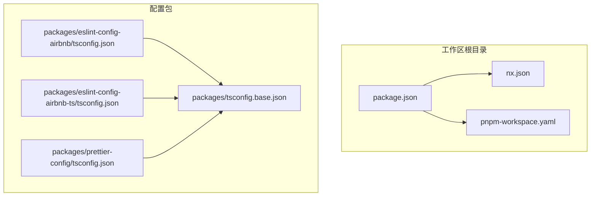
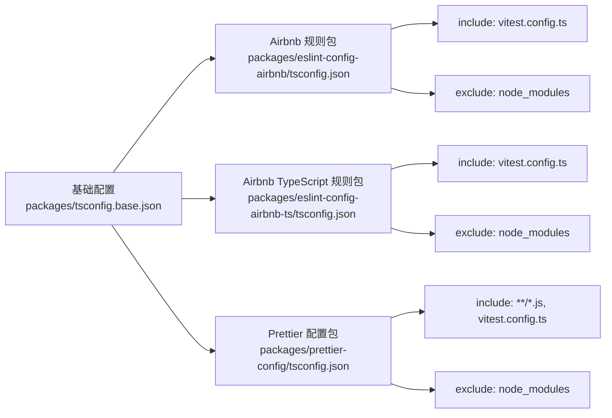
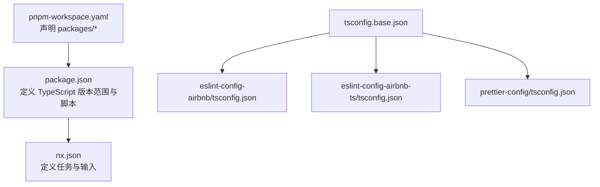

# TypeScript 基础配置

<cite>
**本文引用的文件**
- [packages/tsconfig.base.json](file://packages/tsconfig.base.json)
- [packages/eslint-config-airbnb/tsconfig.json](file://packages/eslint-config-airbnb/tsconfig.json)
- [packages/eslint-config-airbnb-ts/tsconfig.json](file://packages/eslint-config-airbnb-ts/tsconfig.json)
- [packages/prettier-config/tsconfig.json](file://packages/prettier-config/tsconfig.json)
- [package.json](file://package.json)
- [nx.json](file://nx.json)
- [pnpm-workspace.yaml](file://pnpm-workspace.yaml)
</cite>

## 目录
1. [简介](#简介)
2. [项目结构](#项目结构)
3. [核心组件](#核心组件)
4. [架构总览](#架构总览)
5. [详细组件分析](#详细组件分析)
6. [依赖分析](#依赖分析)
7. [性能考虑](#性能考虑)
8. [故障排查指南](#故障排查指南)
9. [结论](#结论)
10. [附录](#附录)

## 简介
本文件面向需要在多项目中复用统一 TypeScript 基础配置的团队与个人，系统性阐述基础 tsconfig 的结构、配置项作用与继承机制，并提供在不同项目中的复用方式、覆盖策略与最佳实践。同时给出常见编译问题的定位思路与性能优化建议，帮助你在保证类型安全的同时提升开发效率。

## 项目结构
该仓库采用 Nx 工作区组织多个工具包，其中基础 TypeScript 配置集中于 packages/tsconfig.base.json；各子包（如 ESLint/Airbnb、ESLint/Airbnb TypeScript、Prettier）通过 extends 继承该基础配置，并按需进行 include/exclude 覆盖。

图表来源
- [packages/tsconfig.base.json:1-13](file://packages/tsconfig.base.json#L1-L13)
- [packages/eslint-config-airbnb/tsconfig.json:1-6](file://packages/eslint-config-airbnb/tsconfig.json#L1-L6)
- [packages/eslint-config-airbnb-ts/tsconfig.json:1-6](file://packages/eslint-config-airbnb-ts/tsconfig.json#L1-L6)
- [packages/prettier-config/tsconfig.json:1-6](file://packages/prettier-config/tsconfig.json#L1-L6)
- [package.json:1-38](file://package.json#L1-L38)
- [nx.json:1-20](file://nx.json#L1-L20)
- [pnpm-workspace.yaml:1-6](file://pnpm-workspace.yaml#L1-L6)

章节来源
- [package.json:1-38](file://package.json#L1-L38)
- [nx.json:1-20](file://nx.json#L1-L20)
- [pnpm-workspace.yaml:1-6](file://pnpm-workspace.yaml#L1-L6)

## 核心组件
- 基础 tsconfig：定义所有子包共享的基础编译选项，确保一致的编译行为与类型检查策略。
- 子包 tsconfig：通过 extends 引入基础配置，并针对自身文件范围进行 include/exclude 调整。
- 工作区配置：Nx 与 pnpm workspace 定义了构建、测试、格式化等任务与包发现规则。

章节来源
- [packages/tsconfig.base.json:1-13](file://packages/tsconfig.base.json#L1-L13)
- [packages/eslint-config-airbnb/tsconfig.json:1-6](file://packages/eslint-config-airbnb/tsconfig.json#L1-L6)
- [packages/eslint-config-airbnb-ts/tsconfig.json:1-6](file://packages/eslint-config-airbnb-ts/tsconfig.json#L1-L6)
- [packages/prettier-config/tsconfig.json:1-6](file://packages/prettier-config/tsconfig.json#L1-L6)
- [package.json:1-38](file://package.json#L1-L38)
- [nx.json:1-20](file://nx.json#L1-L20)
- [pnpm-workspace.yaml:1-6](file://pnpm-workspace.yaml#L1-L6)

## 架构总览
下图展示了基础配置与各子包之间的继承关系及典型 include/exclude 范围：

图表来源
- [packages/tsconfig.base.json:1-13](file://packages/tsconfig.base.json#L1-L13)
- [packages/eslint-config-airbnb/tsconfig.json:1-6](file://packages/eslint-config-airbnb/tsconfig.json#L1-L6)
- [packages/eslint-config-airbnb-ts/tsconfig.json:1-6](file://packages/eslint-config-airbnb-ts/tsconfig.json#L1-L6)
- [packages/prettier-config/tsconfig.json:1-6](file://packages/prettier-config/tsconfig.json#L1-L6)

## 详细组件分析

### 基础 tsconfig 结构与继承机制
- 继承入口：各子包的 tsconfig 使用 extends 指向基础配置，确保默认编译行为一致。
- include/exclude：子包可按需限定参与编译的文件集合，避免无关文件进入编译流程。
- 典型场景：
  - 仅需 TypeScript 的包（如 Airbnb TypeScript 规则包）：include 可聚焦到测试配置文件，exclude 忽略 node_modules。
  - 同时支持 JS 的包（如 Prettier 配置包）：include 可包含 js 与配置文件，exclude 同样忽略 node_modules。

章节来源
- [packages/tsconfig.base.json:1-13](file://packages/tsconfig.base.json#L1-L13)
- [packages/eslint-config-airbnb/tsconfig.json:1-6](file://packages/eslint-config-airbnb/tsconfig.json#L1-L6)
- [packages/eslint-config-airbnb-ts/tsconfig.json:1-6](file://packages/eslint-config-airbnb-ts/tsconfig.json#L1-L6)
- [packages/prettier-config/tsconfig.json:1-6](file://packages/prettier-config/tsconfig.json#L1-L6)

### 在不同项目中复用基础配置
- 复用方式：在目标项目的 tsconfig 中添加 extends 指向基础配置路径。
- 范围控制：根据项目实际需要设置 include/exclude，避免引入不必要文件。
- 版本对齐：确保 TypeScript 版本满足基础配置要求，避免因版本差异导致的编译异常。

章节来源
- [packages/tsconfig.base.json:1-13](file://packages/tsconfig.base.json#L1-L13)
- [package.json:30-30](file://package.json#L30-L30)

### 关键编译选项的作用与影响范围
以下选项来自基础配置，建议结合项目实际评估其影响：
- target：指定输出目标语言版本，影响生成代码的兼容性与特性使用。
- module/moduleResolution：决定模块解析策略与打包器适配，影响依赖解析与运行时行为。
- allowJs/checkJs：允许混编 JS 并选择是否进行类型检查，适合渐进式迁移或混合项目。
- esModuleInterop：改善 CommonJS 与 ES 模块互操作，减少运行时导入差异带来的问题。
- skipLibCheck：跳过库文件的类型检查，显著降低编译时间，但可能掩盖潜在类型问题。
- strict：全局严格模式开关，建议在需要强约束的项目中开启，以提升类型安全性。

章节来源
- [packages/tsconfig.base.json:3-10](file://packages/tsconfig.base.json#L3-L10)

### 项目特定配置的覆盖方法与扩展策略
- 局部覆盖：在子包 tsconfig 中通过 include/exclude 精准控制文件范围，避免全量扫描。
- 扩展策略：若需额外编译选项，可在子包 tsconfig 中追加 compilerOptions，实现“在基础之上增强”的效果。
- 最佳实践：
  - 将变更集中在基础配置，子包尽量只做 include/exclude 的微调。
  - 对大型项目启用 skipLibCheck 以提升编译速度，同时在 CI 中保留严格模式进行深度校验。
  - 明确区分 JS/TS 文件处理策略，避免混编带来的歧义。

章节来源
- [packages/eslint-config-airbnb/tsconfig.json:1-6](file://packages/eslint-config-airbnb/tsconfig.json#L1-L6)
- [packages/eslint-config-airbnb-ts/tsconfig.json:1-6](file://packages/eslint-config-airbnb-ts/tsconfig.json#L1-L6)
- [packages/prettier-config/tsconfig.json:1-6](file://packages/prettier-config/tsconfig.json#L1-L6)
- [packages/tsconfig.base.json:1-13](file://packages/tsconfig.base.json#L1-L13)

### 常见编译问题与定位思路
- 类型检查缓慢：确认是否启用了 skipLibCheck；在 CI 中可临时关闭以获得更全面的检查。
- 模块解析失败：核对 module 与 moduleResolution 设置是否匹配当前打包器与运行环境。
- 混合项目报错：合理设置 allowJs 与 checkJs，明确哪些 JS 文件需要类型检查。
- 运行时导入差异：启用 esModuleInterop 以减少 CommonJS 与 ES 模块间的互操作问题。
- include/exclude 不生效：检查子包 tsconfig 的 include/exclude 是否覆盖了基础配置的设定。

章节来源
- [packages/tsconfig.base.json:3-10](file://packages/tsconfig.base.json#L3-L10)
- [packages/eslint-config-airbnb/tsconfig.json:1-6](file://packages/eslint-config-airbnb/tsconfig.json#L1-L6)
- [packages/eslint-config-airbnb-ts/tsconfig.json:1-6](file://packages/eslint-config-airbnb-ts/tsconfig.json#L1-L6)
- [packages/prettier-config/tsconfig.json:1-6](file://packages/prettier-config/tsconfig.json#L1-L6)

## 依赖分析
- 包管理与工作区：pnpm workspace 定义了 packages/* 的包发现规则；package.json 指定 TypeScript 版本范围与工作区脚本。
- Nx 任务与输入：nx.json 定义了 build、lint 等任务的输入与依赖关系，有助于缓存与增量构建。

图表来源
- [pnpm-workspace.yaml:1-6](file://pnpm-workspace.yaml#L1-L6)
- [package.json:1-38](file://package.json#L1-L38)
- [nx.json:1-20](file://nx.json#L1-L20)
- [packages/tsconfig.base.json:1-13](file://packages/tsconfig.base.json#L1-L13)
- [packages/eslint-config-airbnb/tsconfig.json:1-6](file://packages/eslint-config-airbnb/tsconfig.json#L1-L6)
- [packages/eslint-config-airbnb-ts/tsconfig.json:1-6](file://packages/eslint-config-airbnb-ts/tsconfig.json#L1-L6)
- [packages/prettier-config/tsconfig.json:1-6](file://packages/prettier-config/tsconfig.json#L1-L6)

章节来源
- [pnpm-workspace.yaml:1-6](file://pnpm-workspace.yaml#L1-L6)
- [package.json:1-38](file://package.json#L1-L38)
- [nx.json:1-20](file://nx.json#L1-L20)

## 性能考虑
- 启用 skipLibCheck：显著降低编译时间，适用于大多数前端与工具类项目。
- 精准 include/exclude：避免扫描 node_modules 与无关文件，缩短编译路径。
- 严格模式权衡：在本地开发可适度放宽，在 CI 中启用更严格的类型检查以保障质量。
- TypeScript 版本锁定：遵循工作区的版本范围，避免因版本差异导致的性能与兼容性问题。

章节来源
- [packages/tsconfig.base.json:9-10](file://packages/tsconfig.base.json#L9-L10)
- [packages/eslint-config-airbnb/tsconfig.json:4-5](file://packages/eslint-config-airbnb/tsconfig.json#L4-L5)
- [packages/eslint-config-airbnb-ts/tsconfig.json:4-5](file://packages/eslint-config-airbnb-ts/tsconfig.json#L4-L5)
- [packages/prettier-config/tsconfig.json:4-5](file://packages/prettier-config/tsconfig.json#L4-L5)
- [package.json:30-30](file://package.json#L30-L30)

## 故障排查指南
- 编译缓慢：优先检查是否启用了 skipLibCheck；确认 include/exclude 是否过于宽泛。
- 类型错误集中在第三方库：确认是否已启用 skipLibCheck；如需更严格检查，可在 CI 中临时关闭该选项。
- 模块解析异常：核对 module 与 moduleResolution 设置，确保与打包器与运行环境一致。
- 混合项目类型检查异常：合理设置 allowJs 与 checkJs，明确混编策略。
- include/exclude 生效顺序：确认子包 tsconfig 的 include/exclude 是否覆盖了基础配置。

章节来源
- [packages/tsconfig.base.json:3-10](file://packages/tsconfig.base.json#L3-L10)
- [packages/eslint-config-airbnb/tsconfig.json:1-6](file://packages/eslint-config-airbnb/tsconfig.json#L1-L6)
- [packages/eslint-config-airbnb-ts/tsconfig.json:1-6](file://packages/eslint-config-airbnb-ts/tsconfig.json#L1-L6)
- [packages/prettier-config/tsconfig.json:1-6](file://packages/prettier-config/tsconfig.json#L1-L6)

## 结论
通过统一的基础 tsconfig 与清晰的继承/覆盖策略，可以在多项目间保持一致的编译行为与类型安全水平。建议在日常开发中启用 skipLibCheck 提升性能，同时在 CI 中强化类型检查；在子包中仅做必要的 include/exclude 微调，避免过度复杂的配置叠加。

## 附录
- 在新项目中复用基础配置的步骤概要：
  1) 创建 tsconfig 并添加 extends 指向基础配置。
  2) 根据项目范围设置 include/exclude。
  3) 如需增强选项，在子包 tsconfig 中追加 compilerOptions。
  4) 在本地与 CI 中分别平衡性能与严格性。