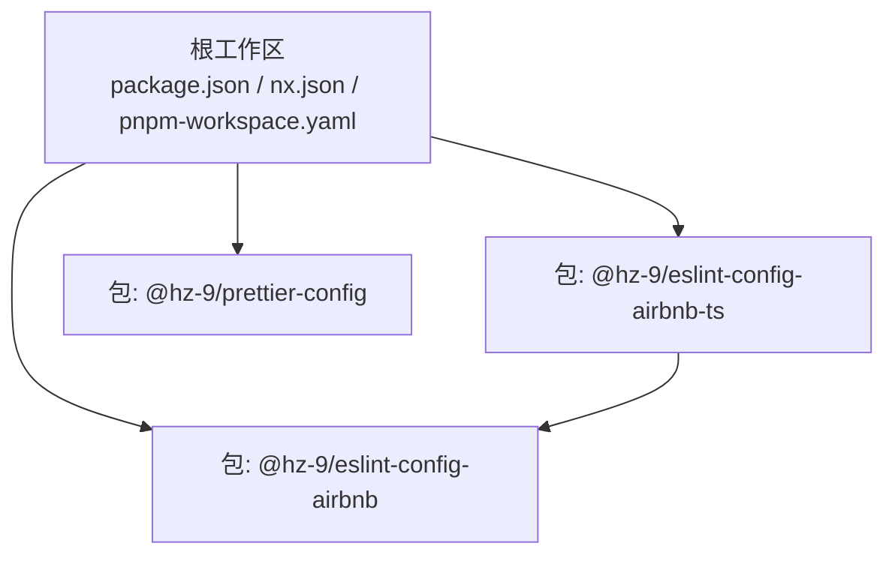
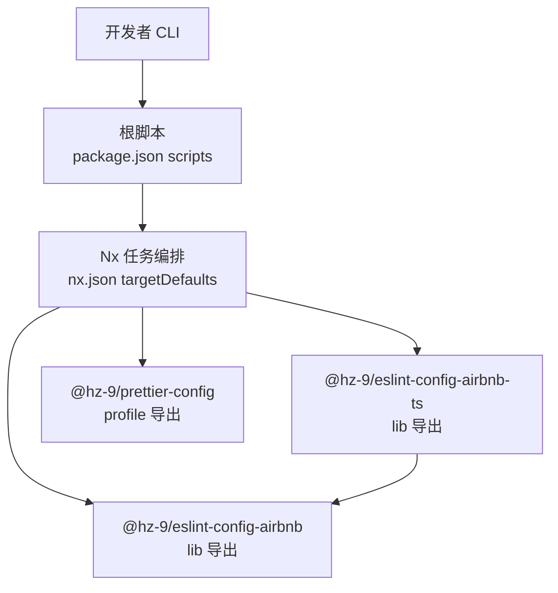
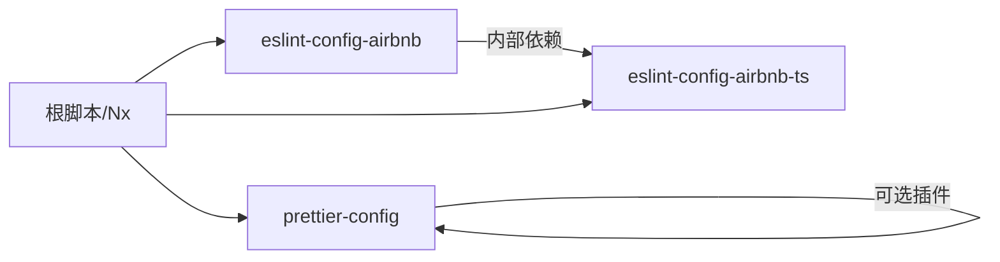

# 核心包

<cite>
**本文引用的文件**
- [package.json](file://package.json)
- [nx.json](file://nx.json)
- [pnpm-workspace.yaml](file://pnpm-workspace.yaml)
- [packages/tsconfig.base.json](file://packages/tsconfig.base.json)
- [packages/eslint-config-airbnb/package.json](file://packages/eslint-config-airbnb/package.json)
- [packages/eslint-config-airbnb/src/index.js](file://packages/eslint-config-airbnb/src/index.js)
- [packages/eslint-config-airbnb-ts/package.json](file://packages/eslint-config-airbnb-ts/package.json)
- [packages/eslint-config-airbnb-ts/src/index.js](file://packages/eslint-config-airbnb-ts/src/index.js)
- [packages/prettier-config/package.json](file://packages/prettier-config/package.json)
- [packages/prettier-config/profile/index.js](file://packages/prettier-config/profile/index.js)
- [README.md](file://README.md)
</cite>

## 目录
1. [简介](#简介)
2. [项目结构](#项目结构)
3. [核心组件](#核心组件)
4. [架构总览](#架构总览)
5. [详细组件分析](#详细组件分析)
6. [依赖分析](#依赖分析)
7. [性能考虑](#性能考虑)
8. [故障排查指南](#故障排查指南)
9. [结论](#结论)
10. [附录](#附录)

## 简介
本仓库是一个基于 Nx 的多包工作区，提供一组可复用的 JavaScript/TypeScript 代码质量工具链：ESLint（Airbnb 风格）与 Prettier 配置。其目标是统一团队在不同项目中的代码风格与静态检查策略，降低配置成本，提升协作效率。

- 快速开始与常用命令见根目录说明。
- 工作区通过 pnpm 管理，Nx 提供构建、测试、缓存与受影响范围分析等能力。
- 核心包包括：
  - @hz-9/eslint-config-airbnb：面向 JavaScript 的 Airbnb 风格 ESLint 配置
  - @hz-9/eslint-config-airbnb-ts：面向 TypeScript 的 Airbnb 风格 ESLint 配置（依赖上述 JS 配置）
  - @hz-9/prettier-config：统一的 Prettier 配置（含 import 排序插件）

## 项目结构
工作区采用“根脚本 + 多包”的组织方式，所有包位于 packages 目录下，并通过 pnpm workspace 管理。Nx 负责任务编排、输入/输出缓存与增量构建。

图表来源
- [pnpm-workspace.yaml:1-6](file://pnpm-workspace.yaml#L1-L6)
- [packages/eslint-config-airbnb-ts/package.json:66-70](file://packages/eslint-config-airbnb-ts/package.json#L66-L70)

章节来源
- [README.md:1-45](file://README.md#L1-L45)
- [pnpm-workspace.yaml:1-6](file://pnpm-workspace.yaml#L1-L6)
- [nx.json:1-20](file://nx.json#L1-L20)

## 核心组件
本节概述三个核心包的职责、导出入口与典型使用场景。

- @hz-9/eslint-config-airbnb
  - 职责：提供 JavaScript/JSX 的 Airbnb 风格 ESLint 规则集与推荐配置
  - 入口：默认导出 profile/index；亦支持按需导出 airbnb-base、airbnb-prettier、flat 系列
  - 使用场景：新建或已有 JS/JSX 项目接入统一规则
  - 关键依赖：eslint-plugin-import、confusing-browser-globals、semver
  - 引用路径：[入口导出:1-2](file://packages/eslint-config-airbnb/src/index.js#L1-L2)，[包导出字段:20-54](file://packages/eslint-config-airbnb/package.json#L20-L54)

- @hz-9/eslint-config-airbnb-ts
  - 职责：在 JS 配置基础上扩展 TS 专属规则与解析器
  - 入口：默认导出 profile/index；亦支持 airbnb-ts、airbnb-prettier、flat 系列
  - 使用场景：TS/TSX 项目接入统一规则与类型感知检查
  - 关键依赖：@hz-9/eslint-config-airbnb（内部依赖）、@typescript-eslint/eslint-plugin、@typescript-eslint/parser
  - 引用路径：[入口导出:1-2](file://packages/eslint-config-airbnb-ts/src/index.js#L1-L2)，[包导出字段:21-54](file://packages/eslint-config-airbnb-ts/package.json#L21-L54)

- @hz-9/prettier-config
  - 职责：提供统一的 Prettier 配置，自动探测并启用 import 排序插件
  - 入口：默认导出 profile/index
  - 使用场景：跨项目统一格式化风格，含 import 分组与排序
  - 关键依赖：@trivago/prettier-plugin-sort-imports（可选）
  - 引用路径：[入口导出:19-21](file://packages/prettier-config/package.json#L19-L21)，[运行时逻辑:1-30](file://packages/prettier-config/profile/index.js#L1-L30)

章节来源
- [packages/eslint-config-airbnb/package.json:1-84](file://packages/eslint-config-airbnb/package.json#L1-L84)
- [packages/eslint-config-airbnb/src/index.js:1-2](file://packages/eslint-config-airbnb/src/index.js#L1-L2)
- [packages/eslint-config-airbnb-ts/package.json:1-87](file://packages/eslint-config-airbnb-ts/package.json#L1-L87)
- [packages/eslint-config-airbnb-ts/src/index.js:1-2](file://packages/eslint-config-airbnb-ts/src/index.js#L1-L2)
- [packages/prettier-config/package.json:1-45](file://packages/prettier-config/package.json#L1-L45)
- [packages/prettier-config/profile/index.js:1-30](file://packages/prettier-config/profile/index.js#L1-L30)

## 架构总览
从工作流角度看，开发者的日常操作由根脚本驱动，Nx 统一调度任务，各包通过各自的构建脚本与导出字段对外提供能力。

图表来源
- [package.json:5-16](file://package.json#L5-L16)
- [nx.json:6-14](file://nx.json#L6-L14)
- [packages/eslint-config-airbnb-ts/package.json:66-70](file://packages/eslint-config-airbnb-ts/package.json#L66-L70)

## 详细组件分析

### @hz-9/eslint-config-airbnb
- 功能与定位
  - 提供 Airbnb 风格的 JS 规则集合，覆盖最佳实践、错误处理、ES6、导入、Node、严格模式、风格与变量等方面
  - 支持 Flat Config（ESM/CJS 双态）与传统配置两种形态
- 导出与使用模式
  - 默认导出：用于直接作为 ESLint 配置文件的 extends 或 flat 文件
  - 按需导出：airbnb-base、airbnb-prettier、flat 系列等，便于组合使用
- 典型应用场景
  - 新建 JS/JSX 项目快速接入统一规则
  - 在现有项目中逐步替换或补充规则集
- 关键依赖
  - eslint-plugin-import：导入相关规则
  - confusing-browser-globals：避免误用浏览器全局变量
  - semver：版本语义化工具（用于规则兼容性判断）
- 参数与返回值
  - 导出对象为 ESLint 配置对象（包含 parser、plugins、rules、settings 等字段），具体字段以各 profile 为准
- 常见问题
  - 与其他规则冲突：优先级遵循 ESLint 合并规则，可通过 overrides 或局部禁用解决
  - 与 Prettier 冲突：建议配合 @hz-9/prettier-config 使用，或启用 eslint-plugin-prettier

章节来源
- [packages/eslint-config-airbnb/package.json:20-54](file://packages/eslint-config-airbnb/package.json#L20-L54)
- [packages/eslint-config-airbnb/src/index.js:1-2](file://packages/eslint-config-airbnb/src/index.js#L1-L2)

### @hz-9/eslint-config-airbnb-ts
- 功能与定位
  - 在 JS 配置之上扩展 TS 专属规则与解析器，确保类型安全与风格一致
- 导出与使用模式
  - 默认导出：airbnb-ts 或 airbnb-prettier 等 profile
  - 支持 flat 配置，适配现代项目生态
- 依赖关系
  - 内部依赖：@hz-9/eslint-config-airbnb（复用 JS 规则）
  - 外部依赖：@typescript-eslint/eslint-plugin、@typescript-eslint/parser
- 参数与返回值
  - 返回 ESLint 配置对象，包含 parser、plugins、overrides 等
- 常见问题
  - TypeScript 版本不匹配：确保 peerDependencies 中的版本范围满足要求
  - 解析失败：确认 tsconfig 与项目结构正确

章节来源
- [packages/eslint-config-airbnb-ts/package.json:21-54](file://packages/eslint-config-airbnb-ts/package.json#L21-L54)
- [packages/eslint-config-airbnb-ts/src/index.js:1-2](file://packages/eslint-config-airbnb-ts/src/index.js#L1-L2)

### @hz-9/prettier-config
- 功能与定位
  - 提供统一的 Prettier 配置，自动检测并启用 import 排序插件
  - 支持 import 分组、分隔符、排序与命名空间分组
- 导出与使用模式
  - 默认导出：profile/index.js，包含 plugins 与默认配置的合并
- 参数与返回值
  - 返回 Prettier 配置对象（含 plugins、importOrder 等）
- 常见问题
  - 缺少 import 排序插件：若未安装 @trivago/prettier-plugin-sort-imports，则回退到基础配置
  - 插件解析失败：profile/index.js 中包含容错逻辑，缺失时会打印提示并继续运行

章节来源
- [packages/prettier-config/package.json:19-21](file://packages/prettier-config/package.json#L19-L21)
- [packages/prettier-config/profile/index.js:1-30](file://packages/prettier-config/profile/index.js#L1-L30)

## 依赖分析
- 包间依赖
  - @hz-9/eslint-config-airbnb-ts 依赖 @hz-9/eslint-config-airbnb（内部依赖）
- 运行时依赖
  - @hz-9/eslint-config-airbnb：eslint-plugin-import、confusing-browser-globals、semver
  - @hz-9/eslint-config-airbnb-ts：@typescript-eslint/eslint-plugin、@typescript-eslint/parser、@hz-9/eslint-config-airbnb
  - @hz-9/prettier-config：@trivago/prettier-plugin-sort-imports（可选）
- 工具链依赖
  - 根脚本与 Nx：构建、测试、格式化、受影响分析等
  - tsconfig.base.json：统一编译选项，供 TS 项目共享

图表来源
- [packages/eslint-config-airbnb-ts/package.json:66-70](file://packages/eslint-config-airbnb-ts/package.json#L66-L70)
- [packages/prettier-config/package.json:32-34](file://packages/prettier-config/package.json#L32-L34)
- [package.json:17-32](file://package.json#L17-L32)

章节来源
- [packages/eslint-config-airbnb-ts/package.json:66-70](file://packages/eslint-config-airbnb-ts/package.json#L66-L70)
- [packages/prettier-config/package.json:32-34](file://packages/prettier-config/package.json#L32-L34)
- [package.json:17-32](file://package.json#L17-L32)

## 性能考虑
- 使用 Nx 的输入/输出缓存与增量构建，减少重复 lint/build 时间
- 通过 targetDefaults 与 namedInputs 将 lint 任务与配置文件绑定，避免不必要的重跑
- Prettier 配置仅在需要时启用 import 排序插件，降低运行时开销

## 故障排查指南
- ESLint 报错“缺少 peer 依赖”
  - 确认已安装符合版本范围的 eslint（JS 配置）与 typescript（TS 配置）
  - 参考：[JS 包 peerDependencies:74-76](file://packages/eslint-config-airbnb/package.json#L74-L76)，[TS 包 peerDependencies:76-79](file://packages/eslint-config-airbnb-ts/package.json#L76-L79)
- Prettier 插件未生效
  - 确认 @trivago/prettier-plugin-sort-imports 是否安装；如未安装，profile/index.js 会回退到基础配置
  - 参考：[插件探测与回退逻辑:4-11](file://packages/prettier-config/profile/index.js#L4-L11)，[包依赖声明:32-34](file://packages/prettier-config/package.json#L32-L34)
- TS 项目解析失败
  - 确认 tsconfig 与项目结构正确，且 TypeScript 版本满足 peerDependencies
  - 参考：[TS 包引擎与版本约束:80-82](file://packages/eslint-config-airbnb-ts/package.json#L80-L82)
- 任务执行异常
  - 使用根脚本与 Nx 命令进行调试，必要时清理缓存后重试
  - 参考：[根脚本命令:5-16](file://package.json#L5-L16)，[Nx 配置:6-14](file://nx.json#L6-L14)

章节来源
- [packages/eslint-config-airbnb/package.json:74-76](file://packages/eslint-config-airbnb/package.json#L74-L76)
- [packages/eslint-config-airbnb-ts/package.json:76-79](file://packages/eslint-config-airbnb-ts/package.json#L76-L79)
- [packages/prettier-config/package.json:32-34](file://packages/prettier-config/package.json#L32-L34)
- [packages/prettier-config/profile/index.js:4-11](file://packages/prettier-config/profile/index.js#L4-L11)
- [package.json:5-16](file://package.json#L5-L16)
- [nx.json:6-14](file://nx.json#L6-L14)

## 结论
该工作区通过标准化的 ESLint 与 Prettier 配置，帮助团队在多项目环境中保持一致的代码质量与风格。TS 配置在 JS 配置之上扩展类型感知规则，形成完整的前端代码质量体系。结合 Nx 的任务编排与缓存机制，可在保证质量的同时显著提升开发效率。

## 附录
- 快速开始与常用命令
  - 安装依赖、全量 lint、全量 build、格式化、查看依赖图谱、仅对变更项目 lint、创建/版本/发布变更集
  - 参考：[根 README 示例:9-36](file://README.md#L9-L36)
- TypeScript 编译选项
  - 统一的 tsconfig.base.json 供 TS 项目共享
  - 参考：[基础 tsconfig:1-13](file://packages/tsconfig.base.json#L1-L13)