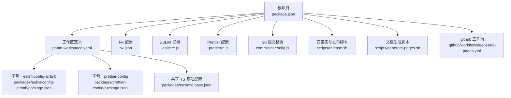
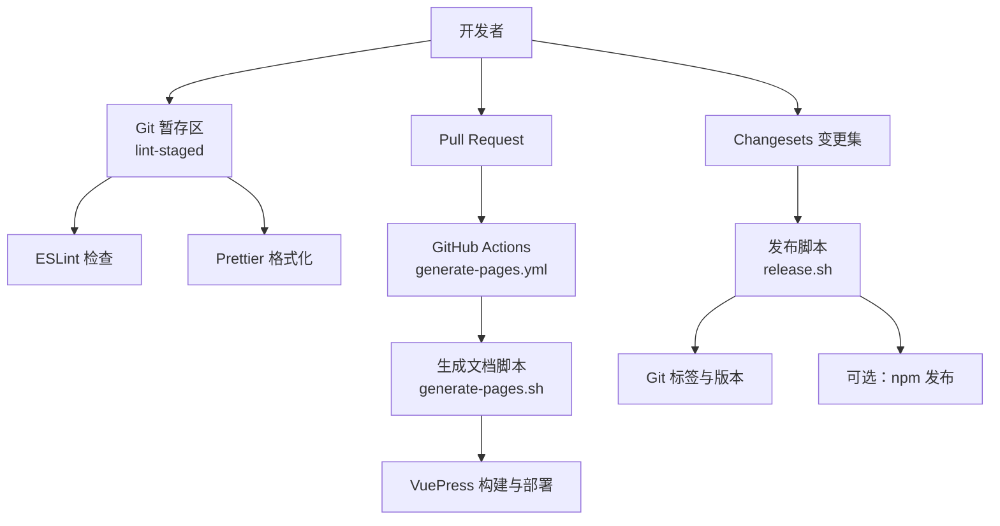
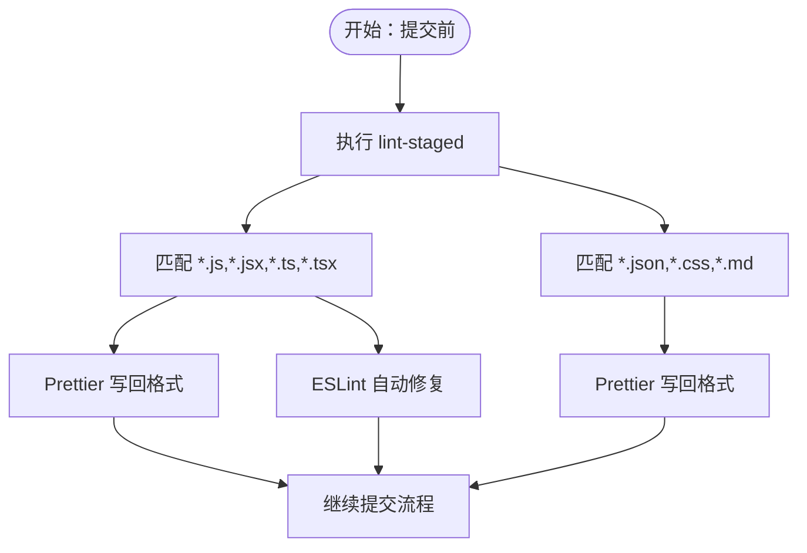
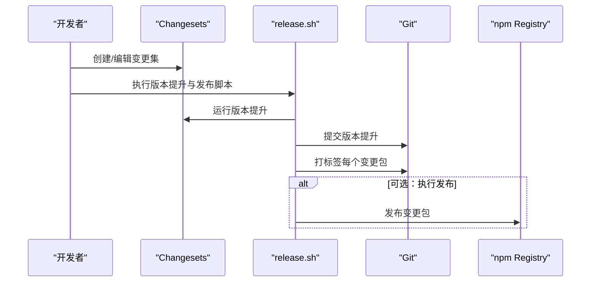
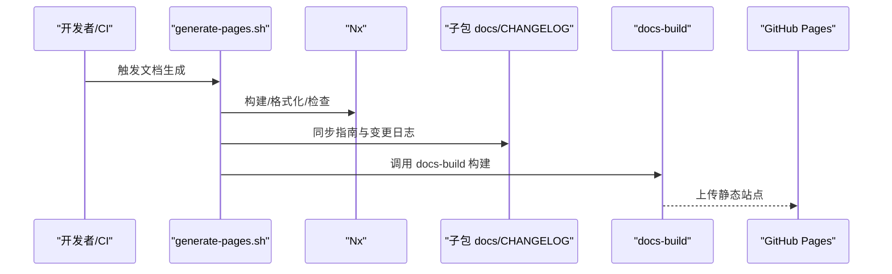
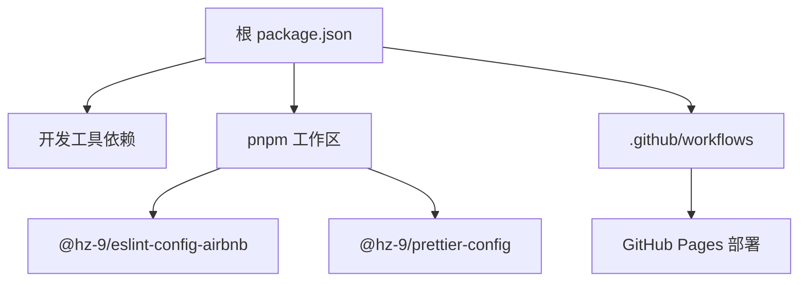

# 贡献指南

<cite>
**本文引用的文件**
- [package.json](file://package.json)
- [README.md](file://README.md)
- [nx.json](file://nx.json)
- [pnpm-workspace.yaml](file://pnpm-workspace.yaml)
- [.eslintrc.js](file://.eslintrc.js)
- [.prettierrc.js](file://.prettierrc.js)
- [.lintstagedrc.json](file://.lintstagedrc.json)
- [commitlint.config.js](file://commitlint.config.js)
- [scripts/release.sh](file://scripts/release.sh)
- [scripts/generate-pages.sh](file://scripts/generate-pages.sh)
- [.github/workflows/generate-pages.yml](file://.github/workflows/generate-pages.yml)
- [packages/eslint-config-airbnb/package.json](file://packages/eslint-config-airbnb/package.json)
- [packages/prettier-config/package.json](file://packages/prettier-config/package.json)
- [packages/tsconfig.base.json](file://packages/tsconfig.base.json)
- [docs/README.md](file://docs/README.md)
</cite>

## 目录
1. [简介](#简介)
2. [项目结构](#项目结构)
3. [核心组件](#核心组件)
4. [架构总览](#架构总览)
5. [详细组件分析](#详细组件分析)
6. [依赖分析](#依赖分析)
7. [性能考虑](#性能考虑)
8. [故障排查指南](#故障排查指南)
9. [结论](#结论)
10. [附录](#附录)

## 简介
本仓库是一套基于 Nx 的 JavaScript/TypeScript 代码质量配置集合，包含 ESLint 与 Prettier 的配置包，采用 pnpm 工作区进行多包管理。贡献者可通过本指南快速完成本地开发环境搭建、遵循统一的编码规范与提交规范，并理解版本发布与文档生成流程。

## 项目结构
- 多包工作区：通过 pnpm 工作区定义各子包目录，便于统一构建、测试与发布。
- 根级脚本与工具：提供统一的构建、格式化、检查、变更集（Changesets）与发布脚本。
- 文档与 CI：根文档与 GitHub Actions 工作流负责文档站点生成与部署。

图表来源
- [package.json:1-38](file://package.json#L1-L38)
- [pnpm-workspace.yaml:1-6](file://pnpm-workspace.yaml#L1-L6)
- [nx.json:1-20](file://nx.json#L1-L20)
- [.eslintrc.js:1-4](file://.eslintrc.js#L1-L4)
- [.prettierrc.js:1-15](file://.prettierrc.js#L1-L15)
- [commitlint.config.js:1-200](file://commitlint.config.js#L1-L200)
- [scripts/release.sh:1-73](file://scripts/release.sh#L1-L73)
- [scripts/generate-pages.sh:1-56](file://scripts/generate-pages.sh#L1-L56)
- [.github/workflows/generate-pages.yml:1-68](file://.github/workflows/generate-pages.yml#L1-L68)
- [packages/eslint-config-airbnb/package.json:1-84](file://packages/eslint-config-airbnb/package.json#L1-L84)
- [packages/prettier-config/package.json:1-45](file://packages/prettier-config/package.json#L1-L45)
- [packages/tsconfig.base.json:1-13](file://packages/tsconfig.base.json#L1-L13)

章节来源
- [pnpm-workspace.yaml:1-6](file://pnpm-workspace.yaml#L1-L6)
- [package.json:1-38](file://package.json#L1-L38)
- [README.md:1-45](file://README.md#L1-L45)
- [docs/README.md:1-28](file://docs/README.md#L1-L28)

## 核心组件
- 开发与构建
  - 使用 Nx 进行多包构建与受影响目标执行，支持增量构建与缓存。
  - 提供统一的构建、测试、格式化与检查脚本，便于在本地与 CI 中一致执行。
- 代码质量工具链
  - ESLint：继承团队 AirBnb 风格配置，保证 JS/TS 规范一致性。
  - Prettier：统一代码格式，集成导入排序插件，按模块域分组与排序。
  - lint-staged：在 Git 提交前自动格式化与修复可修复的规则。
- 版本与发布
  - Changesets：用于记录变更、生成变更日志与触发版本号提升。
  - 发布脚本：自动化版本提升、锁文件更新、打标签与可选的 npm 发布。
- 文档与站点
  - 文档生成脚本：从各子包同步指南与变更日志到根文档，再由 docs-build 构建站点。
  - GitHub Actions：在推送默认分支时自动生成并部署文档页面。

章节来源
- [package.json:5-16](file://package.json#L5-L16)
- [nx.json:6-14](file://nx.json#L6-L14)
- [.eslintrc.js:1-4](file://.eslintrc.js#L1-L4)
- [.prettierrc.js:1-15](file://.prettierrc.js#L1-L15)
- [.lintstagedrc.json:1-5](file://.lintstagedrc.json#L1-L5)
- [scripts/release.sh:1-73](file://scripts/release.sh#L1-L73)
- [scripts/generate-pages.sh:1-56](file://scripts/generate-pages.sh#L1-L56)
- [.github/workflows/generate-pages.yml:1-68](file://.github/workflows/generate-pages.yml#L1-L68)

## 架构总览
下图展示了从本地开发到文档发布的整体流程，包括质量检查、版本管理与文档生成的关键节点。

图表来源
- [.lintstagedrc.json:1-5](file://.lintstagedrc.json#L1-L5)
- [.github/workflows/generate-pages.yml:1-68](file://.github/workflows/generate-pages.yml#L1-L68)
- [scripts/generate-pages.sh:1-56](file://scripts/generate-pages.sh#L1-L56)
- [scripts/release.sh:1-73](file://scripts/release.sh#L1-L73)

## 详细组件分析

### 开发环境与工具链
- Node 与包管理器
  - Node 版本范围与 pnpm 版本在根配置中声明，确保团队环境一致。
- Nx 任务与输入
  - targetDefaults 定义了构建与检查的输入与依赖关系，支持增量构建与缓存。
- 工作区组织
  - pnpm 工作区指向 packages/* 子包，便于统一管理与发布。

章节来源
- [package.json:33-36](file://package.json#L33-L36)
- [nx.json:6-14](file://nx.json#L6-L14)
- [pnpm-workspace.yaml:4-6](file://pnpm-workspace.yaml#L4-L6)

### 代码质量工具链
- ESLint
  - 根 ESLint 配置继承团队 AirBnb 风格，确保 JS/TS 规范一致。
- Prettier
  - 继承团队 Prettier 配置，并启用导入排序插件，按模块域分组与排序，提升可读性。
- lint-staged
  - 在暂存阶段对 JS/TS 文件执行格式化与修复，对 JSON/CSS/Markdown 执行格式化，减少 CI 压力。

图表来源
- [.lintstagedrc.json:1-5](file://.lintstagedrc.json#L1-L5)
- [.prettierrc.js:6-14](file://.prettierrc.js#L6-L14)
- [.eslintrc.js:1-4](file://.eslintrc.js#L1-L4)

章节来源
- [.eslintrc.js:1-4](file://.eslintrc.js#L1-L4)
- [.prettierrc.js:1-15](file://.prettierrc.js#L1-L15)
- [.lintstagedrc.json:1-5](file://.lintstagedrc.json#L1-L5)

### 提交信息与分支策略
- 提交信息规范
  - 通过 commitlint 与 conventional 规则约束提交信息格式，建议遵循约定式提交，便于自动生成变更日志与版本号。
- 分支策略
  - 默认保护分支为 master；CI 在推送到该分支时触发文档生成与部署流程。

章节来源
- [commitlint.config.js:1-200](file://commitlint.config.js#L1-L200)
- [nx.json:3](file://nx.json#L3)
- [.github/workflows/generate-pages.yml:7-11](file://.github/workflows/generate-pages.yml#L7-L11)

### 变更集与发布流程
- Changesets
  - 使用 Changesets 记录每次变更，生成统一的变更日志并在版本提升时更新各子包版本。
- 发布脚本
  - 自动快照当前版本、执行版本提升、更新锁文件、识别变更包、提交版本提升、打标签，并可选执行 npm 发布。
  - 支持在 CI 中执行完整发布流水线（注释掉的部分可按需启用）。

图表来源
- [scripts/release.sh:1-73](file://scripts/release.sh#L1-L73)

章节来源
- [package.json:13-15](file://package.json#L13-L15)
- [scripts/release.sh:1-73](file://scripts/release.sh#L1-L73)

### 文档生成与部署
- 文档生成脚本
  - 先构建与格式化所有包，再从各子包同步指南与变更日志到根文档，最后调用 docs-build 构建站点。
- GitHub Actions 工作流
  - 在推送默认分支时自动安装依赖、运行文档生成脚本，并部署到 GitHub Pages。

图表来源
- [scripts/generate-pages.sh:1-56](file://scripts/generate-pages.sh#L1-L56)
- [.github/workflows/generate-pages.yml:1-68](file://.github/workflows/generate-pages.yml#L1-L68)

章节来源
- [scripts/generate-pages.sh:1-56](file://scripts/generate-pages.sh#L1-L56)
- [.github/workflows/generate-pages.yml:1-68](file://.github/workflows/generate-pages.yml#L1-L68)

### 子包与共享配置
- 子包清单
  - eslint-config-airbnb：面向 JavaScript 的 ESLint 配置。
  - eslint-config-airbnb-ts：面向 TypeScript 的 ESLint 配置。
  - prettier-config：统一的 Prettier 配置与导入排序插件。
- 共享 TS 基础配置
  - 提供基础编译选项，便于子包复用。

章节来源
- [packages/eslint-config-airbnb/package.json:1-84](file://packages/eslint-config-airbnb/package.json#L1-L84)
- [packages/prettier-config/package.json:1-45](file://packages/prettier-config/package.json#L1-L45)
- [packages/tsconfig.base.json:1-13](file://packages/tsconfig.base.json#L1-L13)
- [docs/README.md:5-11](file://docs/README.md#L5-L11)

## 依赖分析
- 工具链依赖
  - ESLint、Prettier、Husky、lint-staged、Commitlint、Changesets、Vitest、@nx/vite 等。
- 工作区与子包
  - pnpm 工作区指向 packages/*，子包通过 exports/main 等字段暴露产物。
- CI 与文档
  - GitHub Actions 使用 Node 18/20 与 pnpm 8.15.9，配合 docs-build 与 VuePress 构建文档。

图表来源
- [package.json:17-32](file://package.json#L17-L32)
- [pnpm-workspace.yaml:4-6](file://pnpm-workspace.yaml#L4-L6)
- [packages/eslint-config-airbnb/package.json:20-54](file://packages/eslint-config-airbnb/package.json#L20-L54)
- [packages/prettier-config/package.json:19-28](file://packages/prettier-config/package.json#L19-L28)
- [.github/workflows/generate-pages.yml:34-67](file://.github/workflows/generate-pages.yml#L34-L67)

章节来源
- [package.json:17-32](file://package.json#L17-L32)
- [pnpm-workspace.yaml:4-6](file://pnpm-workspace.yaml#L4-L6)

## 性能考虑
- 使用 Nx 的增量构建与缓存，仅对受影响项目执行目标，缩短本地与 CI 时间。
- lint-staged 仅处理暂存文件，降低提交耗时。
- Changesets 与版本提升脚本避免不必要的重复操作，结合锁文件更新确保依赖一致性。

## 故障排查指南
- Node 版本不匹配
  - 确认 Node 版本满足根配置中的引擎要求，避免因版本差异导致构建或测试失败。
- pnpm 版本不匹配
  - 使用根配置中声明的 pnpm 版本，确保锁文件与工作区解析一致。
- 提交被拒绝
  - 检查提交信息是否符合约定式提交规范；如未生效，确认 commitlint 配置已正确加载。
- 文档未更新
  - 确认 CI 推送至默认分支后触发工作流；检查 generate-pages.sh 是否成功同步子包文档与变更日志。
- 发布失败
  - 检查 release.sh 的版本提升与标签步骤；如需发布到 npm，请按需取消注释相应步骤并确保认证配置正确。

章节来源
- [package.json:33-36](file://package.json#L33-L36)
- [commitlint.config.js:1-200](file://commitlint.config.js#L1-L200)
- [.github/workflows/generate-pages.yml:7-11](file://.github/workflows/generate-pages.yml#L7-L11)
- [scripts/release.sh:21-68](file://scripts/release.sh#L21-L68)

## 结论
本指南提供了从环境准备、编码规范、提交与分支策略，到版本发布与文档生成的完整贡献路径。建议新贡献者先阅读“开发环境与工具链”“代码质量工具链”“提交信息与分支策略”“变更集与发布流程”“文档生成与部署”，再结合“故障排查指南”快速定位问题并高效推进贡献。

## 附录
- 快速命令参考
  - 安装依赖、构建、检查、格式化、查看依赖图、运行受影响检查、创建/版本提升/发布变更集等。
- 社区与沟通
  - 问题反馈与讨论请前往仓库 Issues 页面，遵守社区行为规范，保持友好与尊重。

章节来源
- [README.md:7-36](file://README.md#L7-L36)
- [docs/README.md:13-27](file://docs/README.md#L13-L27)