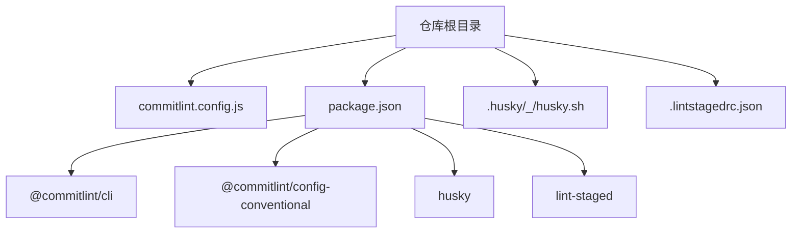
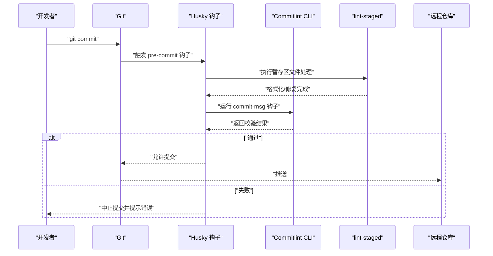
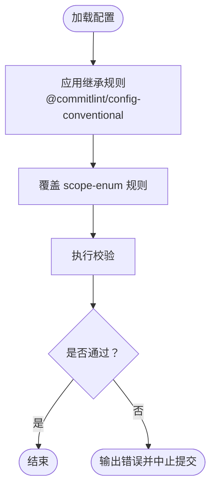
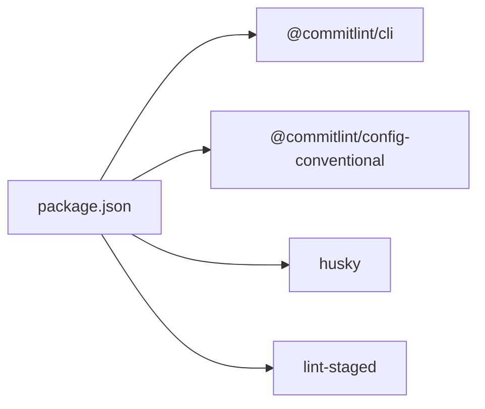
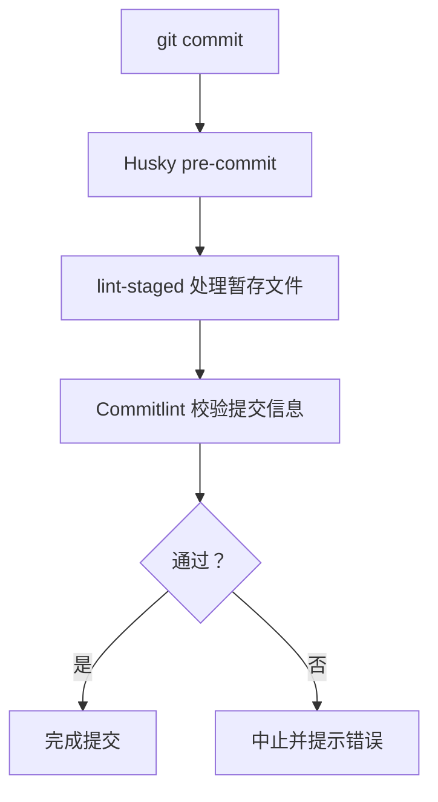
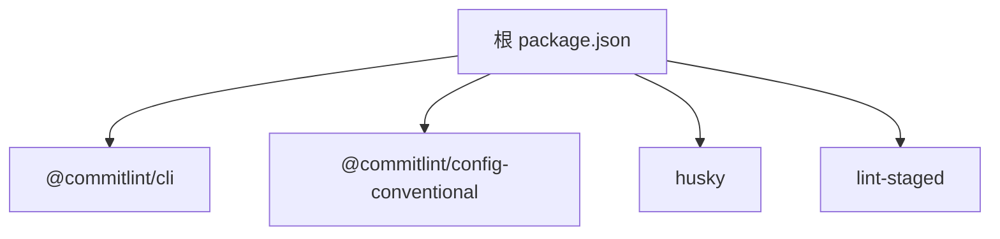

# Commitlint 配置

<cite>
**本文引用的文件**
- [commitlint.config.js](file://commitlint.config.js)
- [package.json](file://package.json)
- [.lintstagedrc.json](file://.lintstagedrc.json)
- [.husky/_/husky.sh](file://.husky/_/husky.sh)
- [README.md](file://README.md)
- [docs/README.md](file://docs/README.md)
</cite>

## 目录
1. [简介](#简介)
2. [项目结构](#项目结构)
3. [核心组件](#核心组件)
4. [架构总览](#架构总览)
5. [详细组件分析](#详细组件分析)
6. [依赖分析](#依赖分析)
7. [性能考虑](#性能考虑)
8. [故障排查指南](#故障排查指南)
9. [结论](#结论)
10. [附录](#附录)

## 简介
本文件面向使用 Nx 工作区的团队，系统化梳理 Commitlint 在本仓库中的配置与使用方式，重点围绕 commitlint.config.js 的配置结构、规则设置与扩展机制展开，并结合实际工作流（Husky、lint-staged）给出最佳实践与排障建议。同时提供基于 Conventional Commits 与 Angular 规范的模板思路，帮助不同协作模式的团队快速落地一致的提交消息规范。

## 项目结构
本仓库采用 Nx 管理多包，Commitlint 作为开发依赖参与本地与 CI 的提交消息校验。关键位置如下：
- 提交规范配置：commitlint.config.js
- 开发工具与脚本：package.json（包含 @commitlint/cli、@commitlint/config-conventional、husky、lint-staged）
- 提交钩子与工作流：.husky/_/husky.sh（Husky 脚手架提示）
- 代码格式化与静态检查：.lintstagedrc.json（与 Commitlint 协同）

图表来源
- [commitlint.config.js:1-7](file://commitlint.config.js#L1-L7)
- [package.json:17-32](file://package.json#L17-L32)
- [.husky/_/husky.sh:1-9](file://.husky/_/husky.sh#L1-L9)
- [.lintstagedrc.json:1-4](file://.lintstagedrc.json#L1-L4)

章节来源
- [commitlint.config.js:1-7](file://commitlint.config.js#L1-L7)
- [package.json:17-32](file://package.json#L17-L32)
- [.husky/_/husky.sh:1-9](file://.husky/_/husky.sh#L1-L9)
- [.lintstagedrc.json:1-4](file://.lintstagedrc.json#L1-L4)

## 核心组件
- Commitlint 配置文件：commitlint.config.js
  - 继承官方 Conventional Commits 配置，覆盖 scope-enum 规则以限定有效作用域集合。
- 开发依赖与脚本：
  - @commitlint/cli：命令行工具
  - @commitlint/config-conventional：Conventional Commits 规则集
  - husky：Git 钩子管理
  - lint-staged：暂存区文件批量处理
- 工作流集成：
  - .husky/_/husky.sh：Husky 脚手架提示（已弃用旧写法）
  - .lintstagedrc.json：与 Commitlint 协同进行格式化与修复

章节来源
- [commitlint.config.js:1-7](file://commitlint.config.js#L1-L7)
- [package.json:17-32](file://package.json#L17-L32)
- [.husky/_/husky.sh:1-9](file://.husky/_/husky.sh#L1-L9)
- [.lintstagedrc.json:1-4](file://.lintstagedrc.json#L1-L4)

## 架构总览
下图展示了从开发者提交到本地校验再到 CI 的整体流程，体现 Commitlint 与 Husky、lint-staged 的协作关系：

图表来源
- [.husky/_/husky.sh:1-9](file://.husky/_/husky.sh#L1-L9)
- [.lintstagedrc.json:1-4](file://.lintstagedrc.json#L1-L4)
- [commitlint.config.js:1-7](file://commitlint.config.js#L1-L7)

## 详细组件分析

### Commitlint 配置文件（commitlint.config.js）
- 配置结构
  - extends：继承官方 Conventional Commits 规则集，确保遵循约定式提交的基本语义与格式。
  - rules：在继承基础上进行局部覆盖或增强，当前仅覆盖 scope-enum 规则。
- 规则设置
  - scope-enum：限制提交作用域为固定枚举值，避免作用域滥用导致的可读性与自动化链路问题。
- 可扩展点
  - 可继续在 rules 中添加更多规则，如 type-enum、subject-full-stop、header-max-length 等。
  - 可通过 additional extends 引入团队定制规则集，实现跨仓库复用。

图表来源
- [commitlint.config.js:1-7](file://commitlint.config.js#L1-L7)

章节来源
- [commitlint.config.js:1-7](file://commitlint.config.js#L1-L7)

### 依赖与脚本（package.json）
- 关键依赖
  - @commitlint/cli：命令行工具，用于在本地与 CI 校验提交信息。
  - @commitlint/config-conventional：官方 Conventional Commits 规则集。
  - husky：安装与管理 Git 钩子。
  - lint-staged：在提交前对暂存文件执行格式化与修复。
- 脚本
  - prepare：初始化 Husky 钩子。
  - 其他脚本：构建、测试、格式化等，与提交规范协同工作。

图表来源
- [package.json:17-32](file://package.json#L17-L32)

章节来源
- [package.json:17-32](file://package.json#L17-L32)

### 工作流集成（Husky 与 lint-staged）
- Husky
  - 通过 prepare 脚本安装钩子；当前脚手架提示显示旧写法已被弃用，建议按提示清理相关行以避免后续版本失败。
- lint-staged
  - 在 pre-commit 阶段对暂存文件执行格式化与修复，减少提交中的风格问题，降低 Commitlint 的负担。

图表来源
- [.husky/_/husky.sh:1-9](file://.husky/_/husky.sh#L1-L9)
- [.lintstagedrc.json:1-4](file://.lintstagedrc.json#L1-L4)

章节来源
- [.husky/_/husky.sh:1-9](file://.husky/_/husky.sh#L1-L9)
- [.lintstagedrc.json:1-4](file://.lintstagedrc.json#L1-L4)

### 提交消息规范与验证规则
- 基于 Conventional Commits 的规范
  - 结构：type(scope): subject
  - 常见类型：feat、fix、docs、style、refactor、perf、test、build、ci、chore、revert
  - 作用域：通过 scope-enum 限定为项目内明确的包或模块，避免泛化
- 规则继承与覆盖
  - 继承官方规则集，保证一致性；仅在必要时覆盖，保持最小变更原则
- 与工作流的配合
  - 通过 Husky 在本地即时反馈，减少无效提交
  - 通过 lint-staged 减少风格类问题，提升提交质量

章节来源
- [commitlint.config.js:1-7](file://commitlint.config.js#L1-L7)

### 不同团队协作模式下的配置模板思路
- Conventional Commits 模板
  - 继承官方规则集，按需覆盖 scope-enum、type-enum 等
  - 适用于大多数开源与企业内部多包场景
- Angular 规范模板
  - 若团队偏好 Angular 规范，可在 extends 中替换为对应的规则集（例如 @commitlint/config-angular），并在 rules 中补充团队特有的约束
- 环境特定配置
  - 通过分支或环境变量选择不同的规则集（例如在 release 分支启用更严格的 header-max-length）
  - 通过条件化的 extends 或 rules 实现差异化策略

章节来源
- [commitlint.config.js:1-7](file://commitlint.config.js#L1-L7)

### 自定义规则与最佳实践
- 自定义规则
  - 在 rules 中新增规则或调整阈值（如将 warn 改为 error）
  - 使用 additional extends 引入团队共享规则集，便于跨仓库统一
- 最佳实践
  - 将 Commitlint 与 lint-staged、Husky 结合，形成“提交前自动修复 + 提交信息强制校验”的闭环
  - 对作用域进行枚举约束，避免滥用导致的可读性下降
  - 在 CI 中同样运行 Commitlint，确保主干分支的提交质量

章节来源
- [commitlint.config.js:1-7](file://commitlint.config.js#L1-L7)
- [.lintstagedrc.json:1-4](file://.lintstagedrc.json#L1-L4)

## 依赖分析
- 直接依赖
  - @commitlint/cli：提供命令行能力
  - @commitlint/config-conventional：提供 Conventional Commits 规则
  - husky：提供 Git 钩子管理
  - lint-staged：提供暂存区文件处理
- 间接依赖
  - Nx 工作区与 pnpm 管理的包生态，影响规则与工具的可用性与版本兼容性

图表来源
- [package.json:17-32](file://package.json#L17-L32)

章节来源
- [package.json:17-32](file://package.json#L17-L32)

## 性能考虑
- 本地校验优先：通过 Husky 与 lint-staged 在本地尽早发现问题，减少 CI 时间与失败成本
- 规则数量控制：仅在必要时新增或覆盖规则，避免规则过多导致校验耗时增加
- 缓存与增量：结合 Nx 的增量构建与缓存策略，减少不必要的重复校验

## 故障排查指南
- Husky 脚手架提示被弃用
  - 现象：执行脚本时出现弃用提示，提示移除旧写法
  - 处理：按提示清理相关行，避免后续版本失败
- 提交被意外中止
  - 排查：确认提交信息是否符合 scope-enum 与其它规则
  - 处理：修正提交信息后重试
- 本地与 CI 行为不一致
  - 排查：确认本地与 CI 的 Node 版本、Commitlint 版本一致
  - 处理：统一版本或在 CI 中显式安装依赖

章节来源
- [.husky/_/husky.sh:1-9](file://.husky/_/husky.sh#L1-L9)

## 结论
本仓库以 Conventional Commits 为基础，通过 Commitlint 与 Husky、lint-staged 的协同，实现了本地即时反馈与提交质量保障。建议团队在继承官方规则的前提下，按需覆盖作用域枚举与补充团队规则，形成稳定、可演进的提交规范体系。

## 附录
- 快速开始与常用命令参考
  - 安装依赖、构建、格式化、查看受影响项目等命令可参考根目录与文档目录中的说明

章节来源
- [README.md:1-45](file://README.md#L1-L45)
- [docs/README.md:1-28](file://docs/README.md#L1-L28)