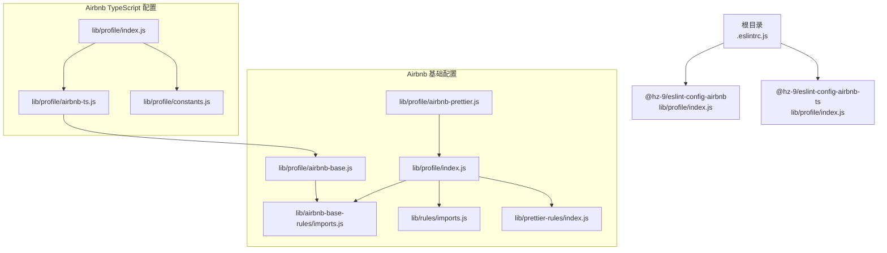
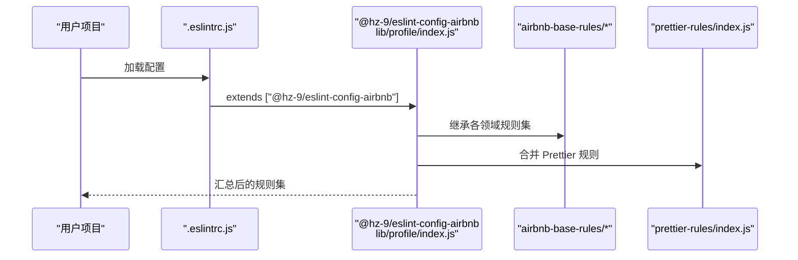
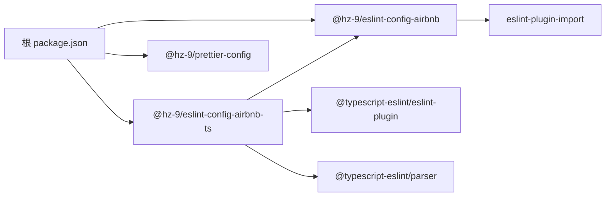

# ESLint 配置

<cite>
**本文引用的文件**
- [.eslintrc.js](file://.eslintrc.js)
- [package.json（根）](file://package.json)
- [packages/eslint-config-airbnb/package.json](file://packages/eslint-config-airbnb/package.json)
- [packages/eslint-config-airbnb/lib/profile/index.js](file://packages/eslint-config-airbnb/lib/profile/index.js)
- [packages/eslint-config-airbnb/lib/profile/airbnb-base.js](file://packages/eslint-config-airbnb/lib/profile/airbnb-base.js)
- [packages/eslint-config-airbnb/lib/profile/airbnb-prettier.js](file://packages/eslint-config-airbnb/lib/profile/airbnb-prettier.js)
- [packages/eslint-config-airbnb/lib/airbnb-base-rules/imports.js](file://packages/eslint-config-airbnb/lib/airbnb-base-rules/imports.js)
- [packages/eslint-config-airbnb/lib/rules/imports.js](file://packages/eslint-config-airbnb/lib/rules/imports.js)
- [packages/eslint-config-airbnb/lib/prettier-rules/index.js](file://packages/eslint-config-airbnb/lib/prettier-rules/index.js)
- [packages/eslint-config-airbnb-ts/package.json](file://packages/eslint-config-airbnb-ts/package.json)
- [packages/eslint-config-airbnb-ts/lib/profile/index.js](file://packages/eslint-config-airbnb-ts/lib/profile/index.js)
- [packages/eslint-config-airbnb-ts/lib/profile/airbnb-ts.js](file://packages/eslint-config-airbnb-ts/lib/profile/airbnb-ts.js)
- [packages/eslint-config-airbnb-ts/lib/profile/constants.js](file://packages/eslint-config-airbnb-ts/lib/profile/constants.js)
- [packages/prettier-config/package.json](file://packages/prettier-config/package.json)
</cite>

## 目录
1. [简介](#简介)
2. [项目结构](#项目结构)
3. [核心组件](#核心组件)
4. [架构总览](#架构总览)
5. [详细组件分析](#详细组件分析)
6. [依赖关系分析](#依赖关系分析)
7. [性能考量](#性能考量)
8. [故障排查指南](#故障排查指南)
9. [结论](#结论)
10. [附录](#附录)

## 简介
本文件系统性梳理该仓库中的 ESLint 配置体系，重点围绕以下目标展开：
- 解释 .eslintrc.js 的结构与配置项（规则、插件、解析器等）
- 对比 AirBnB 风格配置与 TypeScript 配置的差异与适用场景
- 提供自定义规则最佳实践：如何扩展基础配置、添加自定义规则、集成第三方插件
- 讲解配置继承机制与环境特定设置（overrides）
- 给出常见问题解决方案与性能优化建议

## 项目结构
该仓库采用 Nx 工作区组织，核心与 ESLint/Prettier 相关的模块集中在 packages 目录中，并通过工作区依赖统一管理版本与发布。

图表来源
- [.eslintrc.js:1-4](file://.eslintrc.js#L1-L4)
- [packages/eslint-config-airbnb/lib/profile/index.js:1-38](file://packages/eslint-config-airbnb/lib/profile/index.js#L1-L38)
- [packages/eslint-config-airbnb/lib/profile/airbnb-base.js:1-27](file://packages/eslint-config-airbnb/lib/profile/airbnb-base.js#L1-L27)
- [packages/eslint-config-airbnb/lib/profile/airbnb-prettier.js:1-29](file://packages/eslint-config-airbnb/lib/profile/airbnb-prettier.js#L1-L29)
- [packages/eslint-config-airbnb/lib/airbnb-base-rules/imports.js:1-296](file://packages/eslint-config-airbnb/lib/airbnb-base-rules/imports.js#L1-L296)
- [packages/eslint-config-airbnb/lib/rules/imports.js:1-29](file://packages/eslint-config-airbnb/lib/rules/imports.js#L1-L29)
- [packages/eslint-config-airbnb/lib/prettier-rules/index.js:1-268](file://packages/eslint-config-airbnb/lib/prettier-rules/index.js#L1-L268)
- [packages/eslint-config-airbnb-ts/lib/profile/index.js:1-87](file://packages/eslint-config-airbnb-ts/lib/profile/index.js#L1-L87)
- [packages/eslint-config-airbnb-ts/lib/profile/airbnb-ts.js:1-35](file://packages/eslint-config-airbnb-ts/lib/profile/airbnb-ts.js#L1-L35)
- [packages/eslint-config-airbnb-ts/lib/profile/constants.js:1-4](file://packages/eslint-config-airbnb-ts/lib/profile/constants.js#L1-L4)

章节来源
- [.eslintrc.js:1-4](file://.eslintrc.js#L1-L4)
- [package.json（根）:1-38](file://package.json#L1-L38)

## 核心组件
- 根配置 .eslintrc.js：仅声明继承 @hz-9/eslint-config-airbnb，其余由被继承配置决定。
- Airbnb 基础配置（JavaScript）：集中于 lib/profile/index.js，聚合多类规则与 Prettier 协同规则，统一导出。
- Airbnb TypeScript 配置：在基础 Airbnb 配置之上，通过 overrides 为 TypeScript 文件启用 @typescript-eslint 插件与解析器，并叠加 TS 专属规则集。
- Prettier 规则桥接：airbnb-prettier 与 prettier-rules/index.js 将 Prettier 格式化偏好映射为 ESLint 规则，避免冲突。

章节来源
- [.eslintrc.js:1-4](file://.eslintrc.js#L1-L4)
- [packages/eslint-config-airbnb/lib/profile/index.js:1-38](file://packages/eslint-config-airbnb/lib/profile/index.js#L1-L38)
- [packages/eslint-config-airbnb/lib/profile/airbnb-prettier.js:1-29](file://packages/eslint-config-airbnb/lib/profile/airbnb-prettier.js#L1-L29)
- [packages/eslint-config-airbnb/lib/prettier-rules/index.js:1-268](file://packages/eslint-config-airbnb/lib/prettier-rules/index.js#L1-L268)
- [packages/eslint-config-airbnb-ts/lib/profile/index.js:1-87](file://packages/eslint-config-airbnb-ts/lib/profile/index.js#L1-L87)

## 架构总览
下图展示从根配置到具体规则的继承链路与覆盖策略：

图表来源
- [.eslintrc.js:1-4](file://.eslintrc.js#L1-L4)
- [packages/eslint-config-airbnb/lib/profile/index.js:1-38](file://packages/eslint-config-airbnb/lib/profile/index.js#L1-L38)

章节来源
- [.eslintrc.js:1-4](file://.eslintrc.js#L1-L4)
- [packages/eslint-config-airbnb/lib/profile/index.js:1-38](file://packages/eslint-config-airbnb/lib/profile/index.js#L1-L38)

## 详细组件分析

### 根配置 .eslintrc.js
- 作用：声明继承 @hz-9/eslint-config-airbnb，作为团队统一入口。
- 关键点：未在根配置中直接定义 rules、plugins、parser，避免重复与冲突；所有规则由被继承配置提供。

章节来源
- [.eslintrc.js:1-4](file://.eslintrc.js#L1-L4)

### Airbnb 基础配置（JavaScript）
- 插件与环境：启用 import 插件，设定 es6 与 node 环境。
- 解析器选项：指定 ecmaVersion 与 sourceType。
- 继承结构：按领域拆分规则（如 best-practices、errors、es6、imports、node、strict、style、variables），并在 index 中统一聚合。
- Prettier 协同：airbnb-prettier 在继承基础上引入 prettier-rules/index.js，将格式化相关规则交由 Prettier 处理，ESLint 只做逻辑检查。

章节来源
- [packages/eslint-config-airbnb/lib/profile/index.js:1-38](file://packages/eslint-config-airbnb/lib/profile/index.js#L1-L38)
- [packages/eslint-config-airbnb/lib/profile/airbnb-base.js:1-27](file://packages/eslint-config-airbnb/lib/profile/airbnb-base.js#L1-L27)
- [packages/eslint-config-airbnb/lib/profile/airbnb-prettier.js:1-29](file://packages/eslint-config-airbnb/lib/profile/airbnb-prettier.js#L1-L29)
- [packages/eslint-config-airbnb/lib/prettier-rules/index.js:1-268](file://packages/eslint-config-airbnb/lib/prettier-rules/index.js#L1-L268)

### Airbnb TypeScript 配置
- 继承策略：先继承 @hz-9/eslint-config-airbnb 的 index，再通过 overrides 为 TypeScript 文件单独应用 TS 规则集。
- 覆盖范围：通过常量 TS_FILES_GLOB 定义匹配模式，确保仅对 .ts/.tsx/.cts/.mts 生效。
- 插件与解析器：在 overrides 内启用 @typescript-eslint 插件与 @typescript-eslint/parser。
- 规则叠加：在 overrides 中引入 airbnb-ts-rules 下的各类规则集，并保留与 Prettier 的协同。

章节来源
- [packages/eslint-config-airbnb-ts/lib/profile/index.js:1-87](file://packages/eslint-config-airbnb-ts/lib/profile/index.js#L1-L87)
- [packages/eslint-config-airbnb-ts/lib/profile/airbnb-ts.js:1-35](file://packages/eslint-config-airbnb-ts/lib/profile/airbnb-ts.js#L1-L35)
- [packages/eslint-config-airbnb-ts/lib/profile/constants.js:1-4](file://packages/eslint-config-airbnb-ts/lib/profile/constants.js#L1-L4)

### 导入规则（Import）详解
- 基础规则：涵盖未解析导入、命名导出一致性、默认导出命名冲突、重复导入、绝对路径与相对路径顺序、导入后空行、首选默认导出、禁止内部模块、循环依赖检测、无用路径段、相对父路径导入限制、相对包导入限制、类型一致风格等。
- 项目定制：在 lib/rules/imports.js 中对 no-extraneous-dependencies 的 devDependencies 白名单进行扩展，增加对 Vite 配置文件的支持。

章节来源
- [packages/eslint-config-airbnb/lib/airbnb-base-rules/imports.js:1-296](file://packages/eslint-config-airbnb/lib/airbnb-base-rules/imports.js#L1-L296)
- [packages/eslint-config-airbnb/lib/rules/imports.js:1-29](file://packages/eslint-config-airbnb/lib/rules/imports.js#L1-L29)

### Prettier 协同规则
- 设计理念：将大量格式化相关规则关闭（off），交由 Prettier 统一处理，避免 ESLint 与 Prettier 在格式上互相冲突。
- 应用方式：通过 airbnb-prettier 与 prettier-rules/index.js 实现，确保两者在团队内保持一致。

章节来源
- [packages/eslint-config-airbnb/lib/prettier-rules/index.js:1-268](file://packages/eslint-config-airbnb/lib/prettier-rules/index.js#L1-L268)
- [packages/eslint-config-airbnb/lib/profile/airbnb-prettier.js:1-29](file://packages/eslint-config-airbnb/lib/profile/airbnb-prettier.js#L1-L29)

### 配置继承与环境特定设置（overrides）
- 继承机制：AirBnB 基础配置以“领域规则集”形式拆分，index 统一 require.resolve 并合并，形成可维护的模块化规则树。
- 环境特定设置：TypeScript 配置通过 overrides 为 ts 文件单独启用 TS 插件与解析器，并叠加 TS 专用规则集，同时保留与 Prettier 的协同。

章节来源
- [packages/eslint-config-airbnb/lib/profile/index.js:1-38](file://packages/eslint-config-airbnb/lib/profile/index.js#L1-L38)
- [packages/eslint-config-airbnb-ts/lib/profile/index.js:1-87](file://packages/eslint-config-airbnb-ts/lib/profile/index.js#L1-L87)

### Airbnb 风格与 TypeScript 配置对比
- 适用场景
  - JavaScript 项目：使用 @hz-9/eslint-config-airbnb（或其 airbnb-base/airbnb-prettier 变体）即可满足大多数需求。
  - TypeScript 项目：使用 @hz-9/eslint-config-airbnb-ts，在基础 Airbnb 配置之上启用 TS 插件与解析器，并应用 TS 专属规则集。
- 主要差异
  - 插件与解析器：TS 配置在 overrides 内启用 @typescript-eslint 插件与 @typescript-eslint/parser。
  - 规则集：TS 配置引入 airbnb-ts-rules 下的规则集，并通过 ts-off 规则对部分 TS 场景放宽约束。
  - 匹配范围：通过 TS_FILES_GLOB 精准限定生效范围，避免对 JS 文件产生影响。

章节来源
- [packages/eslint-config-airbnb-ts/lib/profile/index.js:1-87](file://packages/eslint-config-airbnb-ts/lib/profile/index.js#L1-L87)
- [packages/eslint-config-airbnb-ts/lib/profile/airbnb-ts.js:1-35](file://packages/eslint-config-airbnb-ts/lib/profile/airbnb-ts.js#L1-L35)
- [packages/eslint-config-airbnb-ts/lib/profile/constants.js:1-4](file://packages/eslint-config-airbnb-ts/lib/profile/constants.js#L1-L4)

### 自定义规则最佳实践
- 扩展基础配置
  - 在根配置中继续 extends 更多官方或社区配置，或在本地新建配置文件并将其加入 extends 链。
  - 通过 overrides 为特定文件/目录添加更严格的规则，避免全局污染。
- 添加自定义规则
  - 在本地配置文件中新增 rules 字段，覆盖或补充规则级别（如 off/error/warn）。
  - 若涉及格式化，优先考虑通过 Prettier 处理，避免在 ESLint 中重复定义格式化规则。
- 处理第三方插件
  - 在 plugins 数组中声明插件名称，并在 rules 中引用其规则。
  - 如需解析器支持（如 TypeScript），在对应 overrides 中设置 parser 与插件。
- 与 Prettier 协同
  - 使用 airbnb-prettier 或 prettier-rules/index.js 将格式化规则关闭，避免冲突。
  - 通过 package.json 中的脚本统一执行格式化与校验。

章节来源
- [packages/eslint-config-airbnb/lib/profile/index.js:1-38](file://packages/eslint-config-airbnb/lib/profile/index.js#L1-L38)
- [packages/eslint-config-airbnb/lib/prettier-rules/index.js:1-268](file://packages/eslint-config-airbnb/lib/prettier-rules/index.js#L1-L268)
- [packages/eslint-config-airbnb-ts/lib/profile/index.js:1-87](file://packages/eslint-config-airbnb-ts/lib/profile/index.js#L1-L87)

## 依赖关系分析
- 工作区依赖
  - 根 package.json 将 @hz-9/eslint-config-airbnb 与 @hz-9/prettier-config 作为工作区依赖，保证版本一致性与发布同步。
  - @hz-9/eslint-config-airbnb-ts 依赖 @hz-9/eslint-config-airbnb（workspace:*），确保 TS 配置在基础 Airbnb 之上叠加。
- 外部依赖
  - Airbnb 配置依赖 eslint-plugin-import 与 confusing-browser-globals 等。
  - TS 配置依赖 @typescript-eslint/eslint-plugin 与 @typescript-eslint/parser，并要求 TypeScript 版本范围。

图表来源
- [package.json（根）:1-38](file://package.json#L1-L38)
- [packages/eslint-config-airbnb/package.json:1-84](file://packages/eslint-config-airbnb/package.json#L1-L84)
- [packages/eslint-config-airbnb-ts/package.json:1-87](file://packages/eslint-config-airbnb-ts/package.json#L1-L87)
- [packages/prettier-config/package.json:1-45](file://packages/prettier-config/package.json#L1-L45)

章节来源
- [package.json（根）:1-38](file://package.json#L1-L38)
- [packages/eslint-config-airbnb/package.json:1-84](file://packages/eslint-config-airbnb/package.json#L1-L84)
- [packages/eslint-config-airbnb-ts/package.json:1-87](file://packages/eslint-config-airbnb-ts/package.json#L1-L87)
- [packages/prettier-config/package.json:1-45](file://packages/prettier-config/package.json#L1-L45)

## 性能考量
- 规则数量控制：尽量复用官方推荐配置，减少自定义规则数量，降低 ESLint 分析成本。
- 覆盖范围精准：通过 overrides 限定规则生效范围，避免对无关文件扫描。
- 缓存与增量：结合编辑器/CI 的缓存策略，避免重复分析未变更文件。
- 解析器选择：仅在需要时启用 TypeScript 解析器，避免不必要的解析开销。

## 故障排查指南
- 规则冲突
  - 症状：ESLint 与 Prettier 在格式上冲突。
  - 处理：确认已使用 airbnb-prettier 或将格式化相关规则关闭，交由 Prettier 处理。
- TypeScript 规则不生效
  - 症状：.ts/.tsx 文件未触发 TS 规则。
  - 处理：检查 overrides 是否正确匹配 TS_FILES_GLOB，确认 @typescript-eslint 插件与解析器已在 overrides 中声明。
- 导入规则误报
  - 症状：no-extraneous-dependencies 对某些配置文件误报。
  - 处理：在本地配置中扩展 devDependencies 白名单，参考项目对 Vite 配置文件的处理方式。
- 插件未识别
  - 症状：启用插件后 ESLint 报错找不到插件。
  - 处理：确认插件已安装且在 plugins 数组中声明；若为 TypeScript 项目，确保在 overrides 中声明。

章节来源
- [packages/eslint-config-airbnb/lib/prettier-rules/index.js:1-268](file://packages/eslint-config-airbnb/lib/prettier-rules/index.js#L1-L268)
- [packages/eslint-config-airbnb-ts/lib/profile/index.js:1-87](file://packages/eslint-config-airbnb-ts/lib/profile/index.js#L1-L87)
- [packages/eslint-config-airbnb/lib/rules/imports.js:1-29](file://packages/eslint-config-airbnb/lib/rules/imports.js#L1-L29)

## 结论
该仓库通过模块化的 Airbnb 风格配置与 TypeScript 专项配置，实现了统一、可扩展、可维护的 ESLint 体系。根配置仅负责继承入口，具体规则由被继承配置提供；TypeScript 通过 overrides 精准覆盖，既保持与基础 Airbnb 的一致性，又满足 TS 场景的特殊需求。配合 Prettier 协同与工作区依赖管理，团队可在不同项目中快速落地一致的代码质量标准。

## 附录
- 常用命令
  - 根 package.json 中提供 lint、format、format:check 等脚本，便于统一执行校验与格式化。
- 发布与版本
  - 通过 @changesets/cli 管理版本与变更日志，确保配置更新可追踪。

章节来源
- [package.json（根）:1-38](file://package.json#L1-L38)