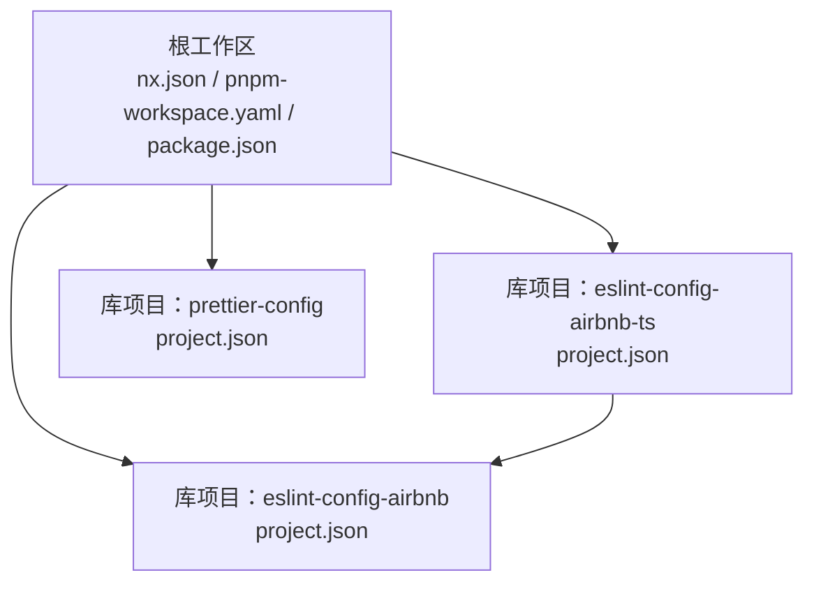
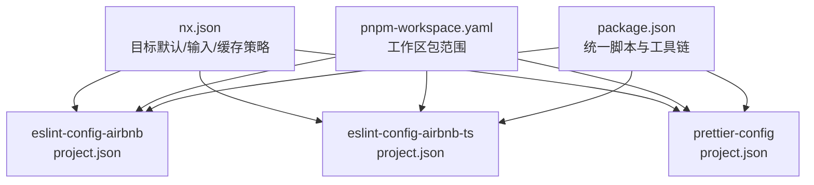
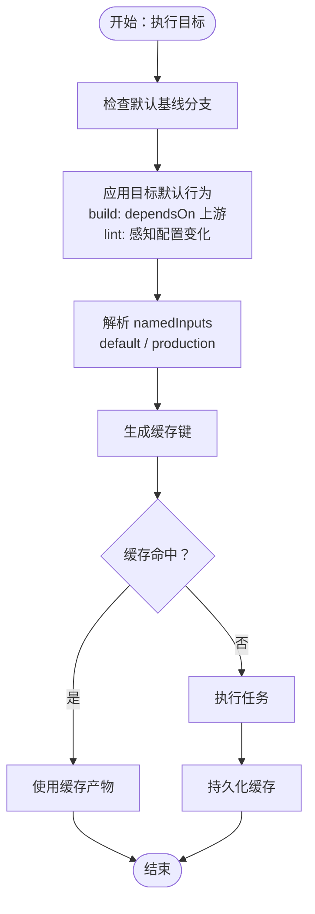
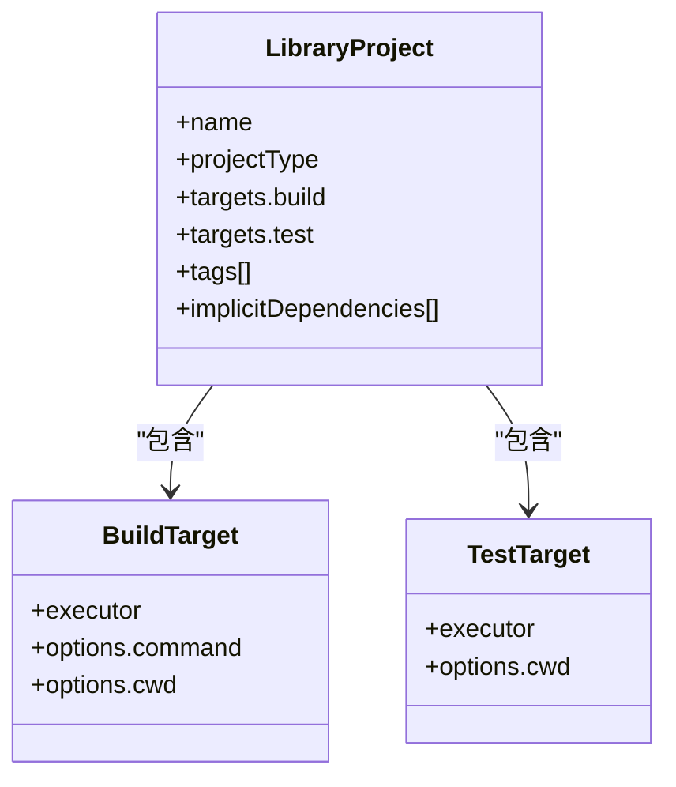
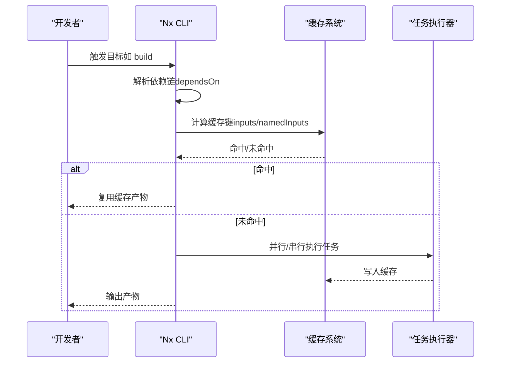
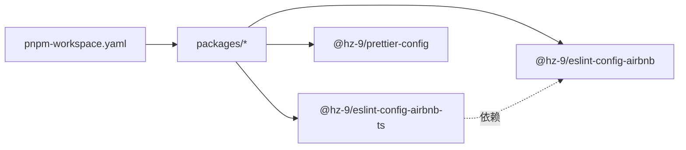

# Nx 工作区配置

<cite>
**本文引用的文件**
- [nx.json](file://nx.json)
- [pnpm-workspace.yaml](file://pnpm-workspace.yaml)
- [package.json](file://package.json)
- [packages/tsconfig.base.json](file://packages/tsconfig.base.json)
- [packages/eslint-config-airbnb/project.json](file://packages/eslint-config-airbnb/project.json)
- [packages/eslint-config-airbnb-ts/project.json](file://packages/eslint-config-airbnb-ts/project.json)
- [packages/prettier-config/project.json](file://packages/prettier-config/project.json)
- [packages/eslint-config-airbnb/package.json](file://packages/eslint-config-airbnb/package.json)
- [packages/eslint-config-airbnb-ts/package.json](file://packages/eslint-config-airbnb-ts/package.json)
- [packages/prettier-config/package.json](file://packages/prettier-config/package.json)
- [README.md](file://README.md)
</cite>

## 目录
1. [简介](#简介)
2. [项目结构](#项目结构)
3. [核心组件](#核心组件)
4. [架构总览](#架构总览)
5. [详细组件分析](#详细组件分析)
6. [依赖分析](#依赖分析)
7. [性能考虑](#性能考虑)
8. [故障排除指南](#故障排除指南)
9. [结论](#结论)
10. [附录](#附录)

## 简介
本文件系统性梳理该 Nx 工作区的配置与最佳实践，重点覆盖以下方面：
- nx.json：项目目标默认行为、输入定义、缓存与增量构建策略
- pnpm-workspace.yaml：工作区包管理范围与依赖解析
- 项目类型模板：库项目、应用项目（可扩展）、混合项目（多目标）
- 任务调度、并行执行与增量构建配置
- 性能优化建议与 CI/CD 集成方案
- 常见问题排查与修复路径

## 项目结构
该工作区采用“库型”单体风格，通过 Nx 管理多个独立的配置类包（ESLint、Prettier），并通过 pnpm 进行统一工作区管理。根目录提供统一脚本与工具链，各包在 packages 下以独立项目存在。

图表来源
- [nx.json:1-20](file://nx.json#L1-L20)
- [pnpm-workspace.yaml:1-6](file://pnpm-workspace.yaml#L1-L6)
- [packages/eslint-config-airbnb/project.json:1-23](file://packages/eslint-config-airbnb/project.json#L1-L23)
- [packages/eslint-config-airbnb-ts/project.json:1-24](file://packages/eslint-config-airbnb-ts/project.json#L1-L24)
- [packages/prettier-config/project.json:1-23](file://packages/prettier-config/project.json#L1-L23)

章节来源
- [nx.json:1-20](file://nx.json#L1-L20)
- [pnpm-workspace.yaml:1-6](file://pnpm-workspace.yaml#L1-L6)
- [package.json:1-38](file://package.json#L1-L38)
- [README.md:1-45](file://README.md#L1-L45)

## 核心组件
- nx.json
  - 默认基线分支、插件启用、目标默认行为与输入集合
  - namedInputs 定义了 default 与 production 输入集，用于缓存与增量构建判定
  - targetDefaults 为 build 与 lint 目标配置依赖链与输入，确保构建顺序与输入一致性
- pnpm-workspace.yaml
  - 指定工作区包扫描范围，统一由 pnpm 管理依赖与版本
- 项目配置（project.json）
  - 各库项目声明目标（如 build、test）与执行器，以及标签与隐式依赖
- 全局脚本与工具链（package.json）
  - 提供统一命令入口，便于批量执行与 CI 使用
- TypeScript 基础配置（tsconfig.base.json）
  - 统一编译选项，保证跨项目一致的类型检查与模块解析

章节来源
- [nx.json:1-20](file://nx.json#L1-L20)
- [pnpm-workspace.yaml:1-6](file://pnpm-workspace.yaml#L1-L6)
- [package.json:1-38](file://package.json#L1-L38)
- [packages/tsconfig.base.json:1-13](file://packages/tsconfig.base.json#L1-L13)

## 架构总览
下图展示工作区整体配置如何协同：nx.json 定义目标与输入，pnpm-workspace.yaml 约束包范围，各库项目在 project.json 中声明目标与依赖，package.json 提供统一脚本入口。

图表来源
- [nx.json:1-20](file://nx.json#L1-L20)
- [pnpm-workspace.yaml:1-6](file://pnpm-workspace.yaml#L1-L6)
- [packages/eslint-config-airbnb/project.json:1-23](file://packages/eslint-config-airbnb/project.json#L1-L23)
- [packages/eslint-config-airbnb-ts/project.json:1-24](file://packages/eslint-config-airbnb-ts/project.json#L1-L24)
- [packages/prettier-config/project.json:1-23](file://packages/prettier-config/project.json#L1-L23)
- [package.json:1-38](file://package.json#L1-L38)

## 详细组件分析

### nx.json：目标默认、输入与缓存
- defaultBase：默认基线分支，影响变更检测与受影响项目计算
- plugins：启用 @nx/vite 插件，为测试等目标提供执行器支持
- targetDefaults：
  - build：通过 dependsOn 强制按拓扑顺序构建上游依赖；inputs 指向 production 及上游生产输入，确保增量构建正确
  - lint：inputs 包含默认输入与根级 ESLint 配置与忽略文件，使 Lint 能感知配置变化
- namedInputs：
  - default：项目根下全部文件
  - production：继承 default，作为生产构建输入集

图表来源
- [nx.json:6-18](file://nx.json#L6-L18)

章节来源
- [nx.json:1-20](file://nx.json#L1-L20)

### pnpm-workspace.yaml：工作区包管理
- packages 列表限定工作区扫描路径，此处仅包含 packages/*，确保 pnpm 将其识别为工作区成员
- 结合 package.json 的 engines 与 packageManager 字段，统一 Node 与 pnpm 版本约束

章节来源
- [pnpm-workspace.yaml:1-6](file://pnpm-workspace.yaml#L1-L6)
- [package.json:33-37](file://package.json#L33-L37)

### 项目模板：库项目（Library）
- 适用场景：纯配置类包（如 ESLint/Prettier 配置），无需打包产物或仅需发布配置文件
- 关键点：
  - projectType 设为 library
  - targets：
    - build：使用 nx:run-commands 执行自定义构建脚本（如调用内部构建脚本）
    - test：使用 @nx/vite:test 执行测试
  - tags：用于分类与过滤（如 scope:package、type:config）
  - implicitDependencies：声明对其他库项目的隐式依赖（如 TS 配置依赖 JS 配置）

图表来源
- [packages/eslint-config-airbnb/project.json:1-23](file://packages/eslint-config-airbnb/project.json#L1-L23)
- [packages/eslint-config-airbnb-ts/project.json:1-24](file://packages/eslint-config-airbnb-ts/project.json#L1-L24)
- [packages/prettier-config/project.json:1-23](file://packages/prettier-config/project.json#L1-L23)

章节来源
- [packages/eslint-config-airbnb/project.json:1-23](file://packages/eslint-config-airbnb/project.json#L1-L23)
- [packages/eslint-config-airbnb-ts/project.json:1-24](file://packages/eslint-config-airbnb-ts/project.json#L1-L24)
- [packages/prettier-config/project.json:1-23](file://packages/prettier-config/project.json#L1-L23)

### 项目模板：应用项目（Application，可扩展）
- 适用场景：需要打包与运行的应用型项目
- 建议配置要点（基于现有库模板扩展）：
  - projectType 设为 application
  - targets：
    - build：使用 @nx/vite:build 或对应框架构建器
    - serve：使用 @nx/vite:dev 或对应开发服务器
    - test：使用 @nx/vite:test
    - e2e：使用 @nx/vite:e2e 或端到端测试执行器
  - tags：添加 type:app 以便区分
  - implicitDependencies：可声明对共享库的依赖

[本节为概念性模板说明，不直接分析具体文件，故无章节来源]

### 项目模板：混合项目（多目标）
- 适用场景：同时包含构建、测试、发布等多目标的复杂项目
- 建议配置要点：
  - 在同一 project.json 中定义多个 targets
  - 使用 dependsOn 管理目标间依赖（如先 build 再 test）
  - 通过 inputs 与 namedInputs 精细化控制缓存与增量构建

[本节为概念性模板说明，不直接分析具体文件，故无章节来源]

### 任务调度、并行执行与增量构建
- 任务调度与并行：
  - Nx 默认按拓扑排序执行，可通过 targetDefaults 的 dependsOn 控制依赖链
  - 使用 Nx 命令行的并行参数（如 --parallel=N）提升吞吐
- 增量构建与缓存：
  - namedInputs 与 inputs 决定缓存键生成
  - 生产输入集 production 与 default 的差异可控制何时触发重建
  - 变更检测基于 defaultBase 与 Git 基线

图表来源
- [nx.json:6-18](file://nx.json#L6-L18)

章节来源
- [nx.json:6-18](file://nx.json#L6-L18)
- [README.md:25-26](file://README.md#L25-L26)

## 依赖分析
- 工作区包范围：pnpm-workspace.yaml 限定 packages/* 为工作区成员，确保 pnpm 正确解析与安装
- 项目间依赖：
  - eslint-config-airbnb-ts 明确声明对 @hz-9/eslint-config-airbnb 的依赖
  - 通过 implicitDependencies 在项目层面建立依赖关系，影响构建顺序与缓存
- 工具链与版本：
  - package.json 统一声明 Nx、Vite 插件、ESLint、Prettier 等版本，并约束 Node 与 pnpm 版本

图表来源
- [pnpm-workspace.yaml:4-6](file://pnpm-workspace.yaml#L4-L6)
- [packages/eslint-config-airbnb-ts/project.json:22](file://packages/eslint-config-airbnb-ts/project.json#L22)
- [packages/eslint-config-airbnb-ts/package.json:67](file://packages/eslint-config-airbnb-ts/package.json#L67)

章节来源
- [pnpm-workspace.yaml:1-6](file://pnpm-workspace.yaml#L1-L6)
- [packages/eslint-config-airbnb-ts/project.json:22](file://packages/eslint-config-airbnb-ts/project.json#L22)
- [packages/eslint-config-airbnb-ts/package.json:67](file://packages/eslint-config-airbnb-ts/package.json#L67)

## 性能考虑
- 缓存与增量构建
  - 合理划分 namedInputs，避免将过多无关文件纳入输入
  - 对频繁变动的文件（如日志、临时文件）使用 .eslintignore/.prettierignore 等忽略列表
- 任务并行
  - 在 CI 中使用并行度参数提升吞吐，但需平衡资源占用
- 依赖最小化
  - 通过 implicitDependencies 与 tags 精准控制受影响项目范围
- 工具链版本锁定
  - 保持 Nx、Vite 插件与 Node 版本稳定，减少缓存失效与不一致

[本节提供通用指导，不直接分析具体文件，故无章节来源]

## 故障排除指南
- 变更检测无效或受影响项目过多
  - 检查 defaultBase 是否正确，确认基线分支与当前分支一致
  - 确认 inputs 与 namedInputs 是否包含必要文件，避免遗漏配置文件
- 缓存未命中或频繁重建
  - 检查 inputs 是否包含动态生成文件或时间戳相关文件
  - 确认生产输入集与默认输入集的差异是否合理
- 任务执行顺序异常
  - 检查 dependsOn 配置是否正确，确保上游依赖先于下游目标执行
- 本地与 CI 行为不一致
  - 对齐 Node 与 pnpm 版本，确保 packageManager 与 engines 设置一致
  - 在 CI 中显式设置并行度与缓存策略

章节来源
- [nx.json:3-5](file://nx.json#L3-L5)
- [nx.json:6-18](file://nx.json#L6-L18)
- [package.json:33-37](file://package.json#L33-L37)

## 结论
该工作区通过 nx.json 与 pnpm-workspace.yaml 实现了清晰的目标默认行为、输入定义与缓存策略，结合库型项目模板与 Vite 插件，提供了高效、可维护的多包开发体验。建议在实际项目中进一步细化 inputs 与 namedInputs，明确任务并行度与 CI 缓存策略，以获得更佳的性能与稳定性。

## 附录
- 快速上手命令参考（来自 README）
  - 安装依赖、全量 Lint、全量构建、格式化、查看依赖图、仅对变更项目执行 Lint、Changeset 流程与发布流程

章节来源
- [README.md:7-36](file://README.md#L7-L36)