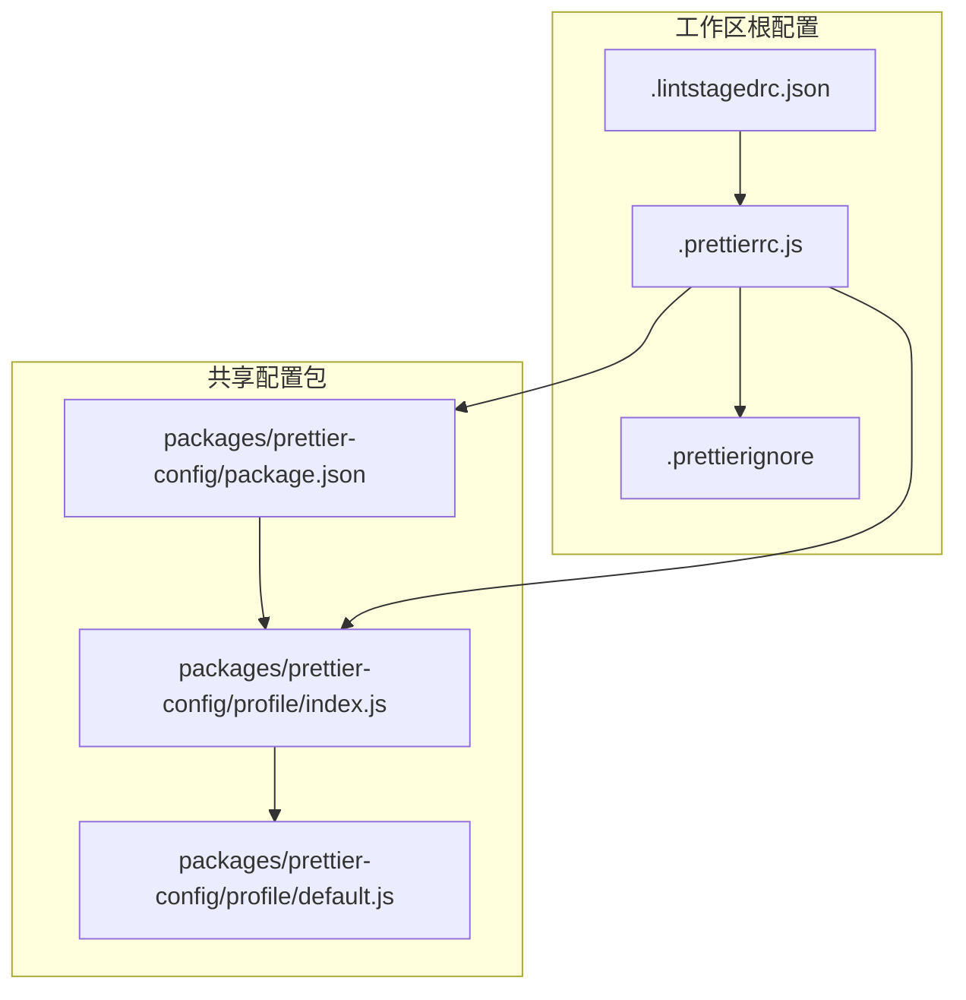
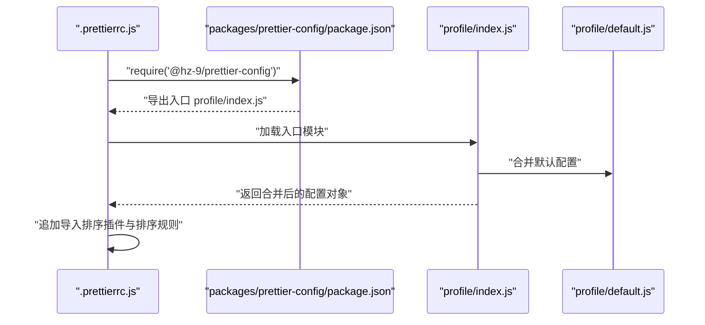
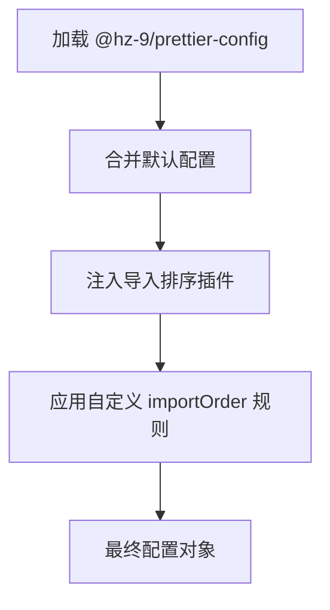
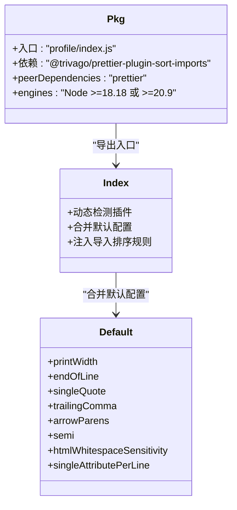
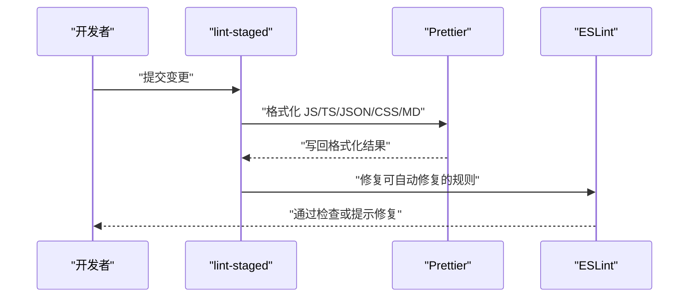
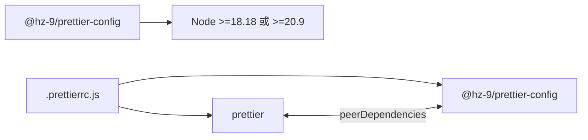

# Prettier 配置

<cite>
**本文引用的文件**
- [.prettierrc.js](file://.prettierrc.js)
- [.prettierignore](file://.prettierignore)
- [packages/prettier-config/profile/index.js](file://packages/prettier-config/profile/index.js)
- [packages/prettier-config/profile/default.js](file://packages/prettier-config/profile/default.js)
- [packages/prettier-config/package.json](file://packages/prettier-config/package.json)
- [package.json](file://package.json)
- [.lintstagedrc.json](file://.lintstagedrc.json)
- [docs/guide/prettier-config/README.md](file://docs/guide/prettier-config/README.md)
- [docs/guide/prettier-config/README.zh-CN.md](file://docs/guide/prettier-config/README.zh-CN.md)
- [.eslintrc.js](file://.eslintrc.js)
- [packages/eslint-config-airbnb/src/prettier-rules/index.js](file://packages/eslint-config-airbnb/src/prettier-rules/index.js)
</cite>

## 目录
1. [简介](#简介)
2. [项目结构](#项目结构)
3. [核心组件](#核心组件)
4. [架构总览](#架构总览)
5. [详细组件分析](#详细组件分析)
6. [依赖分析](#依赖分析)
7. [性能考虑](#性能考虑)
8. [故障排查指南](#故障排查指南)
9. [结论](#结论)
10. [附录](#附录)

## 简介
本文件系统性梳理仓库中的 Prettier 配置体系，涵盖：
- 根配置文件的各项规则与取值来源
- 配置继承与覆盖机制
- 不同项目类型的配置模板与最佳实践
- 与 ESLint 的集成与冲突处理
- 忽略文件与工作区特定设置
- 配置验证与调试技巧

## 项目结构
该仓库采用“共享配置包 + 工作区根配置”的模式：
- 共享配置包：通过独立包导出默认配置与扩展规则，便于在多项目复用
- 工作区根配置：在根目录的配置文件中组合共享配置，并追加项目特定规则（如导入排序插件）

**图表来源**
- [packages/prettier-config/package.json:1-45](file://packages/prettier-config/package.json#L1-L45)
- [packages/prettier-config/profile/index.js:1-30](file://packages/prettier-config/profile/index.js#L1-L30)
- [packages/prettier-config/profile/default.js:1-29](file://packages/prettier-config/profile/default.js#L1-L29)
- [.prettierrc.js:1-15](file://.prettierrc.js#L1-L15)
- [.prettierignore:1-105](file://.prettierignore#L1-L105)
- [.lintstagedrc.json:1-5](file://.lintstagedrc.json#L1-L5)

**章节来源**
- [.prettierrc.js:1-15](file://.prettierrc.js#L1-L15)
- [.prettierignore:1-105](file://.prettierignore#L1-L105)
- [packages/prettier-config/package.json:1-45](file://packages/prettier-config/package.json#L1-L45)
- [packages/prettier-config/profile/index.js:1-30](file://packages/prettier-config/profile/index.js#L1-L30)
- [packages/prettier-config/profile/default.js:1-29](file://packages/prettier-config/profile/default.js#L1-L29)
- [.lintstagedrc.json:1-5](file://.lintstagedrc.json#L1-L5)

## 核心组件
- 共享配置入口：通过包导出的入口文件加载默认配置，并按需注入导入排序插件能力
- 默认配置：集中定义打印宽度、换行符、引号策略、尾逗号、箭头函数括号、分号、HTML 白空敏感度与单属性换行等
- 根配置：在工作区根目录合并共享配置，并追加导入排序插件与自定义排序规则
- 忽略文件：统一管理日志、构建产物、依赖目录、文档输出等无需格式化的路径
- 集成脚本：通过工作区脚本与 lint-staged 同时驱动 Prettier 与 ESLint

**章节来源**
- [packages/prettier-config/profile/index.js:1-30](file://packages/prettier-config/profile/index.js#L1-L30)
- [packages/prettier-config/profile/default.js:1-29](file://packages/prettier-config/profile/default.js#L1-L29)
- [.prettierrc.js:1-15](file://.prettierrc.js#L1-L15)
- [.prettierignore:1-105](file://.prettierignore#L1-L105)
- [package.json:1-38](file://package.json#L1-L38)
- [.lintstagedrc.json:1-5](file://.lintstagedrc.json#L1-L5)

## 架构总览
下图展示从“根配置”到“共享配置”的加载链路，以及与“导入排序插件”的集成方式。

**图表来源**
- [.prettierrc.js:1-15](file://.prettierrc.js#L1-L15)
- [packages/prettier-config/package.json:1-45](file://packages/prettier-config/package.json#L1-L45)
- [packages/prettier-config/profile/index.js:1-30](file://packages/prettier-config/profile/index.js#L1-L30)
- [packages/prettier-config/profile/default.js:1-29](file://packages/prettier-config/profile/default.js#L1-L29)

## 详细组件分析

### 根配置文件（.prettierrc.js）
- 继承机制：通过 require 共享配置包，获得默认规则集
- 覆盖机制：在共享配置基础上追加插件与导入排序规则，实现“继承 + 扩展”
- 插件：启用导入排序插件以规范化 import 顺序与分组
- 导入排序规则：定义命名空间、相对路径与第三方库的优先级与分隔策略

**图表来源**
- [.prettierrc.js:1-15](file://.prettierrc.js#L1-L15)
- [packages/prettier-config/profile/index.js:1-30](file://packages/prettier-config/profile/index.js#L1-L30)
- [packages/prettier-config/profile/default.js:1-29](file://packages/prettier-config/profile/default.js#L1-L29)

**章节来源**
- [.prettierrc.js:1-15](file://.prettierrc.js#L1-L15)

### 共享配置包（packages/prettier-config）
- 包元信息：声明入口、依赖与引擎版本，确保与 Prettier 主版本兼容
- 入口逻辑：动态检测导入排序插件是否存在，存在则注入插件与排序规则；否则回退至默认配置
- 默认规则：集中定义打印宽度、换行符、引号、尾逗号、箭头函数括号、分号、HTML 白空敏感度与单属性换行等

**图表来源**
- [packages/prettier-config/package.json:1-45](file://packages/prettier-config/package.json#L1-L45)
- [packages/prettier-config/profile/index.js:1-30](file://packages/prettier-config/profile/index.js#L1-L30)
- [packages/prettier-config/profile/default.js:1-29](file://packages/prettier-config/profile/default.js#L1-L29)

**章节来源**
- [packages/prettier-config/package.json:1-45](file://packages/prettier-config/package.json#L1-L45)
- [packages/prettier-config/profile/index.js:1-30](file://packages/prettier-config/profile/index.js#L1-L30)
- [packages/prettier-config/profile/default.js:1-29](file://packages/prettier-config/profile/default.js#L1-L29)

### 忽略文件（.prettierignore）
- 作用：避免对日志、进程文件、覆盖率、构建产物、依赖目录、文档输出、锁文件等进行格式化
- 建议：与 .gitignore 保持同步，减少误格式化与无意义的 diff

**章节来源**
- [.prettierignore:1-105](file://.prettierignore#L1-L105)

### 与 ESLint 的集成与冲突处理
- 根 ESLint 配置：通过 extends 引入团队 Air-BnB 风格配置
- Prettier 与 ESLint 冲突：Air-BnB 预设中为 Prettier 关闭了大量格式化规则，避免两者冲突
- 工作流：lint-staged 在暂存区同时执行 Prettier 与 ESLint，保证提交前一致性

**图表来源**
- [.lintstagedrc.json:1-5](file://.lintstagedrc.json#L1-L5)
- [.eslintrc.js:1-4](file://.eslintrc.js#L1-L4)
- [packages/eslint-config-airbnb/src/prettier-rules/index.js:1-268](file://packages/eslint-config-airbnb/src/prettier-rules/index.js#L1-L268)

**章节来源**
- [.eslintrc.js:1-4](file://.eslintrc.js#L1-L4)
- [packages/eslint-config-airbnb/src/prettier-rules/index.js:1-268](file://packages/eslint-config-airbnb/src/prettier-rules/index.js#L1-L268)
- [.lintstagedrc.json:1-5](file://.lintstagedrc.json#L1-L5)

### 工作区脚本与命令
- format：对多种文件类型执行格式化写回
- format:check：仅检查不写回，用于 CI 校验
- 结合 Husky 与 lint-staged，在提交前自动格式化与修复

**章节来源**
- [package.json:1-38](file://package.json#L1-L38)

## 依赖分析
- 外部依赖：Prettier 主程序与导入排序插件
- 包内依赖：共享配置包作为 devDependencies 被工作区根配置引用
- 版本约束：共享配置包声明 peerDependencies 与 engines，确保兼容性

**图表来源**
- [packages/prettier-config/package.json:1-45](file://packages/prettier-config/package.json#L1-L45)
- [package.json:1-38](file://package.json#L1-L38)
- [.prettierrc.js:1-15](file://.prettierrc.js#L1-L15)

**章节来源**
- [packages/prettier-config/package.json:1-45](file://packages/prettier-config/package.json#L1-L45)
- [package.json:1-38](file://package.json#L1-L38)

## 性能考虑
- 避免对大型二进制或生成物目录进行扫描，已在忽略文件中屏蔽
- 通过 lint-staged 仅对暂存文件执行格式化，降低开发时开销
- 将复杂规则（如导入排序）集中在共享配置，减少重复计算

[本节为通用建议，无需引用具体文件]

## 故障排查指南
- 配置未生效
  - 检查根配置是否正确 require 共享配置包
  - 确认共享配置包入口文件已导出有效配置对象
- 插件未启用
  - 确认插件已安装且版本满足要求
  - 查看共享配置入口是否成功解析插件路径
- 与 ESLint 冲突
  - 确认 ESLint 预设中已关闭与 Prettier 冲突的规则
  - 在提交流程中先执行 Prettier 再执行 ESLint
- 提交失败
  - 检查 lint-staged 配置是否覆盖目标文件类型
  - 使用 format:check 在本地先行验证

**章节来源**
- [packages/prettier-config/profile/index.js:1-30](file://packages/prettier-config/profile/index.js#L1-L30)
- [packages/eslint-config-airbnb/src/prettier-rules/index.js:1-268](file://packages/eslint-config-airbnb/src/prettier-rules/index.js#L1-L268)
- [.lintstagedrc.json:1-5](file://.lintstagedrc.json#L1-L5)

## 结论
该配置体系通过“共享配置包 + 工作区根配置”的方式实现了：
- 可复用、可演进的默认规则
- 明确的继承与覆盖边界
- 与 ESLint 的低冲突协作
- 开发体验与 CI 一致性的保障

[本节为总结，无需引用具体文件]

## 附录

### 配置项速览与取值说明
- 打印宽度：较大宽度以适配带注释场景
- 换行符：统一使用 LF
- 引号：优先使用单引号
- 尾逗号：数组与对象支持，函数参数不支持
- 箭头函数括号：始终包裹参数
- 分号：禁用分号
- HTML 白空敏感度：忽略，适配 Vue 等框架
- 单属性换行：强制每个属性单独一行

以上取值均来自默认配置文件。

**章节来源**
- [packages/prettier-config/profile/default.js:1-29](file://packages/prettier-config/profile/default.js#L1-L29)

### 配置继承与覆盖机制
- 继承：根配置通过 require 共享配置包获取默认规则
- 覆盖：在共享配置基础上追加插件与导入排序规则，实现“默认 + 扩展”

**章节来源**
- [.prettierrc.js:1-15](file://.prettierrc.js#L1-L15)
- [packages/prettier-config/profile/index.js:1-30](file://packages/prettier-config/profile/index.js#L1-L30)

### 与 ESLint 的集成与冲突解决
- ESLint 预设关闭与 Prettier 冲突的规则
- lint-staged 串行执行 Prettier 与 ESLint
- 根 ESLint 配置通过 extends 引入团队预设

**章节来源**
- [.eslintrc.js:1-4](file://.eslintrc.js#L1-L4)
- [packages/eslint-config-airbnb/src/prettier-rules/index.js:1-268](file://packages/eslint-config-airbnb/src/prettier-rules/index.js#L1-L268)
- [.lintstagedrc.json:1-5](file://.lintstagedrc.json#L1-L5)

### 忽略文件与工作区特定设置
- 忽略文件：统一屏蔽日志、构建产物、依赖目录、文档输出与锁文件
- 工作区特定：根配置追加导入排序插件与排序规则

**章节来源**
- [.prettierignore:1-105](file://.prettierignore#L1-L105)
- [.prettierrc.js:1-15](file://.prettierrc.js#L1-L15)

### 配置验证与调试技巧
- 本地验证：使用 format:check 命令检查当前仓库
- 提交前校验：借助 lint-staged 在暂存区执行格式化与修复
- 文档参考：查看共享配置包的使用说明与规则清单

**章节来源**
- [package.json:1-38](file://package.json#L1-L38)
- [docs/guide/prettier-config/README.md:1-46](file://docs/guide/prettier-config/README.md#L1-L46)
- [docs/guide/prettier-config/README.zh-CN.md:1-48](file://docs/guide/prettier-config/README.zh-CN.md#L1-L48)