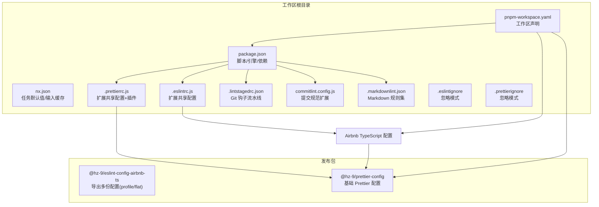
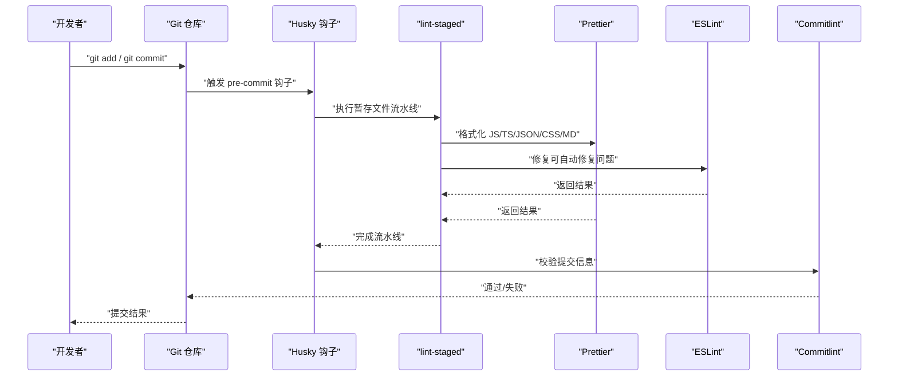
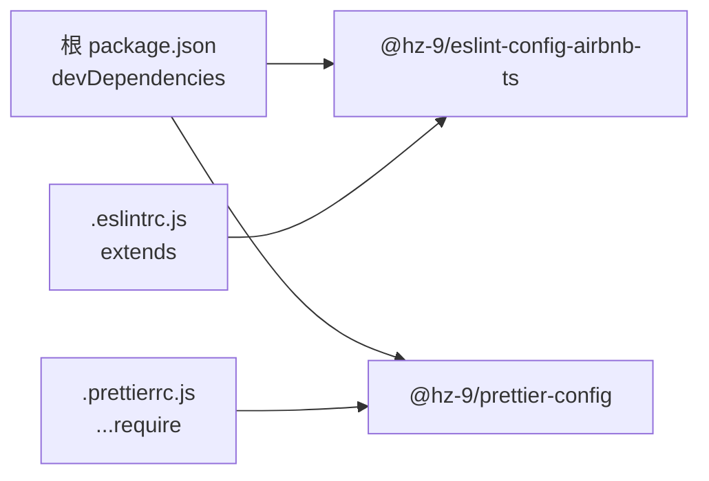
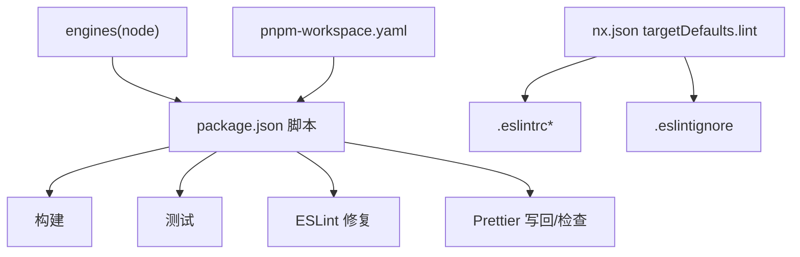

# 配置指南

<cite>
**本文引用的文件**
- [.eslintrc.js](file://.eslintrc.js)
- [.eslintignore](file://.eslintignore)
- [.prettierrc.js](file://.prettierrc.js)
- [.prettierignore](file://.prettierignore)
- [.lintstagedrc.json](file://.lintstagedrc.json)
- [commitlint.config.js](file://commitlint.config.js)
- [.markdownlint.json](file://.markdownlint.json)
- [package.json](file://package.json)
- [pnpm-workspace.yaml](file://pnpm-workspace.yaml)
- [nx.json](file://nx.json)
- [packages/tsconfig.base.json](file://packages/tsconfig.base.json)
- [packages/eslint-config-airbnb-ts/package.json](file://packages/eslint-config-airbnb-ts/package.json)
- [packages/prettier-config/package.json](file://packages/prettier-config/package.json)
</cite>

## 目录
1. [简介](#简介)
2. [项目结构](#项目结构)
3. [核心组件](#核心组件)
4. [架构总览](#架构总览)
5. [详细组件分析](#详细组件分析)
6. [依赖分析](#依赖分析)
7. [性能考虑](#性能考虑)
8. [故障排查指南](#故障排查指南)
9. [结论](#结论)
10. [附录](#附录)

## 简介
本指南面向使用 Nx 工作区的团队，系统性讲解本仓库中各类质量工具的配置与最佳实践，包括 ESLint、Prettier、Commitlint、Markdownlint、lint-staged、Nx 任务输入缓存与脚本集成等。文档重点覆盖：
- 各配置文件的作用、格式与关键字段
- 配置继承、覆盖规则与环境特定设置
- 不同项目类型的配置模板与示例路径
- 性能优化建议与常见错误规避
- 配置验证与调试技巧

## 项目结构
该仓库采用 pnpm workspace + Nx 的组织方式，核心配置集中在根目录，同时在 packages 下发布可复用的配置包（ESLint 与 Prettier）。关键文件职责概览：
- 根级配置：ESLint、Prettier、Commitlint、lint-staged、Markdownlint、Nx、工作区脚本与引擎约束
- 包级配置：发布到工作区的共享配置包清单与导出入口
- 忽略文件：统一管理 ESLint 与 Prettier 的忽略模式，确保与版本控制一致

图表来源
- [package.json:1-38](file://package.json#L1-L38)
- [nx.json:1-20](file://nx.json#L1-L20)
- [.eslintrc.js:1-4](file://.eslintrc.js#L1-L4)
- [.prettierrc.js:1-15](file://.prettierrc.js#L1-L15)
- [.lintstagedrc.json:1-5](file://.lintstagedrc.json#L1-L5)
- [commitlint.config.js:1-7](file://commitlint.config.js#L1-L7)
- [.markdownlint.json:1-11](file://.markdownlint.json#L1-L11)
- [.eslintignore:1-101](file://.eslintignore#L1-L101)
- [.prettierignore:1-105](file://.prettierignore#L1-L105)
- [pnpm-workspace.yaml:1-6](file://pnpm-workspace.yaml#L1-L6)
- [packages/eslint-config-airbnb-ts/package.json:1-87](file://packages/eslint-config-airbnb-ts/package.json#L1-L87)
- [packages/prettier-config/package.json:1-45](file://packages/prettier-config/package.json#L1-L45)

章节来源
- [package.json:1-38](file://package.json#L1-L38)
- [pnpm-workspace.yaml:1-6](file://pnpm-workspace.yaml#L1-L6)

## 核心组件
本节对各配置文件进行分门别类的说明，帮助快速定位与理解。

- ESLint 根配置
  - 作用：集中扩展共享的 Airbnb 风格 TypeScript 配置，作为工作区统一规则入口
  - 关键点：通过映射解析绝对路径加载配置，便于与工作区包协同
  - 参考路径：[根 ESLint 配置:1-4](file://.eslintrc.js#L1-L4)

- Prettier 根配置
  - 作用：基于共享配置进行扩展，并引入导入排序插件与定制化排序规则
  - 关键点：合并共享配置；启用导入分组、分隔符、命名空间分组与装饰器解析插件
  - 参考路径：[根 Prettier 配置:1-15](file://.prettierrc.js#L1-L15)

- lint-staged 配置
  - 作用：在 Git 暂存阶段自动执行格式化与修复，提升协作效率
  - 关键点：按文件类型分流处理，JS/TS 先格式化再 ESLint 修复，JSON/CSS/Markdown 单独格式化
  - 参考路径：[lint-staged 配置:1-5](file://.lintstagedrc.json#L1-L5)

- Commitlint 配置
  - 作用：扩展约定式提交规范，限定 scope 枚举范围以契合工作区包名
  - 关键点：在 conventional 基础上新增 scope 限制，覆盖工作区包与“all”
  - 参考路径：[Commitlint 配置:1-7](file://commitlint.config.js#L1-L7)

- Markdownlint 配置
  - 作用：放宽行长度限制、仅允许兄弟标题去重、允许指定 HTML 标签、关闭无标题段落警告
  - 关键点：通过布尔或对象形式精细控制规则
  - 参考路径：[Markdownlint 配置:1-11](file://.markdownlint.json#L1-L11)

- 忽略文件
  - .eslintignore：与 .gitignore 保持同步，屏蔽日志、构建产物、临时文件、文档与锁文件等
  - .prettierignore：与 .eslintignore 类似，但包含更多工作区特定路径
  - 参考路径：
    - [ESLint 忽略:1-101](file://.eslintignore#L1-L101)
    - [Prettier 忽略:1-105](file://.prettierignore#L1-L105)

- Nx 任务输入缓存
  - 作用：为 lint 任务声明输入依赖，结合默认 base 提升缓存命中率
  - 关键点：将 .eslintrc* 与 .eslintignore 纳入输入，避免误判缓存
  - 参考路径：[Nx 任务输入:6-14](file://nx.json#L6-L14)

- TypeScript 基础编译配置
  - 作用：为工作区提供统一的 TS 编译选项基线（如模块解析、严格性等）
  - 参考路径：[TS 基础配置:1-13](file://packages/tsconfig.base.json#L1-L13)

章节来源
- [.eslintrc.js:1-4](file://.eslintrc.js#L1-L4)
- [.prettierrc.js:1-15](file://.prettierrc.js#L1-L15)
- [.lintstagedrc.json:1-5](file://.lintstagedrc.json#L1-L5)
- [commitlint.config.js:1-7](file://commitlint.config.js#L1-L7)
- [.markdownlint.json:1-11](file://.markdownlint.json#L1-L11)
- [.eslintignore:1-101](file://.eslintignore#L1-L101)
- [.prettierignore:1-105](file://.prettierignore#L1-L105)
- [nx.json:6-14](file://nx.json#L6-L14)
- [packages/tsconfig.base.json:1-13](file://packages/tsconfig.base.json#L1-L13)

## 架构总览
下图展示从开发提交到质量检查的端到端流程，涵盖 Git 钩子、lint-staged、ESLint/Prettier、Commitlint 与 Nx 任务缓存。

图表来源
- [.lintstagedrc.json:1-5](file://.lintstagedrc.json#L1-L5)
- [commitlint.config.js:1-7](file://commitlint.config.js#L1-L7)
- [package.json:5-16](file://package.json#L5-L16)

## 详细组件分析

### ESLint 配置分析
- 继承与覆盖
  - 根配置通过扩展共享包加载规则，若需覆盖，可在根配置中添加 overrides 或 rules 字段
  - 对于特定包或文件夹，推荐在对应子项目中补充局部 .eslintrc.* 文件，利用 overrides 精准控制
- 规则优先级
  - 路径解析后的规则优先级高于默认规则；本地 rules 会覆盖继承规则
- 与 Prettier 协同
  - 通过插件或 parser 配置避免格式冲突；在本仓库中由 Prettier 负责格式化，ESLint 专注逻辑与风格
- 调试建议
  - 使用 --print-config 验证最终生效配置
  - 在本地 .eslintrc.* 中临时收紧规则以定位问题文件

参考路径
- [根 ESLint 配置:1-4](file://.eslintrc.js#L1-L4)
- [ESLint 忽略:1-101](file://.eslintignore#L1-L101)
- [Nx 任务输入:11-13](file://nx.json#L11-L13)

章节来源
- [.eslintrc.js:1-4](file://.eslintrc.js#L1-L4)
- [.eslintignore:1-101](file://.eslintignore#L1-L101)
- [nx.json:11-13](file://nx.json#L11-L13)

### Prettier 配置分析
- 继承与扩展
  - 根配置合并共享配置，随后追加插件与导入排序规则，形成统一的格式化策略
- 插件与排序
  - 导入排序插件支持正则分组、分隔符、命名空间分组与装饰器解析，适合大型 monorepo 的模块化导入
- 与 ESLint 协同
  - 通过禁用冲突规则（如缩进、分号）减少重复检查；本仓库由 Prettier 主导格式化
- 调试建议
  - 使用 --check 验证一致性；对特定文件运行 --write 排查异常

参考路径
- [根 Prettier 配置:1-15](file://.prettierrc.js#L1-L15)
- [Prettier 忽略:1-105](file://.prettierignore#L1-L105)

章节来源
- [.prettierrc.js:1-15](file://.prettierrc.js#L1-L15)
- [.prettierignore:1-105](file://.prettierignore#L1-L105)

### lint-staged 流水线分析
- 流程设计
  - JS/TS：先 Prettier 写回，再 ESLint 修复，最后提交
  - JSON/CSS/MD：仅 Prettier 写回
- 效果
  - 将格式化与修复前置到提交前，降低 CI 压力并提升一致性
- 调试建议
  - 临时在命令中加入 --debug 查看处理文件列表
  - 若某文件被忽略，检查 .eslintignore 与 .prettierignore 的匹配项

参考路径
- [lint-staged 配置:1-5](file://.lintstagedrc.json#L1-L5)

章节来源
- [.lintstagedrc.json:1-5](file://.lintstagedrc.json#L1-L5)

### Commitlint 配置分析
- 规则继承
  - 扩展 conventional 提交规范，保证语义化风格一致
- 自定义范围
  - 限定 scope 为工作区包名集合与“all”，避免无关范围导致的歧义
- 调试建议
  - 使用 --verbose 输出详细匹配信息；在本地测试提交信息是否符合规则

参考路径
- [Commitlint 配置:1-7](file://commitlint.config.js#L1-L7)

章节来源
- [commitlint.config.js:1-7](file://commitlint.config.js#L1-L7)

### Markdownlint 配置分析
- 规则要点
  - 放宽行长度限制，允许兄弟标题去重，允许指定 HTML 标签，关闭无标题段落警告
- 适用场景
  - 文档较多的仓库，平衡严格性与可读性
- 调试建议
  - 使用 --rules 列出规则；针对特定规则添加注释禁用

参考路径
- [Markdownlint 配置:1-11](file://.markdownlint.json#L1-L11)

章节来源
- [.markdownlint.json:1-11](file://.markdownlint.json#L1-L11)

### TypeScript 基础配置分析
- 作用
  - 为工作区提供统一的编译选项基线，减少各项目重复配置
- 关键点
  - 模块解析、允许 JS、跳过库检查、严格性等
- 调试建议
  - 在子项目中覆盖需要的选项；使用 tsserver 验证配置

参考路径
- [TS 基础配置:1-13](file://packages/tsconfig.base.json#L1-L13)

章节来源
- [packages/tsconfig.base.json:1-13](file://packages/tsconfig.base.json#L1-L13)

### 发布包与导出关系
- @hz-9/eslint-config-airbnb-ts
  - 导出多份配置（profile/flat），适配不同 ESLint 版本与风格
- @hz-9/prettier-config
  - 提供基础 Prettier 配置与导入排序插件依赖
- 工作区集成
  - 通过 workspace:* 引用，确保版本一致性与增量更新

图表来源
- [package.json:17-32](file://package.json#L17-L32)
- [.eslintrc.js:2](file://.eslintrc.js#L2)
- [.prettierrc.js:4](file://.prettierrc.js#L4)
- [packages/eslint-config-airbnb-ts/package.json:21-54](file://packages/eslint-config-airbnb-ts/package.json#L21-L54)
- [packages/prettier-config/package.json:19-22](file://packages/prettier-config/package.json#L19-L22)

章节来源
- [package.json:17-32](file://package.json#L17-L32)
- [.eslintrc.js:2](file://.eslintrc.js#L2)
- [.prettierrc.js:4](file://.prettierrc.js#L4)
- [packages/eslint-config-airbnb-ts/package.json:21-54](file://packages/eslint-config-airbnb-ts/package.json#L21-L54)
- [packages/prettier-config/package.json:19-22](file://packages/prettier-config/package.json#L19-L22)

## 依赖分析
- 工作区脚本与引擎
  - 提供统一的构建、测试、格式化与发布脚本；约束 Node 版本范围与包管理器
- 依赖关系
  - 根配置依赖共享包；共享包之间存在导出与 peer 依赖关系
- 缓存与输入
  - Nx 为 lint 任务声明输入，结合默认 base 提升缓存命中率

图表来源
- [package.json:5-16](file://package.json#L5-L16)
- [package.json:33-36](file://package.json#L33-L36)
- [pnpm-workspace.yaml:4-6](file://pnpm-workspace.yaml#L4-L6)
- [nx.json:6-14](file://nx.json#L6-L14)

章节来源
- [package.json:5-16](file://package.json#L5-L16)
- [package.json:33-36](file://package.json#L33-L36)
- [pnpm-workspace.yaml:4-6](file://pnpm-workspace.yaml#L4-L6)
- [nx.json:6-14](file://nx.json#L6-L14)

## 性能考虑
- 缓存与增量
  - 利用 Nx 任务输入缓存，减少不必要的全量扫描；将 .eslintrc* 与 .eslintignore 纳入输入
- 忽略文件
  - 确保 .eslintignore 与 .prettierignore 与 .gitignore 保持同步，避免扫描无关目录
- 并行与增量
  - 在 CI 中开启并行任务；在本地使用 --fix 时优先处理受影响文件
- 插件与解析
  - 导入排序插件启用必要的解析插件（如装饰器）以减少解析失败带来的回退

章节来源
- [nx.json:6-14](file://nx.json#L6-L14)
- [.eslintignore:1-101](file://.eslintignore#L1-L101)
- [.prettierignore:1-105](file://.prettierignore#L1-L105)
- [.prettierrc.js:8-14](file://.prettierrc.js#L8-L14)

## 故障排查指南
- ESLint 未生效
  - 检查根配置是否正确扩展共享包；确认路径解析无误
  - 参考：[根 ESLint 配置:1-4](file://.eslintrc.js#L1-L4)
- Prettier 与 ESLint 冲突
  - 禁用冲突规则；确认 Prettier 优先负责格式化
  - 参考：[根 Prettier 配置:1-15](file://.prettierrc.js#L1-L15)
- lint-staged 未处理某些文件
  - 检查文件类型是否匹配；核对 .eslintignore 与 .prettierignore
  - 参考：[lint-staged 配置:1-5](file://.lintstagedrc.json#L1-L5)
- Commitlint 校验失败
  - 检查 scope 是否在允许枚举内；必要时调整规则
  - 参考：[Commitlint 配置:1-7](file://commitlint.config.js#L1-L7)
- Markdownlint 报错
  - 根据规则禁用或放宽；使用 --rules 定位问题
  - 参考：[Markdownlint 配置:1-11](file://.markdownlint.json#L1-L11)
- 缓存不命中
  - 确认 .eslintrc* 与 .eslintignore 是否纳入输入；检查默认 base 设置
  - 参考：[Nx 任务输入:6-14](file://nx.json#L6-L14)

章节来源
- [.eslintrc.js:1-4](file://.eslintrc.js#L1-L4)
- [.prettierrc.js:1-15](file://.prettierrc.js#L1-L15)
- [.lintstagedrc.json:1-5](file://.lintstagedrc.json#L1-L5)
- [commitlint.config.js:1-7](file://commitlint.config.js#L1-L7)
- [.markdownlint.json:1-11](file://.markdownlint.json#L1-L11)
- [nx.json:6-14](file://nx.json#L6-L14)

## 结论
本仓库通过共享配置包与工作区脚本实现了跨项目的统一质量标准。遵循“根配置继承 + 子项目覆盖”的原则，配合 lint-staged、Commitlint 与 Nx 缓存，可在保证一致性的同时显著提升开发体验与 CI 效率。建议在新项目中直接复用本仓库的配置模板，并根据团队风格微调规则与忽略列表。

## 附录
- 配置模板与示例路径
  - ESLint：[根配置示例:1-4](file://.eslintrc.js#L1-L4)
  - Prettier：[根配置示例:1-15](file://.prettierrc.js#L1-L15)
  - lint-staged：[配置示例:1-5](file://.lintstagedrc.json#L1-L5)
  - Commitlint：[配置示例:1-7](file://commitlint.config.js#L1-L7)
  - Markdownlint：[配置示例:1-11](file://.markdownlint.json#L1-L11)
  - 忽略文件：[ESLint 忽略:1-101](file://.eslintignore#L1-L101)、[Prettier 忽略:1-105](file://.prettierignore#L1-L105)
  - TypeScript 基础：[TS 基础配置:1-13](file://packages/tsconfig.base.json#L1-L13)
- 环境与脚本
  - Node 版本与包管理器约束：[引擎与包管理器:33-36](file://package.json#L33-L36)
  - 工作区声明：[pnpm 工作区:1-6](file://pnpm-workspace.yaml#L1-L6)
  - 脚本入口：[工作区脚本:5-16](file://package.json#L5-L16)
- 发布包导出
  - Airbnb TypeScript 配置导出：[导出清单:21-54](file://packages/eslint-config-airbnb-ts/package.json#L21-L54)
  - Prettier 配置导出：[导出清单:19-22](file://packages/prettier-config/package.json#L19-L22)