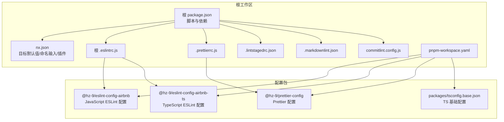
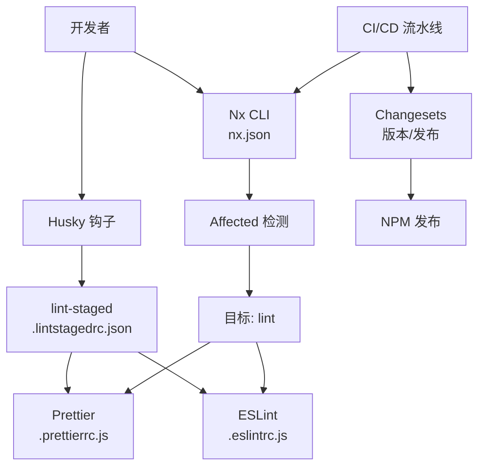
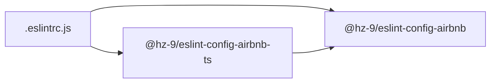
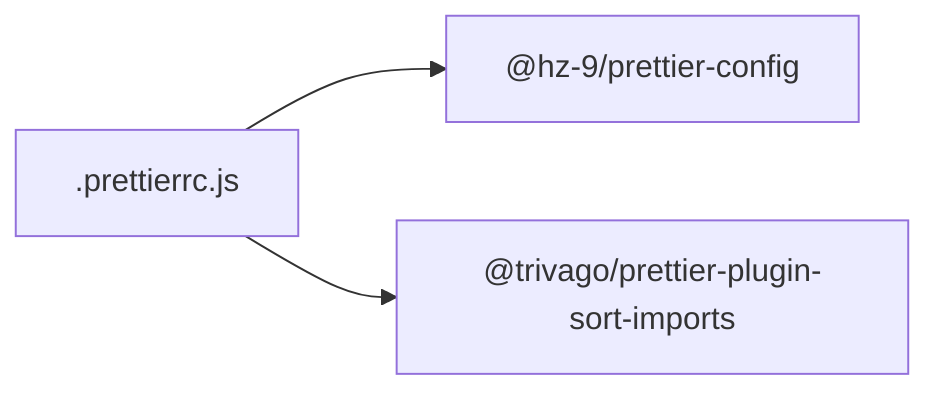
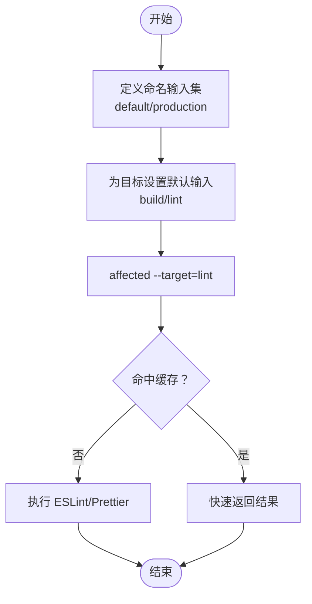
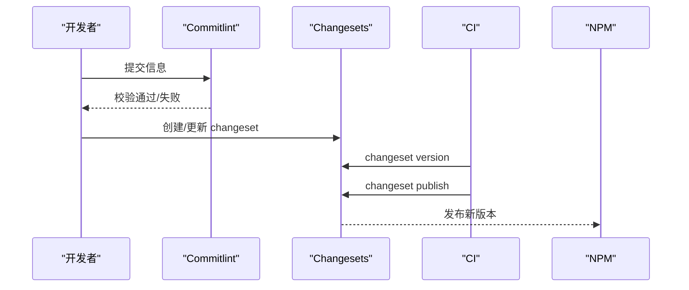
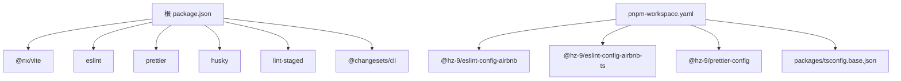

# 使用场景

<cite>
**本文引用的文件**
- [package.json](file://package.json)
- [nx.json](file://nx.json)
- [pnpm-workspace.yaml](file://pnpm-workspace.yaml)
- [.eslintrc.js](file://.eslintrc.js)
- [.prettierrc.js](file://.prettierrc.js)
- [.lintstagedrc.json](file://.lintstagedrc.json)
- [.markdownlint.json](file://.markdownlint.json)
- [commitlint.config.js](file://commitlint.config.js)
- [packages/eslint-config-airbnb/package.json](file://packages/eslint-config-airbnb/package.json)
- [packages/eslint-config-airbnb-ts/package.json](file://packages/eslint-config-airbnb-ts/package.json)
- [packages/prettier-config/package.json](file://packages/prettier-config/package.json)
- [packages/tsconfig.base.json](file://packages/tsconfig.base.json)
- [README.md](file://README.md)
- [README.zh-CN.md](file://README.zh-CN.md)
</cite>

## 目录
1. [简介](#简介)
2. [项目结构](#项目结构)
3. [核心组件](#核心组件)
4. [架构总览](#架构总览)
5. [详细组件分析](#详细组件分析)
6. [依赖分析](#依赖分析)
7. [性能考虑](#性能考虑)
8. [故障排查指南](#故障排查指南)
9. [结论](#结论)
10. [附录](#附录)

## 简介
本文件面向在不同开发环境与团队规模下使用 lint-nx 的工程团队，系统性阐述如何在大型 Nx 工作空间中统一代码质量标准，提升团队协作效率与一致性。lint-nx 以 Nx 为核心编排工具，结合 ESLint 与 Prettier 的可复用配置包，辅以 Husky、lint-staged、Changesets 等工具链，形成从本地提交到 CI/CD 的完整质量闭环。

## 项目结构
该仓库采用 pnpm workspace + Nx 的组织方式，核心由以下部分组成：
- 根级工作区脚本与工具：通过根级 package.json 统一管理脚本与依赖，包括构建、格式化、测试、版本发布等。
- Nx 配置：nx.json 定义了 targetDefaults、命名输入集与插件，确保 lint 命令与缓存、增量执行一致。
- 代码规范配置：
  - ESLint：根级 .eslintrc.js 引入 @hz-9/eslint-config-airbnb；另有 ts 版本包用于 TypeScript 项目。
  - Prettier：根级 .prettierrc.js 引入 @hz-9/prettier-config，并启用 import 排序插件。
  - Markdown：.markdownlint.json 控制文档风格检查规则。
  - 提交信息：commitlint.config.js 限制 scope 范围，配合 Changesets 进行版本与发布管理。
- 工作空间声明：pnpm-workspace.yaml 指定 packages/* 为工作区包目录。
- 公共 TS 基础配置：packages/tsconfig.base.json 提供基础编译选项，便于多项目共享。

图表来源
- [package.json:1-38](file://package.json#L1-L38)
- [nx.json:1-20](file://nx.json#L1-L20)
- [pnpm-workspace.yaml:1-6](file://pnpm-workspace.yaml#L1-L6)
- [.eslintrc.js:1-4](file://.eslintrc.js#L1-L4)
- [.prettierrc.js:1-15](file://.prettierrc.js#L1-L15)
- [.lintstagedrc.json:1-5](file://.lintstagedrc.json#L1-L5)
- [.markdownlint.json:1-11](file://.markdownlint.json#L1-L11)
- [commitlint.config.js:1-7](file://commitlint.config.js#L1-L7)
- [packages/eslint-config-airbnb/package.json:1-84](file://packages/eslint-config-airbnb/package.json#L1-L84)
- [packages/eslint-config-airbnb-ts/package.json:1-87](file://packages/eslint-config-airbnb-ts/package.json#L1-L87)
- [packages/prettier-config/package.json:1-45](file://packages/prettier-config/package.json#L1-L45)
- [packages/tsconfig.base.json:1-13](file://packages/tsconfig.base.json#L1-L13)

章节来源
- [README.md:1-45](file://README.md#L1-L45)
- [README.zh-CN.md:1-45](file://README.zh-CN.md#L1-L45)

## 核心组件
- ESLint 配置扩展
  - 根级 .eslintrc.js 引入 @hz-9/eslint-config-airbnb，覆盖 JS/TS 项目的规则基线。
  - packages/eslint-config-airbnb 与 packages/eslint-config-airbnb-ts 分别提供 JS 与 TS 的规则集与导出入口，支持 flat 与传统配置风格。
- Prettier 配置扩展
  - 根级 .prettierrc.js 合并 @hz-9/prettier-config，并启用 import 排序插件，定义 importOrder 等策略。
  - packages/prettier-config 作为独立包，提供可复用的 Prettier 规则与导出入口。
- Nx 目标与缓存
  - nx.json 中为 lint 目标配置输入集，确保 ESLint 配置变更触发重新 lint。
  - targetDefaults 为 build/lint 设置依赖与输入，提升增量与缓存命中率。
- 提交与版本
  - commitlint.config.js 限定 scope，保证变更范围清晰。
  - Changesets 用于版本号提升与变更日志生成，配合根级脚本完成发布流程。
- 文档风格
  - .markdownlint.json 对文档进行风格约束，避免过度严格或不一致的格式。

章节来源
- [.eslintrc.js:1-4](file://.eslintrc.js#L1-L4)
- [packages/eslint-config-airbnb/package.json:1-84](file://packages/eslint-config-airbnb/package.json#L1-L84)
- [packages/eslint-config-airbnb-ts/package.json:1-87](file://packages/eslint-config-airbnb-ts/package.json#L1-L87)
- [.prettierrc.js:1-15](file://.prettierrc.js#L1-L15)
- [packages/prettier-config/package.json:1-45](file://packages/prettier-config/package.json#L1-L45)
- [nx.json:1-20](file://nx.json#L1-L20)
- [commitlint.config.js:1-7](file://commitlint.config.js#L1-L7)
- [.markdownlint.json:1-11](file://.markdownlint.json#L1-L11)

## 架构总览
下图展示了 lint-nx 在本地与 CI 场景中的典型交互：开发者通过 Husky + lint-staged 在提交前自动格式化与修复；Nx 管理多包构建与受影响项目检测；ESLint/Prettier 应用统一规则；Changesets 参与版本与发布。

图表来源
- [.lintstagedrc.json:1-5](file://.lintstagedrc.json#L1-L5)
- [.prettierrc.js:1-15](file://.prettierrc.js#L1-L15)
- [.eslintrc.js:1-4](file://.eslintrc.js#L1-L4)
- [nx.json:1-20](file://nx.json#L1-L20)
- [package.json:5-16](file://package.json#L5-L16)
- [commitlint.config.js:1-7](file://commitlint.config.js#L1-L7)

## 详细组件分析

### ESLint 配置体系
- 配置扩展链路
  - 根级 .eslintrc.js 引入 @hz-9/eslint-config-airbnb，作为 JS/TS 的统一规则基线。
  - packages/eslint-config-airbnb-ts 依赖 @hz-9/eslint-config-airbnb，并引入 TS 解析器与插件，适配 TS 项目。
- 导出与分层
  - 两个配置包均提供多种导出入口（如 airbnb-base、airbnb-prettier、flat 系列），便于按需选择。
- 适用场景
  - 小型团队：直接使用 airbnb 或 airbnb-prettier 入口即可快速落地。
  - 大型 Nx 工作空间：通过 Nx targetDefaults 与 affected 精准定位变更项目，结合缓存提升 lint 性能。

图表来源
- [.eslintrc.js:1-4](file://.eslintrc.js#L1-L4)
- [packages/eslint-config-airbnb/package.json:1-84](file://packages/eslint-config-airbnb/package.json#L1-L84)
- [packages/eslint-config-airbnb-ts/package.json:1-87](file://packages/eslint-config-airbnb-ts/package.json#L1-L87)

章节来源
- [.eslintrc.js:1-4](file://.eslintrc.js#L1-L4)
- [packages/eslint-config-airbnb/package.json:1-84](file://packages/eslint-config-airbnb/package.json#L1-L84)
- [packages/eslint-config-airbnb-ts/package.json:1-87](file://packages/eslint-config-airbnb-ts/package.json#L1-L87)

### Prettier 配置体系
- 统一入口
  - 根级 .prettierrc.js 合并 @hz-9/prettier-config，确保团队内格式化行为一致。
- 导入排序增强
  - 启用 @trivago/prettier-plugin-sort-imports，并配置 importOrder、分隔与解析插件，减少手动整理成本。
- 适用场景
  - 前端/全栈：统一 JS/TS/JSON/CSS/Markdown 格式化，降低分歧。
  - 大型工作空间：与 lint-staged 结合，在提交阶段即规范化，缩短评审与回滚成本。

图表来源
- [.prettierrc.js:1-15](file://.prettierrc.js#L1-L15)
- [packages/prettier-config/package.json:1-45](file://packages/prettier-config/package.json#L1-L45)

章节来源
- [.prettierrc.js:1-15](file://.prettierrc.js#L1-L15)
- [packages/prettier-config/package.json:1-45](file://packages/prettier-config/package.json#L1-L45)

### Nx 目标与缓存策略
- 目标默认值
  - 为 build/lint 配置 inputs，确保 ESLint 配置变更触发重跑，同时利用 Nx 缓存与依赖拓扑。
- 命名输入集
  - default 与 production 输入集用于控制任务输入范围，提升增量构建与 lint 的准确性。
- 适用场景
  - 大型 Nx 工作空间：通过 affected --target=lint 快速定位受影响项目，显著缩短 CI 时间。

图表来源
- [nx.json:6-18](file://nx.json#L6-L18)

章节来源
- [nx.json:1-20](file://nx.json#L1-L20)

### 提交信息与版本发布
- 提交信息规范
  - commitlint.config.js 限制 scope，使变更范围明确，便于 Changesets 识别与生成变更日志。
- 版本与发布
  - 根级脚本集成 changeset、version、publish，实现自动化版本提升与发布。
- 适用场景
  - 团队协作：统一提交语言，降低沟通成本；自动化发布减少人为失误。

图表来源
- [commitlint.config.js:1-7](file://commitlint.config.js#L1-L7)
- [package.json:13-15](file://package.json#L13-L15)

章节来源
- [commitlint.config.js:1-7](file://commitlint.config.js#L1-L7)
- [package.json:13-15](file://package.json#L13-L15)

### 文档风格与 Markdown 规范
- .markdownlint.json 关闭部分严格规则，允许特定元素，兼顾可读性与一致性。
- 适用场景
  - 开源/文档驱动项目：在保证质量的同时，避免过度约束影响阅读体验。

章节来源
- [.markdownlint.json:1-11](file://.markdownlint.json#L1-L11)

## 依赖分析
- 工作空间与包
  - pnpm-workspace.yaml 指定 packages/* 为工作区，集中管理 @hz-9/eslint-config-airbnb、@hz-9/eslint-config-airbnb-ts、@hz-9/prettier-config 等包。
- 根级依赖
  - package.json 统一管理 Nx、ESLint、Prettier、Husky、lint-staged、Changesets 等工具，确保版本与 Node 版本要求一致。
- TS 基础配置
  - packages/tsconfig.base.json 提供通用编译选项，便于多项目共享，减少重复配置。

图表来源
- [package.json:17-32](file://package.json#L17-L32)
- [pnpm-workspace.yaml:4-6](file://pnpm-workspace.yaml#L4-L6)
- [packages/eslint-config-airbnb/package.json:1-84](file://packages/eslint-config-airbnb/package.json#L1-L84)
- [packages/eslint-config-airbnb-ts/package.json:1-87](file://packages/eslint-config-airbnb-ts/package.json#L1-L87)
- [packages/prettier-config/package.json:1-45](file://packages/prettier-config/package.json#L1-L45)
- [packages/tsconfig.base.json:1-13](file://packages/tsconfig.base.json#L1-L13)

章节来源
- [package.json:1-38](file://package.json#L1-L38)
- [pnpm-workspace.yaml:1-6](file://pnpm-workspace.yaml#L1-L6)
- [packages/tsconfig.base.json:1-13](file://packages/tsconfig.base.json#L1-L13)

## 性能考虑
- 增量与缓存
  - 利用 Nx 的 affected 与 targetDefaults，仅对变更项目执行 lint，显著缩短 CI 时间。
- 输入集优化
  - 将 .eslintrc* 与 .eslintignore 纳入 lint 输入集，确保规则变更时正确失效缓存。
- 提交阶段预处理
  - lint-staged 在本地提前格式化与修复，减少 CI 失败与回滚成本。

章节来源
- [nx.json:6-18](file://nx.json#L6-L18)
- [.lintstagedrc.json:1-5](file://.lintstagedrc.json#L1-L5)

## 故障排查指南
- Node 版本不匹配
  - 根级 engines 与 packageManager 指明 Node 版本范围与 pnpm 版本，安装前请确认满足要求。
- ESLint/Prettier 插件冲突
  - 若出现规则冲突，优先检查根级 .eslintrc.js 与 .prettierrc.js 的合并顺序与插件版本。
- 提交被拒绝
  - 检查 commitlint.scope-enum 是否包含当前 scope，必要时更新 scope 列表。
- 变更未触发 lint
  - 确认 nx.json 中 lint 输入集是否包含 .eslintrc* 与 .eslintignore；或使用 affected --target=lint 明确指定项目。
- 发布失败
  - 按顺序执行 changeset version 与 changeset publish，确保变更日志已生成且权限正常。

章节来源
- [package.json:33-37](file://package.json#L33-L37)
- [commitlint.config.js:3-5](file://commitlint.config.js#L3-L5)
- [nx.json:11-13](file://nx.json#L11-L13)
- [package.json:13-15](file://package.json#L13-L15)

## 结论
lint-nx 通过 Nx 的工程化能力与可复用的 ESLint/Prettier 配置包，为不同规模与类型的团队提供了统一的代码质量标准与高效协作路径。在大型 Nx 工作空间中，结合 affected、缓存与提交前校验，可显著提升开发效率与一致性；在团队协作中，通过标准化配置与自动化发布，降低沟通成本并稳定交付节奏。

## 附录

### 不同开发环境与团队规模的应用建议
- 小团队（1–5 人）
  - 直接使用根级 .eslintrc.js 与 .prettierrc.js，配合 Husky + lint-staged 即可快速落地。
  - 使用 affected --target=lint 在 PR 前进行最小化校验。
- 中团队（5–20 人）
  - 引入 @hz-9/eslint-config-airbnb-ts 以覆盖 TS 项目；为不同项目类型选择合适导出入口。
  - 在 CI 中增加缓存层，结合 Nx 的命名输入集提升命中率。
- 大团队（>20 人）
  - 将 lint 作为 CI 的强制步骤，禁止绕过；对关键规则进行白名单/例外管理，保持可操作性。
  - 使用 Changesets 管理版本节奏，定期同步主干与发布分支。

### 在大型 Nx 工作空间中统一标准
- 通过 nx.json 的 targetDefaults 与命名输入集，确保 lint 行为一致且可缓存。
- 将 .eslintrc* 与 .eslintignore 纳入 lint 输入，避免规则变更“漏检”。
- 使用 affected --target=lint 实现按需 lint，缩短 CI 时间。

### 团队协作中的标准化收益
- 减少代码评审中的格式与风格分歧，提升合并速度。
- 通过提交信息规范与 Changesets 自动化发布，降低发布风险与沟通成本。

### 面向不同项目类型的具体应用
- 前端项目
  - 使用 @hz-9/eslint-config-airbnb 与 Prettier 统一 JS/TS/JSX/TSX 格式化与规则。
- 后端项目（Node/TS）
  - 使用 @hz-9/eslint-config-airbnb-ts 并结合 tsconfig.base.json，确保类型安全与风格一致。
- 全栈项目
  - 前端与后端分别应用对应配置包，共享公共 TS 基础配置，避免重复维护。

### 定制化配置参数指南
- ESLint
  - 在根级 .eslintrc.js 中添加或覆盖规则；按需选择 airbnb-base、airbnb-prettier 或 flat 系列入口。
- Prettier
  - 在 .prettierrc.js 中调整 importOrder、分隔符与解析插件，以适配团队导入习惯。
- 提交信息
  - 在 commitlint.config.js 的 scope-enum 中补充团队/模块 scope，确保提交信息清晰。

### CI/CD 集成最佳实践
- 触发策略
  - 主干保护：lint 与测试必须通过方可合并；PR 仅运行 affected --target=lint。
- 缓存与性能
  - 为 Nx 与 Prettier 配置建立缓存键，避免不必要的重建。
- 发布流程
  - 使用 Changesets 在 CI 中执行 changeset version 与 publish，确保版本与日志一致。

### 迁移指南与升级路径
- 从自定义配置迁移到 lint-nx
  - 替换现有 .eslintrc 与 .prettierrc 为根级配置，逐步引入 @hz-9/* 配置包。
  - 在 pnpm-workspace.yaml 中声明 packages/*，并在根级 package.json 中安装依赖。
- 升级路径
  - 优先升级 Nx 与 ESLint/Prettier 至兼容版本；更新 .eslintrc.js 与 .prettierrc.js 的入口与插件配置。
  - 使用 affected --target=lint 验证升级后的规则与性能表现。

### 实际效果与收益对比（示例维度）
- 本地效率
  - 提交前自动格式化与修复，减少 CI 失败与二次修改。
- CI 时间
  - 通过 affected 与缓存，将 lint 时间从分钟级降至秒级（视项目规模而定）。
- 一致性
  - 统一规则与格式化，降低评审分歧与历史债积累。
- 发布稳定性
  - Changesets 自动生成变更日志，减少遗漏与冲突。

章节来源
- [README.md:7-36](file://README.md#L7-L36)
- [README.zh-CN.md:7-36](file://README.zh-CN.md#L7-L36)
- [package.json:5-16](file://package.json#L5-L16)
- [nx.json:6-18](file://nx.json#L6-L18)
- [.lintstagedrc.json:1-5](file://.lintstagedrc.json#L1-L5)
- [commitlint.config.js:1-7](file://commitlint.config.js#L1-L7)