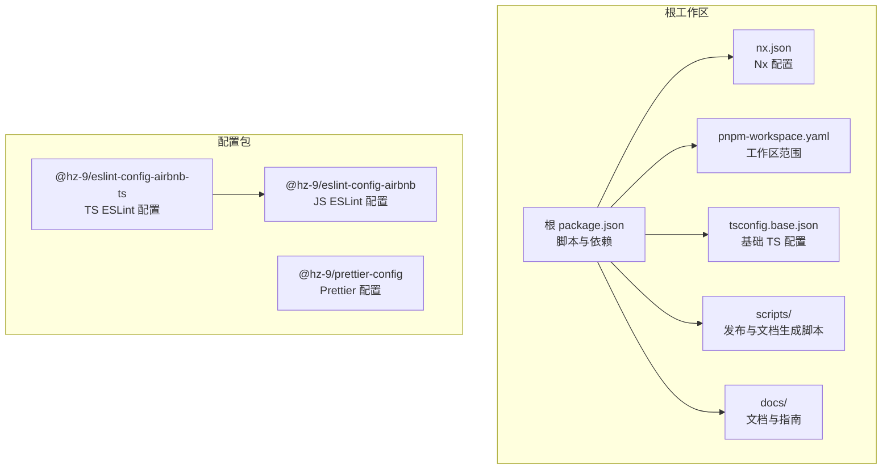
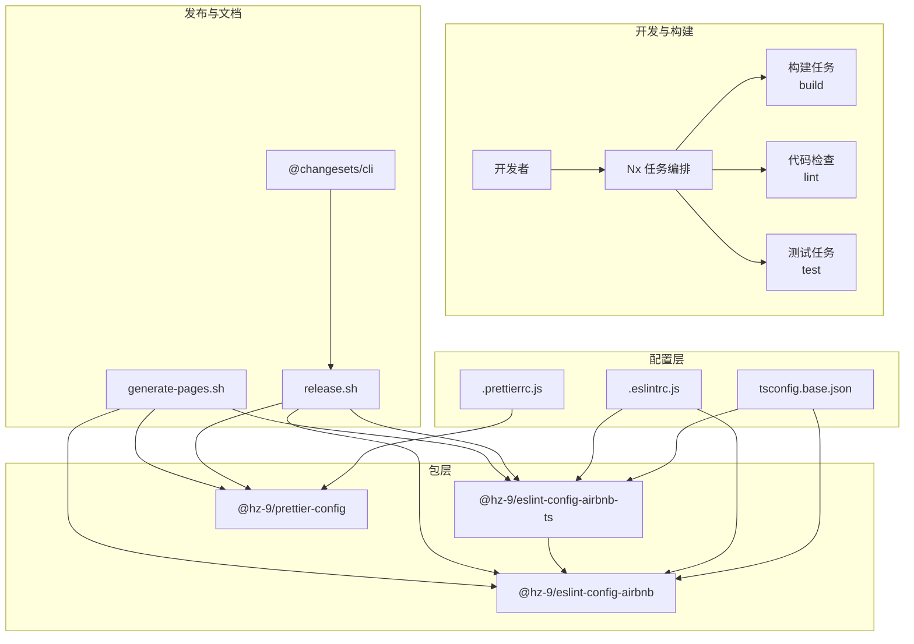
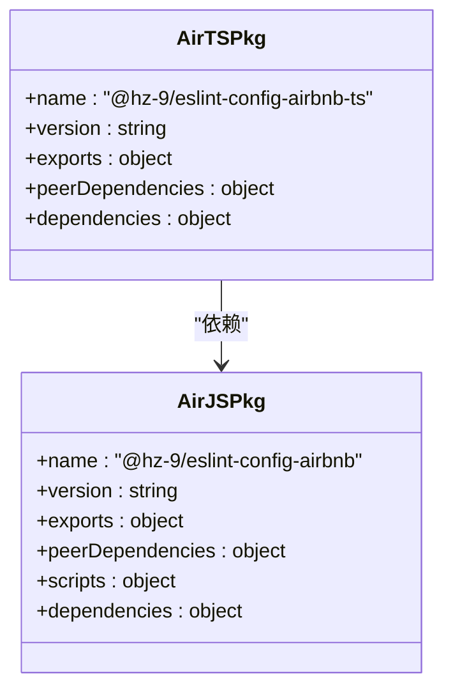
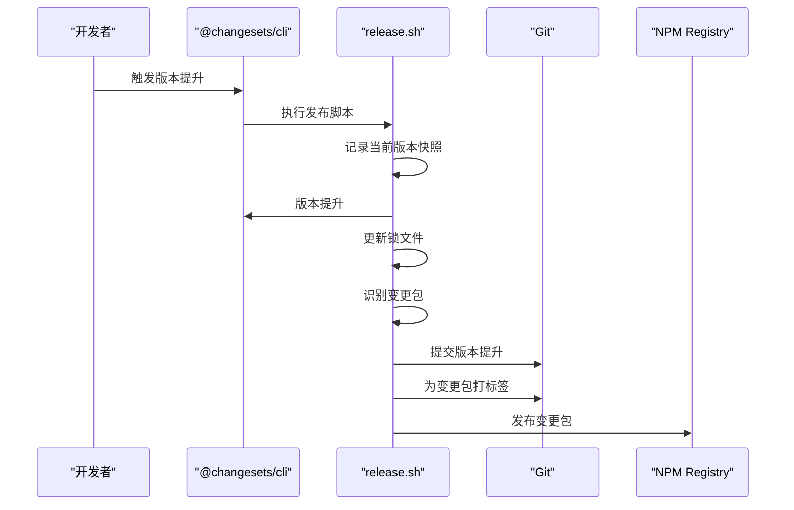
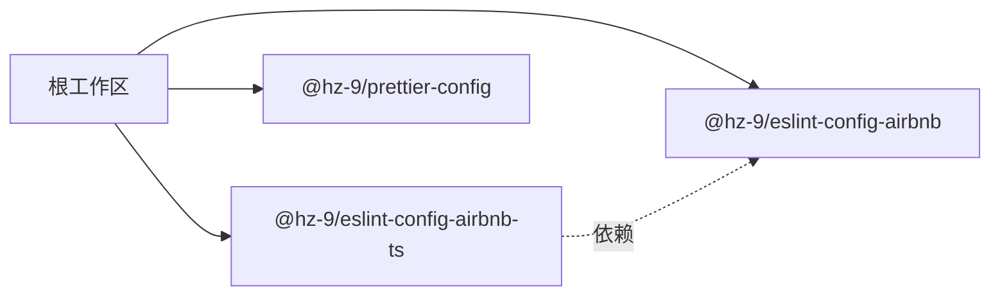

# 架构概览

<cite>
**本文档引用的文件**
- [package.json](file://package.json)
- [nx.json](file://nx.json)
- [pnpm-workspace.yaml](file://pnpm-workspace.yaml)
- [packages/tsconfig.base.json](file://packages/tsconfig.base.json)
- [packages/eslint-config-airbnb/package.json](file://packages/eslint-config-airbnb/package.json)
- [packages/eslint-config-airbnb-ts/package.json](file://packages/eslint-config-airbnb-ts/package.json)
- [packages/prettier-config/package.json](file://packages/prettier-config/package.json)
- [.eslintrc.js](file://.eslintrc.js)
- [.prettierrc.js](file://.prettierrc.js)
- [scripts/release.sh](file://scripts/release.sh)
- [scripts/generate-pages.sh](file://scripts/generate-pages.sh)
- [README.md](file://README.md)
</cite>

## 目录
1. [引言](#引言)
2. [项目结构](#项目结构)
3. [核心组件](#核心组件)
4. [架构总览](#架构总览)
5. [详细组件分析](#详细组件分析)
6. [依赖关系分析](#依赖关系分析)
7. [性能考虑](#性能考虑)
8. [故障排除指南](#故障排除指南)
9. [结论](#结论)
10. [附录](#附录)

## 引言
lint-nx 是一个基于 Nx 的 monorepo 工作区，专注于提供统一的 JavaScript/TypeScript 代码规范（ESLint + Prettier）配置集合。该项目采用 pnpm workspace 进行包管理，通过 Nx 的元数据管理和增量构建能力实现高效的开发与发布流程。工作区包含三个核心包：JavaScript ESLint 配置、TypeScript ESLint 配置以及 Prettier 配置，并通过共享的 tsconfig 基础配置确保类型检查一致性。

## 项目结构
项目采用典型的 Nx monorepo 结构，根目录包含工作区配置、脚本和文档，packages 目录下集中管理所有可发布的配置包。pnpm workspace 将 packages/* 设为工作区范围，配合 Nx 的任务编排实现跨包的构建、测试和发布。

**图表来源**
- [package.json:1-38](file://package.json#L1-L38)
- [nx.json:1-20](file://nx.json#L1-L20)
- [pnpm-workspace.yaml:1-6](file://pnpm-workspace.yaml#L1-L6)
- [packages/tsconfig.base.json:1-13](file://packages/tsconfig.base.json#L1-L13)

**章节来源**
- [package.json:1-38](file://package.json#L1-L38)
- [nx.json:1-20](file://nx.json#L1-L20)
- [pnpm-workspace.yaml:1-6](file://pnpm-workspace.yaml#L1-L6)
- [packages/tsconfig.base.json:1-13](file://packages/tsconfig.base.json#L1-L13)
- [README.md:1-45](file://README.md#L1-L45)

## 核心组件
- 根工作区配置：统一管理脚本、Nx 元数据、pnpm 工作区范围和共享 TypeScript 配置。
- ESLint 配置包（JavaScript/TypeScript）：提供 Airbnb 风格的规则集，支持传统与 Flat 配置格式。
- Prettier 配置包：提供统一的代码格式化规则与导入排序插件集成。
- 发布与文档脚本：自动化版本管理、变更集生成、文档同步与站点构建。

**章节来源**
- [packages/eslint-config-airbnb/package.json:1-84](file://packages/eslint-config-airbnb/package.json#L1-L84)
- [packages/eslint-config-airbnb-ts/package.json:1-87](file://packages/eslint-config-airbnb-ts/package.json#L1-L87)
- [packages/prettier-config/package.json:1-45](file://packages/prettier-config/package.json#L1-L45)
- [scripts/release.sh:1-73](file://scripts/release.sh#L1-L73)
- [scripts/generate-pages.sh:1-56](file://scripts/generate-pages.sh#L1-L56)

## 架构总览
该架构围绕“配置即代码”的理念设计，通过以下机制实现统一规范与高效交付：

- monorepo 与包管理：pnpm workspace 管理本地包依赖与发布范围；根 package.json 提供统一脚本入口。
- Nx 元数据与增量构建：nx.json 定义目标默认行为与输入缓存，结合 changesets 实现版本与发布自动化。
- 配置共享与继承：tsconfig.base.json 作为基础编译选项，各包通过 peerDependencies 与 exports 字段暴露接口。
- 文档与发布：generate-pages.sh 同步各包文档并构建文档站点；release.sh 负责版本快照、打标签与提交。

**图表来源**
- [nx.json:1-20](file://nx.json#L1-L20)
- [packages/tsconfig.base.json:1-13](file://packages/tsconfig.base.json#L1-L13)
- [.eslintrc.js:1-4](file://.eslintrc.js#L1-L4)
- [.prettierrc.js:1-15](file://.prettierrc.js#L1-L15)
- [packages/eslint-config-airbnb-ts/package.json:66-70](file://packages/eslint-config-airbnb-ts/package.json#L66-L70)
- [scripts/release.sh:1-73](file://scripts/release.sh#L1-L73)
- [scripts/generate-pages.sh:1-56](file://scripts/generate-pages.sh#L1-L56)

## 详细组件分析

### ESLint 配置包（JavaScript）
- 包特性：提供多种导出路径（基础规则、与 Prettier 集成等），支持传统与 Flat 配置格式。
- 依赖关系：通过 peerDependencies 与 ESLint 版本对齐，避免重复安装；内部使用 esbuild 进行构建。
- 导出结构：通过 exports 字段暴露不同配置变体，便于按需引入。

**图表来源**
- [packages/eslint-config-airbnb/package.json:1-84](file://packages/eslint-config-airbnb/package.json#L1-L84)
- [packages/eslint-config-airbnb-ts/package.json:1-87](file://packages/eslint-config-airbnb-ts/package.json#L1-L87)

**章节来源**
- [packages/eslint-config-airbnb/package.json:1-84](file://packages/eslint-config-airbnb/package.json#L1-L84)
- [.eslintrc.js:1-4](file://.eslintrc.js#L1-L4)

### ESLint 配置包（TypeScript）
- 包特性：在 JS 基础上扩展 TypeScript 解析器与插件，提供 TS 专用规则与 Flat 配置支持。
- 依赖关系：显式依赖 JS ESLint 配置包，形成继承链；通过 peerDependencies 与 ESLint 和 TypeScript 对齐。
- 构建流程：使用 esbuild 将源码构建为 CommonJS 与 ES Module 双格式产物。

**章节来源**
- [packages/eslint-config-airbnb-ts/package.json:1-87](file://packages/eslint-config-airbnb-ts/package.json#L1-L87)

### Prettier 配置包
- 包特性：提供统一的格式化规则与导入排序插件，通过 exports 暴露主入口。
- 依赖关系：依赖 @trivago/prettier-plugin-sort-imports 插件；通过 peerDependencies 与 Prettier 对齐。
- 使用方式：根目录 .prettierrc.js 通过 require 加载配置并追加插件与排序规则。

**章节来源**
- [packages/prettier-config/package.json:1-45](file://packages/prettier-config/package.json#L1-L45)
- [.prettierrc.js:1-15](file://.prettierrc.js#L1-L15)

### 发布与版本管理
- 版本快照：release.sh 在版本提升前后记录各包版本，用于识别变更包。
- 锁文件更新：版本提升后执行 lockfile-only 安装，确保依赖锁定一致。
- 标签与提交：为每个变更包创建独立标签并提交版本提升变更。
- 发布流程：保留发布步骤以便后续执行 npm 发布与远程推送。

**图表来源**
- [scripts/release.sh:1-73](file://scripts/release.sh#L1-L73)

**章节来源**
- [scripts/release.sh:1-73](file://scripts/release.sh#L1-L73)

### 文档生成与同步
- 同步流程：generate-pages.sh 构建所有包后，从各包复制文档与变更日志到 docs 目录。
- 构建站点：使用 @hz-9/docs-build 按配置构建文档站点，支持多语言与导航生成。

**章节来源**
- [scripts/generate-pages.sh:1-56](file://scripts/generate-pages.sh#L1-L56)

## 依赖关系分析
- 包间依赖：TypeScript ESLint 配置包显式依赖 JavaScript ESLint 配置包，形成清晰的继承关系。
- 外部依赖：各包通过 peerDependencies 与 ESLint、TypeScript、Prettier 对齐版本，减少重复依赖。
- 工作区依赖：pnpm workspace 将 packages/* 设为工作区范围，支持 workspace:* 语法进行本地包引用。

**图表来源**
- [packages/eslint-config-airbnb-ts/package.json:66-70](file://packages/eslint-config-airbnb-ts/package.json#L66-L70)
- [pnpm-workspace.yaml:1-6](file://pnpm-workspace.yaml#L1-L6)

**章节来源**
- [packages/eslint-config-airbnb-ts/package.json:66-70](file://packages/eslint-config-airbnb-ts/package.json#L66-L70)
- [pnpm-workspace.yaml:1-6](file://pnpm-workspace.yaml#L1-L6)

## 性能考虑
- 增量构建：Nx 通过 targetDefaults 与 namedInputs 缓存构建与检查任务的输入，显著减少重复计算。
- 并行执行：run-many 脚本允许同时对多个包执行相同目标，充分利用多核资源。
- 依赖拓扑：构建任务自动遵循依赖拓扑，避免不必要的重复构建。
- 锁文件优化：发布前更新锁文件，确保依赖解析稳定，减少安装时间波动。

**章节来源**
- [nx.json:6-18](file://nx.json#L6-L18)
- [package.json:7-15](file://package.json#L7-L15)

## 故障排除指南
- 版本未更新：确认 changesets 已正确生成变更集并执行版本提升脚本。
- 锁文件不一致：运行 lockfile-only 安装以同步依赖版本。
- 文档未更新：检查 generate-pages.sh 是否成功复制各包文档与变更日志。
- ESLint/Prettier 冲突：确保根配置与各包配置版本匹配，避免 peerDependencies 不兼容。

**章节来源**
- [scripts/release.sh:20-46](file://scripts/release.sh#L20-L46)
- [scripts/generate-pages.sh:21-51](file://scripts/generate-pages.sh#L21-L51)

## 结论
lint-nx 通过 Nx 与 pnpm 的组合实现了高内聚、低耦合的配置包体系。统一的 tsconfig 基础配置与 peerDependencies 策略保证了跨包的一致性与可维护性。借助 Nx 的元数据管理与增量构建能力，团队可以高效地维护多语言（JavaScript/TypeScript）与多框架场景下的代码规范统一，同时通过 changesets 与自动化脚本实现稳定的版本与发布流程。

## 附录
- 快速开始：安装依赖、全量检查、全量构建、格式化、查看依赖图谱、仅对变更项目执行检查、创建变更集、版本提升与发布。
- 包列表：JavaScript ESLint 配置、TypeScript ESLint 配置、Prettier 配置。

**章节来源**
- [README.md:7-36](file://README.md#L7-L36)
- [README.md:38-45](file://README.md#L38-L45)