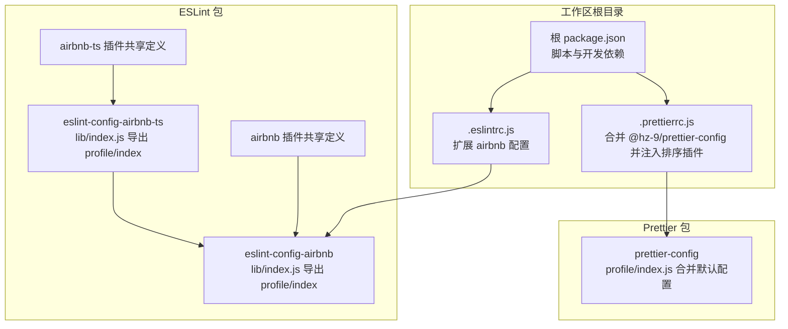
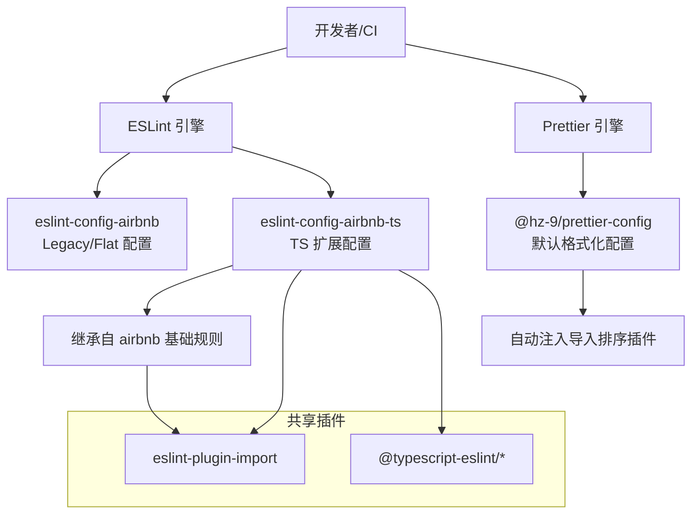
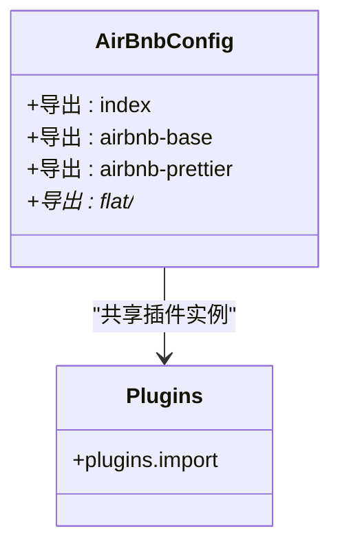
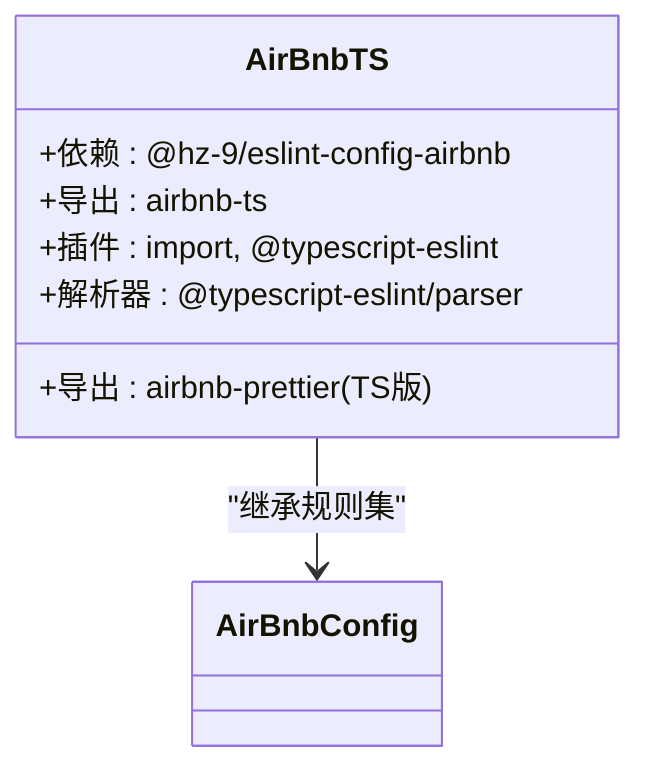
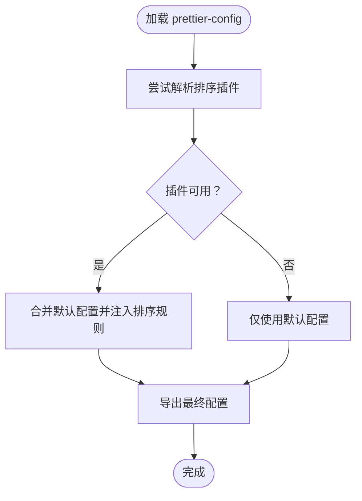
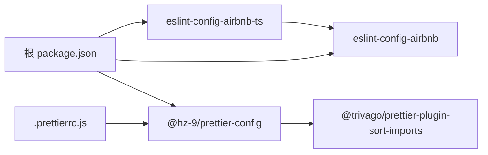

# 核心特性

<cite>
**本文引用的文件**
- [packages/eslint-config-airbnb/package.json](file://packages/eslint-config-airbnb/package.json)
- [packages/eslint-config-airbnb-ts/package.json](file://packages/eslint-config-airbnb-ts/package.json)
- [packages/prettier-config/package.json](file://packages/prettier-config/package.json)
- [packages/eslint-config-airbnb/lib/index.js](file://packages/eslint-config-airbnb/lib/index.js)
- [packages/eslint-config-airbnb-ts/lib/index.js](file://packages/eslint-config-airbnb-ts/lib/index.js)
- [packages/prettier-config/profile/index.js](file://packages/prettier-config/profile/index.js)
- [packages/eslint-config-airbnb/lib/plugins.js](file://packages/eslint-config-airbnb/lib/plugins.js)
- [packages/eslint-config-airbnb-ts/lib/plugins.js](file://packages/eslint-config-airbnb-ts/lib/plugins.js)
- [packages/tsconfig.base.json](file://packages/tsconfig.base.json)
- [package.json](file://package.json)
- [.eslintrc.js](file://.eslintrc.js)
- [.prettierrc.js](file://.prettierrc.js)
</cite>

## 目录
1. [简介](#简介)
2. [项目结构](#项目结构)
3. [核心组件](#核心组件)
4. [架构总览](#架构总览)
5. [详细组件分析](#详细组件分析)
6. [依赖关系分析](#依赖关系分析)
7. [性能与可维护性考量](#性能与可维护性考量)
8. [故障排查指南](#故障排查指南)
9. [结论](#结论)
10. [附录](#附录)

## 简介
本项目为一个基于 Nx 的多包工作区，提供统一的 JavaScript/TypeScript 代码质量解决方案，核心由三个包组成：
- eslint-config-airbnb：面向 JavaScript 的 AirBnB 风格 ESLint 配置集（含 Flat Config 支持）
- eslint-config-airbnb-ts：面向 TypeScript 的 AirBnB 风格 ESLint 配置集（在 airbnb 基础上增强 TS 能力）
- prettier-config：统一的 Prettier 格式化配置，并集成导入顺序排序插件

这三个包协同工作，通过 ESLint 实现语法与风格规则检查，通过 Prettier 统一格式化输出，形成从“规则约束”到“格式统一”的完整质量闭环。

## 项目结构
工作区采用 Nx 管理多包，顶层脚本与根级配置负责构建、格式化与发布；三个核心包分别位于 packages 目录下，各自提供 CommonJS 与 ESM 导出，支持 Flat Config 与 Legacy Config 两种模式。

图表来源
- [package.json:1-38](file://package.json#L1-L38)
- [.eslintrc.js:1-4](file://.eslintrc.js#L1-L4)
- [.prettierrc.js:1-15](file://.prettierrc.js#L1-L15)
- [packages/eslint-config-airbnb/lib/index.js:1-2](file://packages/eslint-config-airbnb/lib/index.js#L1-L2)
- [packages/eslint-config-airbnb-ts/lib/index.js:1-2](file://packages/eslint-config-airbnb-ts/lib/index.js#L1-L2)
- [packages/prettier-config/profile/index.js:1-30](file://packages/prettier-config/profile/index.js#L1-L30)
- [packages/eslint-config-airbnb/lib/plugins.js:1-8](file://packages/eslint-config-airbnb/lib/plugins.js#L1-L8)
- [packages/eslint-config-airbnb-ts/lib/plugins.js:1-16](file://packages/eslint-config-airbnb-ts/lib/plugins.js#L1-L16)

章节来源
- [package.json:1-38](file://package.json#L1-L38)
- [.eslintrc.js:1-4](file://.eslintrc.js#L1-L4)
- [.prettierrc.js:1-15](file://.prettierrc.js#L1-L15)

## 核心组件
- eslint-config-airbnb
  - 角色：提供 JavaScript/AirBnB 风格的 ESLint 配置，导出 CommonJS 与 ESM，支持 Legacy 与 Flat Config 两种入口
  - 关键点：通过 exports 字段暴露多个子路径导出，便于按需选择基础配置或与 Prettier 组合的配置
  - 依赖：eslint-plugin-import、eslint 作为 peerDependencies，确保与 ESLint 版本兼容
  - 入口映射：lib/index.js -> lib/profile/index.js

- eslint-config-airbnb-ts
  - 角色：在 airbnb 基础上扩展 TypeScript 支持，提供 TS 解析器与 TS ESLint 插件
  - 关键点：显式依赖 @hz-9/eslint-config-airbnb，形成继承关系；同时导出 TS 专用配置与 Flat Config 变体
  - 依赖：@typescript-eslint/eslint-plugin、@typescript-eslint/parser、eslint、typescript（peerDependencies）

- prettier-config
  - 角色：提供统一的 Prettier 默认配置，并尝试自动启用导入顺序排序插件
  - 关键点：动态检测 @trivago/prettier-plugin-sort-imports 是否可用，若存在则注入 importOrder 等规则
  - 依赖：@trivago/prettier-plugin-sort-imports（作为依赖），prettier（peerDependencies）

章节来源
- [packages/eslint-config-airbnb/package.json:1-84](file://packages/eslint-config-airbnb/package.json#L1-L84)
- [packages/eslint-config-airbnb-ts/package.json:1-87](file://packages/eslint-config-airbnb-ts/package.json#L1-L87)
- [packages/prettier-config/package.json:1-45](file://packages/prettier-config/package.json#L1-L45)
- [packages/eslint-config-airbnb/lib/index.js:1-2](file://packages/eslint-config-airbnb/lib/index.js#L1-L2)
- [packages/eslint-config-airbnb-ts/lib/index.js:1-2](file://packages/eslint-config-airbnb-ts/lib/index.js#L1-L2)

## 架构总览
整体架构围绕“配置即包”的理念设计，三个包职责清晰、层次分明：
- ESLint 层：airbnb 与 airbnb-ts 提供规则集；plugins.js 定义共享插件实例，提升 Flat Config 下的复用性
- Prettier 层：prettier-config 提供默认格式化策略，并在运行时自动启用导入排序
- 工作区层：根级 .eslintrc.js 与 .prettierrc.js 将上述包整合到实际项目中

图表来源
- [packages/eslint-config-airbnb/lib/plugins.js:1-8](file://packages/eslint-config-airbnb/lib/plugins.js#L1-L8)
- [packages/eslint-config-airbnb-ts/lib/plugins.js:1-16](file://packages/eslint-config-airbnb-ts/lib/plugins.js#L1-L16)
- [packages/prettier-config/profile/index.js:1-30](file://packages/prettier-config/profile/index.js#L1-L30)
- [packages/eslint-config-airbnb/package.json:20-54](file://packages/eslint-config-airbnb/package.json#L20-L54)
- [packages/eslint-config-airbnb-ts/package.json:21-55](file://packages/eslint-config-airbnb-ts/package.json#L21-L55)

## 详细组件分析

### eslint-config-airbnb 分析
- 导出与入口
  - 通过 exports 字段提供多种入口，包括基础 airbnb-base、与 Prettier 组合的 airbnb-prettier，以及 Flat Config 对应变体
  - 入口文件 lib/index.js 指向 profile/index，便于统一消费
- 插件共享
  - plugins.js 暴露共享的 import 插件实例，减少重复解析成本，提升 Flat Config 性能
- 适用场景
  - 适用于纯 JavaScript 项目或需要 AirBnB 风格规则的混合项目
  - 结合 Prettier 使用时，可通过 airbnb-prettier 入口避免重复规则冲突

图表来源
- [packages/eslint-config-airbnb/package.json:20-54](file://packages/eslint-config-airbnb/package.json#L20-L54)
- [packages/eslint-config-airbnb/lib/plugins.js:1-8](file://packages/eslint-config-airbnb/lib/plugins.js#L1-L8)

章节来源
- [packages/eslint-config-airbnb/package.json:1-84](file://packages/eslint-config-airbnb/package.json#L1-L84)
- [packages/eslint-config-airbnb/lib/plugins.js:1-8](file://packages/eslint-config-airbnb/lib/plugins.js#L1-L8)

### eslint-config-airbnb-ts 分析
- 继承与扩展
  - 显式依赖 @hz-9/eslint-config-airbnb，继承其规则集
  - 在自身 plugins.js 中引入 @typescript-eslint/eslint-plugin 与 @typescript-eslint/parser，提供 TS 专属规则与解析能力
- 导出与入口
  - 提供 airbnb-ts 与 airbnb-prettier（TS 版本）等入口，适配 TS 项目
- 适用场景
  - TypeScript 项目优先选择该配置，以获得类型安全相关的规则覆盖

图表来源
- [packages/eslint-config-airbnb-ts/package.json:66-70](file://packages/eslint-config-airbnb-ts/package.json#L66-L70)
- [packages/eslint-config-airbnb-ts/lib/plugins.js:1-16](file://packages/eslint-config-airbnb-ts/lib/plugins.js#L1-L16)

章节来源
- [packages/eslint-config-airbnb-ts/package.json:1-87](file://packages/eslint-config-airbnb-ts/package.json#L1-L87)
- [packages/eslint-config-airbnb-ts/lib/plugins.js:1-16](file://packages/eslint-config-airbnb-ts/lib/plugins.js#L1-L16)

### prettier-config 分析
- 动态插件注入
  - 在 profile/index.js 中尝试 resolve @trivago/prettier-plugin-sort-imports，若存在则自动启用导入排序相关配置
  - 自动注入 importOrder、importOrderSeparation、importOrderSortSpecifiers、importOrderGroupNamespaceSpecifiers、importOrderParserPlugins 等规则
- 默认配置合并
  - 通过展开 default.js 的默认值，保证在未安装排序插件时仍可提供基础格式化能力
- 适用场景
  - 任何需要统一格式化的项目，尤其强调导入顺序规范的团队协作

图表来源
- [packages/prettier-config/profile/index.js:1-30](file://packages/prettier-config/profile/index.js#L1-L30)

章节来源
- [packages/prettier-config/package.json:1-45](file://packages/prettier-config/package.json#L1-L45)
- [packages/prettier-config/profile/index.js:1-30](file://packages/prettier-config/profile/index.js#L1-L30)

## 依赖关系分析
- 包间依赖
  - eslint-config-airbnb-ts 依赖 @hz-9/eslint-config-airbnb，形成“基础规则 + TS 扩展”的继承链
  - prettier-config 依赖 @trivago/prettier-plugin-sort-imports（作为依赖），但对 Prettier 本身声明为 peerDependencies，避免重复安装
- 运行时依赖
  - 根 package.json 声明了工作区内的开发依赖与引擎版本要求，确保 Node 与工具链版本一致
- 导入顺序排序插件
  - 根级 .prettierrc.js 显式注入排序插件与 importOrder 规则，覆盖 prettier-config 的默认行为，体现“全局默认 + 项目定制”的组合策略

图表来源
- [packages/eslint-config-airbnb-ts/package.json:66-70](file://packages/eslint-config-airbnb-ts/package.json#L66-L70)
- [packages/prettier-config/package.json:32-34](file://packages/prettier-config/package.json#L32-L34)
- [package.json:17-32](file://package.json#L17-L32)
- [.prettierrc.js:6-14](file://.prettierrc.js#L6-L14)

章节来源
- [packages/eslint-config-airbnb-ts/package.json:1-87](file://packages/eslint-config-airbnb-ts/package.json#L1-L87)
- [packages/prettier-config/package.json:1-45](file://packages/prettier-config/package.json#L1-L45)
- [package.json:1-38](file://package.json#L1-L38)
- [.prettierrc.js:1-15](file://.prettierrc.js#L1-L15)

## 性能与可维护性考量
- 插件共享与 Flat Config
  - 通过 plugins.js 暴露共享插件实例，减少重复初始化开销，提升 ESLint 在 Flat Config 下的启动与执行效率
- 动态插件检测
  - prettier-config 在 profile/index.js 中进行插件可用性检测，避免在缺失插件时产生错误，提高可维护性与容错性
- 版本与引擎约束
  - 各包均声明 engines 与 peerDependencies，确保在指定 Node 与工具链版本范围内稳定运行，降低环境差异导致的问题

## 故障排查指南
- Prettier 排序插件未生效
  - 检查是否已安装 @trivago/prettier-plugin-sort-imports；若未安装，prettier-config 将回退到默认配置
  - 确认根级 .prettierrc.js 中的 plugins 与 importOrder 设置是否正确
- ESLint 规则冲突
  - 若同时使用 airbnb 与 airbnb-prettier，请确认仅保留一种入口，避免重复规则导致的冲突
  - 对于 TypeScript 项目，优先使用 eslint-config-airbnb-ts，确保 TS 解析器与插件正确加载
- Node/工具链版本不匹配
  - 检查 engines 与 peerDependencies 约束，确保 Node 与 ESLint/Prettier/TypeScript 版本满足要求

章节来源
- [packages/prettier-config/profile/index.js:1-30](file://packages/prettier-config/profile/index.js#L1-L30)
- [packages/eslint-config-airbnb/package.json:74-79](file://packages/eslint-config-airbnb/package.json#L74-L79)
- [packages/eslint-config-airbnb-ts/package.json:76-79](file://packages/eslint-config-airbnb-ts/package.json#L76-L79)
- [package.json:33-37](file://package.json#L33-L37)

## 结论
本项目通过三个核心包实现了“AirBnB 风格规则 + TypeScript 增强 + 统一格式化”的一体化代码质量方案。eslint-config-airbnb 与 eslint-config-airbnb-ts 提供从基础到 TS 的完整规则矩阵，prettier-config 则在格式层面提供默认与智能增强。配合工作区根级配置，团队可在不同项目类型中快速落地一致的质量标准。

## 附录
- 配置示例与使用场景（以路径代替具体代码）
  - JavaScript 项目（AirBnB 风格）
    - 入口参考：[packages/eslint-config-airbnb/lib/index.js:1-2](file://packages/eslint-config-airbnb/lib/index.js#L1-L2)
    - 根级 ESLint 配置参考：[.eslintrc.js:1-4](file://.eslintrc.js#L1-L4)
  - TypeScript 项目（AirBnB 风格 + TS 增强）
    - 入口参考：[packages/eslint-config-airbnb-ts/lib/index.js:1-2](file://packages/eslint-config-airbnb-ts/lib/index.js#L1-L2)
    - 插件与解析器参考：[packages/eslint-config-airbnb-ts/lib/plugins.js:1-16](file://packages/eslint-config-airbnb-ts/lib/plugins.js#L1-L16)
  - 统一格式化（含导入排序）
    - 默认配置与插件注入参考：[packages/prettier-config/profile/index.js:1-30](file://packages/prettier-config/profile/index.js#L1-L30)
    - 根级 Prettier 配置参考：[.prettierrc.js:1-15](file://.prettierrc.js#L1-L15)
  - TypeScript 基础编译选项（如需统一 TS 行为）
    - 参考：[packages/tsconfig.base.json:1-13](file://packages/tsconfig.base.json#L1-L13)
  - 工作区脚本与依赖
    - 参考：[package.json:5-16](file://package.json#L5-L16)