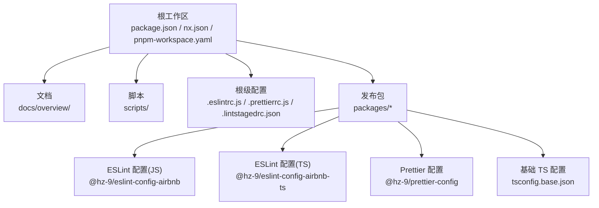
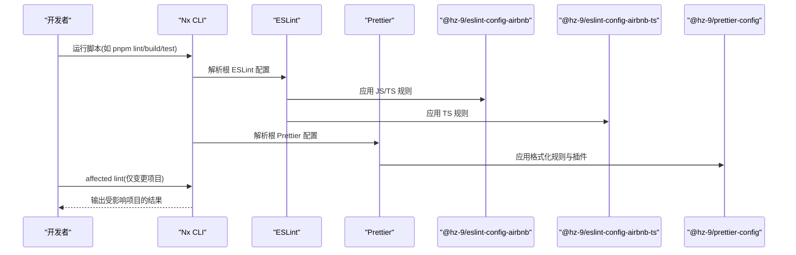
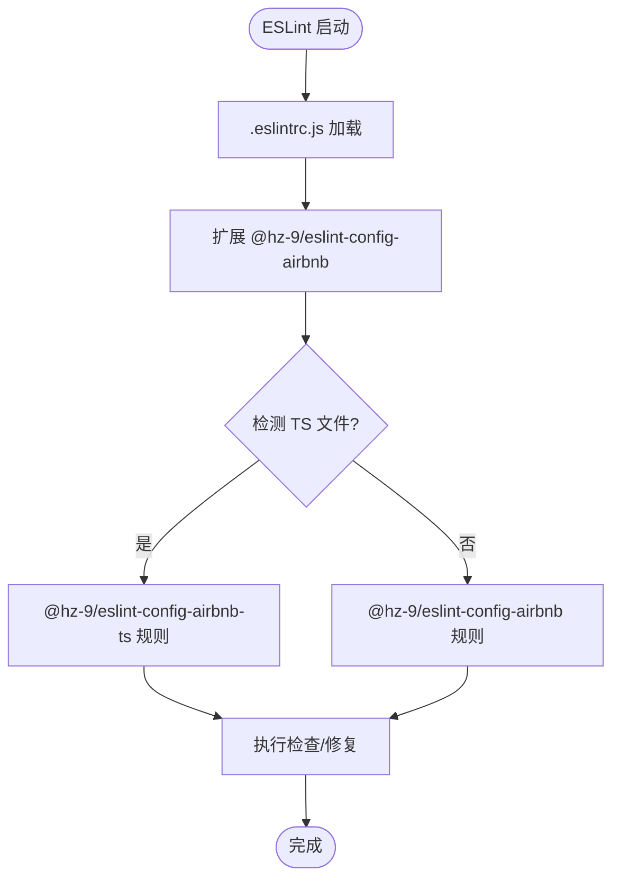
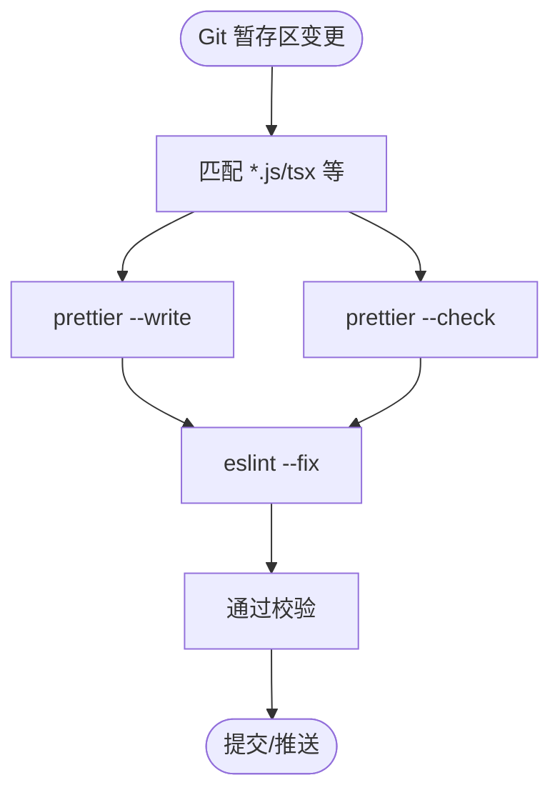
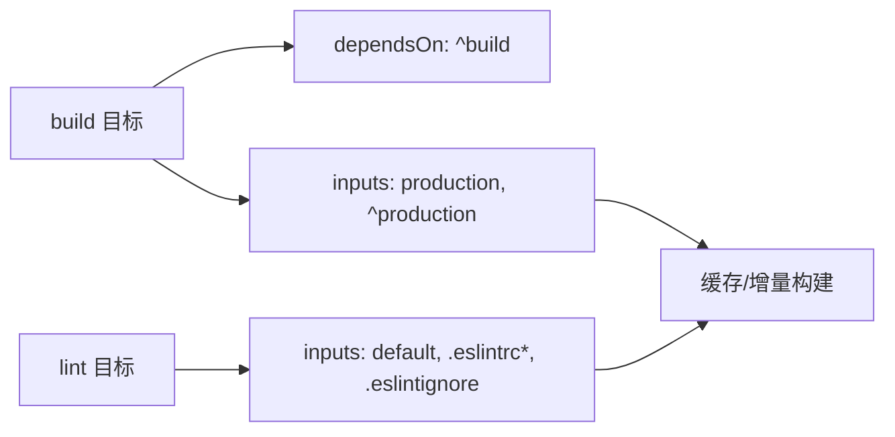
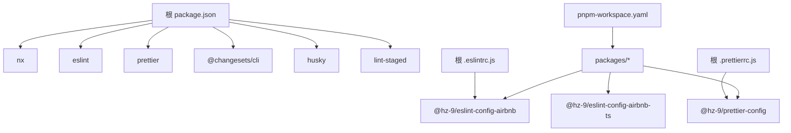

# 项目概览

<cite>
**本文档引用的文件**
- [README.md](file://README.md)
- [README.zh-CN.md](file://README.zh-CN.md)
- [package.json](file://package.json)
- [nx.json](file://nx.json)
- [pnpm-workspace.yaml](file://pnpm-workspace.yaml)
- [.eslintrc.js](file://.eslintrc.js)
- [.prettierrc.js](file://.prettierrc.js)
- [.lintstagedrc.json](file://.lintstagedrc.json)
- [packages/tsconfig.base.json](file://packages/tsconfig.base.json)
- [packages/eslint-config-airbnb/package.json](file://packages/eslint-config-airbnb/package.json)
- [packages/eslint-config-airbnb-ts/package.json](file://packages/eslint-config-airbnb-ts/package.json)
- [packages/prettier-config/package.json](file://packages/prettier-config/package.json)
</cite>

## 目录
1. [简介](#简介)
2. [项目结构](#项目结构)
3. [核心组件](#核心组件)
4. [架构总览](#架构总览)
5. [详细组件分析](#详细组件分析)
6. [依赖关系分析](#依赖关系分析)
7. [性能考虑](#性能考虑)
8. [故障排除指南](#故障排除指南)
9. [结论](#结论)
10. [附录](#附录)

## 简介
HZ 9 Lint 是一个专为 Nx 工作空间设计的 JavaScript/TypeScript 代码质量与格式化工具集合，目标是统一团队在大型多包项目中的编码规范与质量标准。它通过集中化的 ESLint 配置与 Prettier 规则，结合 Nx 的任务编排与缓存能力，显著降低配置成本、提升一致性，并优化开发体验。

- 核心价值主张
  - 统一规范：提供可复用的 ESLint 与 Prettier 配置，覆盖 JS/TS 与前端工程场景。
  - 开发体验：借助 Nx 的增量构建与受影响分析，实现快速、精准的代码检查与格式化。
  - 版本与发布：内置 Changesets 流程，支持受控版本管理与自动化发布。
  - 可扩展性：模块化包结构，便于按需引入或定制。

- 在 Nx 生态系统中的定位
  - 作为 Nx 工作空间中的“质量基础设施”，为多个子包提供一致的 lint/format 能力。
  - 与 Nx 的 targetDefaults、inputs 缓存策略深度集成，最大化任务执行效率。
  - 与 Husky、lint-staged 等工具协同，形成从本地提交到 CI 的完整质量闭环。

**章节来源**
- [README.md:1-45](file://README.md#L1-L45)
- [package.json:1-38](file://package.json#L1-L38)

## 项目结构
该仓库采用 pnpm workspace + Nx 的组织方式，根目录定义工作区与脚本，packages 目录下存放可发布的配置包；根配置文件集中管理 lint/format 行为与 Nx 任务策略。

**图表来源**
- [pnpm-workspace.yaml:1-6](file://pnpm-workspace.yaml#L1-L6)
- [packages/tsconfig.base.json:1-13](file://packages/tsconfig.base.json#L1-L13)
- [packages/eslint-config-airbnb/package.json](file://packages/eslint-config-airbnb/package.json)
- [packages/eslint-config-airbnb-ts/package.json](file://packages/eslint-config-airbnb-ts/package.json)
- [packages/prettier-config/package.json](file://packages/prettier-config/package.json)

**章节来源**
- [pnpm-workspace.yaml:1-6](file://pnpm-workspace.yaml#L1-L6)
- [nx.json:1-20](file://nx.json#L1-L20)
- [packages/tsconfig.base.json:1-13](file://packages/tsconfig.base.json#L1-L13)

## 核心组件
- 根级脚本与命令
  - 通过 Nx 的 run-many 执行跨包构建、测试与受影响分析。
  - 使用 ESLint/Prettier 对工作区内所有包进行批量检查与格式化。
  - 提供 Changesets 命令链以准备版本与发布。
- 根级配置
  - ESLint：基于 AirBnB 规范的 JS/TS 配置，统一规则集。
  - Prettier：基于团队约定的格式化规则，并集成 import 排序插件。
  - lint-staged：在 Git 暂存区文件上执行格式化与修复，保证提交质量。
- 发布包
  - @hz-9/eslint-config-airbnb：JavaScript/JSX 规则集。
  - @hz-9/eslint-config-airbnb-ts：TypeScript/TSX 规则集。
  - @hz-9/prettier-config：共享 Prettier 配置与插件设置。

**章节来源**
- [package.json:5-16](file://package.json#L5-L16)
- [.eslintrc.js:1-4](file://.eslintrc.js#L1-L4)
- [.prettierrc.js:1-15](file://.prettierrc.js#L1-L15)
- [.lintstagedrc.json:1-5](file://.lintstagedrc.json#L1-L5)
- [packages/eslint-config-airbnb/package.json](file://packages/eslint-config-airbnb/package.json)
- [packages/eslint-config-airbnb-ts/package.json](file://packages/eslint-config-airbnb-ts/package.json)
- [packages/prettier-config/package.json](file://packages/prettier-config/package.json)

## 架构总览
下图展示了从开发者的本地操作到 Nx 任务执行、再到各发布包应用的整体流程。

**图表来源**
- [package.json:5-16](file://package.json#L5-L16)
- [.eslintrc.js:1-4](file://.eslintrc.js#L1-L4)
- [.prettierrc.js:1-15](file://.prettierrc.js#L1-L15)
- [nx.json:6-14](file://nx.json#L6-L14)

**章节来源**
- [README.md:7-36](file://README.md#L7-L36)
- [nx.json:1-20](file://nx.json#L1-L20)

## 详细组件分析

### ESLint 配置体系
- 根 ESLint 配置通过扩展 @hz-9/eslint-config-airbnb 实现统一规则，适用于 JS/TS 项目。
- @hz-9/eslint-config-airbnb 与 @hz-9/eslint-config-airbnb-ts 分别针对 JS/JSX 与 TS/TSX 场景提供细化规则。
- 结合 Nx 的 targetDefaults.lint.inputs，确保 ESLint 规则变更能触发正确的缓存失效与重新检查。

**图表来源**
- [.eslintrc.js:1-4](file://.eslintrc.js#L1-L4)
- [nx.json:11-13](file://nx.json#L11-L13)

**章节来源**
- [.eslintrc.js:1-4](file://.eslintrc.js#L1-L4)
- [nx.json:6-14](file://nx.json#L6-L14)

### Prettier 配置与导入排序
- 根 Prettier 配置继承 @hz-9/prettier-config，并启用 @trivago/prettier-plugin-sort-imports 插件。
- 通过 importOrder 等选项对内部模块、外部库与相对路径进行分组与排序，提升可读性与一致性。
- lint-staged 将 Prettier 与 ESLint 修复串联，确保暂存区文件符合格式与规则。

**图表来源**
- [.lintstagedrc.json:1-5](file://.lintstagedrc.json#L1-L5)
- [.prettierrc.js:1-15](file://.prettierrc.js#L1-L15)

**章节来源**
- [.lintstagedrc.json:1-5](file://.lintstagedrc.json#L1-L5)
- [.prettierrc.js:1-15](file://.prettierrc.js#L1-L15)

### Nx 任务与缓存策略
- targetDefaults.build 与 build 依赖链确保构建顺序与输入缓存正确。
- targetDefaults.lint 明确监听根级 ESLint 配置文件，变更后自动触发受影响检查。
- namedInputs 定义 default 与 production 输入集合，配合 Nx Cloud/缓存提升执行效率。

**图表来源**
- [nx.json:6-18](file://nx.json#L6-L18)

**章节来源**
- [nx.json:1-20](file://nx.json#L1-L20)

### 发布包清单与职责边界
- @hz-9/eslint-config-airbnb：面向 JS/JSX 的 AirBnB 规则集，适配通用前端与 Node 项目。
- @hz-9/eslint-config-airbnb-ts：面向 TS/TSX 的规则集，补充类型安全与 TS 特有规则。
- @hz-9/prettier-config：统一的 Prettier 规则与插件配置，保障格式一致性。

**章节来源**
- [packages/eslint-config-airbnb/package.json](file://packages/eslint-config-airbnb/package.json)
- [packages/eslint-config-airbnb-ts/package.json](file://packages/eslint-config-airbnb-ts/package.json)
- [packages/prettier-config/package.json](file://packages/prettier-config/package.json)

## 依赖关系分析
- 工作区依赖
  - pnpm workspace 将 packages/* 纳入统一管理，便于版本与发布同步。
  - devDependencies 包含 Nx、ESLint、Prettier、Changesets、Husky、lint-staged 等核心工具。
- 配置依赖
  - .eslintrc.js 依赖 @hz-9/eslint-config-airbnb；.prettierrc.js 依赖 @hz-9/prettier-config。
  - lint-staged 将 Prettier 与 ESLint 串联，形成本地质量门禁。
- 缓存与任务依赖
  - nx.json 中的 targetDefaults 与 namedInputs 决定任务输入与缓存键，影响执行效率与准确性。

**图表来源**
- [package.json:17-32](file://package.json#L17-L32)
- [.eslintrc.js:1-4](file://.eslintrc.js#L1-L4)
- [.prettierrc.js:1-15](file://.prettierrc.js#L1-L15)
- [pnpm-workspace.yaml:4-6](file://pnpm-workspace.yaml#L4-L6)

**章节来源**
- [package.json:17-32](file://package.json#L17-L32)
- [pnpm-workspace.yaml:1-6](file://pnpm-workspace.yaml#L1-L6)

## 性能考虑
- 利用 Nx 的 affected 命令仅对变更项目执行 lint，减少全量扫描时间。
- targetDefaults.lint 的 inputs 配置确保规则文件变更时触发必要的重检，避免陈旧缓存。
- lint-staged 在本地阶段拦截问题，降低 CI 失败率与重复工作。
- Changesets 与脚本链配合，减少手动版本管理开销。

[本节为通用指导，无需列出具体文件来源]

## 故障排除指南
- ESLint 规则未生效
  - 检查根 .eslintrc.js 是否正确扩展 @hz-9/eslint-config-airbnb。
  - 确认 nx.json 中 lint 的 inputs 是否包含 .eslintrc* 与 .eslintignore。
- Prettier 格式化不生效
  - 确认 .prettierrc.js 正确继承 @hz-9/prettier-config 并启用 import 排序插件。
  - 检查 lint-staged 配置是否包含 Prettier 命令。
- 受影响分析结果异常
  - 清理 Nx 缓存并重新运行 affected lint。
  - 核对命名输入与依赖链配置，确保 inputs 正确。

**章节来源**
- [.eslintrc.js:1-4](file://.eslintrc.js#L1-L4)
- [.prettierrc.js:1-15](file://.prettierrc.js#L1-L15)
- [.lintstagedrc.json:1-5](file://.lintstagedrc.json#L1-L5)
- [nx.json:6-18](file://nx.json#L6-L18)

## 结论
HZ 9 Lint 通过集中化的 ESLint 与 Prettier 配置、与 Nx 的深度集成以及标准化的发布流程，为 Nx 工作空间提供了可复用、可维护且高效的代码质量基础设施。它既适合初学者快速上手，也能满足资深开发者对一致性与性能的严格要求。

[本节为总结性内容，无需列出具体文件来源]

## 附录
- 快速开始命令参考（来自根 README）
  - 安装依赖、全量 lint、全量构建、格式化、查看依赖图、仅受影响 lint、创建变更集、版本更新与发布。
- 包列表
  - @hz-9/eslint-config-airbnb：JavaScript/JSX 规则集
  - @hz-9/eslint-config-airbnb-ts：TypeScript/TSX 规则集
  - @hz-9/prettier-config：Prettier 共享配置

**章节来源**
- [README.md:7-45](file://README.md#L7-L45)
- [README.zh-CN.md](file://README.zh-CN.md)
- [packages/eslint-config-airbnb/package.json](file://packages/eslint-config-airbnb/package.json)
- [packages/eslint-config-airbnb-ts/package.json](file://packages/eslint-config-airbnb-ts/package.json)
- [packages/prettier-config/package.json](file://packages/prettier-config/package.json)