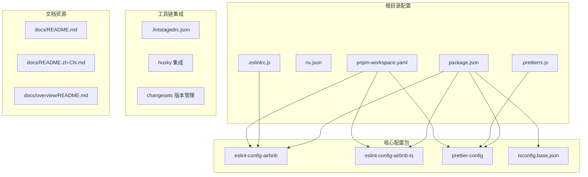
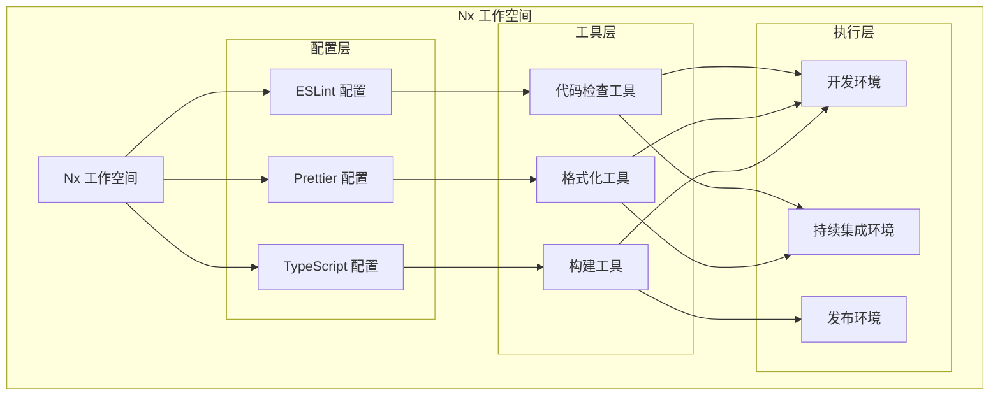
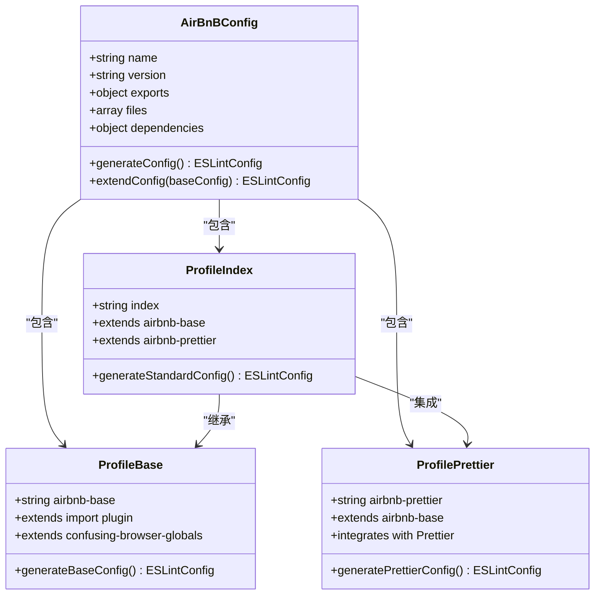
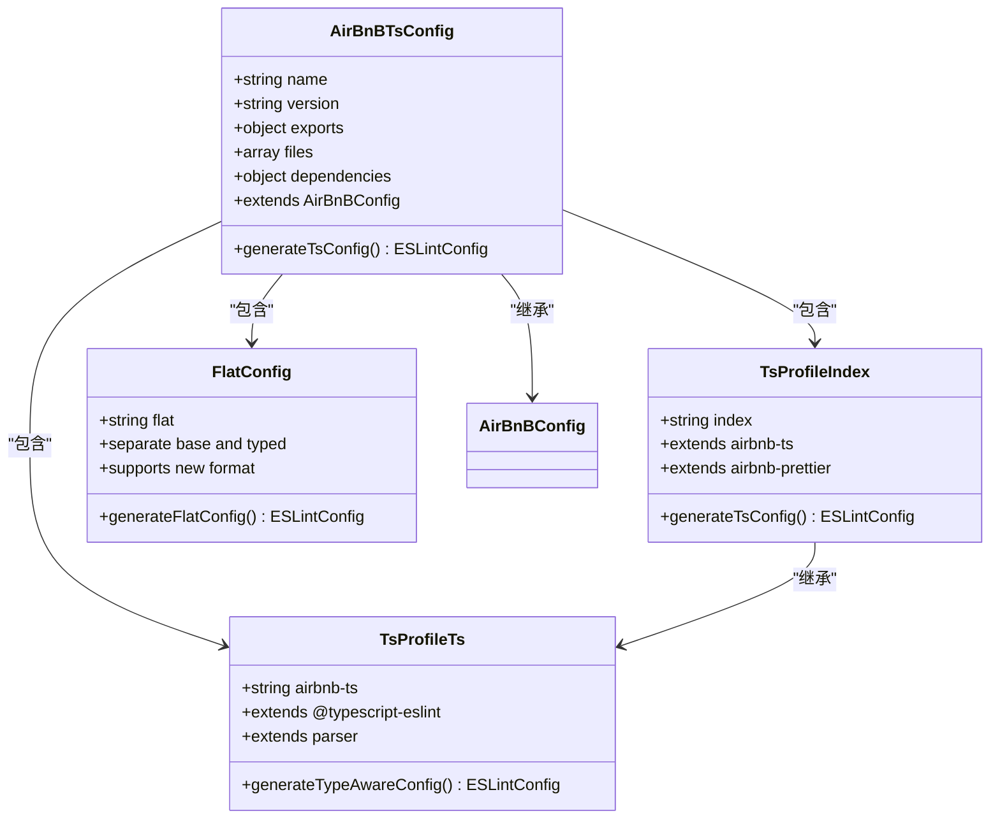
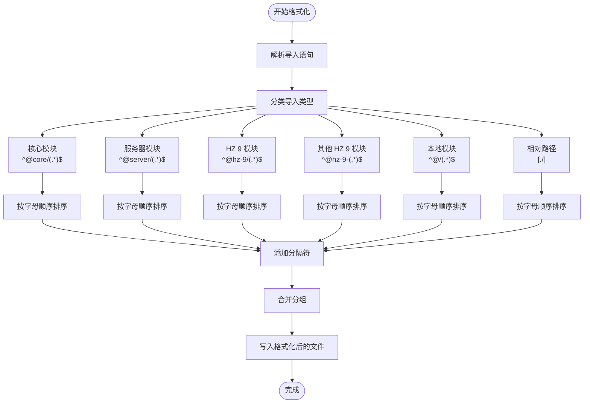
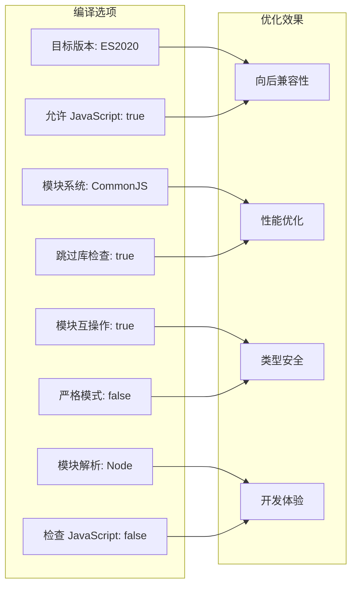

# 项目简介

<cite>
**本文档引用的文件**
- [README.md](file://README.md)
- [README.zh-CN.md](file://README.zh-CN.md)
- [package.json](file://package.json)
- [nx.json](file://nx.json)
- [pnpm-workspace.yaml](file://pnpm-workspace.yaml)
- [.eslintrc.js](file://.eslintrc.js)
- [.prettierrc.js](file://.prettierrc.js)
- [packages/tsconfig.base.json](file://packages/tsconfig.base.json)
- [packages/eslint-config-airbnb/package.json](file://packages/eslint-config-airbnb/package.json)
- [packages/eslint-config-airbnb-ts/package.json](file://packages/eslint-config-airbnb-ts/package.json)
- [packages/prettier-config/package.json](file://packages/prettier-config/package.json)
- [docs/README.md](file://docs/README.md)
- [docs/README.zh-CN.md](file://docs/README.zh-CN.md)
- [docs/overview/README.md](file://docs/overview/README.md)
- [.lintstagedrc.json](file://.lintstagedrc.json)
</cite>

## 目录
1. [引言](#引言)
2. [项目结构](#项目结构)
3. [核心组件](#核心组件)
4. [架构概览](#架构概览)
5. [详细组件分析](#详细组件分析)
6. [依赖分析](#依赖分析)
7. [性能考虑](#性能考虑)
8. [故障排除指南](#故障排除指南)
9. [结论](#结论)
10. [附录](#附录)

## 引言

HZ 9 Lint 是一个专为 Nx 工作空间设计的 JavaScript/TypeScript 代码质量配置集合。该项目的核心目标是为大型前端项目提供统一、可维护且高效的代码质量管理体系，通过标准化的 ESLint 规则和 Prettier 格式化配置，显著提升开发体验和代码一致性。

### 项目价值主张

**统一代码标准**: 通过集中管理 ESLint 和 Prettier 配置，确保整个工作空间内代码风格的一致性，避免团队成员之间的风格分歧。

**提升开发效率**: 自动化的代码检查和格式化流程，减少手动调整代码格式的时间，让开发者专注于业务逻辑实现。

**增强代码质量**: 基于 Airbnb 风格指南的严格规则集，有效预防常见的编程错误和潜在问题。

**简化维护成本**: 模块化的配置设计，支持按需扩展和定制，降低长期维护的复杂度。

## 项目结构

HZ 9 Lint 采用 Nx Monorepo 架构，通过 pnpm 工作空间管理多个独立但相关的包。项目结构清晰地分离了核心配置、工具链集成和文档资源。



**图表来源**
- [package.json:1-38](file://package.json#L1-L38)
- [nx.json:1-20](file://nx.json#L1-L20)
- [pnpm-workspace.yaml:1-6](file://pnpm-workspace.yaml#L1-L6)

**章节来源**
- [package.json:1-38](file://package.json#L1-L38)
- [nx.json:1-20](file://nx.json#L1-L20)
- [pnpm-workspace.yaml:1-6](file://pnpm-workspace.yaml#L1-L6)

## 核心组件

### ESLint 配置生态系统

项目提供了完整的 ESLint 配置解决方案，涵盖 JavaScript 和 TypeScript 两大领域：

**JavaScript ESLint 配置 (@hz-9/eslint-config-airbnb)**
- 基于 Airbnb 风格指南的权威规则集
- 支持多种配置文件格式：传统配置、Flat Config 和混合模式
- 可组合的配置文件：基础配置、Airbnb 配置和与 Prettier 集成的配置
- 完整的类型安全支持，适用于现代 JavaScript 开发

**TypeScript ESLint 配置 (@hz-9/eslint-config-airbnb-ts)**
- 专为 TypeScript 项目优化的规则集
- 分离的基础配置（无类型信息）和类型感知配置（含类型信息）
- 全面的 TypeScript 语言特性支持
- 与 @typescript-eslint 生态系统的深度集成

### Prettier 格式化配置

**统一代码格式化标准**
- 基于项目需求定制的格式化规则
- 内置导入语句排序插件，自动整理模块导入顺序
- 支持多种文件类型的格式化：JavaScript、TypeScript、JSON、CSS、Markdown 等
- 与 ESLint 的无缝集成，避免格式化冲突

### TypeScript 基础配置

**标准化编译选项**
- 统一的目标版本和模块解析策略
- 合理的严格性设置，平衡代码质量和开发体验
- 对 JavaScript 文件的兼容性支持
- 优化的类型检查和模块系统配置

**章节来源**
- [packages/eslint-config-airbnb/package.json:1-84](file://packages/eslint-config-airbnb/package.json#L1-L84)
- [packages/eslint-config-airbnb-ts/package.json:1-87](file://packages/eslint-config-airbnb-ts/package.json#L1-L87)
- [packages/prettier-config/package.json:1-45](file://packages/prettier-config/package.json#L1-L45)
- [packages/tsconfig.base.json:1-13](file://packages/tsconfig.base.json#L1-L13)

## 架构概览

HZ 9 Lint 在 Nx 生态系统中扮演着基础设施服务的角色，为整个工作空间提供统一的代码质量保障。



**图表来源**
- [nx.json:6-14](file://nx.json#L6-L14)
- [package.json:5-16](file://package.json#L5-L16)

### 核心设计理念

**模块化设计**: 每个配置都作为独立的包发布，支持按需安装和版本管理。

**向后兼容**: 提供多种配置格式支持，确保与现有项目的平滑迁移。

**可扩展性**: 开放的配置接口，允许团队根据自身需求进行定制。

**自动化集成**: 与 Nx 的缓存机制和受影响文件检测深度集成。

**章节来源**
- [docs/overview/README.md:1-27](file://docs/overview/README.md#L1-L27)
- [nx.json:1-20](file://nx.json#L1-L20)

## 详细组件分析

### ESLint 配置组件

#### JavaScript ESLint 配置分析



**图表来源**
- [packages/eslint-config-airbnb/package.json:20-54](file://packages/eslint-config-airbnb/package.json#L20-L54)

#### TypeScript ESLint 配置分析



**图表来源**
- [packages/eslint-config-airbnb-ts/package.json:21-55](file://packages/eslint-config-airbnb-ts/package.json#L21-L55)

**章节来源**
- [packages/eslint-config-airbnb/package.json:1-84](file://packages/eslint-config-airbnb/package.json#L1-L84)
- [packages/eslint-config-airbnb-ts/package.json:1-87](file://packages/eslint-config-airbnb-ts/package.json#L1-L87)

### Prettier 配置组件

#### 导入语句排序机制



**图表来源**
- [.prettierrc.js:8-14](file://.prettierrc.js#L8-L14)

**章节来源**
- [.prettierrc.js:1-15](file://.prettierrc.js#L1-L15)
- [packages/prettier-config/package.json:1-45](file://packages/prettier-config/package.json#L1-L45)

### TypeScript 基础配置

#### 编译选项优化策略



**图表来源**
- [packages/tsconfig.base.json:2-11](file://packages/tsconfig.base.json#L2-L11)

**章节来源**
- [packages/tsconfig.base.json:1-13](file://packages/tsconfig.base.json#L1-L13)

## 依赖分析

### 核心依赖关系

```mermaid
graph TB
subgraph "外部依赖"
Nx[Nx 19.0.0]
ESLint[ESLint 8.57.0]
Prettier[Prettier 3.2.5]
TypeScript[TypeScript >=5.0.0 <5.4.0]
Vite[@nx/vite 19.0.0]
end
subgraph "内部包"
AirBnB[@hz-9/eslint-config-airbnb]
AirBnBTS[@hz-9/eslint-config-airbnb-ts]
PrettierCfg[@hz-9/prettier-config]
end
subgraph "开发工具"
Changesets[@changesets/cli 2.27.1]
Husky[husky 9.0.11]
Commitlint[commitlint 19.2.2]
Vitest[vitest 1.3.1]
end
Nx --> AirBnB
Nx --> AirBnBTS
Nx --> PrettierCfg
ESLint --> AirBnB
ESLint --> AirBnBTS
Prettier --> PrettierCfg
TypeScript --> AirBnBTS
Changesets --> AirBnB
Changesets --> AirBnBTS
Changesets --> PrettierCfg
```

**图表来源**
- [package.json:17-32](file://package.json#L17-L32)

### 版本兼容性矩阵

| 组件 | 最低版本 | 推荐版本 | 最高版本 | 兼容性状态 |
|------|----------|----------|----------|------------|
| Node.js | 18.18.0 | - | 19.0.0 | ✅ LTS 支持 |
| Node.js | 20.9.0 | - | 21.0.0 | ✅ 当前推荐 |
| Nx | - | 19.0.0 | - | ✅ 主要版本 |
| ESLint | - | 8.57.0 | - | ✅ 主要版本 |
| Prettier | - | 3.2.5 | - | ✅ 主要版本 |
| TypeScript | 5.0.0 | - | 5.4.0 | ✅ 主要版本 |

**章节来源**
- [package.json:33-37](file://package.json#L33-L37)
- [packages/eslint-config-airbnb/package.json:77-82](file://packages/eslint-config-airbnb/package.json#L77-L82)
- [packages/eslint-config-airbnb-ts/package.json:80-85](file://packages/eslint-config-airbnb-ts/package.json#L80-L85)
- [packages/prettier-config/package.json:38-43](file://packages/prettier-config/package.json#L38-L43)

## 性能考虑

### 缓存优化策略

**Nx 缓存机制**: 利用 Nx 的智能缓存系统，避免重复执行相同的 lint 和格式化任务。

**增量检查**: 结合 `nx affected` 命令，只对变更的项目执行相关任务。

**并行执行**: 使用 `run-many` 命令并行构建所有包，充分利用多核处理器性能。

### 内存使用优化

**模块化加载**: 每个配置包独立发布，按需加载，减少内存占用。

**懒加载策略**: 配置文件采用延迟加载机制，提高启动速度。

**依赖精简**: 移除不必要的依赖项，保持最小化安装体积。

## 故障排除指南

### 常见问题及解决方案

**ESLint 配置冲突**
- 症状: ESLint 报告配置冲突或规则不一致
- 解决方案: 检查 `.eslintrc.js` 中的配置继承顺序，确保没有重复定义

**Prettier 格式化异常**
- 症状: Prettier 无法正确格式化某些文件类型
- 解决方案: 验证 `.prettierrc.js` 中的文件匹配模式和插件配置

**TypeScript 类型检查失败**
- 症状: TypeScript 编译错误或类型检查异常
- 解决方案: 检查 `tsconfig.base.json` 中的编译选项，确保与项目需求匹配

**Nx 缓存问题**
- 症状: 任务执行时间异常或缓存失效
- 解决方案: 清理 Nx 缓存 (`nx reset`) 并重新执行任务

**章节来源**
- [.lintstagedrc.json:1-5](file://.lintstagedrc.json#L1-L5)

## 结论

HZ 9 Lint 项目为 Nx 工作空间提供了一套完整、专业且易于维护的代码质量解决方案。通过模块化的配置设计和深度的工具链集成，该项目显著提升了大型前端项目的开发效率和代码质量。

### 主要优势总结

**统一标准**: 提供一致的代码风格和质量标准，减少团队协作摩擦。

**高效执行**: 智能的缓存机制和增量检查，最大化提升开发效率。

**灵活扩展**: 模块化设计支持按需定制，适应不同项目的需求变化。

**长期维护**: 清晰的版本管理和发布流程，确保项目的可持续发展。

对于需要在 Nx 环境中实施严格代码质量管理的团队，HZ 9 Lint 无疑是一个值得信赖的选择。

## 附录

### 快速开始命令

```bash
# 安装依赖
pnpm install

# Lint 所有包
pnpm lint

# 构建所有包
pnpm build

# 格式化代码
pnpm format

# 查看依赖关系图
pnpm nx graph

# 仅对变更的项目运行 lint
pnpm nx affected --target=lint

# 创建 changeset（版本/发布准备）
pnpm changeset

# 提升版本并生成更新日志
pnpm changeset version

# 发布包到 npm
pnpm changeset publish
```

### 支持的包列表

| 包名称 | 版本 | 功能描述 |
|--------|------|----------|
| @hz-9/eslint-config-airbnb | 0.10.0 | JavaScript ESLint 配置 |
| @hz-9/eslint-config-airbnb-ts | 0.11.0 | TypeScript ESLint 配置 |
| @hz-9/prettier-config | 0.3.1 | Prettier 格式化配置 |

**章节来源**
- [README.md:7-36](file://README.md#L7-L36)
- [README.zh-CN.md:7-36](file://README.zh-CN.md#L7-L36)
- [docs/README.md:13-27](file://docs/README.md#L13-L27)
- [docs/README.zh-CN.md:13-27](file://docs/README.zh-CN.md#L13-L27)